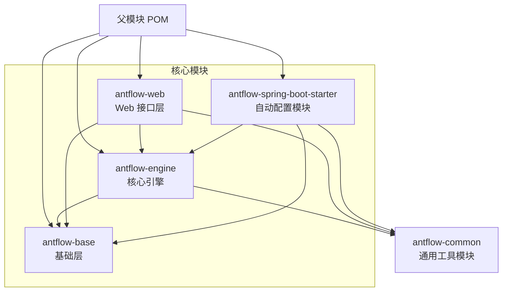
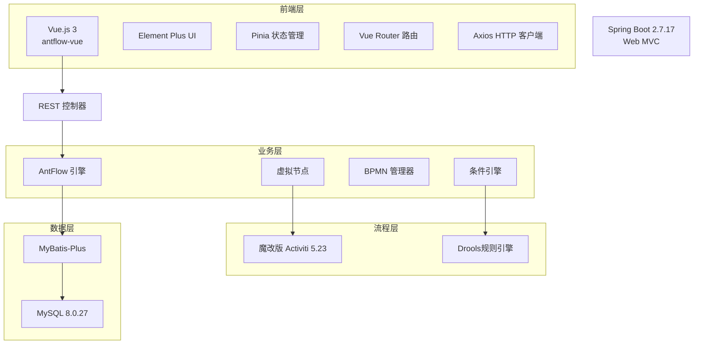
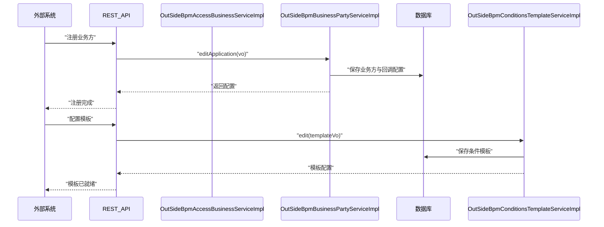
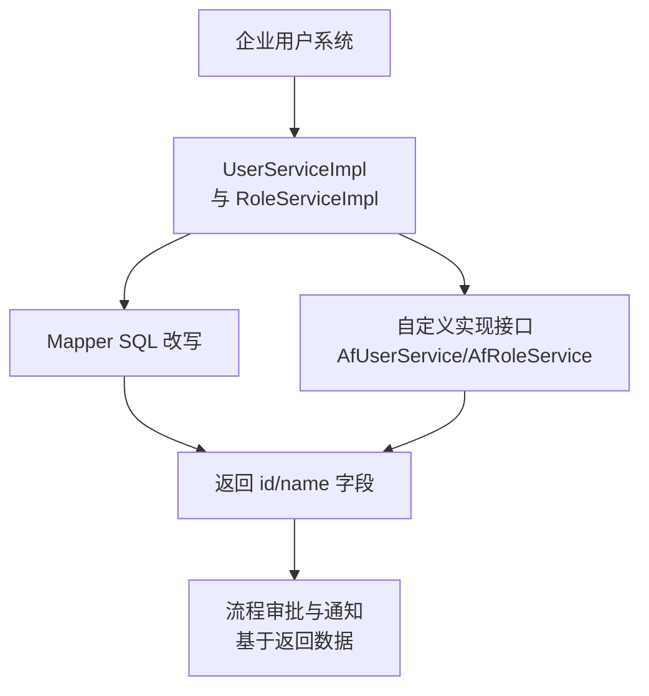
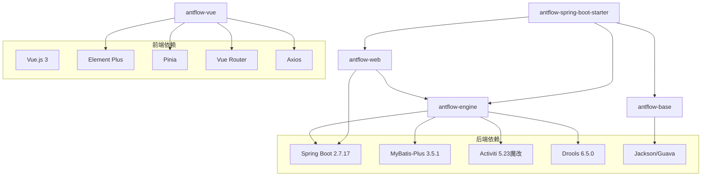

# 生态系统

<cite>
**本文引用的文件**
- [README.zh_CN.md](file://README.zh_CN.md)
- [AntFlow 简介.md](file://doc/系统介绍篇/1.AntFlow介绍.md)
- [AntFlow 系统架构.md](file://doc/系统介绍篇/2.AntFlow_系统架构.md)
- [外部系统集成.md](file://doc/系统介绍篇/10.外部系统集成.md)
- [API接入实战.md](file://doc/系统集成与扩展开发篇/AntFlow业务集成之三API接入(SAAS模式)流程实战.md)
- [API接入扩展篇.md](file://doc/系统集成与扩展开发篇/AntFlow业务集成之四API接入(SAAS模式)扩展篇.md)
- [用户角色集成.md](file://doc/系统集成与扩展开发篇/AntFlow快速集成到企业现有系统之四用户角色集成.md)
- [Starter集成.md](file://doc/系统集成与扩展开发篇/AntFlow快速集成到已有系统之一starter篇.md)
- [源码集成.md](file://doc/系统集成与扩展开发篇/AntFlow快速集成到企业现有系统二之源码集成篇.md)
- [Oracle支持.md](file://doc/多数据库支持/1.antflow oracle支持.md)
- [PostgreSQL支持.md](file://doc/多数据库支持/2.antflow postgresql支持.md)
- [AntReport 项目介绍.md](file://doc/多数据库支持/13.antflow 高斯数据库opengauss支持.md)
- [新手第一篇.md](file://doc/快速上手篇/新手第一篇代码流程.md)
- [新手第二篇.md](file://doc/快速上手篇/新手第二篇之资源索引.md)
- [index.vue](file://antflow-vue/src/views/index.vue)
- [RuoYi Doc 组件](file://antflow-vue/src/components/RuoYi/Doc/index.vue)
</cite>

## 目录
1. [简介](#简介)
2. [项目结构](#项目结构)
3. [核心组件](#核心组件)
4. [架构总览](#架构总览)
5. [详细组件分析](#详细组件分析)
6. [依赖分析](#依赖分析)
7. [性能考量](#性能考量)
8. [故障排查指南](#故障排查指南)
9. [结论](#结论)
10. [附录](#附录)

## 简介
AntFlow 是一款基于 Activiti 的企业级低代码工作流引擎平台，具备独立部署与模块化嵌入能力。其核心特色包括：
- 虚拟节点（VNode）模型，将流程逻辑与引擎实现解耦，降低对特定引擎的依赖
- 低代码与自定义（DIY）双模式，前者通过拖拽完成流程设计，后者仅需实现少量接口即可快速上线
- 完全接管用户系统，可无缝对接企业自有用户/角色/组织架构
- 运行时动态节点与丰富的节点类型，满足复杂审批与路由场景
- 基于 JSON 的可视化方案，便于二次渲染与风格定制

生态方面，AntFlow 与若依灵犀（Ruoyi-Mate）形成前后端一体化集成方向，同时与蚂蚁报表（AntReport）等伙伴项目协同，共同构建企业级低代码与流程中台生态。

章节来源
- [README.zh_CN.md:33-60](file://README.zh_CN.md#L33-L60)
- [AntFlow 简介.md:1-76](file://doc/系统介绍篇/1.AntFlow介绍.md#L1-L76)

## 项目结构
AntFlow 采用多模块 Maven 架构，四大核心模块职责清晰：
- antflow-base：基础层，提供公共工具与接口
- antflow-engine：核心引擎，包含虚拟节点、流程控制与业务适配
- antflow-web：Web 接口层，提供 REST 控制器与应用入口
- antflow-spring-boot-starter：自动配置模块，便于快速集成
- antflow-common：通用工具模块（在父模块中聚合）

图表来源
- [AntFlow 系统架构.md:11-48](file://doc/系统介绍篇/2.AntFlow_系统架构.md#L11-L48)

章节来源
- [AntFlow 系统架构.md:50-58](file://doc/系统介绍篇/2.AntFlow_系统架构.md#L50-L58)

## 核心组件
- 虚拟节点引擎：通过 VNode 抽象屏蔽引擎差异，业务侧仅需实现适配器接口
- BPMN 管理器与条件引擎：负责流程定义、校验与运行时条件判断
- 表单工厂与渲染器：将外部数据转换为内部表单结构，支持低代码与自定义表单
- 外部接入服务：提供租户管理、应用与回调配置，支撑 SaaS 化流程服务
- 用户系统集成：提供接口与 SQL 映射，快速对接企业用户/角色/组织

章节来源
- [AntFlow 系统架构.md:168-208](file://doc/系统介绍篇/2.AntFlow_系统架构.md#L168-L208)
- [外部系统集成.md:9-59](file://doc/系统介绍篇/10.外部系统集成.md#L9-L59)

## 架构总览
AntFlow 采用分层架构，前端通过 REST 接口与后端交互，后端以 Spring Boot 为载体，核心引擎基于魔改 Activiti，配合 Drools 规则引擎与 MyBatis-Plus 数据访问层。

图表来源
- [AntFlow 系统架构.md:63-122](file://doc/系统介绍篇/2.AntFlow_系统架构.md#L63-L122)

章节来源
- [AntFlow 系统架构.md:124-132](file://doc/系统介绍篇/2.AntFlow_系统架构.md#L124-L132)

## 详细组件分析

### 生态项目与集成能力
- 若依灵犀（Ruoyi-Mate）：正在集成 AntFlow 后端，前端集成也在推进中，目标是将工作流能力深度融入 RuoYi 生态，提供“开箱即用”的企业级快速开发能力
- 蚂蚁报表（AntReport）：基于 Ureport2 的企业级报表工具，正逐步改造为 Spring Boot 项目并升级技术栈，未来将与 AntFlow 在流程与数据层面协同

章节来源
- [README.zh_CN.md:136-142](file://README.zh_CN.md#L136-L142)

### 外部系统集成与 SaaS 化接入
AntFlow 提供完善的外部接入能力，支持租户管理、应用与回调配置，典型流程包括：
- 创建租户与应用
- 配置回调与审批人 API
- 设计流程并启动
- 通过 REST API 发起流程与预览

图表来源
- [外部系统集成.md:76-98](file://doc/系统介绍篇/10.外部系统集成.md#L76-L98)

章节来源
- [API接入实战.md:1-24](file://doc/系统集成与扩展开发篇/AntFlow业务集成之三API接入(SAAS模式)流程实战.md#L1-L24)
- [API接入实战.md:29-70](file://doc/系统集成与扩展开发篇/AntFlow业务集成之三API接入(SAAS模式)流程实战.md#L29-L70)
- [API接入实战.md:71-121](file://doc/系统集成与扩展开发篇/AntFlow业务集成之三API接入(SAAS模式)流程实战.md#L71-L121)
- [API接入扩展篇.md:1-24](file://doc/系统集成与扩展开发篇/AntFlow业务集成之四API接入(SAAS模式)扩展篇.md#L1-L24)

### 用户系统与角色集成
AntFlow 完全剥离 Activiti 自带用户体系，可无缝对接企业现有用户/角色/组织架构。集成方式包括：
- 修改默认 Mapper 的 SQL，确保返回 id 与 name 字段
- 或实现 AfUserService/AfRoleService 接口并通过 @Primary 覆盖默认实现

图表来源
- [用户角色集成.md:5-35](file://doc/系统集成与扩展开发篇/AntFlow快速集成到企业现有系统之四用户角色集成.md#L5-L35)

章节来源
- [用户角色集成.md:1-35](file://doc/系统集成与扩展开发篇/AntFlow快速集成到企业现有系统之四用户角色集成.md#L1-L35)

### 集成方式：Starter 与源码集成
- Starter 集成：通过引入 antflow-spring-boot-starter 依赖，复制配置与 SQL 脚本，即可快速启动
- 源码集成：将 antflow-base 与 antflow-engine 模块复制到现有项目，配置 MapperScan 与组件扫描，加载相应模块

章节来源
- [Starter集成.md:1-34](file://doc/系统集成与扩展开发篇/AntFlow快速集成到已有系统之一starter篇.md#L1-L34)
- [源码集成.md:1-75](file://doc/系统集成与扩展开发篇/AntFlow快速集成到企业现有系统二之源码集成篇.md#L1-L75)

### 数据库与信创生态兼容
AntFlow 支持多种数据库与信创生态，包括但不限于：
- Oracle：提供安装、授权与连接配置示例
- PostgreSQL：提供安装、驱动与连接配置示例
- 国产数据库：达梦、人大金仓、南大通用、GaussDB、OceanBase、PolarDB 等

章节来源
- [Oracle支持.md:1-332](file://doc/多数据库支持/1.antflow oracle支持.md#L1-L332)
- [PostgreSQL支持.md:1-94](file://doc/多数据库支持/2.antflow postgresql支持.md#L1-L94)
- [AntReport 项目介绍.md:1-200](file://doc/多数据库支持/13.antflow 高斯数据库opengauss支持.md#L1-L200)

### 学习资源与社区
- 官方文档与手册：包含系统介绍、架构说明、快速上手、开发者指南等
- 视频与教程：通过飞书文档与官网提供学习路径
- 社区交流：QQ 群与 Issues 讨论区，便于用户交流与问题反馈
- 若依集成：提供 Ruoyi 前端集成示例与文档入口

章节来源
- [README.zh_CN.md:123-135](file://README.zh_CN.md#L123-L135)
- [新手第一篇.md:1-50](file://doc/快速上手篇/新手第一篇代码流程.md#L1-L50)
- [新手第二篇.md:1-40](file://doc/快速上手篇/新手第二篇之资源索引.md#L1-L40)
- [index.vue:50-71](file://antflow-vue/src/views/index.vue#L50-L71)
- [RuoYi Doc 组件:1-13](file://antflow-vue/src/components/RuoYi/Doc/index.vue#L1-L13)

## 依赖分析
AntFlow 的核心依赖与模块间关系如下：

图表来源
- [AntFlow 系统架构.md:124-132](file://doc/系统介绍篇/2.AntFlow_系统架构.md#L124-L132)

章节来源
- [AntFlow 系统架构.md:133-166](file://doc/系统介绍篇/2.AntFlow_系统架构.md#L133-L166)

## 性能考量
- 虚拟节点与适配器模式：通过抽象引擎差异，减少耦合，提升可维护性与扩展性
- 数据层优化：支持 MongoDB 与多种国产数据库，满足海量数据与信创生态需求
- 分层架构：前端、业务、数据层清晰分离，便于按需扩展与性能调优

章节来源
- [AntFlow 简介.md:65-76](file://doc/系统介绍篇/1.AntFlow介绍.md#L65-L76)
- [README.zh_CN.md:156-175](file://README.zh_CN.md#L156-L175)

## 故障排查指南
- 外部接入流程无法回调：确认回调 URL 配置与事件类型参数（CallbackTypeEnum）
- 审批人接口不可用：检查审批人 API 是否正确返回 id 与 name 字段
- 用户系统集成失败：核对 Mapper SQL 返回字段或接口实现是否覆盖默认实现
- 数据库连接异常：核对驱动版本与连接参数，参考多数据库支持文档

章节来源
- [API接入实战.md:41-60](file://doc/系统集成与扩展开发篇/AntFlow业务集成之三API接入(SAAS模式)流程实战.md#L41-L60)
- [用户角色集成.md:30-35](file://doc/系统集成与扩展开发篇/AntFlow快速集成到企业现有系统之四用户角色集成.md#L30-L35)
- [Oracle支持.md:317-326](file://doc/多数据库支持/1.antflow oracle支持.md#L317-L326)
- [PostgreSQL支持.md:76-85](file://doc/多数据库支持/2.antflow postgresql支持.md#L76-L85)

## 结论
AntFlow 以虚拟节点为核心，构建了低代码与自定义双模并行的工作流平台，具备强大的外部系统集成能力与信创生态兼容性。通过与若依灵犀、蚂蚁报表等生态伙伴协作，AntFlow 正逐步形成覆盖流程设计、表单渲染、用户集成与多数据库适配的完整解决方案，适用于各类企业级应用场景。

## 附录
- 商业使用政策：开源免费，可商用，禁止二次开源（除获得作者授权）
- 捐赠支持：通过官方渠道进行捐赠，可获专属开发文档
- 贡献方式：通过 Issues 与社区交流，登记使用案例，参与文档与代码贡献
- 应用案例：鼓励用户登记真实使用场景，助力生态传播与口碑建设

章节来源
- [README.zh_CN.md:25-31](file://README.zh_CN.md#L25-L31)
- [README.zh_CN.md:192-214](file://README.zh_CN.md#L192-L214)
- [README.zh_CN.md:200-207](file://README.zh_CN.md#L200-L207)