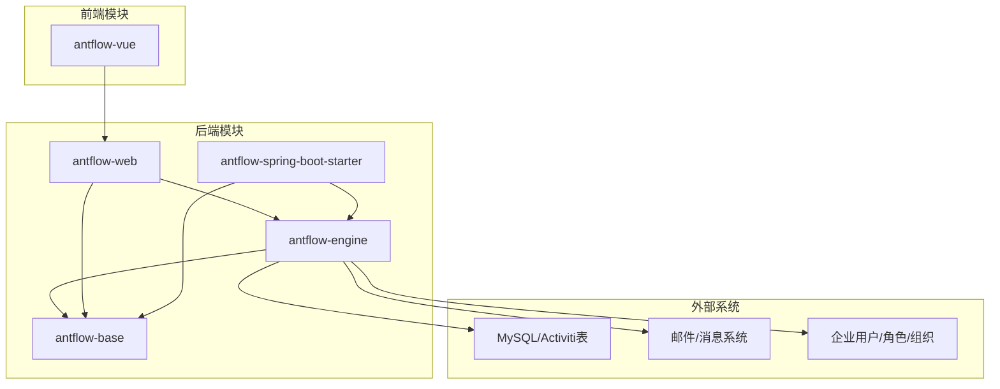
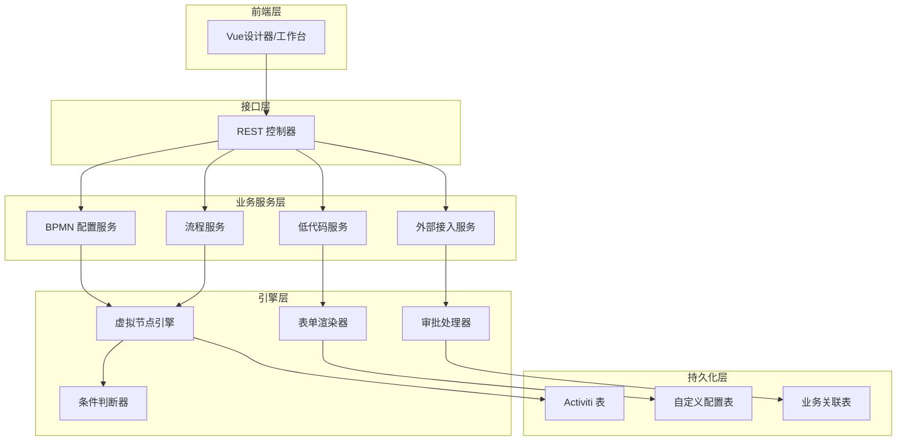
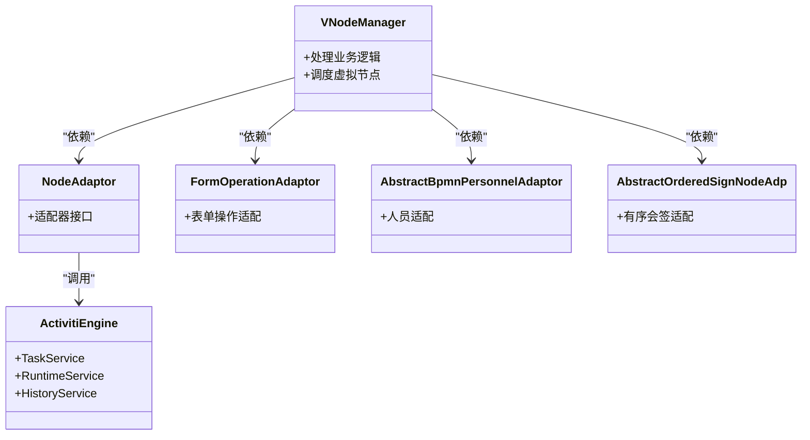
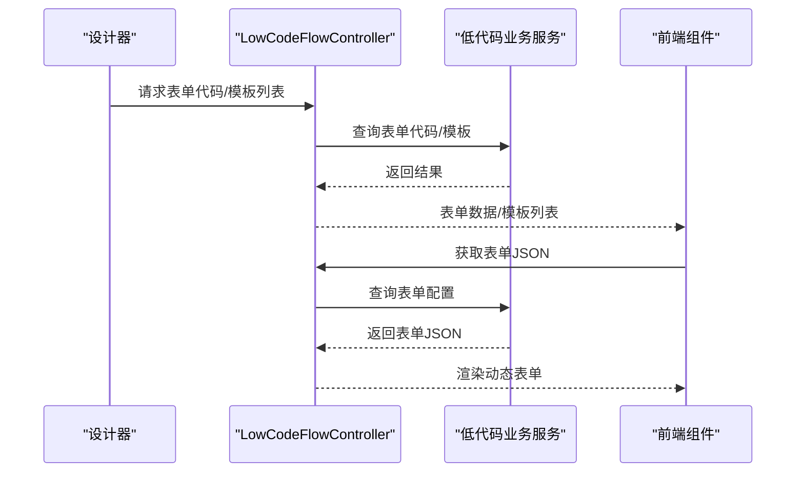
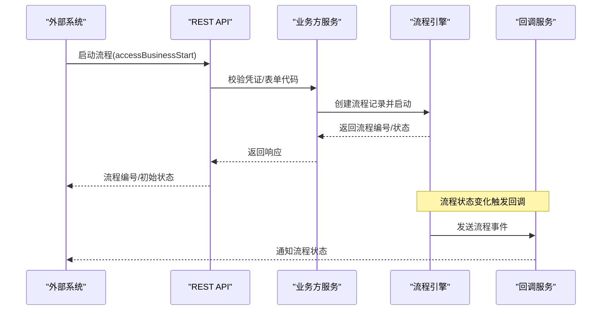
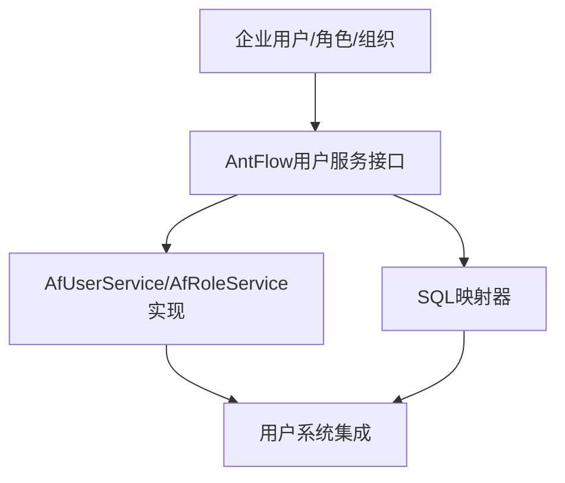
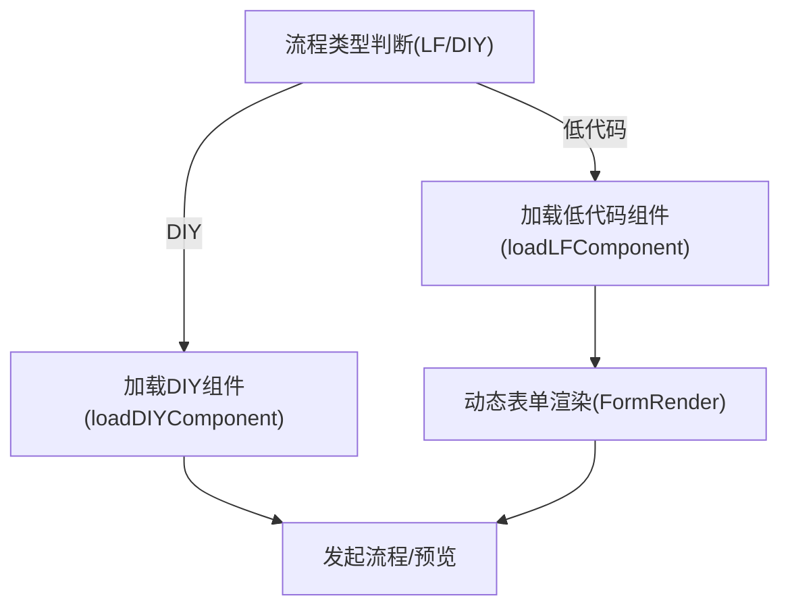
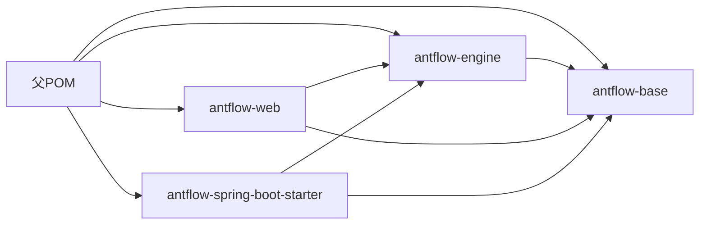

# 项目介绍

<cite>
**本文引用的文件**
- [README.zh_CN.md](file://README.zh_CN.md)
- [1.AntFlow介绍.md](file://doc/系统介绍篇/1.AntFlow介绍.md)
- [2.AntFlow_系统架构.md](file://doc/系统介绍篇/2.AntFlow_系统架构.md)
- [3.核心概念和术语.md](file://doc/系统介绍篇/3.核心概念和术语.md)
- [10.外部系统集成.md](file://doc/系统介绍篇/10.外部系统集成.md)
- [12.Rest控制器.md](file://doc/系统介绍篇/12.Rest控制器.md)
- [15.表单组件和动态表单.md](file://doc/系统介绍篇/15.表单组件和动态表单.md)
- [23.系统扩展.md](file://doc/系统介绍篇/23.系统扩展.md)
- [AntFlow快速集成到企业现有系统之四用户角色集成.md](file://doc/系统集成与扩展开发篇/AntFlow快速集成到企业现有系统之四用户角色集成.md)
- [LowCodeFlowController.java](file://antflow-engine/src/main/java/org/openoa/engine/bpmnconf/controller/LowCodeFlowController.java)
- [AdaptorFactory.java](file://antflow-engine/src/main/java/org/openoa/engine/factory/AdaptorFactory.java)
- [AntFlowConstants.java](file://antflow-engine/src/main/java/org/openoa/engine/bpmnconf/constant/AntFlowConstants.java)
- [AntFlowOperationListener.java](file://antflow-engine/src/main/java/org/openoa/engine/bpmnconf/activitilistener/AntFlowOperationListener.java)
- [index.vue](file://antflow-vue/src/components/Workflow/BasicSetting/index.vue)
- [index.vue](file://antflow-vue/src/views/workflow/startFlow/index.vue)
- [index.vue](file://antflow-vue/src/views/workflow/startOutside/index.vue)
- [componentload.js](file://antflow-vue/src/views/workflow/components/componentload.js)
- [vite.config.js](file://antflow-vue/vite.config.js)
</cite>

## 目录
1. [引言](#引言)
2. [项目结构](#项目结构)
3. [核心组件](#核心组件)
4. [架构总览](#架构总览)
5. [详细组件分析](#详细组件分析)
6. [依赖分析](#依赖分析)
7. [性能考虑](#性能考虑)
8. [故障排查指南](#故障排查指南)
9. [结论](#结论)
10. [附录](#附录)

## 引言
AntFlow 是一款面向企业级的低代码工作流引擎平台，基于魔改版 Activiti 引擎构建，提供图形化流程设计、低代码表单、运行时动态节点、虚拟节点（VNode）等能力，显著降低流程开发与集成门槛。其核心价值主张包括：
- 虚拟节点（VNode）模式：将流程业务与引擎执行 API 解耦，实现跨引擎迁移与灵活扩展
- 低代码与零引擎知识：前端拖拽即可完成流程设计，后端仅需实现少量接口即可上线
- 用户系统解绑：完全脱离 Activiti 自带用户体系，无缝对接企业自有用户/角色/组织
- 运行时动态节点：支持串并行、会签/或签、退回任意节点、动态跳过、变更处理人等
- JSON 化流程：流程预览与审批路径均为 JSON，便于自定义渲染与二次开发

## 项目结构
AntFlow 采用多模块 Maven 结构，前后端分离，核心模块职责清晰：
- antflow-base：公共接口、常量、工具与领域模型
- antflow-engine：核心引擎、虚拟节点、BPMN 管理、适配器工厂、监听器与服务
- antflow-web：REST 控制器、演示应用与接口层
- antflow-spring-boot-starter：自动配置与依赖聚合
- antflow-vue：Vue3 前端设计器与工作流管理界面
- scripts：数据库初始化脚本

图表来源
- [2.AntFlow_系统架构.md:11-48](file://doc/系统介绍篇/2.AntFlow_系统架构.md#L11-L48)
- [2.AntFlow_系统架构.md:84-122](file://doc/系统介绍篇/2.AntFlow_系统架构.md#L84-L122)

章节来源
- [2.AntFlow_系统架构.md:7-48](file://doc/系统介绍篇/2.AntFlow_系统架构.md#L7-L48)
- [1.AntFlow介绍.md:77-110](file://doc/系统介绍篇/1.AntFlow介绍.md#L77-L110)

## 核心组件
- 虚拟节点（VNode）系统：通过适配器模式将业务逻辑与引擎 API 分离，屏蔽引擎差异，支持多引擎迁移与灵活扩展
- 低代码表单与流程：前端拖拽式设计器，后端仅需实现少量接口即可完成流程开发
- 外部系统集成：提供标准化 REST API，支持外部系统接入、回调通知与流程生命周期管理
- 用户系统集成：完全解绑 Activiti 用户体系，支持企业自有用户/角色/组织对接
- 条件与规则引擎：内置条件判断与规则评估能力，支持动态条件网关与审批人规则

章节来源
- [3.核心概念和术语.md:1-49](file://doc/系统介绍篇/3.核心概念和术语.md#L1-L49)
- [1.AntFlow介绍.md:65-76](file://doc/系统介绍篇/1.AntFlow介绍.md#L65-L76)

## 架构总览
AntFlow 采用分层架构与适配器模式，前端通过 REST 接口与后端交互，后端通过虚拟节点与引擎解耦，条件与规则引擎支撑动态流程与审批。

图表来源
- [2.AntFlow_系统架构.md:210-276](file://doc/系统介绍篇/2.AntFlow_系统架构.md#L210-L276)

章节来源
- [2.AntFlow_系统架构.md:168-208](file://doc/系统介绍篇/2.AntFlow_系统架构.md#L168-L208)

## 详细组件分析

### 虚拟节点（VNode）与适配器模式
虚拟节点将业务逻辑与引擎 API 解耦，通过适配器屏蔽引擎差异，实现跨引擎迁移与灵活扩展。前端设计器与节点配置通过 VO/Adaptor 传递到引擎层，再由引擎适配器调用具体引擎 API。

图表来源
- [3.核心概念和术语.md:5-49](file://doc/系统介绍篇/3.核心概念和术语.md#L5-L49)
- [AdaptorFactory.java:14-33](file://antflow-engine/src/main/java/org/openoa/engine/factory/AdaptorFactory.java#L14-L33)

章节来源
- [3.核心概念和术语.md:1-49](file://doc/系统介绍篇/3.核心概念和术语.md#L1-L49)
- [AdaptorFactory.java:14-33](file://antflow-engine/src/main/java/org/openoa/engine/factory/AdaptorFactory.java#L14-L33)

### 低代码流程与表单加载
低代码流程通过前端设计器生成 JSON 表单与流程配置，后端通过 REST 接口提供表单数据与流程模板管理；前端根据流程类型动态加载 DIY 或低代码表单组件。

图表来源
- [12.Rest控制器.md:103-115](file://doc/系统介绍篇/12.Rest控制器.md#L103-L115)
- [LowCodeFlowController.java:20-84](file://antflow-engine/src/main/java/org/openoa/engine/bpmnconf/controller/LowCodeFlowController.java#L20-L84)
- [15.表单组件和动态表单.md:230-252](file://doc/系统介绍篇/15.表单组件和动态表单.md#L230-L252)

章节来源
- [LowCodeFlowController.java:20-84](file://antflow-engine/src/main/java/org/openoa/engine/bpmnconf/controller/LowCodeFlowController.java#L20-L84)
- [12.Rest控制器.md:103-115](file://doc/系统介绍篇/12.Rest控制器.md#L103-L115)
- [15.表单组件和动态表单.md:226-271](file://doc/系统介绍篇/15.表单组件和动态表单.md#L226-L271)
- [index.vue:49-63](file://antflow-vue/src/views/workflow/startFlow/index.vue#L49-L63)
- [index.vue:46-63](file://antflow-vue/src/views/workflow/startOutside/index.vue#L46-L63)
- [componentload.js:1-33](file://antflow-vue/src/views/workflow/components/componentload.js#L1-L33)

### 外部系统集成与回调
外部系统通过标准化 API 与 AntFlow 交互，支持流程启动、预览、停止与记录查询；系统提供回调机制，将流程状态变化通知外部系统。

图表来源
- [10.外部系统集成.md:100-143](file://doc/系统介绍篇/10.外部系统集成.md#L100-L143)
- [23.系统扩展.md:295-342](file://doc/系统介绍篇/23.系统扩展.md#L295-L342)

章节来源
- [10.外部系统集成.md:1-310](file://doc/系统介绍篇/10.外部系统集成.md#L1-L310)
- [23.系统扩展.md:295-342](file://doc/系统介绍篇/23.系统扩展.md#L295-L342)

### 用户系统集成与解绑
AntFlow 完全解绑 Activiti 用户体系，支持企业自有用户/角色/组织对接。可通过改写 SQL 或实现接口的方式，将 AntFlow 的用户服务替换为企业实现。

图表来源
- [AntFlow快速集成到企业现有系统之四用户角色集成.md:1-35](file://doc/系统集成与扩展开发篇/AntFlow快速集成到企业现有系统之四用户角色集成.md#L1-L35)

章节来源
- [AntFlow快速集成到企业现有系统之四用户角色集成.md:1-35](file://doc/系统集成与扩展开发篇/AntFlow快速集成到企业现有系统之四用户角色集成.md#L1-L35)

### 前端设计器与动态表单渲染
前端通过组件加载器动态加载 DIY 或低代码表单组件，支持根据流程类型切换渲染策略，并提供预览与发起流程的能力。

图表来源
- [index.vue:49-63](file://antflow-vue/src/views/workflow/startFlow/index.vue#L49-L63)
- [index.vue:46-63](file://antflow-vue/src/views/workflow/startOutside/index.vue#L46-L63)
- [componentload.js:1-33](file://antflow-vue/src/views/workflow/components/componentload.js#L1-L33)

章节来源
- [index.vue:49-63](file://antflow-vue/src/views/workflow/startFlow/index.vue#L49-L63)
- [index.vue:46-63](file://antflow-vue/src/views/workflow/startOutside/index.vue#L46-L63)
- [componentload.js:1-33](file://antflow-vue/src/views/workflow/components/componentload.js#L1-L33)
- [vite.config.js:29-70](file://antflow-vue/vite.config.js#L29-L70)

## 依赖分析
- 模块依赖：engine 依赖 base，web 依赖 engine/base，starter 依赖 engine/base
- 技术栈：Spring Boot、魔改 Activiti、MyBatis-Plus、Vue3、Element Plus、Drools 规则引擎
- 自动配置：通过 spring.factories 与 @SpringBootApplication 实现零配置运行

图表来源
- [2.AntFlow_系统架构.md:11-48](file://doc/系统介绍篇/2.AntFlow_系统架构.md#L11-L48)

章节来源
- [2.AntFlow_系统架构.md:133-166](file://doc/系统介绍篇/2.AntFlow_系统架构.md#L133-L166)

## 性能考虑
- 数据层优化：支持 MySQL 与多种国产数据库，提供横向扩展与性能加速能力
- 前端打包优化：通过 Vite 配置拆分第三方依赖与 vForm 库，减少包体积与提升构建速度
- 引擎适配：虚拟节点屏蔽引擎差异，避免因引擎版本升级带来的性能与兼容性问题

章节来源
- [README.zh_CN.md:156-175](file://README.zh_CN.md#L156-L175)
- [vite.config.js:29-70](file://antflow-vue/vite.config.js#L29-L70)

## 故障排查指南
- 低代码表单接口异常
  - 检查控制器端点与参数校验，确认表单代码与模板列表请求是否正确
  - 参考：[LowCodeFlowController.java:20-84](file://antflow-engine/src/main/java/org/openoa/engine/bpmnconf/controller/LowCodeFlowController.java#L20-L84)
- 表单加载失败
  - 确认流程类型判断与组件加载逻辑，检查 DIY/LF 组件映射与动态导入
  - 参考：[componentload.js:1-33](file://antflow-vue/src/views/workflow/components/componentload.js#L1-L33)
- 外部系统回调未触发
  - 校验业务方注册、回调配置与流程事件监听器
  - 参考：[AntFlowOperationListener.java:18-206](file://antflow-engine/src/main/java/org/openoa/engine/bpmnconf/activitilistener/AntFlowOperationListener.java#L18-L206)
- 用户系统集成问题
  - 检查 SQL 映射器或自定义用户服务实现，确保返回字段包含 id 与 name
  - 参考：[AntFlow快速集成到企业现有系统之四用户角色集成.md:1-35](file://doc/系统集成与扩展开发篇/AntFlow快速集成到企业现有系统之四用户角色集成.md#L1-L35)

章节来源
- [LowCodeFlowController.java:20-84](file://antflow-engine/src/main/java/org/openoa/engine/bpmnconf/controller/LowCodeFlowController.java#L20-L84)
- [componentload.js:1-33](file://antflow-vue/src/views/workflow/components/componentload.js#L1-L33)
- [AntFlowOperationListener.java:18-206](file://antflow-engine/src/main/java/org/openoa/engine/bpmnconf/activitilistener/AntFlowOperationListener.java#L18-L206)
- [AntFlow快速集成到企业现有系统之四用户角色集成.md:1-35](file://doc/系统集成与扩展开发篇/AntFlow快速集成到企业现有系统之四用户角色集成.md#L1-L35)

## 结论
AntFlow 通过虚拟节点（VNode）模式实现了流程业务与引擎执行 API 的高度解耦，配合低代码设计器与外部系统集成能力，显著降低了企业级工作流的开发与维护成本。其模块化设计、自动配置与灵活的用户系统集成，使其既能满足初学者快速上手，也能满足资深开发者进行深度扩展与定制。

## 附录
- 快速开始与学习资源：参考项目根 README 与文档目录
- 商业使用与开源政策：开源免费，支持企业登记与合规使用
- 生态与案例：可参考若依灵犀集成案例与官方预览地址

章节来源
- [README.zh_CN.md:33-135](file://README.zh_CN.md#L33-L135)