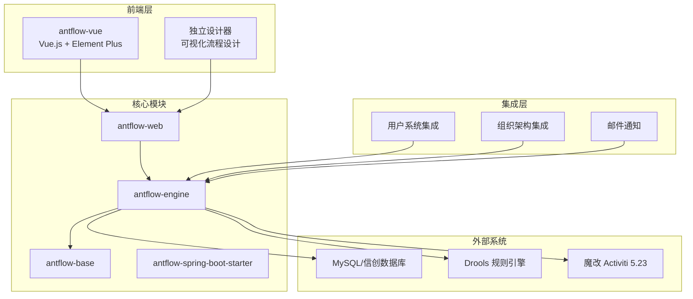
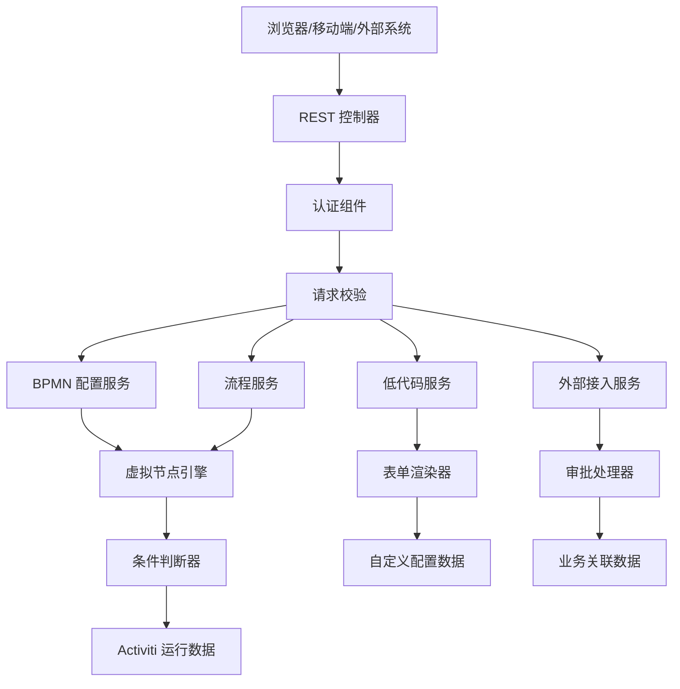
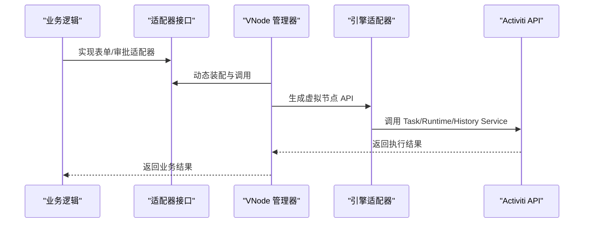
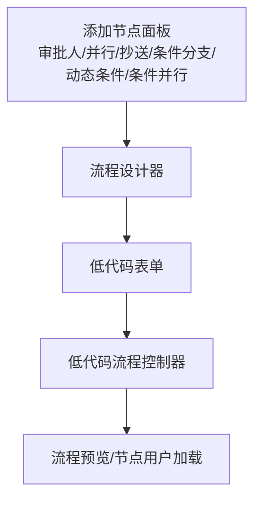
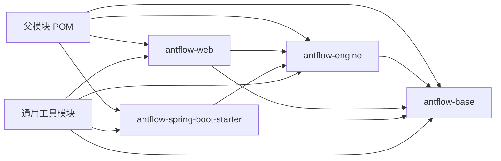

# 项目概述

<cite>
**本文引用的文件**
- [README.zh_CN.md](file://README.zh_CN.md)
- [1.AntFlow介绍.md](file://doc/系统介绍篇/1.AntFlow介绍.md)
- [2.AntFlow_系统架构.md](file://doc/系统介绍篇/2.AntFlow_系统架构.md)
- [AntFlowConstants.java](file://antflow-engine/src/main/java/org/openoa/engine/bpmnconf/constant/AntFlowConstants.java)
- [ProcessConstants.java](file://antflow-engine/src/main/java/org/openoa/engine/bpmnconf/common/ProcessConstants.java)
- [BpmnConfController.java](file://antflow-engine/src/main/java/org/openoa/engine/bpmnconf/controller/BpmnConfController.java)
- [LowCodeFlowController.java](file://antflow-engine/src/main/java/org/openoa/engine/bpmnconf/controller/LowCodeFlowController.java)
- [AdaptorFactory.java](file://antflow-engine/src/main/java/org/openoa/engine/factory/AdaptorFactory.java)
- [AntFlowOperationListener.java](file://antflow-engine/src/main/java/org/openoa/engine/bpmnconf/activitilistener/AntFlowOperationListener.java)
- [AntFlowAutoConfiguration.java](file://antflow-spring-boot-starter/src/main/java/org/antflow/starter/config/AntFlowAutoConfiguration.java)
- [addNode.vue](file://antflow-vue/src/components/Workflow/addNode.vue)
</cite>

## 目录
1. [引言](#引言)
2. [项目结构](#项目结构)
3. [核心组件](#核心组件)
4. [架构总览](#架构总览)
5. [详细组件分析](#详细组件分析)
6. [依赖分析](#依赖分析)
7. [性能考虑](#性能考虑)
8. [故障排查指南](#故障排查指南)
9. [结论](#结论)
10. [附录](#附录)

## 引言
AntFlow 是一款面向企业级的低代码工作流引擎平台，基于魔改版 Activiti 5.23 构建，提供图形化流程设计、低代码表单与强大的虚拟节点（VNode）模式，显著降低流程引擎知识门槛，同时保持对复杂业务的高扩展性。其核心价值主张包括：
- 虚拟节点（VNode）模式：将流程业务与引擎 API 解耦，实现跨引擎迁移与灵活控制，开发者只需聚焦业务逻辑。
- 低代码与 DIY 并存：低代码流程通过拖拽即可完成设计；DIY 模式下开发者仅需实现一个适配器接口即可快速上线。
- 运行时动态节点：支持串行/并行/会签/或签、加批/减签/转办/退回任意节点、动态跳过/变更处理人等丰富能力。
- 与企业用户系统无缝集成：完全脱离 Activiti 自带用户体系，可直接对接企业现有用户/角色/组织架构。
- JSON 化流程可视化：流程预览与审批路径均为 JSON 数据，便于自定义渲染与二次开发。

## 项目结构
AntFlow 采用多模块 Maven 架构，前后端分离，核心模块职责清晰：
- antflow-base：公共工具与接口层
- antflow-engine：核心引擎、虚拟节点、流程控制与业务适配
- antflow-web：Web 接口层，提供 REST 控制器与运行主应用
- antflow-spring-boot-starter：自动配置模块，简化集成
- antflow-vue：前端设计器与工作台，提供流程设计、表单配置与任务管理

图表来源
- [2.AntFlow_系统架构.md:11-48](file://doc/系统介绍篇/2.AntFlow_系统架构.md#L11-L48)
- [2.AntFlow_系统架构.md:63-122](file://doc/系统介绍篇/2.AntFlow_系统架构.md#L63-L122)

章节来源
- [2.AntFlow_系统架构.md:7-48](file://doc/系统介绍篇/2.AntFlow_系统架构.md#L7-L48)
- [2.AntFlow_系统架构.md:63-122](file://doc/系统介绍篇/2.AntFlow_系统架构.md#L63-L122)

## 核心组件
- 虚拟节点（VNode）引擎：通过 VNode 管理器与引擎适配器，将业务逻辑与 Activiti API 解耦，实现跨引擎迁移与灵活控制。
- 适配器工厂（AdaptorFactory）：集中管理表单操作适配器、人员适配器与有序会签节点适配器，支持按标签解析与动态装配。
- 流程控制器（BpmnConfController、LowCodeFlowController）：提供流程设计、发布、预览、节点用户加载、低代码表单查询等接口。
- 业务常量与流程常量：封装流程节点类型、网关类型、系统变量等常量，支撑流程控制与业务判断。
- 自动配置（AntFlowAutoConfiguration）：基于 Spring Boot Starter 的自动扫描与 Mapper 扫描，简化集成与部署。

章节来源
- [AdaptorFactory.java:14-33](file://antflow-engine/src/main/java/org/openoa/engine/factory/AdaptorFactory.java#L14-L33)
- [BpmnConfController.java:30-190](file://antflow-engine/src/main/java/org/openoa/engine/bpmnconf/controller/BpmnConfController.java#L30-L190)
- [LowCodeFlowController.java:20-84](file://antflow-engine/src/main/java/org/openoa/engine/bpmnconf/controller/LowCodeFlowController.java#L20-L84)
- [AntFlowConstants.java:3-91](file://antflow-engine/src/main/java/org/openoa/engine/bpmnconf/constant/AntFlowConstants.java#L3-L91)
- [AntFlowAutoConfiguration.java:8-18](file://antflow-spring-boot-starter/src/main/java/org/antflow/starter/config/AntFlowAutoConfiguration.java#L8-L18)

## 架构总览
AntFlow 的整体架构分为四层：客户端层（浏览器/移动端/外部系统）、接口层（REST 控制器）、业务服务层（BPMN 配置、流程、低代码、外部接入）、引擎层（虚拟节点、条件引擎、表单渲染、审批处理）与持久化层（Activiti 表、自定义配置表、业务表）。

图表来源
- [2.AntFlow_系统架构.md:212-276](file://doc/系统介绍篇/2.AntFlow_系统架构.md#L212-L276)

章节来源
- [2.AntFlow_系统架构.md:210-276](file://doc/系统介绍篇/2.AntFlow_系统架构.md#L210-L276)

## 详细组件分析

### 虚拟节点（VNode）模式
- 设计思想：通过 VNode 管理器与引擎适配器，将业务表单逻辑与 Activiti API 解耦，形成与引擎无关的虚拟节点 API，从而实现跨引擎迁移与灵活控制。
- 关键流程：业务逻辑实现适配器接口 → VNode 管理器调度 → 引擎适配器调用 Activiti API → 完成任务流转与状态更新。
- 优势：无需深入流程引擎知识即可完成复杂流程设计；运行时可动态定义节点，满足中国式办公的灵活需求。

图表来源
- [2.AntFlow_系统架构.md:170-208](file://doc/系统介绍篇/2.AntFlow_系统架构.md#L170-L208)

章节来源
- [2.AntFlow_系统架构.md:168-208](file://doc/系统介绍篇/2.AntFlow_系统架构.md#L168-L208)

### 低代码工作流设计能力
- 设计器能力：前端提供节点添加面板，支持审批人、并行审批、抄送、条件分支、动态条件、条件并行等节点类型，通过拖拽完成流程设计。
- 表单能力：低代码表单通过表单框架与字段配置实现动态渲染，支持分页列表、模板列表与发起页面的数据查询。
- 控制器接口：提供流程设计编辑、列表分页、预览、节点用户加载、按钮权限、业务数据视图与操作等 REST 接口。

图表来源
- [addNode.vue:54-103](file://antflow-vue/src/components/Workflow/addNode.vue#L54-L103)
- [LowCodeFlowController.java:20-84](file://antflow-engine/src/main/java/org/openoa/engine/bpmnconf/controller/LowCodeFlowController.java#L20-L84)
- [BpmnConfController.java:30-190](file://antflow-engine/src/main/java/org/openoa/engine/bpmnconf/controller/BpmnConfController.java#L30-L190)

章节来源
- [addNode.vue:54-103](file://antflow-vue/src/components/Workflow/addNode.vue#L54-L103)
- [LowCodeFlowController.java:20-84](file://antflow-engine/src/main/java/org/openoa/engine/bpmnconf/controller/LowCodeFlowController.java#L20-L84)
- [BpmnConfController.java:30-190](file://antflow-engine/src/main/java/org/openoa/engine/bpmnconf/controller/BpmnConfController.java#L30-L190)

### 与传统流程引擎的区别
- 引擎无关性：通过 VNode 与引擎适配器，AntFlow 将业务与引擎 API 解耦，避免因引擎版本升级或属性变更导致的兼容问题。
- 开发门槛：低代码模式下无需编码即可完成流程设计；DIY 模式下仅需实现一个适配器接口，大幅降低开发成本。
- 运行时灵活性：支持运行时动态节点、动态跳过、变更处理人、退回任意节点等能力，贴合中国式办公场景。
- 用户系统集成：完全脱离 Activiti 自带用户体系，可直接对接企业现有用户/角色/组织架构。

章节来源
- [README.zh_CN.md:51-60](file://README.zh_CN.md#L51-L60)
- [2.AntFlow_系统架构.md:168-208](file://doc/系统介绍篇/2.AntFlow_系统架构.md#L168-L208)

### 适配器工厂与业务扩展
- 适配器工厂负责按标签解析与动态装配各类适配器，包括表单操作适配器、人员适配器与有序会签节点适配器，支撑流程节点的多样化扩展。
- 通过注解驱动的装配机制，开发者可按需扩展新的节点类型与审批规则，保持核心引擎稳定的同时提升业务适配能力。

章节来源
- [AdaptorFactory.java:14-33](file://antflow-engine/src/main/java/org/openoa/engine/factory/AdaptorFactory.java#L14-L33)

### 流程常量与节点类型
- AntFlowConstants 定义了流程节点类型、网关类型、系统变量等常量，支撑流程控制与业务判断。
- ProcessConstants 提供流程实例下一节点查询、任务查询、历史任务获取等通用能力，辅助流程推进与回溯。

章节来源
- [AntFlowConstants.java:3-91](file://antflow-engine/src/main/java/org/openoa/engine/bpmnconf/constant/AntFlowConstants.java#L3-L91)
- [ProcessConstants.java:39-157](file://antflow-engine/src/main/java/org/openoa/engine/bpmnconf/common/ProcessConstants.java#L39-L157)

### 事件监听与外部回调
- AntFlowOperationListener 实现工作流按钮操作回调，支持流程启动、提交、同意、作废、终止、转发、退回修改、加批等事件的消息发送与外部回调。
- 通过统一的监听器接口，可将流程事件与外部系统集成，实现审批状态同步与消息通知。

章节来源
- [AntFlowOperationListener.java:17-206](file://antflow-engine/src/main/java/org/openoa/engine/bpmnconf/activitilistener/AntFlowOperationListener.java#L17-L206)

### 自动配置与集成
- AntFlowAutoConfiguration 通过 @MapperScans 与 @ComponentScan，自动扫描基础、通用与引擎模块的 Mapper 与组件，简化集成与部署。
- 结合 Spring Boot Starter，用户可零配置快速引入 AntFlow 能力，降低集成成本。

章节来源
- [AntFlowAutoConfiguration.java:8-18](file://antflow-spring-boot-starter/src/main/java/org/antflow/starter/config/AntFlowAutoConfiguration.java#L8-L18)

## 依赖分析
- 技术栈：Spring Boot 2.7.17、魔改 Activiti 5.23、MyBatis-Plus 3.5.1、MySQL 8.0.27、Drools 6.5.0、Vue.js 3、Element Plus。
- 模块依赖：antflow-engine 依赖 antflow-base，antflow-web 与 starter 依赖 engine 与 base，通用工具模块贯穿各层。
- 外部依赖：数据库层支持 MySQL 与信创数据库；规则引擎支持 Drools；前端使用 Vue 3 与 Element Plus。

图表来源
- [2.AntFlow_系统架构.md:11-48](file://doc/系统介绍篇/2.AntFlow_系统架构.md#L11-L48)

章节来源
- [2.AntFlow_系统架构.md:59-131](file://doc/系统介绍篇/2.AntFlow_系统架构.md#L59-L131)

## 性能考虑
- 数据层优化：支持 MongoDB 与主流信创数据库，满足海量数据与高并发场景；通过源码级深度改造，确保原生性能与分布式特性。
- 引擎适配：虚拟节点模式减少引擎 API 调用层级，降低耦合并提升执行效率。
- 前端渲染：JSON 化流程数据便于前端自定义渲染，减少图片流带来的传输与渲染开销。

章节来源
- [README.zh_CN.md:158-175](file://README.zh_CN.md#L158-L175)

## 故障排查指南
- 常见问题定位：检查数据库连接、表结构初始化脚本与引擎版本兼容性；确认流程节点类型与网关配置是否正确。
- 日志与异常：关注业务异常抛出与流程状态一致性，核对历史任务记录与下一节点查询结果。
- 集成问题：确认用户系统对接 SQL 字段映射与 @Primary 覆盖实现；验证邮件通知配置与外部回调地址。

章节来源
- [ProcessConstants.java:111-123](file://antflow-engine/src/main/java/org/openoa/engine/bpmnconf/common/ProcessConstants.java#L111-L123)
- [1.AntFlow介绍.md:218-235](file://doc/系统介绍篇/1.AntFlow介绍.md#L218-L235)

## 结论
AntFlow 以虚拟节点（VNode）为核心，将流程业务与引擎 API 解耦，提供低代码与 DIY 双通道的开发体验，配合运行时动态节点与企业用户系统集成能力，满足复杂企业场景的流程需求。通过模块化设计与自动配置机制，AntFlow 降低了集成与维护成本，为企业级工作流平台提供了高扩展性与高可用性的解决方案。

## 附录
- 快速开始：前端运行与后端启动步骤详见项目说明；学习资源与生态项目参见 README 与文档目录。
- 社区与生态：QQ 群、Gitee Wiki、若依灵犀集成案例与捐赠支持信息详见 README。

章节来源
- [README.zh_CN.md:88-134](file://README.zh_CN.md#L88-L134)
- [1.AntFlow介绍.md:248-255](file://doc/系统介绍篇/1.AntFlow介绍.md#L248-L255)