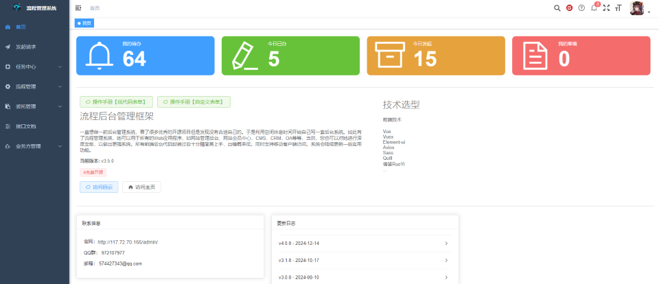
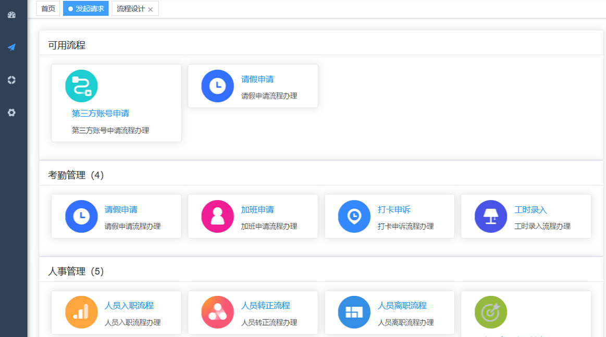
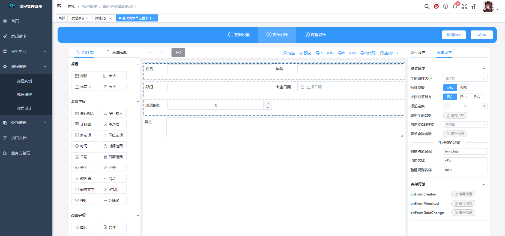

<p align="center">
	
</p>
<h1 align="center" style="margin: 30px 0 30px; font-weight: bold;">Antflow v4.0.0</h1>
<h4 align="center">基于Vue3 Element-Plus 前端快速开发框架</h4>
 
## 平台简介

-  在线预览  &nbsp;&nbsp; [预览入口](http://117.72.70.166/admin/) &nbsp;&nbsp;&nbsp; [系统操作手册](https://gitee.com/tylerzhou/Antflow/wikis/)
-  预览功能以及API介绍文档来啦(持续完善中...) [wiki](https://gitee.com/tylerzhou/Antflow/wikis/) 
-  **完全开源免费,无付费引导,可放心使用** 
-  开源设计器地址 [Gitee仓库](https://gitee.com/ldhnet/AntFlow-Designer) | [GitHub仓库](https://github.com/ldhnet/AntFlow-Designer) | [GitCode仓库](https://gitcode.com/ldhnet/FlowDesigner/overview) 

-  开源项目地址 [Gitee仓库](https://gitee.com/tylerzhou/Antflow) | [Github仓库](https://github.com/mrtylerzhou/AntFlow) | [GitCode仓库](https://gitcode.com/zypqqgc/AntFlow/overview) 

 - QQ技术交流群（972107977） 期待您的加入
 - 有疑问可以Issues留言，我们会认真对待
  [issues地址](https://gitee.com/tylerzhou/Antflow/issues)

## 前端运行

```bash
# gitee克隆项目
git clone https://gitee.com/tylerzhou/Antflow.git 

# 进入项目目录
cd Antflow/antflow-vue

# 安装依赖
npm  install  --registry=https://registry.npmmirror.com

# 启动服务
npm run dev

# 构建测试环境 npm run build:stage
# 构建生产环境 npm run build:prod
# 前端访问地址 http://localhost:80
```

## 内置功能

1.  发起请求：发起流程。
2.  任务中心：我的发起，代办任务，已办任务。
3.  流程管理：流程设计，流程列表。 
 
## 演示图  






##  捐赠支持
😀 你可以请作者喝杯咖啡表示鼓励
<table>
    <tr>
        <td></td>
        <td></td>
    </tr>  
</table>

## 好书推荐

大家在使用本项目时，推荐结合贺波老师的书
[《深入Flowable流程引擎：核心原理与高阶实战》](https://item.jd.com/14804836.html)学习。这本书得到了Flowable创始人Tijs Rademakers亲笔作序推荐，对系统学习和深入掌握Flowable的用法非常有帮助。

> flowable源于activiti,很多核心表,核心api和设计模式都是一样的.读flowable的书同样也可以用在activiti上


