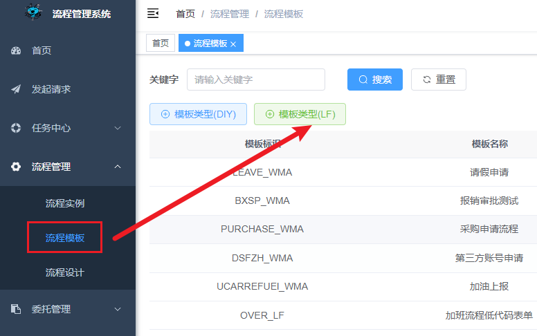
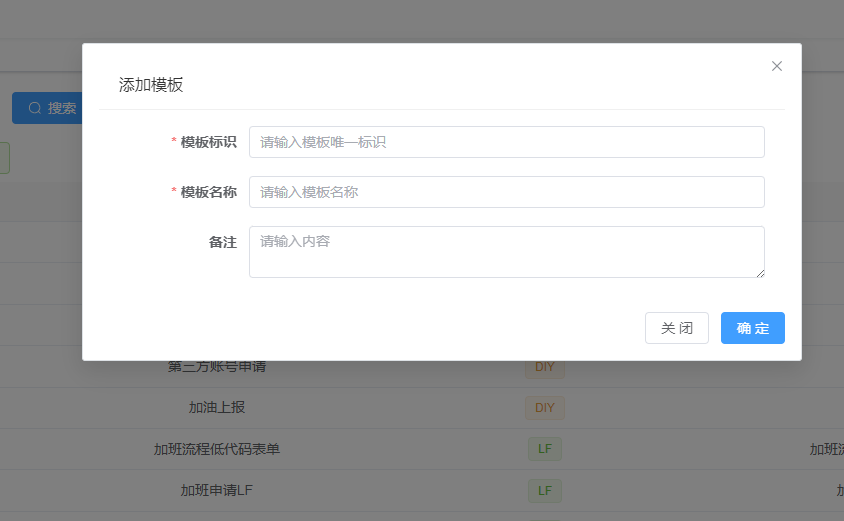
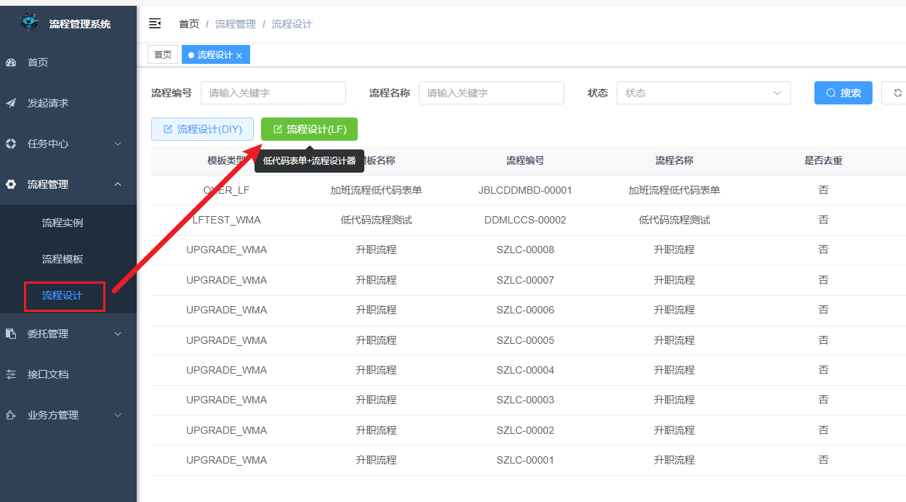
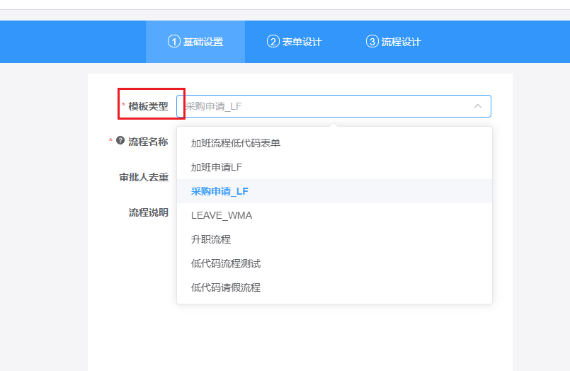
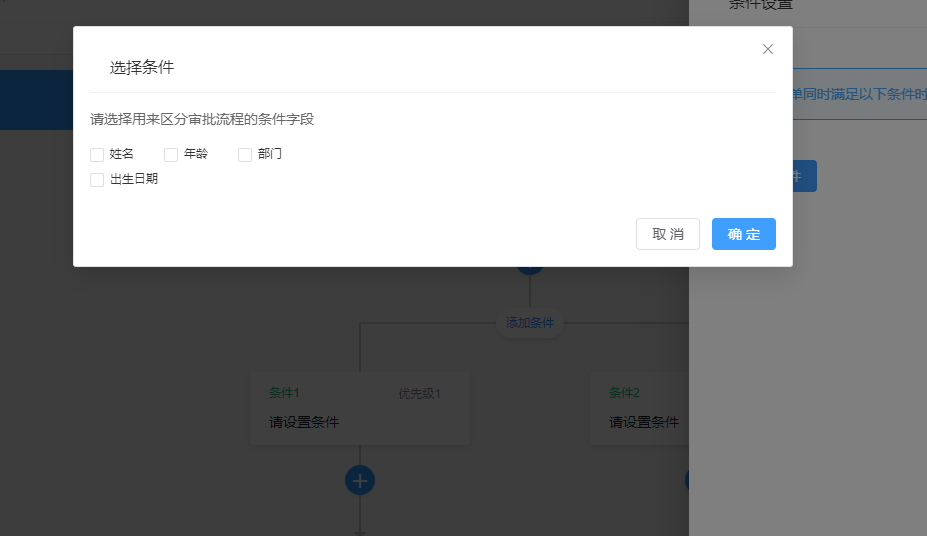
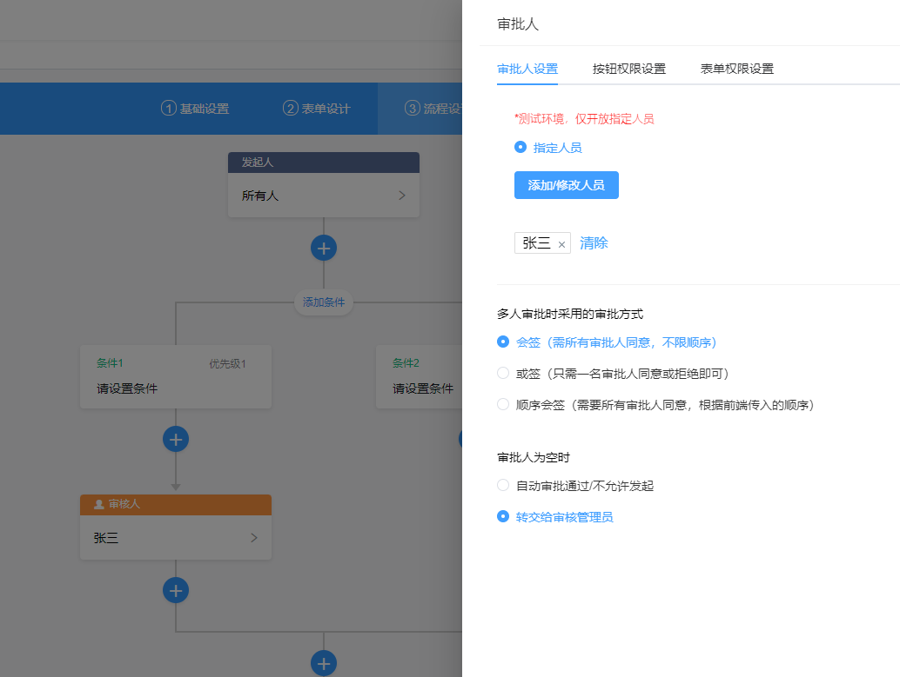
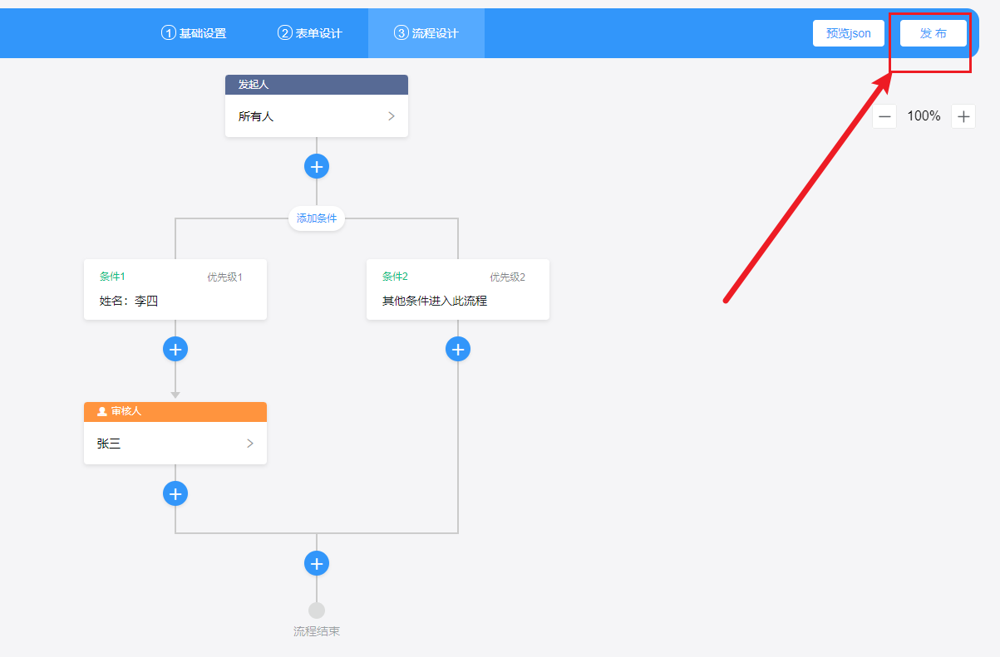
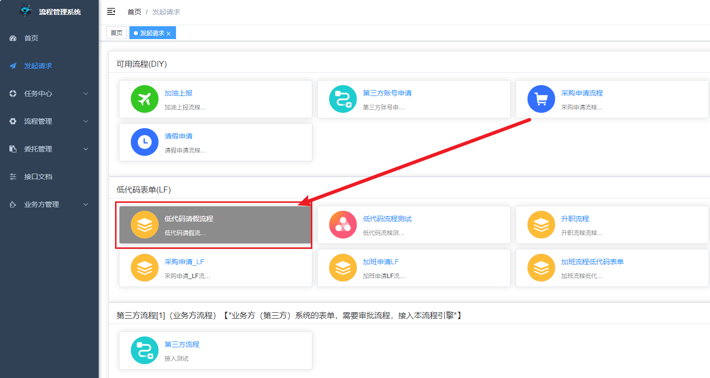
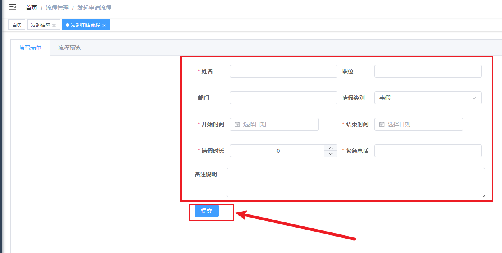

### 温馨提示：低代码表单流程 可以实现【零】编码发起业务流程 

# 第一步：登录进入首页

# 第二步：添加流程模板

### 2-1、点击流程模板设计，并填写基本信息，如下图： 

 

### 2-2、新增模板信息，模板标识是唯一值：

 

# 第三步：流程设计

### 3-1、点击 【流程设计(LF)】，即含有{低代码表单设计} + {流程设计}：

### 3-2、基础表单设置，选中第二步中添加的流程模板

### 3-3、表单设计，选中需要的控件，并且修改标签名称

### 3-4、流程设计,流程设计节点包括：
- 1-发起人 节点是默认的不用选
- 2-条件节点 条件字段是从低代码表单中 获取的，所以需要先完成低代码表单设计。
- 3-审批人节点，目前仅支持指定人员，其他类型请自行开发，或等待后续支持。如下图：
 

 

# 第四步：流程模板启动

- 流程设计列表菜单，找到刚才创建的流程，点击启动，如下图

# 第五步：发起流程

### 5-1、点击 【发起请求】 菜单 在 {低代码表单(LF)}模块中找到刚才添加的 流程。

### 5-2、填写表单并提交，即可完成流程实例的启动，进入审批程序。

# 第六步：流程审批

### 6-1、例如，用李四账户登录，然后点击 我的代办列表,如下图：
 

### 6-2、点击审批，完成流程审批，流程流转到下一位审批人，如下图
 

 
# 第7步：流程预览
 

