###  温馨提示：自定义表单流程 对接步骤，在文档最下方 

# 第一步：登录进入首页

<div>
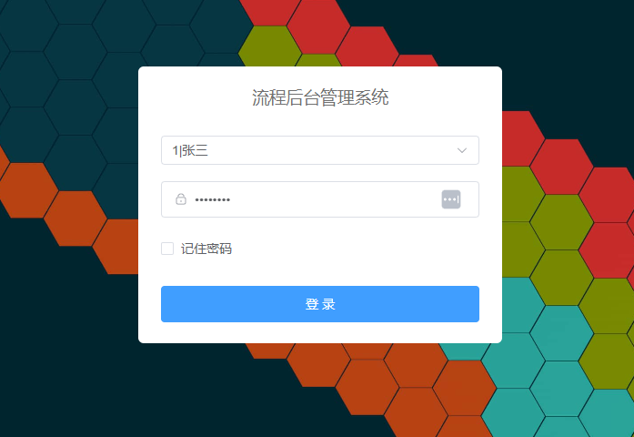
</div>
<div>
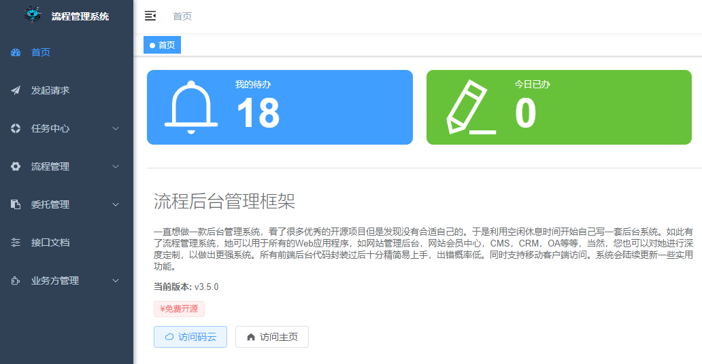
</div>

# 第二步：添加流程模板

### 2-1、流程模板添加 需要 对 前后端代码 做相应添加，具体步骤看文档最后： 
 

# 第三步：流程设计

### 3-1、点击 【流程设计(DIY)】：

<div>
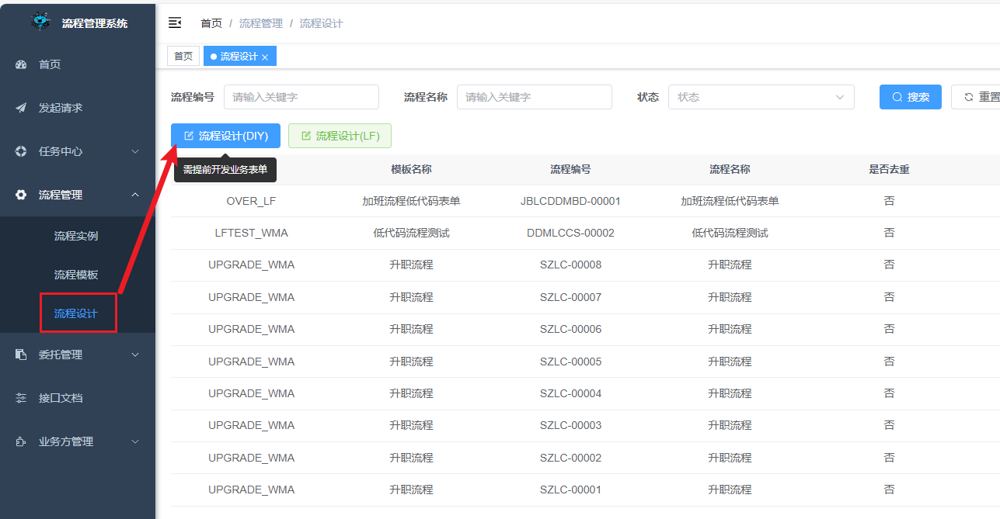
</div>

### 3-2、基础表单设置，选中第二步中添加的流程模板
<div>
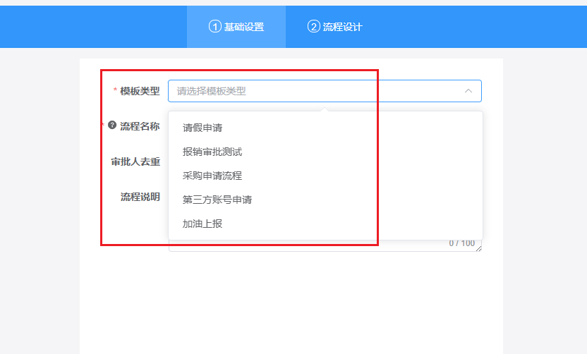
</div>

### 3-3、表单设计 

- 需要 对 前后端代码 做相应添加，具体步骤看文档最

### 3-4、流程设计,流程设计节点包括：
- 1-发起人 节点是默认的不用选
- 2-条件节点 条件字段是从\public\mock\conditions.json 中获取的。
- 3-审批人节点，目前仅支持指定人员，其他类型请自行开发，或等待后续支持。
   审批人数据是在 \public\mock\departments.json 静态模拟的
如下图：
 <div>

</div>
<div>
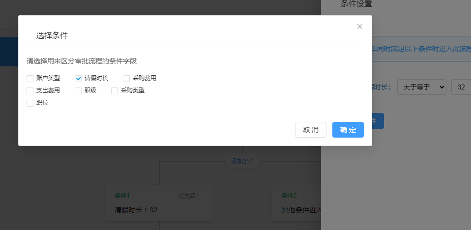
</div>
 <div>
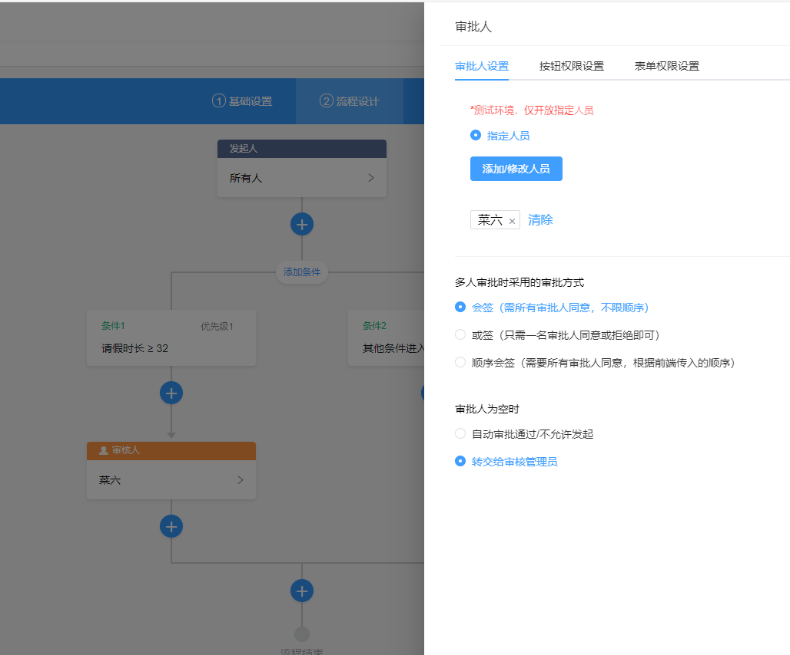
</div>
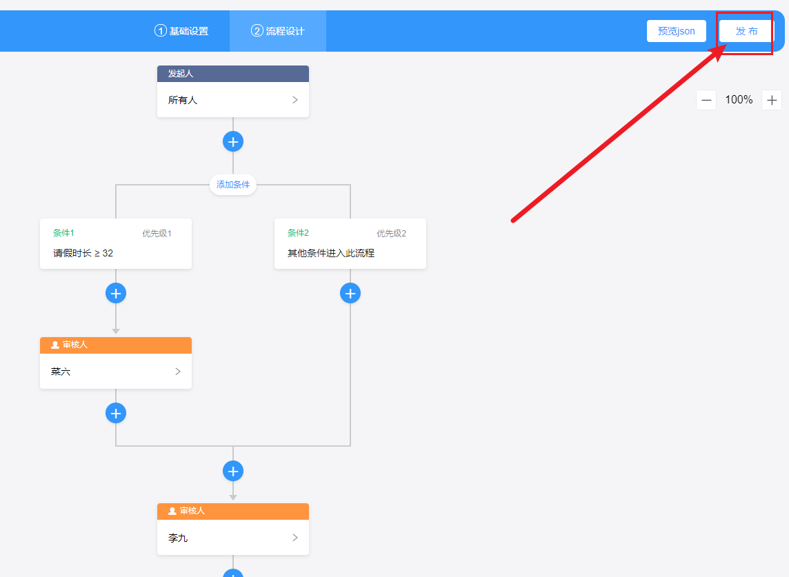
</div>

# 第四步：流程模板启动

- 流程设计列表菜单，找到刚才创建的流程，点击启动，如下图
</div>
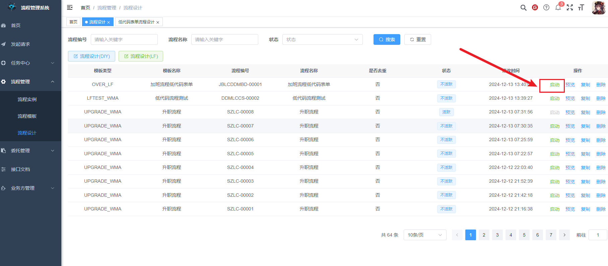
</div>

# 第五步：发起流程

### 5-1、点击 【发起请求】 菜单 在 {可用流程(DIY)} 模块中找到刚才添加的 流程。
</div>
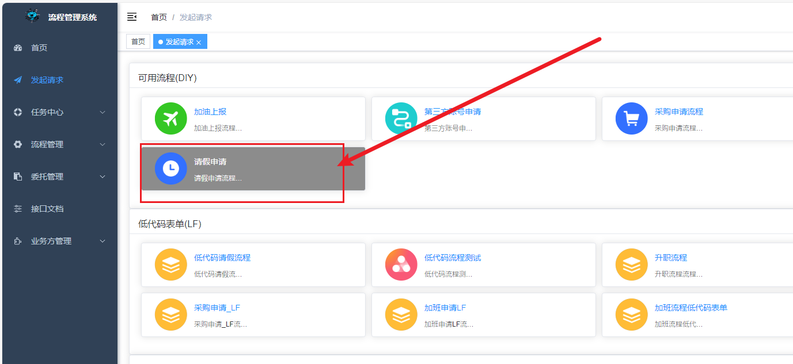
</div>

### 5-2、填写表单并提交，即可完成流程实例的启动，进入审批程序。
</div>
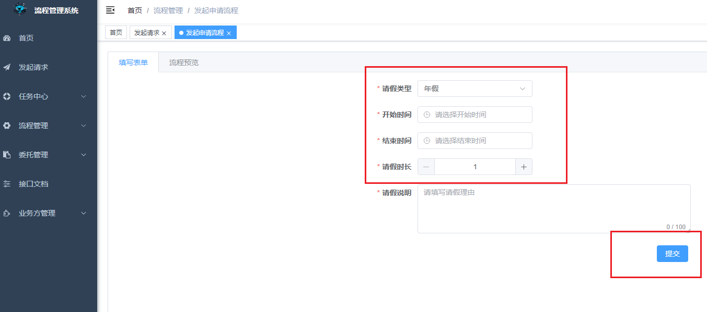
</div>

# 第六步：流程审批

### 6-1、例如，用李四账户登录，然后点击 我的代办列表,如下图：
 </div>
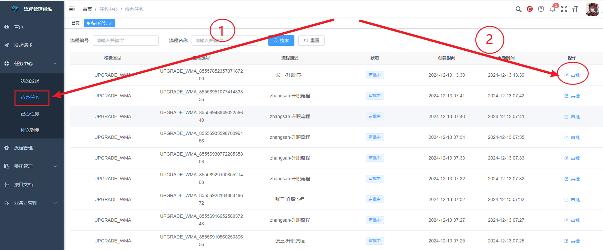
</div>

### 6-2、点击审批，完成流程审批，流程流转到下一位审批人，如下图
 </div>
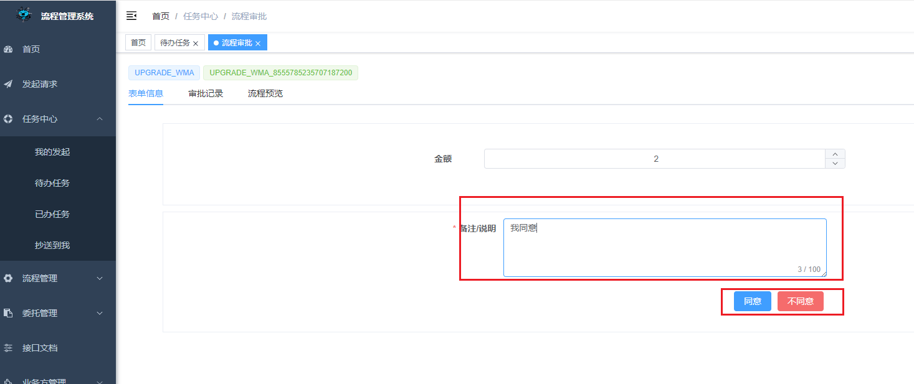
</div>
 
# 第7步：流程预览
 </div>
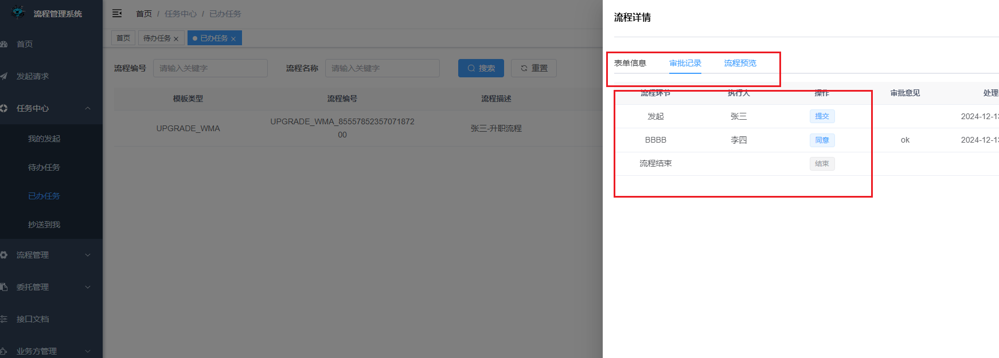
</div>


# Antflow 后端Api项目修改步骤 

### 1 创建对应的业务表 例如 加油上报sql：
```
-- ----------------------------
-- Table structure for t_biz_ucar_refuel
-- ----------------------------
DROP TABLE IF EXISTS `t_biz_ucar_refuel`;
CREATE TABLE `t_biz_ucar_refuel` (
  `id` int(11) NOT NULL AUTO_INCREMENT,
`license_plate_number` varchar(32) DEFAULT NULL COMMENT '车牌号',
`refuel_time` datetime DEFAULT NULL COMMENT '加油日期',
`remark` varchar(255) CHARACTER SET utf8mb4 COLLATE utf8mb4_general_ci NULL DEFAULT NULL,
`create_user` varchar(50) DEFAULT NULL COMMENT '创建人',
`create_time` datetime DEFAULT NULL COMMENT '创建日期',
`update_user` varchar(50) DEFAULT NULL COMMENT '更新人',
`update_time` datetime DEFAULT NULL COMMENT '更新日期',
PRIMARY KEY (`id`)
) ENGINE=InnoDB DEFAULT CHARSET=utf8mb4 COMMENT='加油表';

```
### 2、在antflow-web模块依照下面文件做相应的添加，例如：
##### 1、 如下图中第4步，是接入工作流引擎，可以使业务表单与工作流引擎关联起来，实现流转。
 </div>
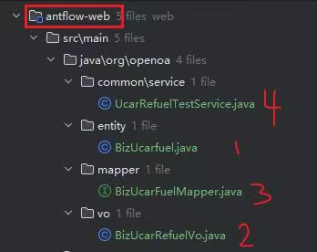
</div>

##### 2、 service文件请严格按照下图中进行添加， 

 </div>
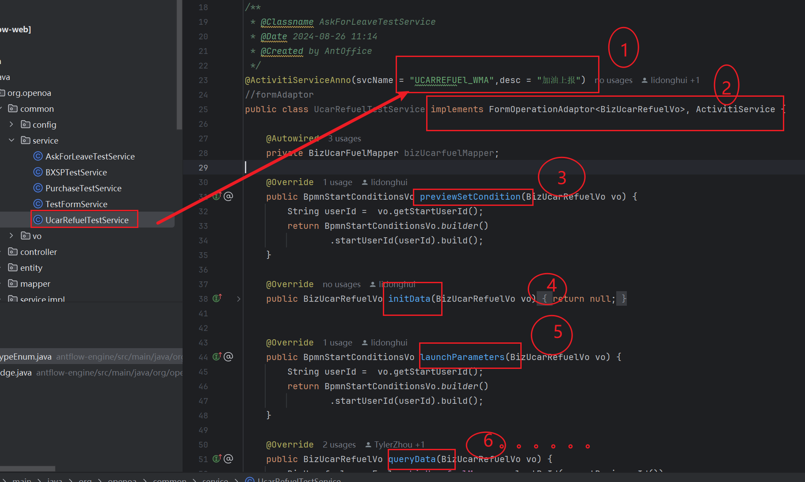
</div>


# Antflow 前端自定义表单

##### 温馨提示 前端配置的api url如下几个文件中：
- \src\api\mockflow.js
- \src\api\mocklow.js
- \src\api\mockoutside.js

```
--我们预览地址的服务器，需要改成自己本地或者服务器地址
let baseUrl = "http://117.72.70.166:8001";
//let baseUrl = "http://localhost:8001";
```

### 1、现有业务表单在 \src\views\workflow\components\forms\  项目文件夹下面，可以复制后修改一份 进行使用，如下图：
 </div>
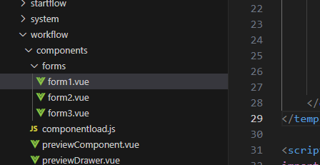
</div>

### 2、添加发起流程页的图标 \src\components\Dashboard\Workplace.vue 文件，图标文件在\asets\images\work\文件加下，可自行设计：
```
 --94行
let statusColor = {
    "LEAVE_WMA": 'leave',
    "DSFZH_WMA": 'jiejing',
    "PURCHASE_WMA": 'bought',
    "UCARREFUEl_WMA": 'trip',
    "LFTEST_WMA": 'zhushou',
};
 ```

### 3、添加对应的 自定义表单路由 在\src\utils\flow\const.js文件中，如下：
```
--138行
export const bizFormMaps = new Map([
  ['DSFZH_WMA', '/forms/form1.vue'],
  ['LEAVE_WMA', '/forms/form2.vue'],
  ['UCARREFUEl_WMA', '/forms/form3.vue']
]);

```

