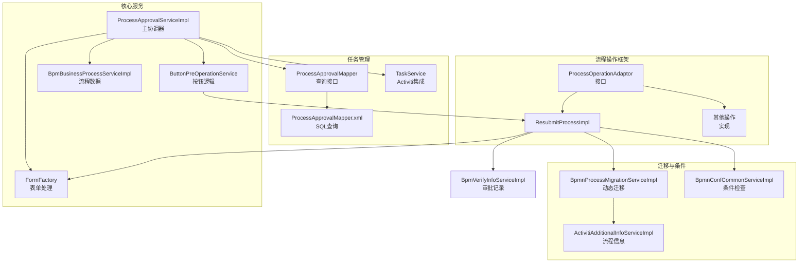
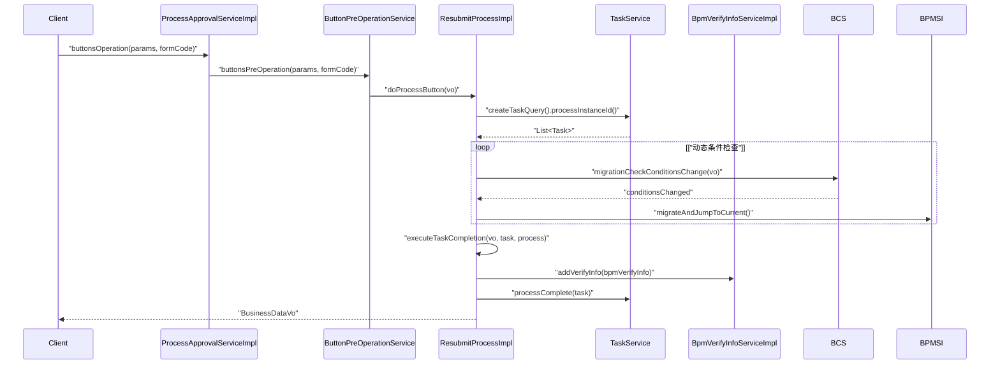
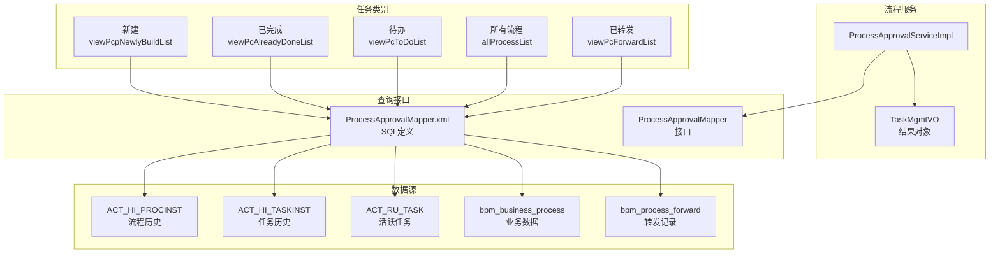
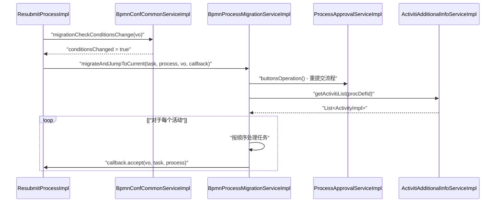
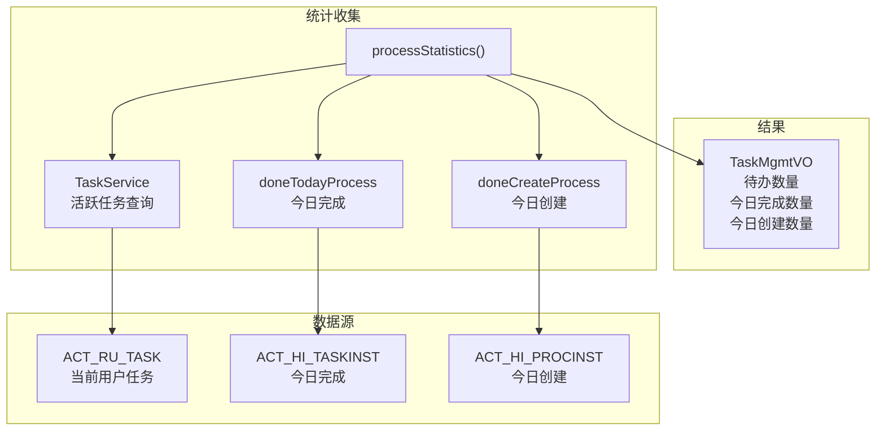

# 流程操作与任务管理

## 流程操作架构

流程操作系统基于使用适配器模式的可插拔架构构建，允许统一处理不同类型的流程操作，同时保持特定的业务逻辑。



## 核心流程操作

### 流程操作类型

系统支持通过 `ProcessOperationAdaptor`接口实现的几种核心流程操作：

| 操作类型   | 代码                     | 描述           | 实现                    |
| ---------- | ------------------------ | -------------- | ----------------------- |
| 提交       | `BUTTON_TYPE_RESUBMIT` | 初始流程提交   | `ResubmitProcessImpl` |
| 审批       | `BUTTON_TYPE_AGREE`    | 标准审批       | `ResubmitProcessImpl` |
| 添加审批人 | `BUTTON_TYPE_JP`       | 动态添加审批人 | `ResubmitProcessImpl` |

### 流程操作流程




### 业务数据处理

`ResubmitProcessImpl`中的 `executeTaskCompletion`方法处理审批的核心逻辑：

1. **任务验证** - 确保任务存在且用户有权限
2. **表单数据处理** - 通过 `FormFactory`处理表单数据
3. **验证记录创建** - 为审计跟踪创建 `BpmVerifyInfo`记录
4. **流程摘要信息更新** - 更新流程摘要信息
5. **任务完成** - 完成Activiti任务

**来源**： [antflow-engine/src/main/java/org/openoa/engine/bpmnconf/service/biz/ResubmitProcessImpl.java L116-L164](https://github.com/mrtylerzhou/AntFlow-activiti/blob/160c7ba8/antflow-engine/src/main/java/org/openoa/engine/bpmnconf/service/biz/ResubmitProcessImpl.java#L116-L164)

## 任务管理系统

### 任务查询类别

系统通过 `ProcessApprovalMapper.xml`提供全面的任务查询能力：

| 查询类型 | 方法                      | 目的                   |
| -------- | ------------------------- | ---------------------- |
| 最近创建 | `viewPcpNewlyBuildList` | 用户最近创建的流程     |
| 已完成   | `viewPcAlreadyDoneList` | 用户已完成的任务       |
| 待办     | `viewPcToDoList`        | 用户待办任务           |
| 所有流程 | `allProcessList`        | 管理员视图下的所有流程 |
| 已转发   | `viewPcForwardList`     | 转发给用户的任务       |

### 任务管理架构



**来源**： [antflow-engine/src/main/resources/mapper/ProcessApprovalMapper.xml](https://github.com/mrtylerzhou/AntFlow-activiti/blob/160c7ba8/antflow-engine/src/main/resources/mapper/ProcessApprovalMapper.xml)
[antflow-engine/src/main/java/org/openoa/engine/bpmnconf/mapper/ProcessApprovalMapper.java](https://github.com/mrtylerzhou/AntFlow-activiti/blob/160c7ba8/antflow-engine/src/main/java/org/openoa/engine/bpmnconf/mapper/ProcessApprovalMapper.java)

### 任务列表处理

`ProcessApprovalServiceImpl`中的 `findPcProcessList`方法根据类型参数处理不同的任务列表请求：

* **类型3**：最近创建的任务 - 包括流程键过滤
* **类型4**：已完成的任务 - 按完成时间排序
* **类型5**：运行中的任务 - 分配给用户的活跃任务
* **类型8**：所有流程 - 管理员视图
* **类型9**：已转发的流程 - 转发给用户的任务

**来源**： [antflow-engine/src/main/java/org/openoa/engine/bpmnconf/service/biz/ProcessApprovalServiceImpl.java L97-L167](https://github.com/mrtylerzhou/AntFlow-activiti/blob/160c7ba8/antflow-engine/src/main/java/org/openoa/engine/bpmnconf/service/biz/ProcessApprovalServiceImpl.java#L97-L167)

## 流程迁移与动态条件

### 动态条件迁移

系统支持在执行过程中动态迁移流程，当条件发生变化时。这由 `BpmnProcessMigrationServiceImpl`处理：



**来源**： [antflow-engine/src/main/java/org/openoa/engine/bpmnconf/service/biz/BpmnProcessMigrationServiceImpl.java L49-L125](https://github.com/mrtylerzhou/AntFlow-activiti/blob/160c7ba8/antflow-engine/src/main/java/org/openoa/engine/bpmnconf/service/biz/BpmnProcessMigrationServiceImpl.java#L49-L125)
[antflow-engine/src/main/java/org/openoa/engine/bpmnconf/service/biz/ResubmitProcessImpl.java L98-L103](https://github.com/mrtylerzhou/AntFlow-activiti/blob/160c7ba8/antflow-engine/src/main/java/org/openoa/engine/bpmnconf/service/biz/ResubmitProcessImpl.java#L98-L103)

### 迁移流程

迁移流程涉及：

1. **条件检查** - 验证动态条件是否已更改
2. **流程重提交** - 使用更新的条件创建新的流程实例
3. **活动迭代** - 处理工作流定义中的每个活动
4. **任务完成** - 完成带有适当验证记录的任务
5. **当前任务处理** - 使用原始审批意见为当前任务执行回调

**来源**： [antflow-engine/src/main/java/org/openoa/engine/bpmnconf/service/biz/BpmnProcessMigrationServiceImpl.java L49-L125](https://github.com/mrtylerzhou/AntFlow-activiti/blob/160c7ba8/antflow-engine/src/main/java/org/openoa/engine/bpmnconf/service/biz/BpmnProcessMigrationServiceImpl.java#L49-L125)

## 任务查询操作

### 基本查询结构

所有任务查询都使用在 `ProcessApprovalMapper.xml`中定义的公共基本参数结构：

```xml
-- 公共过滤参数
<sql id="base_param_sql">
 <if test="taskMgmtVO.search!=null and taskMgmtVO.search!=''">
 AND (s.description LIKE CONCAT('%', #{taskMgmtVO.search},'%')
 OR s.processNumber LIKE CONCAT('%', #{taskMgmtVO.search},'%'))
 </if>
 <!-- 其他用户、流程名称、日期等过滤条件 -->
</sql>
```

### 查询实现

| 查询类型            | 关键表                                        | 排序                | 特殊逻辑       |
| ------------------- | --------------------------------------------- | ------------------- | -------------- |
| `viewNewlyBuild`  | `ACT_HI_PROCINST`, `bpm_business_process` | `createTime DESC` | 按启动用户过滤 |
| `viewAlreadyDone` | `ACT_HI_TASKINST`, `bpm_business_process` | `runTime DESC`    | 排除系统任务   |
| `viewPcToDo`      | `ACT_RU_TASK`, `bmp_business_process`     | `runTime DESC`    | 仅活跃任务     |
| `allProcess`      | `ACT_RU_TASK`, `ACT_HI_PROCINST`          | `runTime DESC`    | 管理员视图     |

**来源**： [antflow-engine/src/main/resources/mapper/ProcessApprovalMapper.xml L40-L190](https://github.com/mrtylerzhou/AntFlow-activiti/blob/160c7ba8/antflow-engine/src/main/resources/mapper/ProcessApprovalMapper.xml#L40-L190)

## 统计与监控

### 流程统计

系统通过 `processStatistics`方法提供实时统计：




### 操作检查

系统通过 `isOperational`查询包含操作验证，以检查是否允许特定的流程操作：

```python
select count(1) from bpm_process_operation w 
where w.process_node=#{taskMgmtVO.taskName} 
 and w.process_key=#{taskMgmtVO.processKey} 
 and w.type=#{taskMgmtVO.type}
```


## 集成点

### 表单处理集成

流程操作通过 `FormFactory`与表单系统集成：

* **表单数据转换** - `dataFormConversion(params, formCode)`
* **表单适配器** - `getFormAdaptor(vo).consentData(vo)`
* **外部访问** - 特殊处理外部流程访问

### Activiti集成

系统通过以下方式与Activiti引擎集成：

* **任务服务** - 任务查询和完成
* **流程实例管理** - 流程生命周期操作
* **历史服务** - 审计跟踪和报告
