# REST API 控制器

## 控制器架构概述

REST API层被组织成专门的控制器，这些控制器处理工作流系统的不同方面：

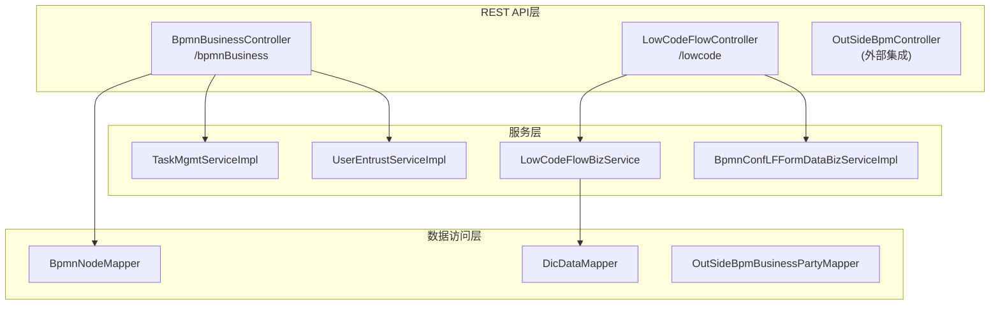

## BPMN业务控制器

### 控制器概述

`BpmnBusinessController`提供了核心BPMN业务操作的端点，包括表单管理、用户委托和流程启动功能。

| 端点                                        | 方法 | 目的                           |
| ------------------------------------------- | ---- | ------------------------------ |
| `/bpmnBusiness/getDIYFormCodeList`        | GET  | 检索自定义表单DIY FormCode列表 |
| `/bpmnBusiness/entrustlist/{type}`        | POST | 根据类型获取分页的委托列表     |
| `/bpmnBusiness/entrustDetail/{id}`        | GET  | 根据ID获取委托详情             |
| `/bpmnBusiness/editEntrust`               | POST | 编辑委托信息                   |
| `/bpmnBusiness/getStartUserChooseModules` | GET  | 获取流程启动用户选择模块       |

### 端点详情

#### DIY表单代码管理

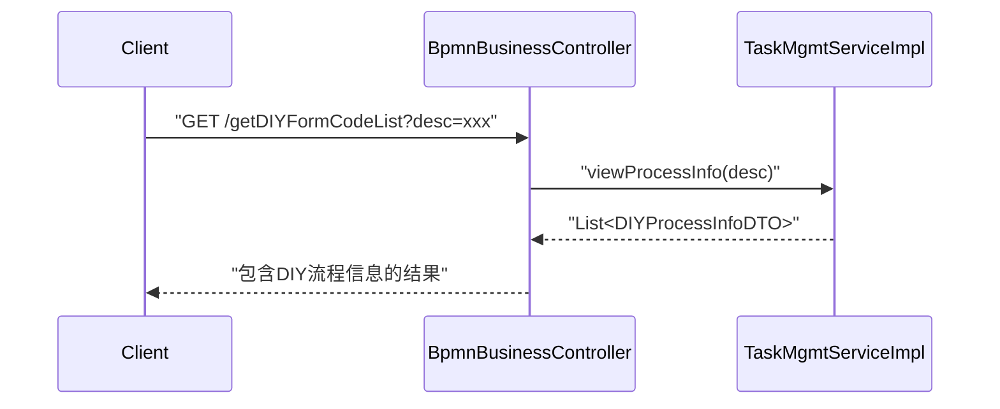

#### 用户委托管理

控制器提供了全面的委托管理能力：

* **列出委托**：`POST /entrustlist/{type}` 接受带有分页参数的 `DetailRequestDto`，并返回 `ResultAndPage<Entrust>`
* **获取委托详情**：`GET /entrustDetail/{id}` 返回特定ID的详细委托信息
* **编辑委托**：`POST /editEntrust` 处理 `DataVo`对象以更新委托配置

#### 启动用户选择模块

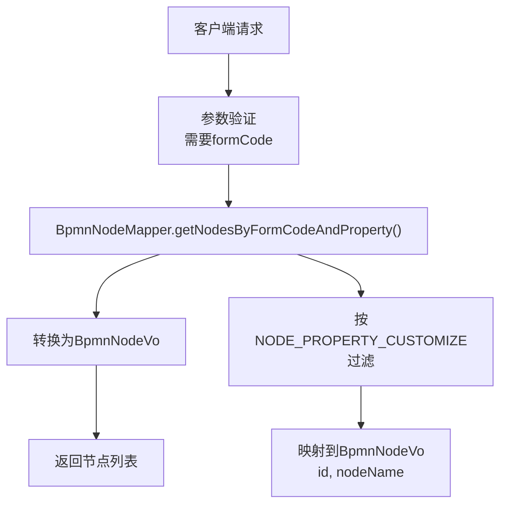

## 低代码流程控制器

### 控制器概述

`LowCodeFlowController`管理低代码工作流操作，包括表单代码管理、表单数据检索和模板管理。

| 端点                                     | 方法 | 目的                                  |
| ---------------------------------------- | ---- | ------------------------------------- |
| `/lowcode/getLowCodeFlowFormCodes`     | GET  | 获取用于流程设计的所有LF FormCodes    |
| `/lowcode/getLFFormCodePageList`       | POST | 获取LF FormCode的分页列表（用于模板） |
| `/lowcode/getLFActiveFormCodePageList` | POST | 获取活跃的LF FormCode分页列表         |
| `/lowcode/getformDataByFormCode`       | GET  | 根据表单代码获取表单数据              |
| `/lowcode/createLowCodeFormCode`       | POST | 创建新的低代码表单代码                |

### 低代码表单管理流程

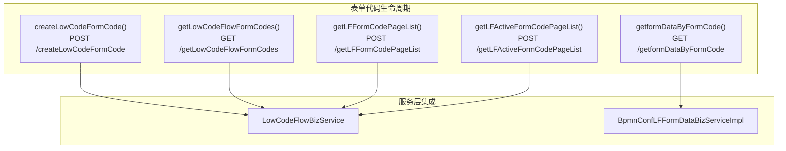

### 表单代码数据结构

控制器使用几个关键的数据结构：

#### BaseKeyValueStruVo

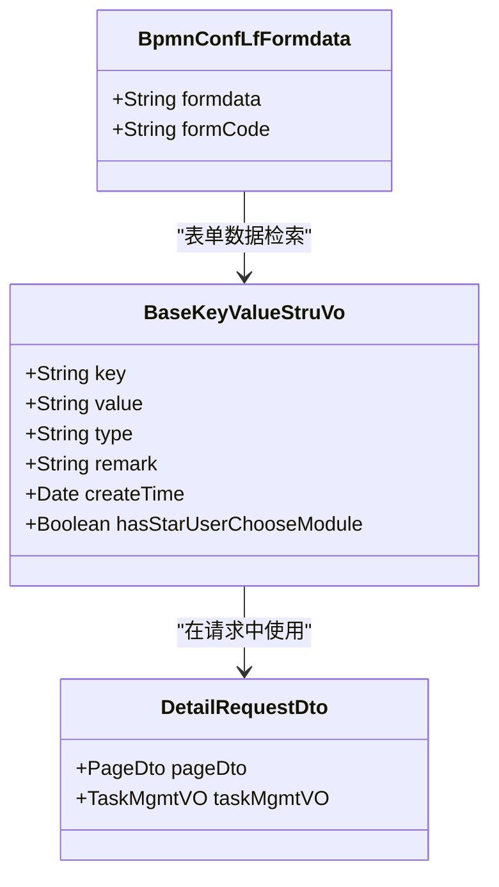

## 服务集成模式

### 依赖注入结构

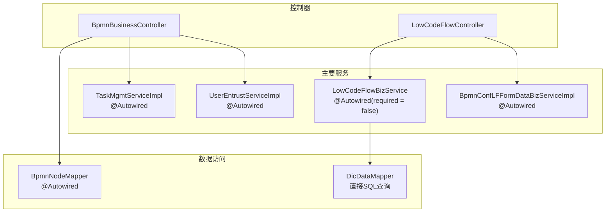

### 请求处理管道

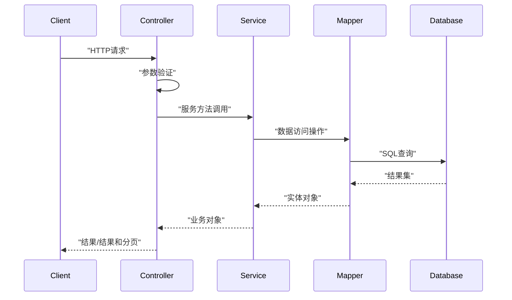

## 数据访问集成

### Mapper集成模式

控制器与MyBatis mappers集成以进行数据访问：

| 控制器                     | Mapper                            | 目的         |
| -------------------------- | --------------------------------- | ------------ |
| `BpmnBusinessController` | `BpmnNodeMapper`                | 节点属性查询 |
| `LowCodeFlowController`  | `DicDataMapper`                 | 字典数据访问 |
| 外部控制器                 | `OutSideBpmBusinessPartyMapper` | 外部方管理   |

### SQL查询模式

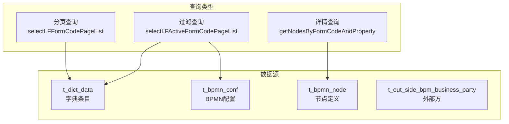

## 错误处理和验证

### 参数验证模式

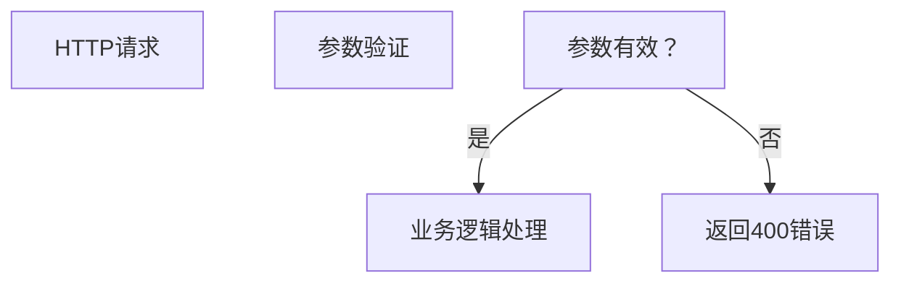

### 验证失败处理

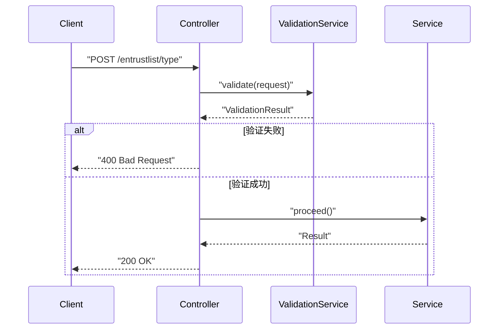

## 字典数据集成

> 字典主要用于存储一些简单的配置项,比如低代码流程的流程名称等信息

### 字典服务架构

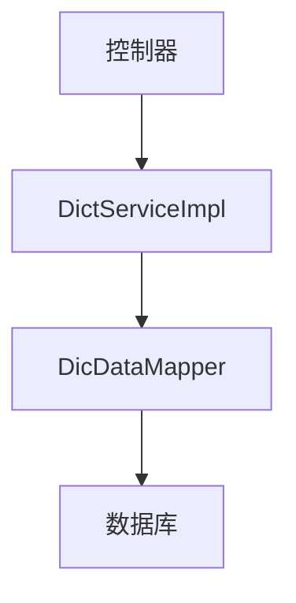

### 字典查询流程

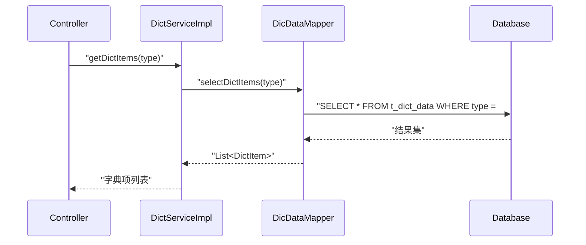

## 外部集成模式

### 外部方管理架构

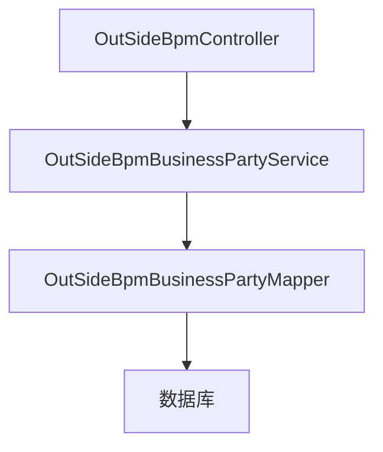

### 外部方查询流程

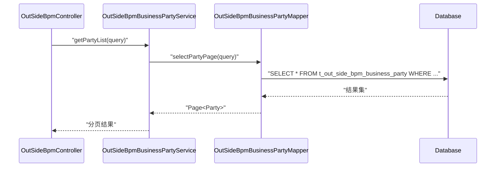
