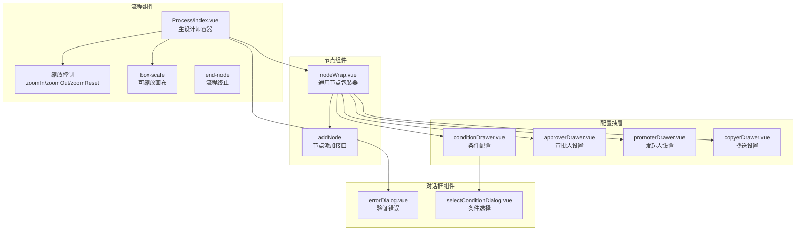
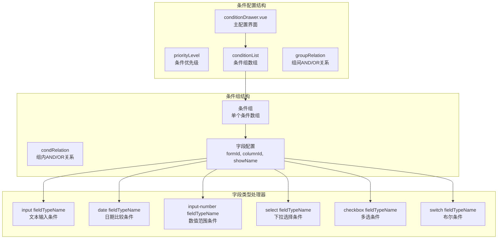
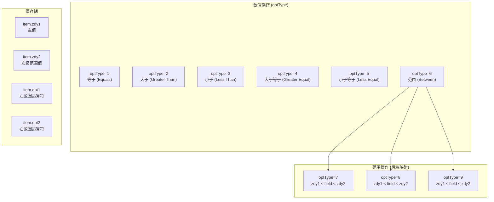
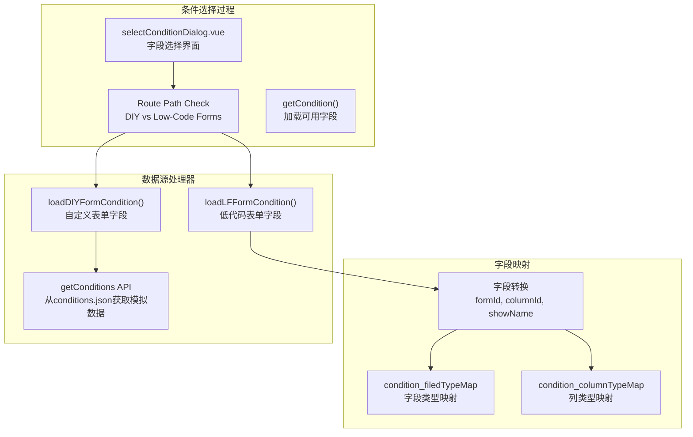
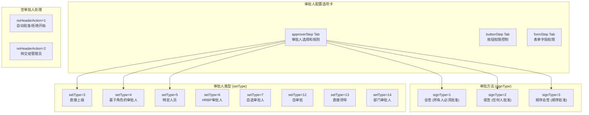
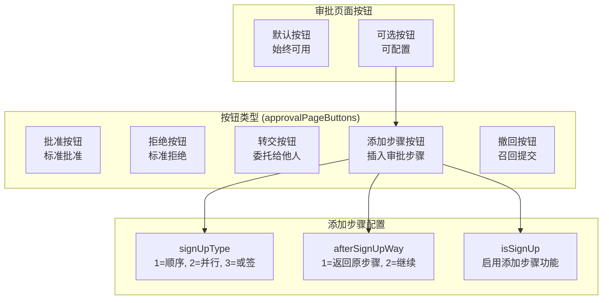
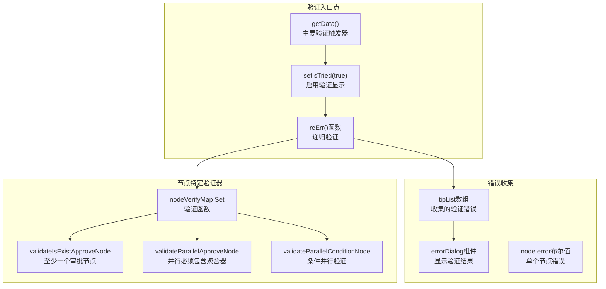
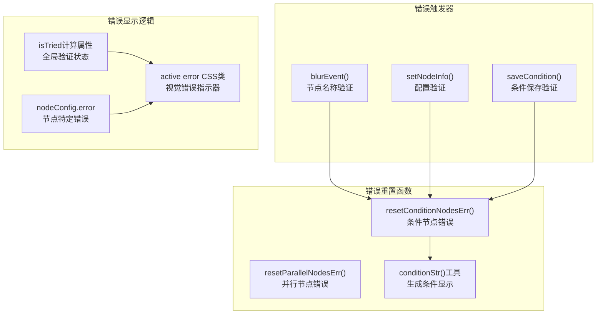
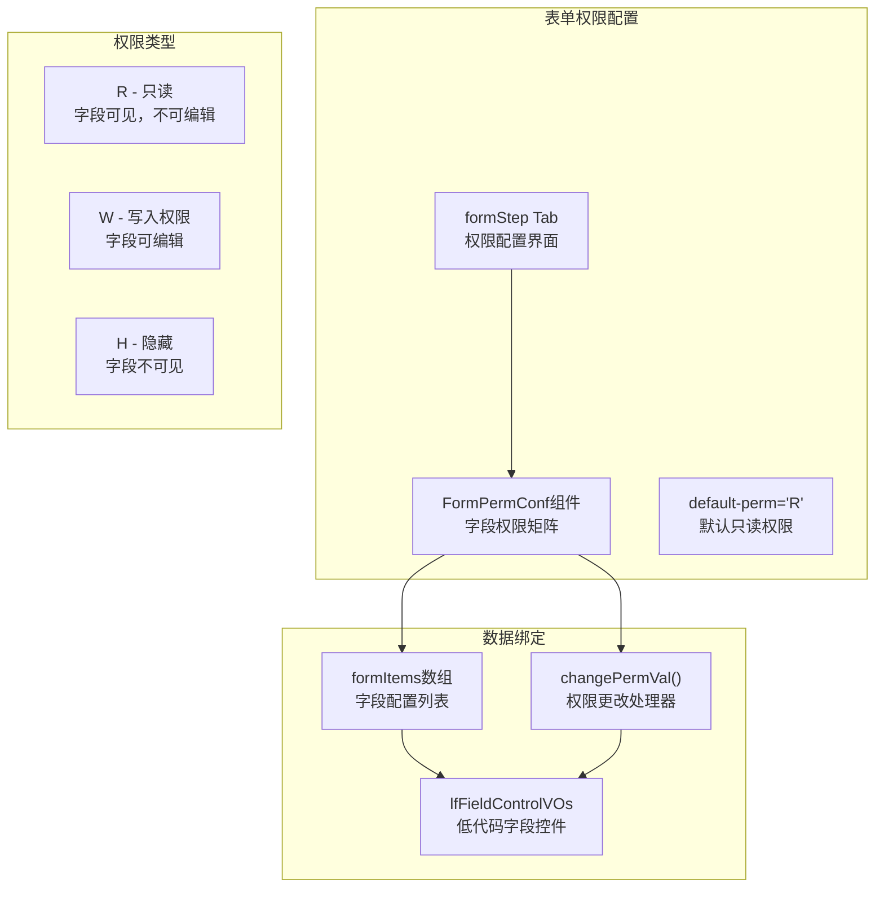

# 工作流设计师与节点配置

## 工作流设计师界面

主工作流设计师在 `Process`组件中实现，该组件提供了一个可缩放的画布，用于设计带有缩放控制和验证功能的工作流。

### 主设计师组件

设计师通过 `wheelZoomFunc`和 `zoomInit`工具支持缩放功能，允许用户将工作流画布从50%缩放到200%，以便更好地查看复杂流程。

### 节点类型系统

AntFlow支持多种节点类型，每种类型都有特定的配置要求和视觉表示：

| 节点类型 | 值 | 描述         | 配置抽屉            |
| -------- | -- | ------------ | ------------------- |
| 开始节点 | 1  | 流程发起人   | `promoterDrawer`  |
| 条件节点 | 2  | 分支逻辑     | `conditionDrawer` |
| 抄送节点 | 6  | 抄送接收人   | `copyerDrawer`    |
| 审批节点 | 4  | 单人审批     | `approverDrawer`  |
| 并行审批 | 7  | 多人并行审批 | `approverDrawer`  |

## 条件配置系统

条件配置系统允许用户通过条件组和单个条件的层次结构创建复杂的分支逻辑。

### 条件抽屉界面

`conditionDrawer`组件提供了一个全面的界面，用于配置条件分支，支持多个条件组和各种字段类型。

### 条件字段类型和操作

系统支持各种字段类型，并在 `optTypes`中定义了特定的操作类型：

`convertConditionNodeValue`函数处理前端显示格式和后端存储格式之间的转换，特别是对于复杂的范围操作和多选值。

### 条件选择对话框

`selectConditionDialog`组件允许用户选择可用的表单字段作为条件标准：

## 审批人配置系统

`approverDrawer`组件为审批节点提供了全面的设置，包括审批人选择、审批方法和表单权限。

### 审批人类型和设置

### 按钮权限配置

按钮权限系统控制审批人在审批过程中可用的操作：

`handleCheckedButtonsChange`函数管理按钮可见性，特别是对“添加步骤”按钮（值19）的特殊处理，该按钮启用动态审批插入。

## 节点验证和错误处理

工作流设计师包括全面的验证，以确保在部署前流程的完整性。

### 验证框架

### 错误状态管理

当验证失败时，单个节点会显示错误状态：

`resetConditionNodesErr`函数自动验证条件配置并更新显示名称，而 `resetParallelNodesErr`处理并行审批节点验证。

## 表单权限集成

工作流设计师通过 `FormPermConf`组件与表单权限系统集成，允许在每个审批步骤中对字段可见性和可编辑性进行细粒度控制。

权限系统支持对每个工作流程步骤中的表单字段访问进行细粒度控制，支持动态表单，并确保在整个审批过程中数据可见性适当。
