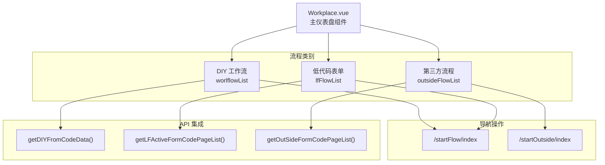
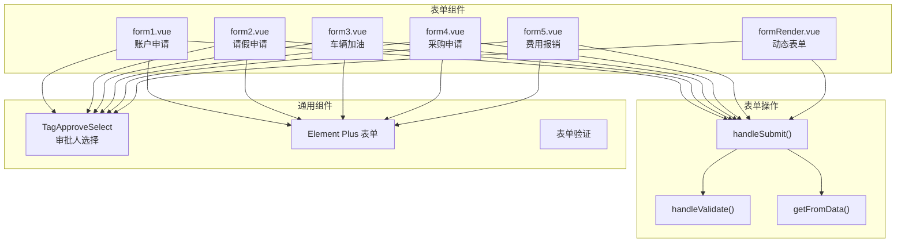
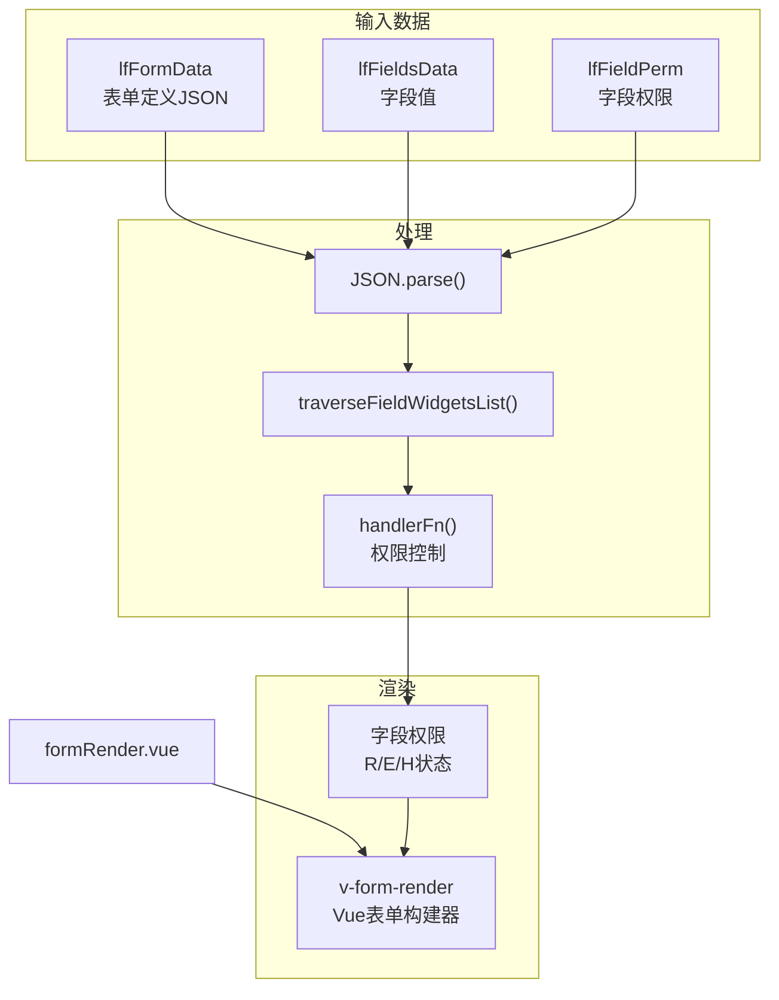
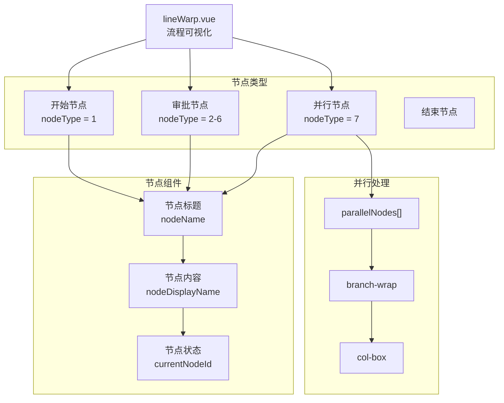

# 仪表盘和任务管理

本文件介绍了AntFlow Vue.js应用程序中的前端仪表盘界面和任务管理功能。它详细说明了用于工作流启动、任务表单和流程可视化的用户界面组件。

## 仪表盘概述

仪表盘作为用户启动工作流和管理任务的中心入口点。它通过 `Workplace`组件显示三种不同类别的可用流程。

### 仪表盘组件架构



**来源**： [antflow-vue/src/components/Dashboard/Workplace.vue L1-L249](https://github.com/mrtylerzhou/AntFlow-activiti/blob/160c7ba8/antflow-vue/src/components/Dashboard/Workplace.vue#L1-L249)

### 流程显示与启动

仪表盘将工作流组织为三个部分，采用一致的卡片式布局：

| 流程类型   | 描述             | 数据源                            | 导航目标                |
| ---------- | ---------------- | --------------------------------- | ----------------------- |
| DIY 工作流 | 自定义工作流流程 | `getDIYFromCodeData()`          | `/startFlow/index`    |
| 低代码表单 | 动态生成的表单   | `getLFActiveFormCodePageList()` | `/startFlow/index`    |
| 第三方     | 外部系统集成     | `getOutSideFormCodePageList()`  | `/startOutside/index` |

每个流程卡片显示：

* 流程图标 (`item.IconUrl`)
* 流程标题 (`item.title`)
* 流程描述 (`item.description`)
* 表单代码标识符 (`item.formCode`)


## 任务表单组件

系统通过专门的表单组件实现任务管理，这些组件处理不同的业务流程。每个表单都遵循一致的验证、提交和审批工作流结构。

### 表单组件架构




### 表单实现模式

所有表单组件都实现了一个标准化接口，包含以下关键方法：

* `handleValidate()` - 验证表单字段和审批人选择
* `getFromData()` - 将表单数据序列化为JSON
* `handleSubmit()` - 触发验证并发出表单数据
* `chooseApprovers()` - 处理自选审批人配置

每个表单组件都接受以下props：

* `previewData` - 用于显示的预填充表单值
* `showSubmit` - 控制提交按钮的可见性
* `isPreview` - 启用/禁用表单编辑


### 动态表单渲染

`formRender`组件通过动态表单生成处理低代码表单：



动态表单系统处理字段权限：

* `R` - 只读字段 (`disabled: true`)
* `E` - 可编辑字段 (`readonly: false`)
* `H` - 隐藏字段 (用 `******`掩盖)


## 流程可视化

系统通过 `lineWarp`组件提供工作流可视化，该组件渲染流程节点和流程路径。

### 工作流预览结构



该组件处理子节点的递归渲染，并根据节点类型和当前状态应用视觉样式。活动节点接收 `current-node` CSS类以进行高亮显示。


## 任务管理集成

### 仪表盘到表单的流程

仪表盘通过标准化的导航模式与任务管理集成：

1. **流程选择** - 用户在仪表盘中点击流程卡片
2. **参数构建** - `handleStart()`或 `handleOutSide()`构建查询参数
3. **导航** - 路由器导航到适当的表单页面，并带有上下文
4. **表单渲染** - 目标页面渲染适当的表单组件
5. **审批流程** - 通过 `TagApproveSelect`进行可选的审批人选择

关键导航参数：

* `formType` - 流程类别 (DIY, LF, outside)
* `formCode` - 唯一流程标识符
* `hasChooseApprove` - 自选审批标志
* `applicationId` - 外部系统标识符 (仅第三方)


### 表单提交管道

所有表单组件都遵循一致的提交管道：

```mermaid
sequenceDiagram
 participant User
 participant Form Component
 participant handleValidate()
 participant getFromData()
 participant Parent Component
 User->>Form Component: "点击提交"
 Form Component->>handleValidate(): "验证表单字段"
 handleValidate()->>handleValidate(): "检查必填字段"
 handleValidate()->>handleValidate(): "验证审批人选择"
 handleValidate()-->>Form Component: "验证结果"
 loop [验证成功]
 Form Component->>getFromData(): "提取表单数据"
 getFromData()-->>Form Component: "JSON字符串"
 Form Component->>Parent Component: "发出handleBizBtn事件"
 Form Component->>User: "显示错误消息"
 end
```
