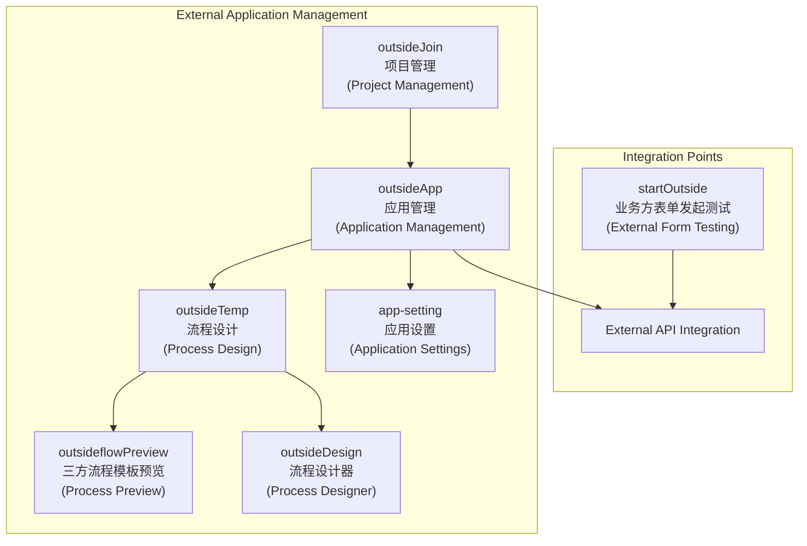
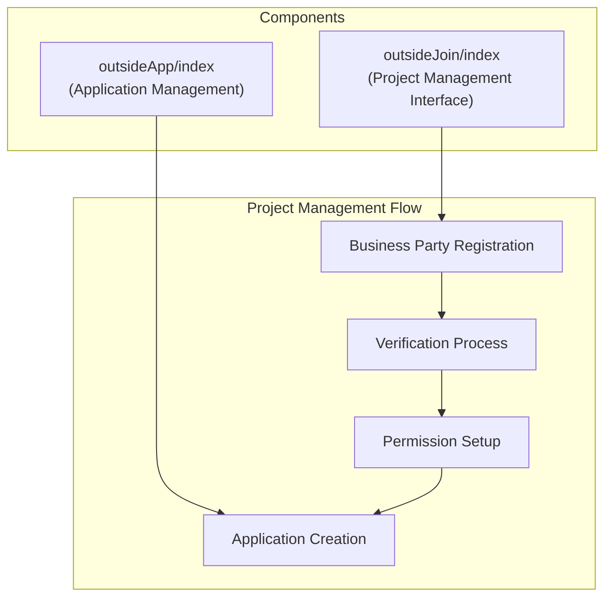
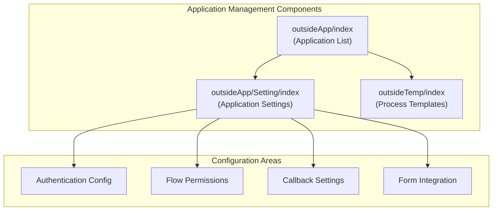
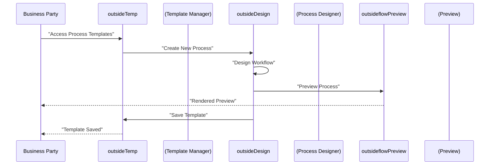
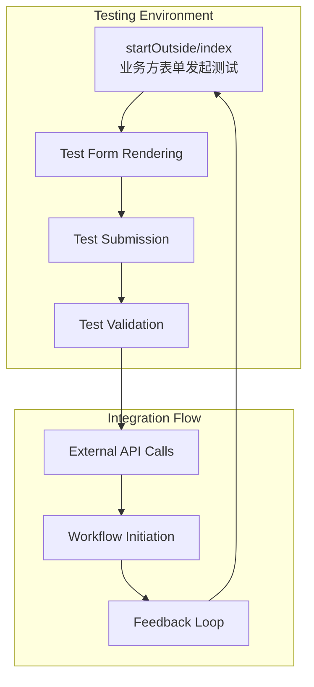
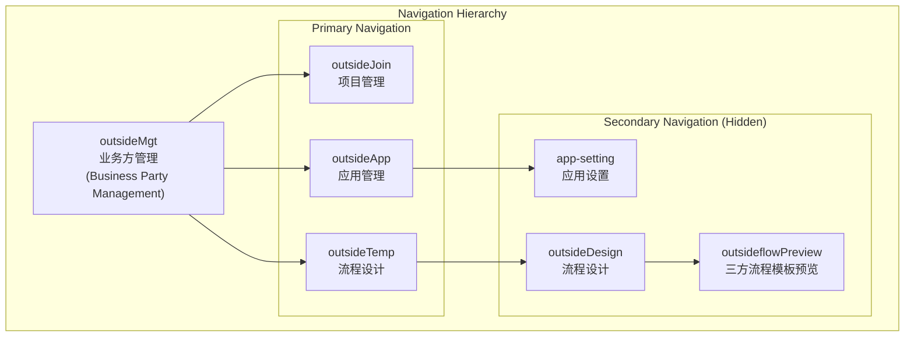

# 外部应用管理

## 系统概述

外部应用管理系统通过“业务方管理”主导航菜单下的几个关键功能区域进行访问：

## 业务方（项目）管理

`outsideJoin`组件为注册和管理将与AntFlow集成的外部业务方提供项目管理能力。

### 项目注册界面

项目管理界面（`workflow/outsideMgt/outsideJoin/index`）是引入新外部业务方的入口点。该组件可能处理以下事项：

* 业务方注册和验证
* 项目信息管理
* 访问权限配置
* 集成先决条件设置

## 应用管理

### 核心应用界面

`outsideApp`组件（`workflow/outsideMgt/outsideApp/index`）提供管理每个业务方项目内注册的外部应用的主界面。

### 应用配置

每个应用都可以通过专用设置界面进行配置：

## 外部流程设计系统

### 流程模板管理

外部流程设计系统允许业务方通过 `outsideTemp`界面创建和管理自己的工作流程：

### 设计界面组件

流程设计系统由几个相互连接的组件组成：

| 组件                    | 用途                 | 可见性               |
| ----------------------- | -------------------- | -------------------- |
| `outsideTemp/index`   | 流程模板列表和管理   | 可见                 |
| `outsideDesign/index` | 可视化流程设计师界面 | 隐藏（从模板访问）   |
| `preview/index`       | 流程模板预览和验证   | 隐藏（从设计师访问） |

## 外部流程测试和集成

### 表单测试界面

`startOutside`组件为外部业务方提供了一个测试环境，以验证其表单集成：

此测试界面（`workflow/startOutside/index`）允许业务方：

* 使用自定义表单定义测试表单渲染
* 验证表单提交过程
* 验证从外部来源发起的工作流
* 在受控环境中调试集成问题

## 导航结构和访问控制

外部应用管理系统在专用导航部分下组织，并具有适当的访问控制：

导航结构采用分层方法，其中：

* 主导航项始终对授权用户可见
* 次导航项隐藏，并在上下文中访问
* 每个组件都维护自己的路由路径和元数据配置

## 与核心工作流系统的集成

外部应用管理系统与AntFlow的核心工作流功能无缝集成，同时为第三方集成保持适当的隔离和安全边界。
