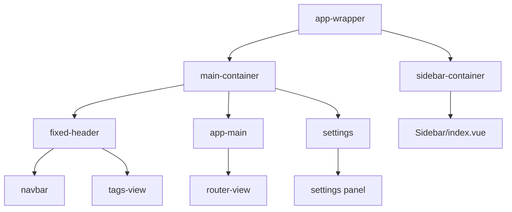
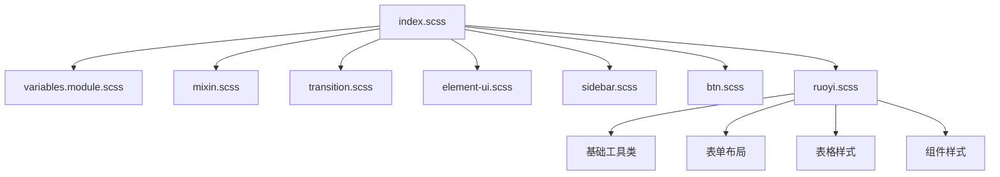

# 导航与应用布局

> **相关源文件**
> * [antflow-vue/public/mock/menu.json](https://github.com/mrtylerzhou/AntFlow-activiti/blob/160c7ba8/antflow-vue/public/mock/menu.json)
> * [antflow-vue/src/assets/styles/index.scss](https://github.com/mrtylerzhou/AntFlow-activiti/blob/160c7ba8/antflow-vue/src/assets/styles/index.scss)
> * [antflow-vue/src/assets/styles/ruoyi.scss](https://github.com/mrtylerzhou/AntFlow-activiti/blob/160c7ba8/antflow-vue/src/assets/styles/ruoyi.scss)
> * [antflow-vue/src/components/Workflow/outsideSetting/index.vue](https://github.com/mrtylerzhou/AntFlow-activiti/blob/160c7ba8/antflow-vue/src/components/Workflow/outsideSetting/index.vue)
> * [antflow-vue/src/layout/index.vue](https://github.com/mrtylerzhou/AntFlow-activiti/blob/160c7ba8/antflow-vue/src/layout/index.vue)
> * [antflow-vue/src/views/workflow/components/previewDrawer.vue](https://github.com/mrtylerzhou/AntFlow-activiti/blob/160c7ba8/antflow-vue/src/views/workflow/components/previewDrawer.vue)

本文档描述了AntFlow Vue.js前端应用的导航结构、应用布局以及用户界面样式框架。它涵盖了主要布局组件、菜单层次结构、路由结构以及定义整体用户体验的CSS样式系统。

有关特定工作流界面和任务管理屏幕的信息，请参见[Dashboard和任务管理](/mrtylerzhou/AntFlow-activiti/3.3-dashboard-and-task-management)。有关表单渲染和UI组件的详细信息，请参见[表单组件和动态表单](/mrtylerzhou/AntFlow-activiti/3.2-form-components-and-dynamic-forms)。

## 应用布局结构

AntFlow前端使用标准的后台管理仪表板布局模式，包括可折叠的侧边栏导航、顶部导航栏、主内容区域以及可选的功能如标签视图和设置面板。

### 主要布局组件

核心布局在`Layout/index.vue`中定义，它编排了主要的UI结构：

该布局实现了响应式设计，带有移动检测和自动侧边栏折叠功能。`app-wrapper`容器使用CSS类来控制侧边栏状态：

| CSS 类 | 目的 |
| --- | --- |
| `hideSidebar` | 折叠侧边栏 |
| `openSidebar` | 展开侧边栏 |
| `withoutAnimation` | 禁用过渡动画 |
| `mobile` | 应用移动设备特定样式 |

来源：[antflow-vue/src/layout/index.vue L1-L143](https://github.com/mrtylerzhou/AntFlow-activiti/blob/160c7ba8/antflow-vue/src/layout/index.vue#L1-L143)

### 响应式行为

应用根据屏幕宽度自动在桌面和移动模式之间切换，遵循Bootstrap的响应式设计原则，在992px处设置断点。在移动设备上，侧边栏会变成覆盖在内容上的抽屉式布局。

来源：[antflow-vue/src/layout/index.vue L41-L57](https://github.com/mrtylerzhou/AntFlow-activiti/blob/160c7ba8/antflow-vue/src/layout/index.vue#L41-L57)

## 导航菜单结构

应用的导航由层次结构的菜单定义，该结构将功能组织成逻辑分组。菜单配置支持可见的导航项和用于特定操作的隐藏路由。

### 菜单层次结构和路由

```mermaid
flowchart TD
Root["根菜单"]
TaskCenter["发起请求"]
FlowTask["任务中心"]
Workflow["流程管理"]
FlowEntrust["委托管理"]
OutsideMgt["业务方管理"]
TaskCenterIndex["taskCenter/index"]
MyTask["我的发起"]
PendingTask["待办任务"]
ApprovedTask["已办任务"]
CopyToMeTask["抄送到我"]
ApproveHidden["流程审批 (hidden)"]
FlowInstance["流程实例"]
FlowCategory["流程类型"]
FlowList["流程设计"]
LFFlowDesign["低代码表单流程设计 (hidden)"]
DIYFlowDesign["自定义表单流程设计 (hidden)"]
FlowPreview["流程模板预览 (hidden)"]
StartFlow["发起申请流程 (hidden)"]
EntrustSetting["委托设置"]
EntrustList["委托列表"]
OutsideJoin["项目管理"]
OutsideApp["应用管理"]
OutsideTemp["流程设计"]
OutsideDesignHidden["流程设计 (hidden)"]
Root --> TaskCenter
Root --> FlowTask
Root --> Workflow
Root --> FlowEntrust
Root --> OutsideMgt
TaskCenter --> TaskCenterIndex
FlowTask --> MyTask
FlowTask --> PendingTask
FlowTask --> ApprovedTask
FlowTask --> CopyToMeTask
FlowTask --> ApproveHidden
Workflow --> FlowInstance
Workflow --> FlowCategory
Workflow --> FlowList
Workflow --> LFFlowDesign
Workflow --> DIYFlowDesign
Workflow --> FlowPreview
Workflow --> StartFlow
FlowEntrust --> EntrustSetting
FlowEntrust --> EntrustList
OutsideMgt --> OutsideJoin
OutsideMgt --> OutsideApp
OutsideMgt --> OutsideTemp
OutsideMgt --> OutsideDesignHidden
```

### 菜单组件映射

每个菜单项都映射到应用结构中的特定Vue组件：

| 菜单路径 | 组件路径 | 目的 |
| --- | --- | --- |
| `/taskCenter` | `workflow/taskCenter/index` | 流程发起界面 |
| `/flowTask/mytask` | `workflow/flowTask/mytask/index` | 用户发起的流程 |
| `/flowTask/pendding` | `workflow/flowTask/pendding/index` | 待审批的任务 |
| `/workflow/flowList` | `workflow/flowList/index` | 流程设计管理 |
| `/workflow/lf-design` | `workflow/flowDesign/lf` | 低代码表单设计 |
| `/workflow/diy-design` | `workflow/flowDesign/diy` | 自定义表单设计 |
| `/outsideMgt/outsideJoin` | `workflow/outsideMgt/outsideJoin/index` | 业务方项目管理 |

来源：[antflow-vue/public/mock/menu.json L1-L378](https://github.com/mrtylerzhou/AntFlow-activiti/blob/160c7ba8/antflow-vue/public/mock/menu.json#L1-L378)

### 隐藏路由和动态导航

菜单系统包括通过编程方式可访问但在主导航中不显示的隐藏路由。这些路由支持特定的工作流，如审批过程和设计界面：

* 流程审批路由(`/approve`, `/approveV2`)用于任务处理
* 低代码和自定义表单工作流的设计界面
* 模板和流程可视化的预览路由
* 业务方管理的管理路由

来源：[antflow-vue/public/mock/menu.json L88-L110](https://github.com/mrtylerzhou/AntFlow-activiti/blob/160c7ba8/antflow-vue/public/mock/menu.json#L88-L110)
[antflow-vue/public/mock/menu.json L164-L234](https://github.com/mrtylerzhou/AntFlow-activiti/blob/160c7ba8/antflow-vue/public/mock/menu.json#L164-L234)

## CSS样式架构

应用使用模块化的CSS架构，多个SCSS文件提供不同层次的样式功能。

### 样式导入层次结构

### 布局容器类

样式系统为应用布局容器提供特定的类：

| 类 | 目的 | CSS 属性 |
| --- | --- | --- |
| `.app-container` | 主内容包装器 | `margin: 10px`, `box-shadow`, `flex-direction: column` |
| `.query-box` | 搜索/过滤部分 | `padding: 10px`, `background-color: #fff` |
| `.table-box` | 数据表容器 | `padding: 10px`, `margin-top: 5px` |
| `.form-header` | 表单中的部分标题 | `font-size: 15px`, `color: #6379bb`, `border-bottom: 1px solid #ddd` |

来源：[antflow-vue/src/assets/styles/index.scss L126-L153](https://github.com/mrtylerzhou/AntFlow-activiti/blob/160c7ba8/antflow-vue/src/assets/styles/index.scss#L126-L153)
[antflow-vue/src/assets/styles/ruoyi.scss L162-L168](https://github.com/mrtylerzhou/AntFlow-activiti/blob/160c7ba8/antflow-vue/src/assets/styles/ruoyi.scss#L162-L168)

### 工具类和间距

框架包括全面的工具类，用于间距、定位和常见的UI模式：

* 内边距工具类：`.pt5`, `.pr5`, `.pl5`, `.pb10`, `.pt10`等
* 外边距工具类：`.mt5`, `.mr5`, `.mb5`, `.ml5`, `.mt10`等
* 浮动工具类：`.l`（左）, `.r`（右）, `.fl`（左浮动）, `.fr`（右浮动）
* 显示工具类：`.block`, `.pointer`, `.clickable`

来源：[antflow-vue/src/assets/styles/ruoyi.scss L6-L96](https://github.com/mrtylerzhou/AntFlow-activiti/blob/160c7ba8/antflow-vue/src/assets/styles/ruoyi.scss#L6-L96)

### Element Plus 自定义

应用自定义了Element Plus组件的样式，以实现一致的主题：

* 表格样式，包括自定义的表头背景(`#f8f8f9`)和行高
* 对话框定位和滚动条行为
* 表单标签字体粗细和字段样式
* 按钮颜色方案，包括自定义的青色变体

来源：[antflow-vue/src/assets/styles/ruoyi.scss L115-L350](https://github.com/mrtylerzhou/AntFlow-activiti/blob/160c7ba8/antflow-vue/src/assets/styles/ruoyi.scss#L115-L350)

## 布局状态管理和响应式特性

布局包含动态状态管理，用于用户界面偏好和响应式行为。

### 侧边栏状态管理

侧边栏行为通过应用商店控制，具有以下状态：

* `opened`：控制侧边栏可见性
* `withoutAnimation`：禁用过渡效果
* `hide`：完全隐藏侧边栏

布局根据屏幕大小和用户交互自动管理侧边栏状态，包括移动设备上的点击外部检测。

来源：[antflow-vue/src/layout/index.vue L29-L61](https://github.com/mrtylerzhou/AntFlow-activiti/blob/160c7ba8/antflow-vue/src/layout/index.vue#L29-L61)

### 版本管理和自动刷新

布局包括自动版本检查功能，该功能定期轮询应用更新，并在有新版本可用时提示用户刷新。这确保了用户始终拥有最新的功能和修复。

来源：[antflow-vue/src/layout/index.vue L68-L94](https://github.com/mrtylerzhou/AntFlow-activiti/blob/160c7ba8/antflow-vue/src/layout/index.vue#L68-L94)

### 主题和设置集成

布局通过CSS自定义属性支持动态主题，并与设置面板集成，允许用户自定义：

* 颜色主题
* 侧边栏主题
* 标签视图可见性
* 标题定位（固定/静态）

来源：[antflow-vue/src/layout/index.vue L26-L32](https://github.com/mrtylerzhou/AntFlow-activiti/blob/160c7ba8/antflow-vue/src/layout/index.vue#L26-L32)