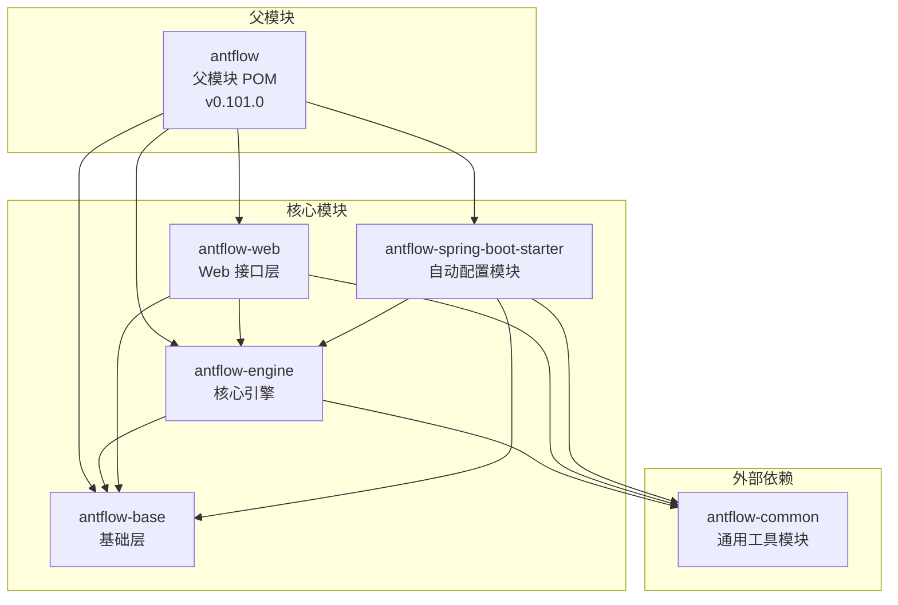
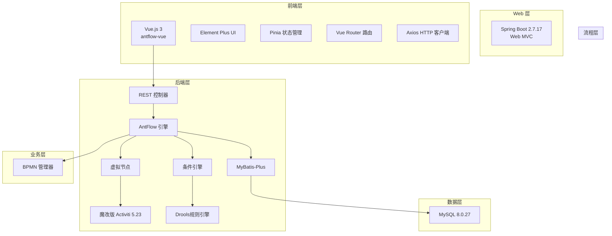
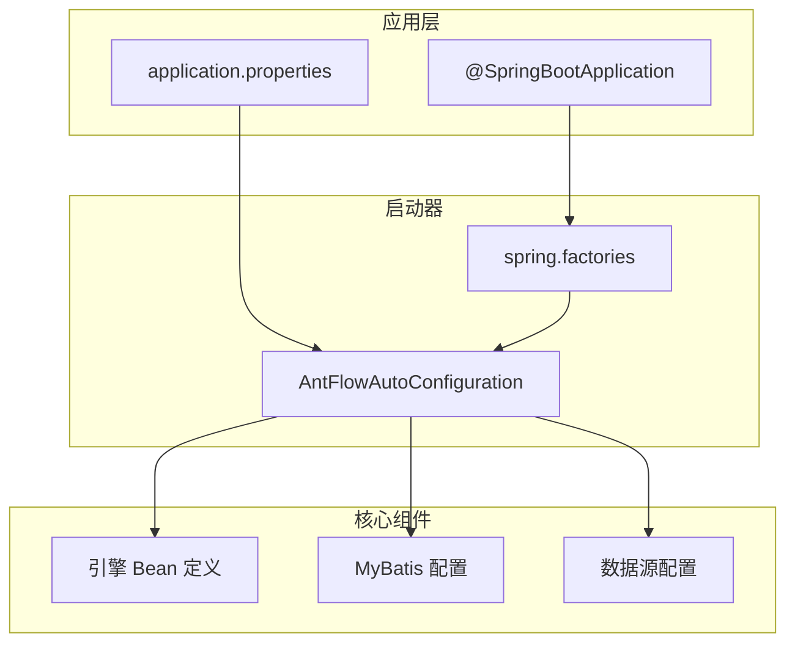
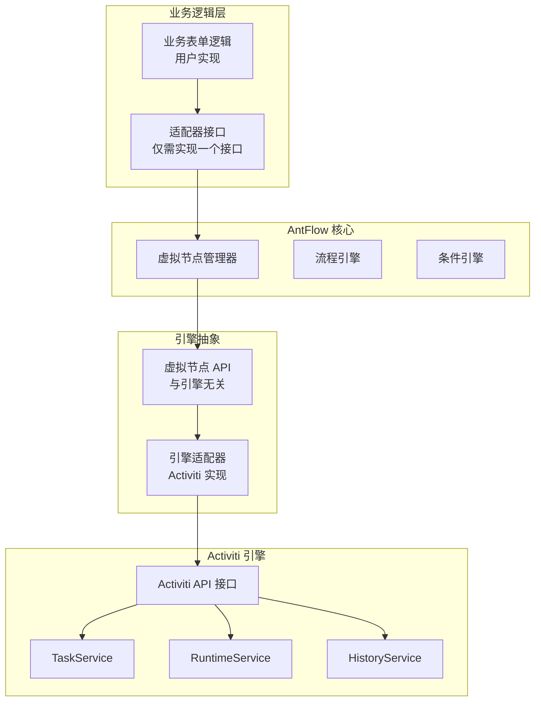
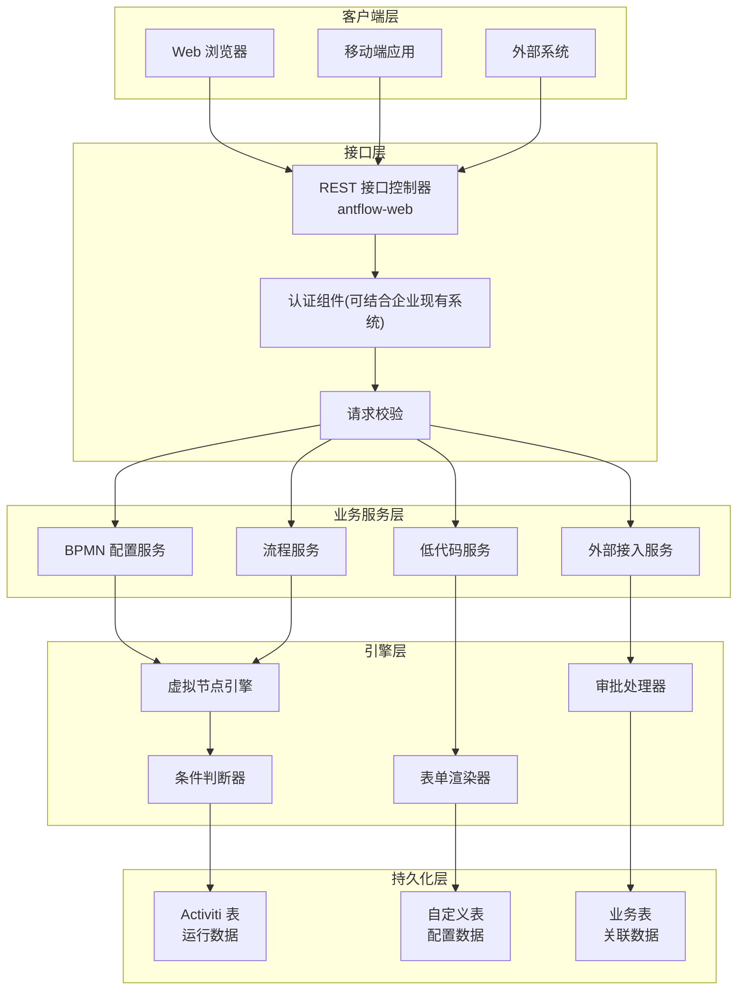

# 系统架构

## 目标与范围

本文将全面概述了 AntFlow 的系统架构，涵盖多模块 Maven 项目结构、技术栈及核心设计理念。AntFlow 是一个企业级低代码工作流引擎平台，基于魔改后的 Activiti 5.23，旨在简化开发与集成门槛。

## 多模块 Maven 架构

AntFlow 采用多模块 Maven 架构，四大模块职责清晰：

### 各模块职责

| 模块     | Artifact ID                     | 主要职责                             | 核心依赖                             |
| -------- | ------------------------------- | ------------------------------------ | ------------------------------------ |
| 基础层   | `antflow-base`                | 公共工具类与接口                     | Guava、Jackson、Drools               |
| 核心引擎 | `antflow-engine`              | 流程引擎、虚拟节点、流程控制         | antflow-base、MyBatis-Plus、Activiti |
| Web 层   | `antflow-web`                 | 提供 REST 接口、运行主应用           | antflow-engine、Spring Boot Web      |
| 启动器   | `antflow-spring-boot-starter` | 自动配置与依赖管理(方便用户快速集成) | 所有模块                             |

## 技术栈架构

AntFlow 系统分层架构如下：

### 核心依赖版本

- Spring Boot 2.7.17
- Activiti 5.23（改造版）
- MyBatis-Plus 3.5.1
- MySQL 8.0.27
- Drools 6.5.0
- Jackson、Guava 等

## 自动配置机制

## 虚拟节点架构创新

## 运行时架构

## 架构设计要点

1. **分层架构**：清晰区分前端、业务、数据层
2. **适配器模式**：虚拟节点屏蔽引擎差异
3. **依赖注入**：基于 Spring Boot 管理 Bean 生命周期
4. **自动配置**：基于 Spring Boot Starter 无配置运行
5. **模块化设计**：Maven 模块独立清晰、便于复用与扩展
