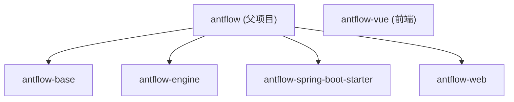
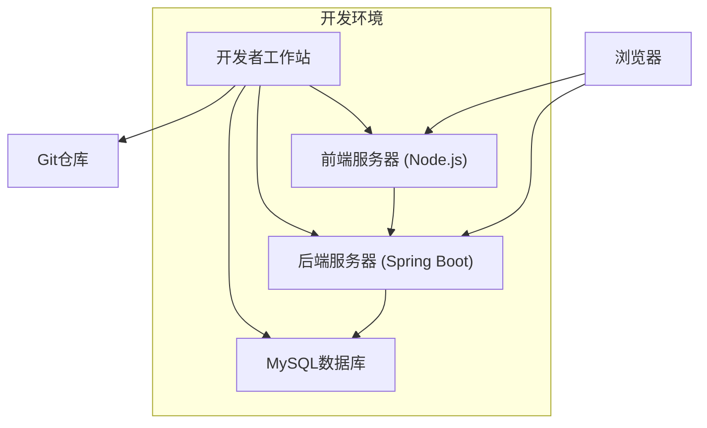
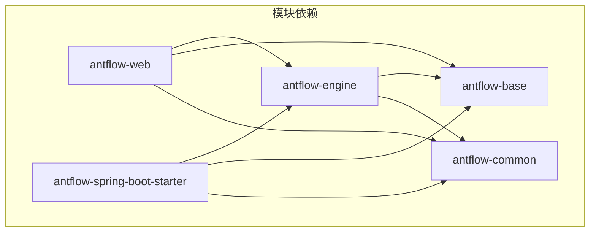
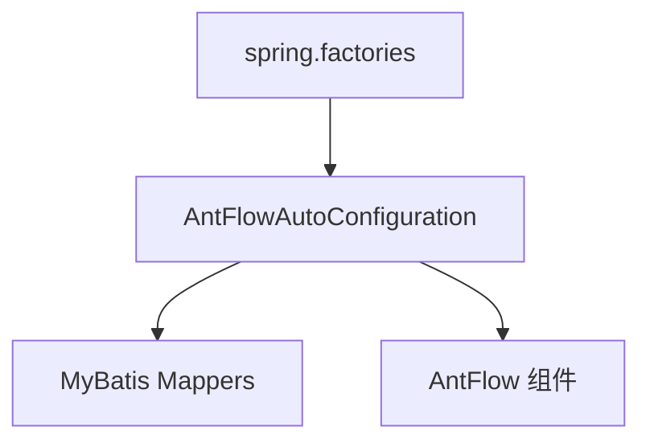

# 开发环境搭建指南

> **相关源文件**
> * [README.zh_CN.md](https://github.com/mrtylerzhou/AntFlow-activiti/blob/160c7ba8/README.zh_CN.md)
> * [antflow-vue/package.json](https://github.com/mrtylerzhou/AntFlow-activiti/blob/160c7ba8/antflow-vue/package.json)
> * [antflow-vue/public/version.json](https://github.com/mrtylerzhou/AntFlow-activiti/blob/160c7ba8/antflow-vue/public/version.json)
> * [antflow-vue/src/components/Dashboard/Shortcuts.vue](https://github.com/mrtylerzhou/AntFlow-activiti/blob/160c7ba8/antflow-vue/src/components/Dashboard/Shortcuts.vue)
> * [antflow-vue/src/components/Mark/Git/index.vue](https://github.com/mrtylerzhou/AntFlow-activiti/blob/160c7ba8/antflow-vue/src/components/Mark/Git/index.vue)
> * [doc/images/1.png](https://github.com/mrtylerzhou/AntFlow-activiti/blob/160c7ba8/doc/images/1.png)
> * [doc/images/2.png](https://github.com/mrtylerzhou/AntFlow-activiti/blob/160c7ba8/doc/images/2.png)
> * [doc/images/3.png](https://github.com/mrtylerzhou/AntFlow-activiti/blob/160c7ba8/doc/images/3.png)
> * [doc/images/4.png](https://github.com/mrtylerzhou/AntFlow-activiti/blob/160c7ba8/doc/images/4.png)
> * [doc/images/flowablebook.jpg](https://github.com/mrtylerzhou/AntFlow-activiti/blob/160c7ba8/doc/images/flowablebook.jpg)
> * [readme.md](https://github.com/mrtylerzhou/AntFlow-activiti/blob/160c7ba8/readme.md)

本页面提供了AntFlow工作流系统开发环境的全面搭建指南。它涵盖了后端和前端的搭建步骤、先决条件、配置以及验证步骤。有关使用自定义组件扩展系统的信息，请参考[扩展系统](/mrtylerzhou/AntFlow-activiti/4.2-database-schema-and-initialization)。

## 1. 先决条件

在开始之前，请确保您的开发机器上已安装以下软件：

| 软件 | 版本 | 备注 |
| --- | --- | --- |
| JDK | 8-21 | 主分支使用Java 8，对于更新的Java版本，请使用java17_support分支 |
| Maven | 3.6+ | 用于依赖管理和构建 |
| MySQL | 5.7+ | 用于持久化工作流数据的数据库 |
| Node.js | 16.20.0+ | 前端开发所需 |
| Git | 任何近期版本 | 用于源代码管理 |

来源: [README.zh_CN.md L45-L50](https://github.com/mrtylerzhou/AntFlow-activiti/blob/160c7ba8/README.zh_CN.md#L45-L50)
 [pom.xml L24-L30](https://github.com/mrtylerzhou/AntFlow-activiti/blob/160c7ba8/pom.xml#L24-L30)

## 2. 项目结构概述

AntFlow由多个模块组成，这些模块协同工作以提供完整的工作流解决方案：



**模块描述**:

* **antflow-base**: 包含基础逻辑和常用工具
* **antflow-engine**: 基于修改后的Activiti构建的核心工作流引擎逻辑
* **antflow-spring-boot-starter**: Spring Boot集成，便于嵌入
* **antflow-web**: 工作流系统的Web应用层
* **antflow-vue**: 基于Vue.js的前端应用

来源: [pom.xml L6-L11](https://github.com/mrtylerzhou/AntFlow-activiti/blob/160c7ba8/pom.xml#L6-L11)
 [README.zh_CN.md L44-L54](https://github.com/mrtylerzhou/AntFlow-activiti/blob/160c7ba8/README.zh_CN.md#L44-L54)

## 3. 设置后端环境

### 3.1 克隆仓库

```
git clone https://github.com/mrtylerzhou/AntFlow-activiti.git
cd AntFlow-activiti
```

### 3.2 数据库配置

1. 创建一个名为**antflow**的新MySQL数据库
2. 在**antflow-web/src/main/resources/application-dev.properties**中更新数据库连接信息：

```
spring.datasource.url=jdbc:mysql://localhost:3306/antflow?nullCatalogMeansCurrent=true
spring.datasource.username=your_username
spring.datasource.password=your_password
spring.datasource.driver-class-name=com.mysql.cj.jdbc.Driver
```

3. 使用提供的SQL脚本初始化数据库：
   - 执行**antflow-web/src/main/resources/scripts/act_init_db.sql**
   - 执行**antflow-web/src/main/resources/scripts/bpm_init_db.sql**

来源: [README.zh_CN.md L106-L110](https://github.com/mrtylerzhou/AntFlow-activiti/blob/160c7ba8/README.zh_CN.md#L106-L110)
 [antflow-web/src/main/resources/application-dev.properties L2-L6](https://github.com/mrtylerzhou/AntFlow-activiti/blob/160c7ba8/antflow-web/src/main/resources/application-dev.properties#L2-L6)

### 3.3 构建和运行后端

```markdown
# 构建所有模块
mvn clean install
# 运行应用
cd antflow-web
mvn spring-boot:run
```

应用将默认在7001端口启动。您可以通过检查控制台输出或访问[http://localhost:7001](http://localhost:7001)来验证它是否正在运行。

来源: [antflow-web/src/main/resources/application-dev.properties L1](https://github.com/mrtylerzhou/AntFlow-activiti/blob/160c7ba8/antflow-web/src/main/resources/application-dev.properties#L1-L1)
 [README.zh_CN.md L106-L110](https://github.com/mrtylerzhou/AntFlow-activiti/blob/160c7ba8/README.zh_CN.md#L106-L110)

## 4. 设置前端环境

### 4.1 安装依赖

```markdown
# 导航到前端目录
cd antflow-vue
# 安装依赖
npm install --registry=https://registry.npmmirror.com
```

### 4.2 运行前端开发服务器

```markdown
# 启动开发服务器
npm run dev
```

默认情况下，前端可通过[http://localhost:80](http://localhost:80)访问。

对于生产环境构建：

```markdown
# 为测试环境构建
npm run build:stage
# 为生产环境构建
npm run build:prod
```

来源: [README.zh_CN.md L88-L104](https://github.com/mrtylerzhou/AntFlow-activiti/blob/160c7ba8/README.zh_CN.md#L88-L104)

## 5. 开发环境架构

以下图表说明了开发环境架构以及组件之间的交互方式：



## 6. 模块依赖

了解模块之间的依赖关系有助于开发和故障排除：



来源: [antflow-web/pom.xml L20-L47](https://github.com/mrtylerzhou/AntFlow-activiti/blob/160c7ba8/antflow-web/pom.xml#L20-L47)
 [antflow-engine/pom.xml L17-L36](https://github.com/mrtylerzhou/AntFlow-activiti/blob/160c7ba8/antflow-engine/pom.xml#L17-L36)
 [antflow-spring-boot-starter/pom.xml L44-L67](https://github.com/mrtylerzhou/AntFlow-activiti/blob/160c7ba8/antflow-spring-boot-starter/pom.xml#L44-L67)

## 7. 配置文件概述

您将使用的关键配置文件：

| 文件 | 目的 | 位置 |
| --- | --- | --- |
| application.properties | 全局应用配置 | antflow-web/src/main/resources/ |
| application-dev.properties | 开发环境配置 | antflow-web/src/main/resources/ |
| pom.xml | Maven项目配置 | 根目录和每个模块目录 |
| mybatis-config.xml | MyBatis ORM配置 | 在application.properties中引用 |

来源: [antflow-web/src/main/resources/application.properties L1-L26](https://github.com/mrtylerzhou/AntFlow-activiti/blob/160c7ba8/antflow-web/src/main/resources/application.properties#L1-L26)
 [antflow-web/src/main/resources/application-dev.properties L1-L44](https://github.com/mrtylerzhou/AntFlow-activiti/blob/160c7ba8/antflow-web/src/main/resources/application-dev.properties#L1-L44)

## 8. Spring 自动配置

AntFlow使用Spring Boot的自动配置来简化设置。关键的自动配置类是`AntFlowAutoConfiguration`：



此自动配置自动设置：

* 来自多个包的MyBatis映射器
* 所有AntFlow模块的组件扫描

来源: [antflow-spring-boot-starter/src/main/java/org/openoa/starter/config/AntFlowAutoConfiguration.java L1-L19](https://github.com/mrtylerzhou/AntFlow-activiti/blob/160c7ba8/antflow-spring-boot-starter/src/main/java/org/openoa/starter/config/AntFlowAutoConfiguration.java#L1-L19)
 [antflow-spring-boot-starter/src/main/resources/META-INF/spring.factories L1-L2](https://github.com/mrtylerzhou/AntFlow-activiti/blob/160c7ba8/antflow-spring-boot-starter/src/main/resources/META-INF/spring.factories#L1-L2)

## 9. 验证

在设置好后端和前端之后，您可以验证您的开发环境是否正常工作：

1. 后端服务器应无错误启动，并显示类似以下消息：``` your project successfully started... ```
2. 访问[http://localhost:80](http://localhost:80)以查看工作流设计器界面。
3. 如果两者都正常工作，则您已成功设置AntFlow开发环境。

来源: [antflow-web/src/main/java/org/openoa/common/config/StartedListener.java L20-L25](https://github.com/mrtylerzhou/AntFlow-activiti/blob/160c7ba8/antflow-web/src/main/java/org/openoa/common/config/StartedListener.java#L20-L25)

## 10. 故障排除

常见问题及其解决方案：

| 问题 | 解决方案 |
| --- | --- |
| 数据库连接错误 | 验证您的MySQL实例是否正在运行，并确保application-dev.properties中的凭据正确 |
| Maven构建失败 | 检查您是否已安装并配置了正确的JDK版本在您的PATH中 |
| 前端npm install失败 | 尝试使用不同的注册表或检查您的Node.js版本是否符合要求 |
| 应用启动错误 | 检查日志以获取具体的错误消息。最常见的问题与数据库配置或端口冲突有关 |

如果您遇到循环依赖问题，请确保在您的application.properties文件中设置了`spring.main.allow-circular-references=true`。

来源: [antflow-web/src/main/resources/application.properties L10-L11](https://github.com/mrtylerzhou/AntFlow-activiti/blob/160c7ba8/antflow-web/src/main/resources/application.properties#L10-L11)