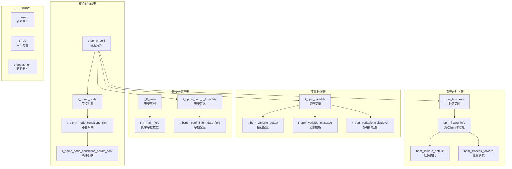
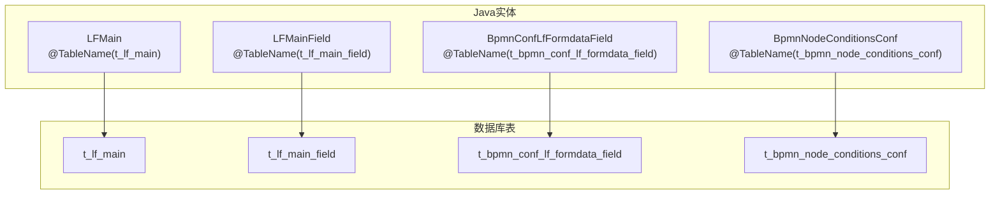

# 数据库架构与初始化

本文件提供了AntFlow数据库架构结构和初始化过程的全面概述。它涵盖了数据库表、表之间的关系以及用于设置系统持久数据层的脚本。

## 数据库架构概述

AntFlow使用MySQL数据库，其架构设计围绕工作流程过程管理、低代码表单和业务流程执行。数据库初始化通过SQL脚本处理，这些脚本创建架构结构和初始演示数据。



## 核心表组

### BPMN配置表

BPMN配置表存储流程定义和节点配置：

| 表                                    | 用途     | 关键字段                                           |
| ------------------------------------- | -------- | -------------------------------------------------- |
| `t_bpmn_conf`                       | 流程定义 | `bpmn_code`, `bpmn_name`, `form_code`        |
| `t_bpmn_node`                       | 节点配置 | `node_id`, `node_type`, `node_property`      |
| `t_bpmn_node_conditions_conf`       | 路由条件 | `is_default`, `sort`, `ext_json`             |
| `t_bpmn_node_conditions_param_conf` | 条件参数 | `condition_param_type`, `condition_param_jsom` |

主要流程配置表 `t_bpmn_conf`包含重要字段：

* `is_lowcode_flow`：标识低代码审批流程
* `is_out_side_process`：标记第三方流程
* `business_party_id`：链接到外部业务方
* `deduplication_type`：控制重复预防逻辑

### 流程运行时表

流程执行数据存储在几个运行时表中：

| 表                       | 用途                                | 关键用途               |
| ------------------------ | ----------------------------------- | ---------------------- |
| `bpm_business_process` | 业务和流程实例关联表,最核心的一个表 | 将业务数据链接到流程   |
| `bpm_flowruninfo`      | 流程运行时信息                      | 跟踪流程执行状态       |
| `bpm_flowrun_entrust`  | 任务委托                            | 处理任务分配转移       |
| `bpm_process_forward`  | 任务转发                            | 管理任务转发给其他用户 |

`bpm_flowruninfo`表存储关键运行时数据，包括：

* `runinfoid`：流程实例标识符
* `entitykey`：链接到外部系统的业务键
* `entityclass`：处理业务逻辑的Java类
* `createactor`：流程发起者信息

## 实体到表映射

系统使用MyBatis-Plus注解将Java实体映射到数据库表：



关键映射模式：

* `@TableId(type = IdType.AUTO)`：自增主键
* `@TableId(type = IdType.ASSIGN_ID)`：使用 `SnowFlake.nextId()`生成Snowflake ID
* `@TableLogic`：使用 `is_del`字段实现软删除功能
* `@TableField(fill = FieldFill.INSERT)`：自动填充时间戳

## 数据库初始化过程

数据库初始化遵循两阶段方法：

### 第一阶段：架构创建

主架构创建脚本创建所有表，并设置适当的约束和索引：

```sql
-- 主配置表
CREATE TABLE t_bpmn_conf (
 id int(11) NOT NULL AUTO_INCREMENT,
 bpmn_code varchar(60) NOT NULL DEFAULT '',
 bpmn_name varchar(60) NOT NULL DEFAULT '',
 is_lowcode_flow tinyint default 0,
 PRIMARY KEY (id),
 UNIQUE KEY bpmn_code (bpmn_code)
);
-- 低代码表单数据存储
CREATE TABLE t_lf_main_field (
 id bigint(20) NOT NULL AUTO_INCREMENT,
 main_id bigint(20),
 field_id varchar(255),
 field_value varchar(2000),
 field_value_number double,
 field_value_dt datetime,
 field_value_text text,
 PRIMARY KEY (id)
);
```

### 第二阶段：演示数据填充

> 使用bpm_init_db_data.sql里提供的初始化demo数据填充

数据初始化脚本填充演示用户、角色和部门：

```sql
-- 演示用户用于测试
INSERT INTO t_user(id, user_name, email, leader_id, hrbp_id, department_id) 
VALUES (1, '张三', 'zypqqgc@qq.com', 13, 17, 9);
-- 演示角色
INSERT INTO t_role VALUES (1, '审核管理员');
INSERT INTO t_role VALUES (2, '招商事业部');
```

演示数据包括用户、部门和角色之间的层次关系，以支持具有不同组织结构的审批工作流测试。


## 重要表介绍


AntFlow系统中包含多个重要的数据库表，主要分为以下几个核心类别：

## BPMN流程配置表

**`t_bpmn_conf`** - 流程定义主表，存储所有流程的基本配置信息 [1](#0-0) 。关键字段包括：

- `bpmn_code`: 流程编码（唯一标识）
- `bpmn_name`: 流程名称
- `is_lowcode_flow`: 标识是否为低代码流程
- `form_code`: 关联的表单编码

**`t_bpmn_node`** - 节点配置表，存储流程中各个节点的详细配置 [2](#0-1)

**`t_bpmn_node_conditions_conf`** - 节点条件配置表，用于配置流程路由条件 [3](#0-2)

## 低代码表单系统表

**`t_lf_main`** - 低代码表单主表，存储表单实例的基本信息 [4](#0-3)

**`t_lf_main_field`** - 表单字段值表，存储具体的字段数据 [5](#0-4) 。支持多种数据类型：

- `field_value`: 字符串值
- `field_value_number`: 数值
- `field_value_dt`: 日期时间
- `field_value_text`: 长文本

**`t_bpmn_conf_lf_formdata_field`** - 表单字段配置表，定义表单的字段结构 [6](#0-5)

## 流程运行时表

**`bpm_business_process`** - 业务流程状态表，跟踪流程的审批状态 

## 用户权限管理表(demo表,可以替换为自己的,主要是修改Userservice里面的sql)

**`t_user`** - 用户表，存储系统用户基本信息 

**`t_role`** - 角色表，定义系统角色 

**`t_user_role`** - 用户角色关联表 

## 流程变量和配置表

**`t_bpm_variable_button`** - 按钮配置表，定义流程中的操作按钮 

**`t_bpm_variable_message`** - 消息模板表，配置流程通知消息 

**Notes**

这些表构成了AntFlow工作流引擎的核心数据结构，支持BPMN流程定义、低代码表单、流程执行和用户权限管理等功能。系统还包含Activiti引擎的标准表（如 `ACT_RE_PROCDEF`、`ACT_RU_EXECUTION`等），但上述自定义表是AntFlow特有的扩展功能表。
