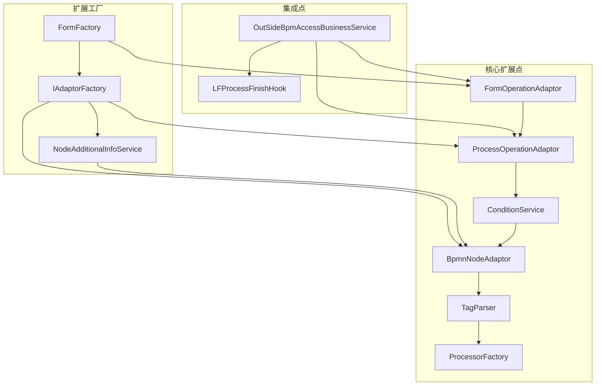
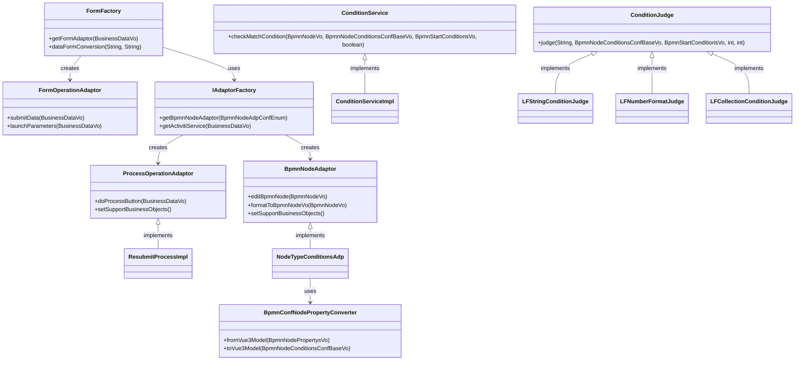
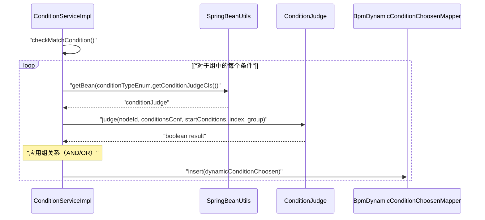
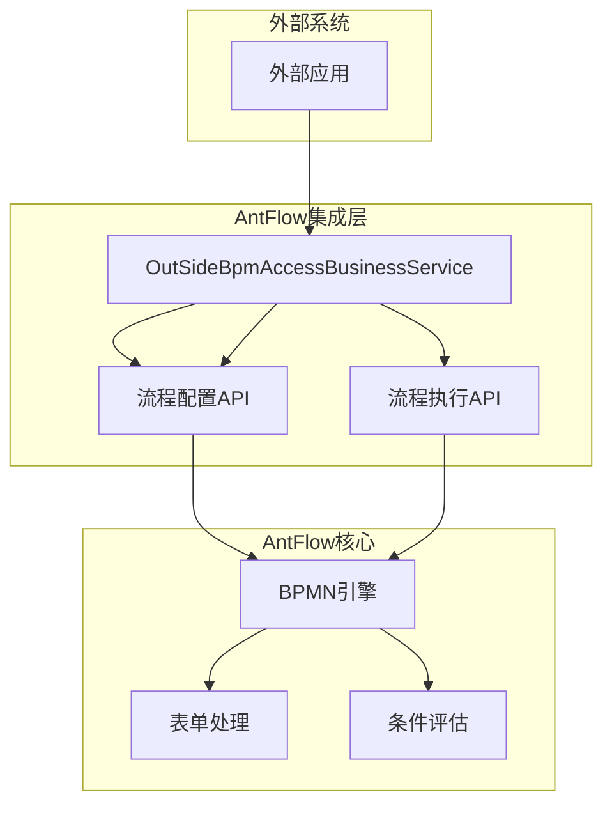
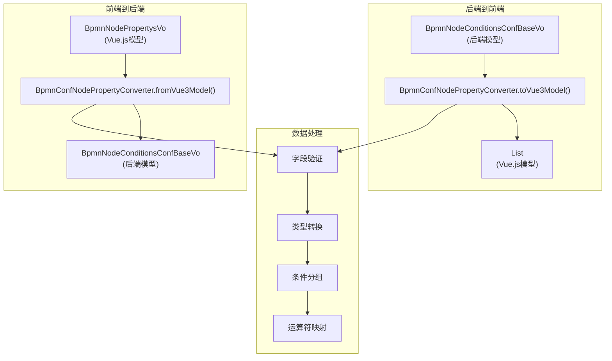
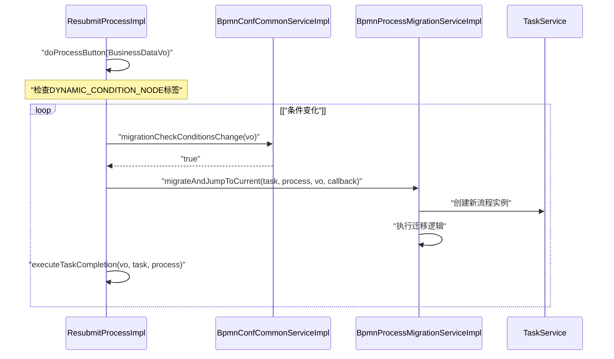

# 扩展系统

本文件为希望使用自定义组件或集成扩展AntFlow工作流系统的开发者提供全面的指南。它解释了主要的扩展点、为扩展性设计的架构以及实现不同类型扩展的分步说明。

## 目录

* [扩展架构概述](#扩展架构概述)
* [扩展点](#扩展点)
* [扩展表单处理](#扩展表单处理)
* [创建自定义流程操作](#创建自定义流程操作)
* [实现自定义条件过滤器](#实现自定义条件过滤器)
* [集成外部系统](#集成外部系统)
* [添加节点标签](#添加节点标签)
* [扩展低代码表单引擎](#扩展低代码表单引擎)
* [最佳实践](#最佳实践)

## 扩展架构概述

AntFlow在设计时考虑了扩展性，采用了模块化架构和定义明确的扩展点。系统使用各种适配器、工厂和服务接口，可以通过实现这些接口来添加自定义功能。

### 扩展性架构



### 扩展组件关系



## 扩展点

AntFlow提供了几个关键的扩展点用于自定义和扩展系统：

| 扩展点                      | 目的                         | 关键接口/类                         | 相关工厂            |
| --------------------------- | ---------------------------- | ----------------------------------- | ------------------- |
| 表单处理(即新建一个DIY流程) | 处理表单提交和数据           | `FormOperationAdaptor`            | `FormFactory`     |
| 流程操作                    | 实现自定义的工作流操作       | `ProcessOperationAdaptor`         | `IAdaptorFactory` |
| 条件过滤器                  | 创建自定义的条件评估         | `ConditionJudge`                  | -                   |
| 节点适配器                  | 处理特殊的节点类型           | `BpmnNodeAdaptor`                 | `IAdaptorFactory` |
| 节点属性转换                | 在前端/后端模型之间转换      | `BpmnConfNodePropertyConverter`   | -                   |
| 外部集成                    | 与外部系统集成               | `OutSideBpmAccessBusinessService` | -                   |
| 流程钩子                    | 在特定流程生命周期点执行代码 | `LFProcessFinishHook`             | -                   |
| 低代码条件                  | 创建自定义的低代码表单条件   | `AbstractLFConditionJudge`        | -                   |

## 扩展表单处理

表单处理系统是最常见的扩展点之一。它允许您定义表单在工作流系统中的提交和处理方式。

### 创建自定义表单适配器

1. 创建一个实现 `FormOperationAdaptor`接口的类
2. 将其注册为Spring bean，并使用适当的表单代码作为其名称
3. 实现表单提交和参数提取所需的方法

### 示例实现

```java
@ActivitiServiceAnno(svcName = "LEAVE_WMA",desc = "请假申请") // 使用表单代码作为bean名称注册
public class MyCustomFormAdapter implements FormOperationAdaptor<MyCustomBusinessDataVo> {
 
 @Override
 public MyCustomBusinessDataVo submitData(MyCustomBusinessDataVo businessDataVo) {
 // 实现自定义的表单提交逻辑
 // 将表单数据保存到您的数据存储中
 return businessDataVo;
 }
 
 @Override
 public BpmnStartConditionsVo launchParameters(MyCustomBusinessDataVo businessDataVo) {
 // 从表单数据中提取工作流参数
 BpmnStartConditionsVo startConditions = new BpmnStartConditionsVo();
 startConditions.setStartUserId(businessDataVo.getEmpId());
 // 设置其他必需的参数
 return startConditions;
 }
}
```

表单适配器通过其bean名称标识，该名称应与工作流配置中使用的表单代码匹配。提交表单时，系统使用 `FormFactory`根据表单代码检索适当的适配器。

## 创建自定义流程操作

流程操作定义了可以在工作流上执行的操作，例如提交、批准或拒绝。

## 实现自定义条件过滤器

条件过滤器允许您定义自定义逻辑，以确定在工作流决策点时应采取的路径。AntFlow提供了几种内置的条件类型，并支持扩展性。

### 条件类型系统

AntFlow使用 `ConditionTypeEnum`来定义可用的条件类型：

| 条件类型     | 代码  | 描述                     | 判断类                           |
| ------------ | ----- | ------------------------ | -------------------------------- |
| 低代码字符串 | 10000 | 低代码表单的字符串比较   | `LFStringConditionJudge`       |
| 低代码数字   | 10001 | 低代码表单的数字比较     | `LFNumberFormatJudge`          |
| 低代码日期   | 10002 | 低代码表单的日期比较     | `LFDateConditionJudge`         |
| 低代码集合   | 10004 | 低代码表单的集合成员资格 | `LFCollectionConditionJudge`   |
| JUEL表达式   | 20000 | JUEL表达式评估           | `JuelExpressionConditionJudge` |
| SpEL表达式   | 20001 | Spring表达式语言         | `SpelExpressionConditionJudge` |

### 条件评估过程



### 创建自定义低代码条件判断器

对于低代码表单，扩展 `AbstractLFConditionJudge`：

```python
@Service
@Slf4j
public class MyCustomLFConditionJudge extends AbstractLFConditionJudge {
 
 @Override
 public boolean judge(String nodeId, BpmnNodeConditionsConfBaseVo conditionsConf, 
 BpmnStartConditionsVo bpmnStartConditionsVo, int index, int group) {
 
 return super.lfCommonJudge(conditionsConf, bpmnStartConditionsVo, (a, b, c) -> {
 // a: 数据库配置中的值
 // b: 用户表单数据中的值
 // c: 运算符类型（来自JudgeOperatorEnum）
 
 // 实现自定义比较逻辑
 String configValue = a.toString();
 String userValue = b.toString();
 
 // 应用运算符逻辑
 return super.compareJudge(configValue, null, userValue, c);
 }, index, group);
 }
}
```

### 创建标准条件判断器

对于非低代码条件，直接实现 `ConditionJudge`：

```python
@Service
@Slf4j
public class MyCustomConditionJudge extends AbstractComparableJudge {
 
 @Override
 public boolean judge(String nodeId, BpmnNodeConditionsConfBaseVo conditionsConf, 
 BpmnStartConditionsVo bpmnStartConditionsVo, int index, int group) {
 
 // 从条件配置中提取值
 String configValue = conditionsConf.getMyCustomField();
 String userValue = bpmnStartConditionsVo.getMyCustomField();
 
 if (Strings.isNullOrEmpty(configValue) || Strings.isNullOrEmpty(userValue)) {
 log.info("自定义条件值为空");
 return false;
 }
 
 // 使用运算符比较值
 BigDecimal configMoney = new BigDecimal(configValue);
 BigDecimal userMoney = new BigDecimal(userValue);
 Integer operator = conditionsConf.getNumberOperator();
 
 return super.compareJudge(configMoney, null, userMoney, operator);
 }
}
```

### 注册新条件类型

将您的条件类型添加到 `ConditionTypeEnum`：

```
MY_CUSTOM_CONDITION(30000, "我的自定义条件", "myCustomField", 2, String.class,
 BpmnNodeConditionsEmptyAdp.class, BpmnStartConditionsVo.class, 
 "myCustomField", MyCustomConditionJudge.class)
```

## 集成外部系统

AntFlow通过其外部API集成服务提供了与外部系统集成的能力。

### 外部API集成

`OutSideBpmAccessBusinessService`提供了外部系统与工作流引擎交互的方法：



### 实现步骤

1. 创建一个与AntFlow的API交互的客户端应用程序
2. 使用 `OutSideBpmAccessBusinessVo`提供必要的数据
3. 调用适当的方法来启动、预览或停止流程

关键集成方法包括：

* `accessBusinessStart`：从外部系统启动工作流流程
* `accessBusinessPreview`：预览工作流流程而不启动它
* `processBreak`：停止正在运行的工作流流程
* `outSideProcessRecord`：检索流程执行记录

示例集成：

```sql
// 创建请求对象
OutSideBpmAccessBusinessVo requestVo = new OutSideBpmAccessBusinessVo();
requestVo.setFormCode("externalFormCode");
requestVo.setUserId("externalUserId");
requestVo.setUserName("外部用户");
requestVo.setFormDataPc(jsonFormData);
requestVo.setTemplateMarks(Arrays.asList("templateMark1", "templateMark2"));
// 如有需要，添加审批人
Map<String, List<BaseIdTranStruVo>> approversList = new HashMap<>();
List<BaseIdTranStruVo> approvers = new ArrayList<>();
approvers.add(new BaseIdTranStruVo("approverId1", "审批人1"));
approversList.put("nodeId1", approvers);
requestVo.setApproversList(approversList);
// 调用服务以启动流程
OutSideBpmAccessRespVo response = outSideBpmAccessBusinessService.accessBusinessStart(requestVo);
String processNumber = response.getProcessNumber();
```

## 创建自定义节点属性转换器

节点属性转换对于在前端Vue.js模型和后端Java对象之间转换数据至关重要。`BpmnConfNodePropertyConverter`处理这种转换。

### 节点属性转换过程



### 自定义节点适配器实现

扩展 `BpmnNodeAdaptor`以处理自定义节点类型：

```python
@Component("myCustomNodeAdp")
public class MyCustomNodeAdp extends BpmnNodeAdaptor {
 
 @Override
 public BpmnNodeVo formatToBpmnNodeVo(BpmnNodeVo bpmnNodeVo) {
 // 从数据库加载配置
 MyCustomNodeConf nodeConf = getCustomNodeConfiguration(bpmnNodeVo.getId());
 
 if (ObjectUtils.isEmpty(nodeConf)) {
 return bpmnNodeVo;
 }
 
 // 将后端模型转换为前端模型
 BpmnNodeConditionsConfBaseVo baseVo = new BpmnNodeConditionsConfBaseVo();
 baseVo.setIsDefault(nodeConf.getIsDefault());
 baseVo.setSort(nodeConf.getSort());
 
 // 使用属性转换器进行转换
 List<BpmnNodeConditionsConfVueVo> vueVos = 
 BpmnConfNodePropertyConverter.toVue3Model(baseVo);
 
 // 设置属性
 bpmnNodeVo.setProperty(BpmnNodePropertysVo.builder()
 .conditionsConf(baseVo)
 .build());
 
 return bpmnNodeVo;
 }
 
 @Override
 public void editBpmnNode(BpmnNodeVo bpmnNodeVo) {
 // 将前端模型转换为后端模型
 BpmnNodeConditionsConfBaseVo baseVo = Optional.ofNullable(bpmnNodeVo.getProperty())
 .map(BpmnConfNodePropertyConverter::fromVue3Model)
 .orElse(new BpmnNodeConditionsConfBaseVo());
 
 // 保存到数据库
 MyCustomNodeConf nodeConf = new MyCustomNodeConf();
 nodeConf.setBpmnNodeId(bpmnNodeVo.getId());
 nodeConf.setIsDefault(baseVo.getIsDefault());
 nodeConf.setSort(baseVo.getSort());
 nodeConf.setExtJson(baseVo.getExtJson());
 
 saveCustomNodeConfiguration(nodeConf);
 }
 
 @Override
 public void setSupportBusinessObjects() {
 addSupportBusinessObjects(BpmnNodeAdpConfEnum.MY_CUSTOM_NODE_TYPE);
 }
}
```

### 处理低代码流程条件

对于低代码表单，系统使用特殊的容器字段方法：

```
// 检查条件是否为低代码流程
if (ConditionTypeEnum.isLowCodeFlow(conditionTypeEnum)) {
 Map<String, Object> lfConditionsMap = baseVo.getGroupedLfConditionsMap();
 // 处理低代码特定逻辑
 String columnDbname = getColumnDbname(conditionTypeEnum);
 Object conditionValue = lfConditionsMap.get(group).get(columnDbname);
}
```

## 扩展低代码表单引擎

低代码表单引擎允许以最少的编码创建工作流。您可以通过自定义字段控件和流程钩子来扩展它。

### 创建自定义字段控件

1. 实现一个扩展 `BpmnNodeLfFormdataFieldControl`的类
2. 定义字段、权限和行为
3. 在系统中注册它

### 实现流程完成钩子

1. 创建一个实现 `LFProcessFinishHook`接口的类
2. 将其注册为Spring bean
3. 实现 `onFinishData`方法，以便在流程完成时执行代码

```python
@Component
public class MyCustomProcessHook implements LFProcessFinishHook {
 
 @Override
 public void onFinishData(BusinessDataVo vo) {
 // 实现当流程完成时执行的自定义逻辑
 String processNumber = vo.getProcessNumber();
 // 执行发送通知、更新外部系统等操作
 }
}
```

## 流程迁移和动态条件

AntFlow支持在工作流执行期间条件变化时的流程迁移。这对于动态条件节点尤为重要。

### 动态条件迁移



### 自定义迁移逻辑的实现

```python
@Component
public class MyCustomMigrationHandler {
 
 @Autowired
 private BpmnProcessMigrationServiceImpl migrationService;
 
 public void handleCustomMigration(Task currentTask, BpmBusinessProcess process, 
 BusinessDataVo vo) {
 
 // 检查是否需要迁移
 String formKey = currentTask.getFormKey();
 if (!StringUtils.isEmpty(formKey)) {
 NodeExtraInfoDTO extraInfo = JSON.parseObject(formKey, NodeExtraInfoDTO.class);
 List<BpmnNodeLabelVO> labels = extraInfo.getNodeLabelVOS();
 
 if (hasCustomMigrationLabel(labels)) {
 // 执行自定义迁移
 migrationService.migrateAndJumpToCurrent(currentTask, process, vo, 
 this::executeCustomCompletion);
 }
 }
 }
 
 private void executeCustomCompletion(BusinessDataVo vo, Task task, 
 BpmBusinessProcess process) {
 // 自定义完成逻辑
 vo.setApprovalComment("由于自定义条件而迁移");
 // 继续正常任务完成
 }
}
```

## 最佳实践

在扩展AntFlow系统时，请遵循以下最佳实践：

1. **使用接口**：始终通过接口进行扩展，而不是修改现有的实现类
2. **Spring Beans**：使用 `@Component`或 `@Service`将自定义组件注册为Spring beans
3. **事务管理**：对修改数据的方法使用 `@Transactional`，以确保数据库一致性
4. **异常处理**：对业务逻辑异常使用 `JiMuBizException`，并提供清晰的错误消息
5. **条件分组**：在实现条件判断器时，正确处理分组条件及其关系
6. **低代码支持**：对于低代码表单，扩展 `AbstractLFConditionJudge`并使用 `lfCommonJudge`模式
7. **属性转换**：使用 `BpmnConfNodePropertyConverter`在前端和后端模型之间进行转换
8. **迁移支持**：使用标签（如 `DYNAMIC_CONDITION_NODE`）为动态条件实现适当的迁移逻辑
9. **安全上下文**：始终使用 `SecurityUtils.getLogInEmpIdStr()`和 `SecurityUtils.getLogInEmpName()`设置适当的用户上下文
10. **测试**：为扩展创建全面的单元测试，特别是对于条件评估逻辑

## 结论

AntFlow提供了一套丰富的扩展点，允许您自定义和扩展系统以满足您的特定需求。通过了解核心架构并遵循系统中建立的模式，您可以创建与现有功能无缝集成的强大扩展。

请记住，扩展应尊重系统的设计原则并保持与核心组件的兼容性，以确保顺利运行和未来的可升级性。
