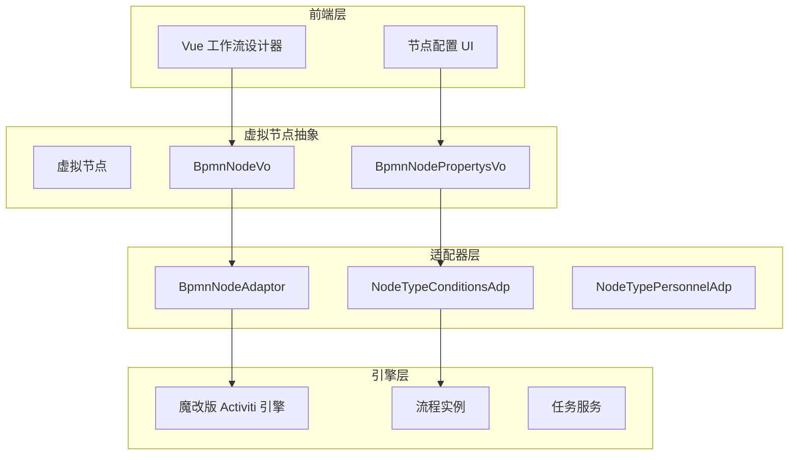
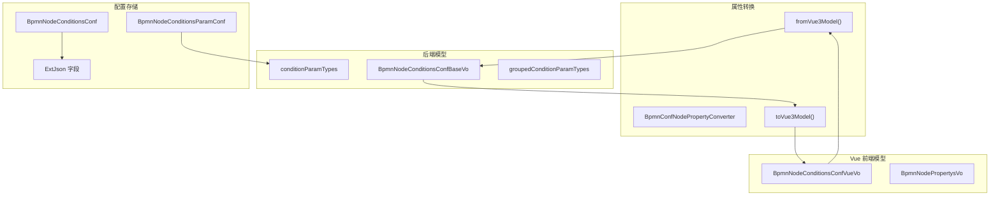
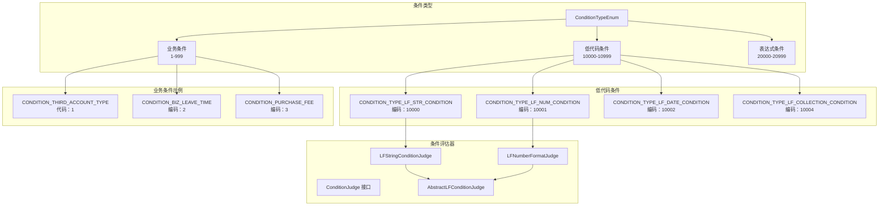
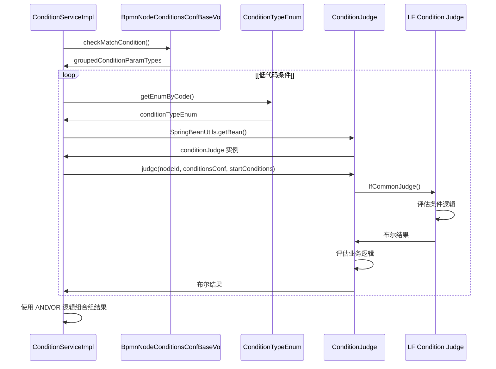
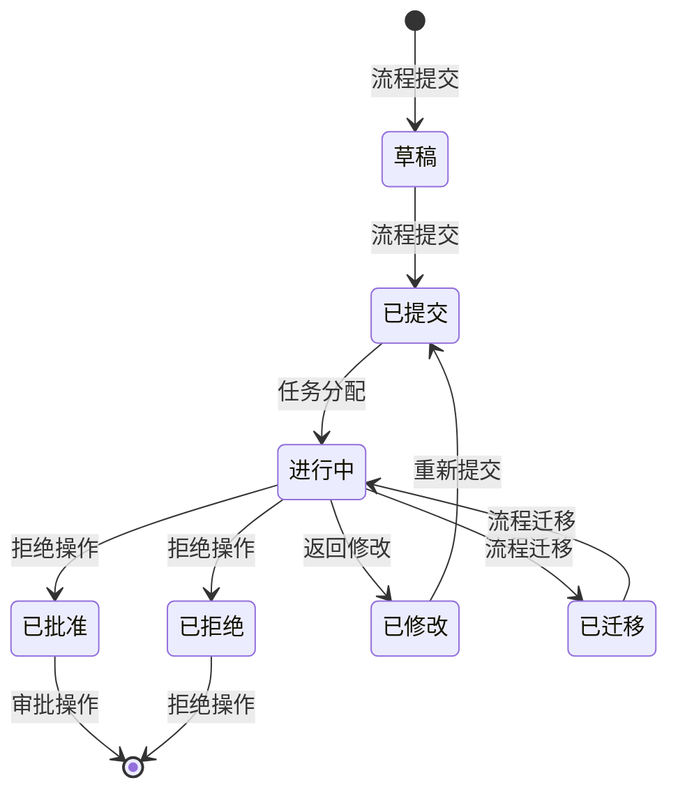
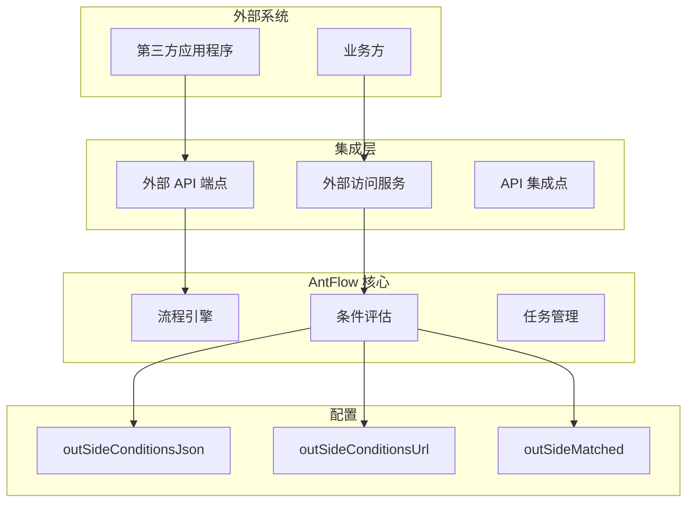

## 虚拟节点（VNodes）

虚拟节点系统是 AntFlow 的核心创新，它将工作流逻辑从特定流程引擎 API 中抽象出来。这一抽象层使得工作流开发与引擎无关，并且更容易在不同工作流引擎之间迁移。

## BPMN 配置系统

BPMN 配置系统通过结构化的配置方法管理流程定义、节点属性和工作流路由逻辑，分离流程流和业务规则之间的关注点。

### 节点配置架构

BpmnConfNodePropertyConverter 负责前端 Vue 模型和后端配置对象之间的双向转换，实现工作流设计器与执行引擎之间的无缝集成。

## 条件管理系统

条件管理系统通过灵活的规则引擎评估工作流路由决策，支持各种条件类型、操作符和评估策略。

### 条件类型层次结构

> ConditionTypeEnum 中的每种条件类型都映射到一个特定的评估器类，该类实现了 ConditionJudge 接口。低代码条件通过 AbstractLFConditionJudge 共享通用评估逻辑

ConditionServiceImpl.checkMatchCondition() 方法通过迭代条件组并应用逻辑运算符组合结果来协调条件评估。

## 低代码流程系统

低代码流程系统允许用户通过可视化配置创建工作流，无需编写代码。它提供了表单构建器、字段管理和动态条件评估。

### 低代码架构

| 组件     | 类/服务                                             | 用途                 |
| -------- | --------------------------------------------------- | -------------------- |
| 表单管理 | `BpmnConfLfFormdataFieldServiceImpl`              | 管理表单字段定义     |
| 字段存储 | `lfConditions` 字段                               | 低代码条件数据的容器 |
| 条件评估 | `LFStringConditionJudge`, `LFNumberFormatJudge` | 评估低代码条件       |
| 数据转换 | `LOWFLOW_CONDITION_CONTAINER_FIELD_NAME`          | 字段映射的常量       |

低代码系统采用特殊的容器字段方法，所有低代码条件都存储在 lfConditions 字段内的 Map<String, Object> 结构中，允许灵活的无模式条件存储。

## 流程操作与生命周期

流程操作涵盖了提交、审批、拒绝和流程迁移等核心工作流操作。这些操作通过结构化的服务层进行管理，该层维护流程状态和历史记录。

### 流程状态管理

流程操作维护审计跟踪，并通过 BpmDynamicConditionChoosen 实体支持动态条件评估，该实体在流程迁移场景中跟踪条件状态。

## 外部集成系统(也称作SaaS流程\)

外部集成系统使第三方应用程序能够通过标准化的 API 和可配置的集成点与 AntFlow 工作流进行交互。

### 集成架构

