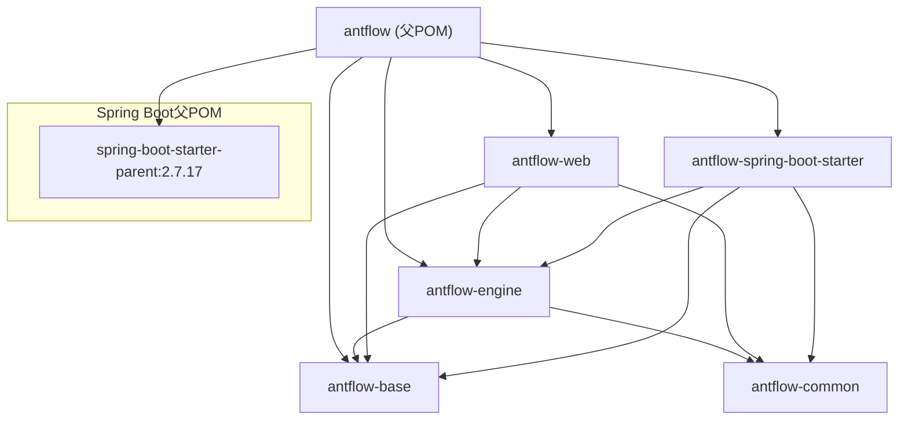
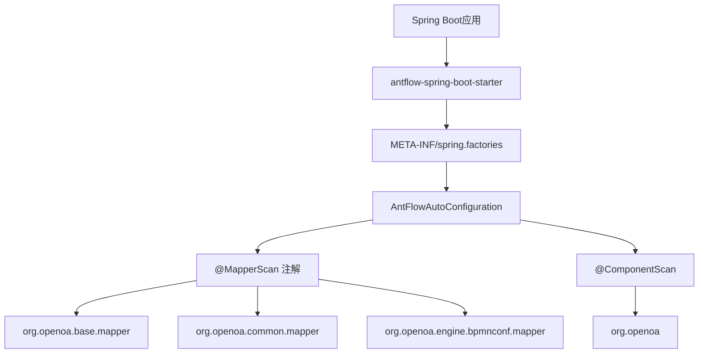

# 模块结构与自动配置

本文档详细描述了AntFlow的Maven模块结构和Spring Boot自动配置系统。它涵盖了四个主要模块（`antflow-base`、`antflow-engine`、`antflow-web`、`antflow-spring-boot-starter`）并解释了它们如何通过Maven依赖管理和Spring Boot的自动配置机制协同工作。

## Maven模块架构

AntFlow遵循模块化的Maven架构，使用一个父POM协调四个子模块。每个模块在系统架构中有特定的角色，并且有明确的依赖关系。

### 模块层次图

### 模块依赖矩阵

| 模块                            | 依赖                                                     | 范围 | 目的                     |
| ------------------------------- | -------------------------------------------------------- | ---- | ------------------------ |
| `antflow-base`                | 无                                                       | -    | 基础实用工具和公共抽象   |
| `antflow-engine`              | `antflow-base`，`antflow-common`                     | 编译 | 核心工作流引擎和业务逻辑 |
| `antflow-web`                 | `antflow-base`，`antflow-common`，`antflow-engine` | 编译 | REST API 控制器和Web层   |
| `antflow-spring-boot-starter` | `antflow-base`，`antflow-common`，`antflow-engine` | 编译 | 自动配置和启动器依赖     |

## 模块规范

### antflow-base 模块

基础模块提供系统中使用的核心实用工具和抽象。

**主要特点:**

* **Artifact ID:** `antflow-base`
* **版本:** `0.101.0`
* **打包方式:** JAR
* **依赖:** 最小的依赖关系，主要是 `provided`范围，避免版本冲突

**主要依赖:**

* Google Guava (`31.0.1-jre`) 用于实用功能
* Jackson 用于JSON处理（提供）
* Spring Framework组件（提供）
* Drools 用于规则引擎支持（提供）
* MyBatis-Plus 扩展（提供）

### antflow-engine 模块

核心引擎模块包含主要的工作流处理逻辑和BPMN执行引擎。

**主要特点:**

* **Artifact ID:** `antflow-engine`
* **版本:** `0.101.0`
* **打包方式:** JAR
* **依赖:** 包含全面的工作流引擎依赖

**关键依赖:**

* `antflow-base` 和 `antflow-common`（编译范围）
* MyBatis-Plus Boot Starter (`3.5.1`) 用于数据库操作
* Spring Boot AutoConfigure 用于配置支持
* AspectJ Weaver 用于AOP功能
* 各种Spring Framework组件

### antflow-web 模块

Web层模块提供REST API端点和Web特定功能。

**主要特点:**

* **Artifact ID:** `antflow-web`
* **版本:** `0.101.0`
* **父模块:** 继承自根 `antflow` POM
* **主类:** `org.openoa.AntFlowApplication`

**依赖:**

* Spring Boot Starter Web 用于REST API支持
* 所有三个基础模块：`antflow-base`，`antflow-common`，`antflow-engine`
* Lombok 用于代码生成

### antflow-spring-boot-starter 模块

启动器模块将所有内容打包在一起，方便集成到Spring Boot应用程序中。

**主要特点:**

* **Artifact ID:** `antflow-spring-boot-starter`
* **版本:** `0.101.0`（通过 `${antflow.version}`属性定义）
* **目的:** 提供自动配置和传递依赖

**全面依赖:**
启动器包括运行AntFlow所需的所有依赖项：

* 所有AntFlow模块（`antflow-base`，`antflow-common`，`antflow-engine`）
* 数据库：MySQL Connector（`8.0.27`），Druid（`1.1.17`），MyBatis-Plus（`3.5.1`）
* 工作流：Drools（`6.5.0.Final`），JGraphX（`4.2.2`）
* 工具：FastJSON2（`2.0.53`），Guava（`31.0.1-jre`），Joda-Time（`2.9.9`）
* 集群：JGroups（`4.2.30.Final`）

## Spring Boot自动配置

AntFlow集成了Spring Boot的自动配置机制，当启动器包含在项目中时，Spring Boot会自动配置Bean和设置。

### 自动配置架构

### AntFlowAutoConfiguration类

`AntFlowAutoConfiguration`类是Spring Boot自动配置的主要入口：

**配置注解:**

* `@Configuration`: 将其标记为Spring配置类
* `@MapperScans`: 配置MyBatis映射器扫描三个包： * `org.openoa.base.mapper` * `org.openoa.common.mapper` * `org.openoa.engine.bpmnconf.mapper`
* `@ComponentScan("org.openoa")`: 启用所有AntFlow包的组件扫描

**自动配置注册:**
该类在 `spring.factories`中以 `EnableAutoConfiguration`键注册，使Spring Boot能够在类路径中存在启动器时自动发现和应用配置。

## 技术栈集成

### 框架版本

| 框架            | 版本        | 用途               |
| --------------- | ----------- | ------------------ |
| Spring Boot     | 2.7.17      | 应用框架和依赖管理 |
| MyBatis-Plus    | 3.5.1       | ORM和数据库操作    |
| MySQL Connector | 8.0.27      | 数据库连接         |
| Drools          | 6.5.0.Final | 业务规则引擎       |
| FastJSON2       | 2.0.53      | JSON处理           |
| Druid           | 1.1.17      | 数据库连接池       |

### 构建配置

该项目使用Maven配置文件来适配不同的环境：

* `dev`（默认激活配置）
* `local`
* `uat`
* `pro`
