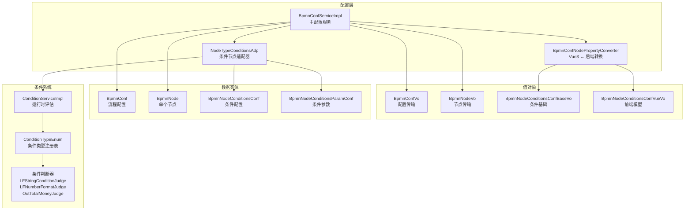
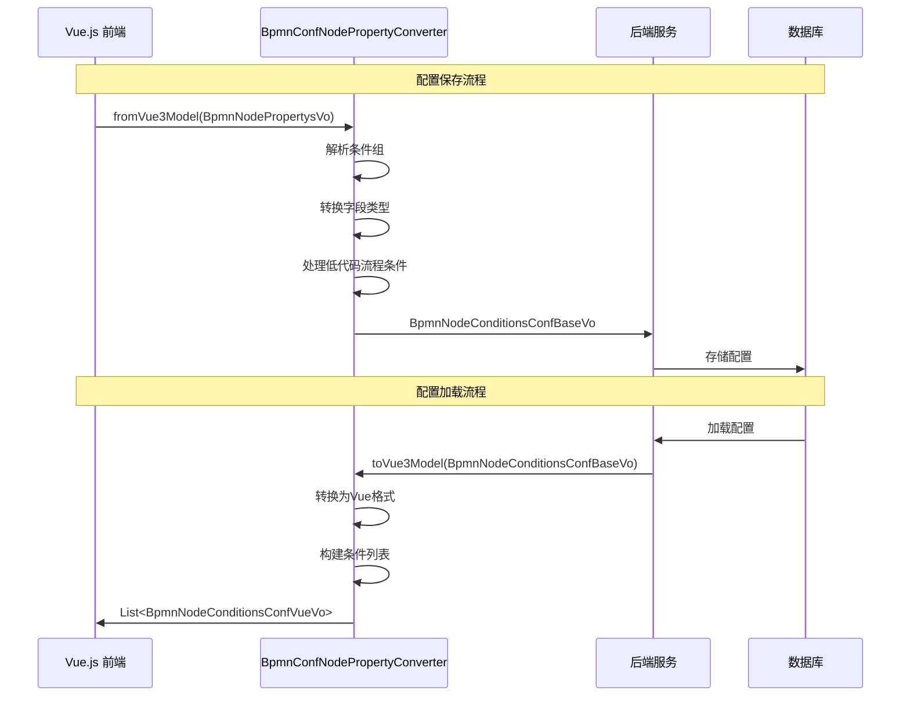
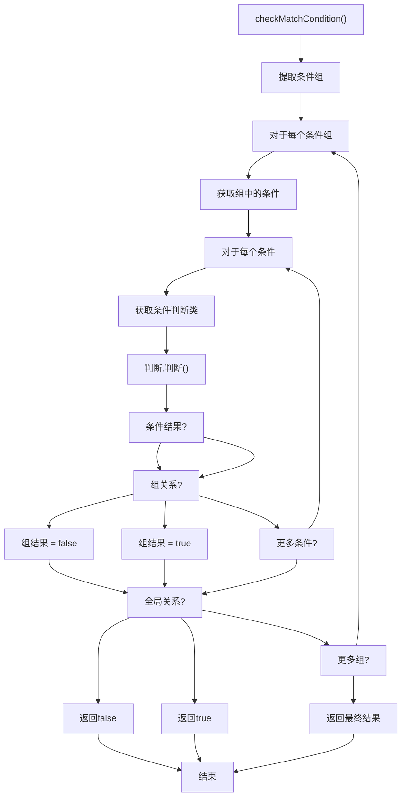
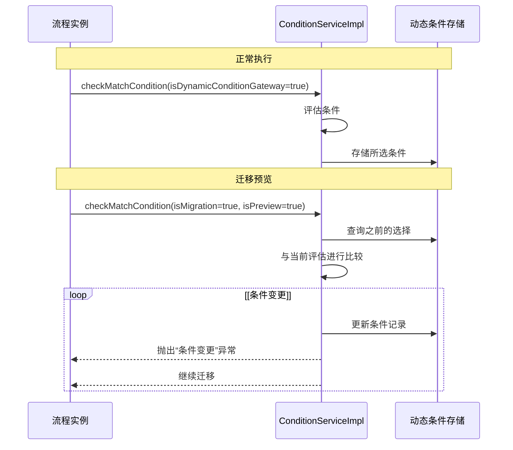

# Antflow配置系统

BPMN配置系统为定义工作流流程、配置具有条件路由逻辑的决策节点以及管理不同工作流组件之间的关系提供了基础。

## 核心架构

BPMN配置系统围绕几个关键组件构建，这些组件处理配置持久化、条件评估以及前端和后端表示之间的属性转换。




## 配置数据模型

BPMN配置系统使用分层数据模型，其中流程包含节点，节点可以有特定的条件配置。

| 实体                            | 目的           | 关键字段                                                      |
| ------------------------------- | -------------- | ------------------------------------------------------------- |
| `BpmnConf`                    | 根流程配置     | `bpmnCode`, `bpmnName`, `formCode`, `effectiveStatus` |
| `BpmnNode`                    | 单个工作流节点 | `nodeId`, `nodeType`, `nodeProperty`, `nodeFrom`      |
| `BpmnNodeConditionsConf`      | 节点的条件配置 | `isDefault`, `sort`, `groupRelation`, `extJson`       |
| `BpmnNodeConditionsParamConf` | 特定条件参数   | `conditionParamType`, `conditionParamJsom`, `operator`  |

```css

```


## 属性转换系统

`BpmnConfNodePropertyConverter`负责在Vue.js前端模型和后端数据结构之间进行双向转换。这种转换对于保持可视化工作流程设计器和后端执行引擎之间的一致性至关重要。



转换器处理几个关键转换：

* **条件组**：将条件组织成具有AND/OR关系的逻辑组
* **字段类型转换**：处理不同的数据类型（字符串、数字、日期、集合）
* **低代码流程集成**：使用 `LOWFLOW_CONDITION_CONTAINER_FIELD_NAME`字段对低代码流程条件进行特殊处理
* **运算符映射**：在前端运算符表示和后端 `JudgeOperatorEnum`值之间进行转换

## 条件类型系统

条件系统通过 `ConditionTypeEnum`支持多种类型的条件，该枚举定义了可用的条件类型、它们的数据结构以及相关的评估逻辑。

```mermaid
flowchart TD
TemplateMarks["CONDITION_TEMPLATEMARK<br>基于模板的条件"]
JUEL["CONDITION_TYPE_JUEL_EXPRESSION<br>JUEL表达式评估"]
SpEL["CONDITION_TYPE_SPEL_EXPRESSION<br>Spring表达式语言"]
AccountType["CONDITION_THIRD_ACCOUNT_TYPE<br>第三方账户条件"]
LeaveTime["CONDITION_BIZ_LEAVE_TIME<br>请假时长条件"]
PurchaseFee["CONDITION_PURCHASE_FEE<br>购买金额条件"]
JobLevel["CONDITION_JOB_LEVEL_TYPE<br>职位级别条件"]
LFString["CONDITION_TYPE_LF_STR_CONDITION<br>字符串字段条件"]
LFNumber["CONDITION_TYPE_LF_NUM_CONDITION<br>数字字段条件"]
LFDate["CONDITION_TYPE_LF_DATE_CONDITION<br>日期字段条件"]
LFCollection["CONDITION_TYPE_LF_COLLECTION_CONDITION<br>集合字段条件"]
StringJudge["LFStringConditionJudge"]
NumberJudge["LFNumberFormatJudge"]
DateJudge["LFDateConditionJudge"]
CollectionJudge["LFCollectionConditionJudge"]
MoneyJudge["OutTotalMoneyJudge"]
LFString --> StringJudge
LFNumber --> NumberJudge
LFDate --> DateJudge
LFCollection --> CollectionJudge
PurchaseFee --> MoneyJudge
subgraph subGraph4 ["条件判断器"]
 StringJudge
 NumberJudge
 DateJudge
 CollectionJudge
 MoneyJudge
end
subgraph subGraph1 ["低代码流程条件"]
 LFString
 LFNumber
 LFDate
 LFCollection
end
subgraph subGraph0 ["业务条件"]
 AccountType
 LeaveTime
 PurchaseFee
 JobLevel
end
subgraph subGraph3 ["外部条件"]
 TemplateMarks
end
subgraph subGraph2 ["表达式条件"]
 JUEL
 SpEL
end
```



每种条件类型定义：

* **代码和描述**：唯一标识符和人类可读的名称
* **字段配置**：目标字段名和数据类型
* **评估类**：用于运行时评估的特定判断类
* **适配器类**：前端/后端集成适配器

## 运行时条件评估

`ConditionServiceImpl`在工作流执行期间协调条件评估。它支持简单条件和具有AND/OR逻辑的复杂分组条件。



评估过程处理：

* **分组条件**：组织成逻辑组的条件
* **关系逻辑**：组内和组间的AND/OR关系
* **动态条件**：对动态条件网关的特殊处理
* **迁移验证**：流程迁移期间的条件变更检测

## 配置管理操作

`BpmnConfServiceImpl`提供了全面的配置管理能力，包括BPMN配置的创建、编辑、检索和激活。

### 配置创建和编辑

`edit()`方法处理BPMN配置创建的完整生命周期：

1. **流程设置**：创建带有生成的 `bpmnCode`的 `BpmnConf`实体
2. **节点处理**：遍历所有节点，验证并创建 `BpmnNode`实体
3. **适配器集成**：使用节点特定的适配器进行专业化配置
4. **模板管理**：处理通知模板和审批提醒
5. **标志管理**：为复制节点和用户选择等功能设置配置标志

### 配置检索

系统提供多种检索方法：

* `detail(long id)`：通过配置ID检索
* `detail(String bpmnCode)`：通过BPMN代码检索
* `detailByFormCode(String formCode)`：通过表单代码检索活动配置

## 低代码流程集成

系统通过专门的条件类型和评估逻辑为低代码流程条件提供特殊支持。低代码条件使用基于容器的方法，其中多个字段条件被包装在一个容器字段中。

### 低代码条件类型

| 条件类型     | 代码  | 目的             | 判断类                         |
| ------------ | ----- | ---------------- | ------------------------------ |
| 字符串条件   | 10000 | 文本字段比较     | `LFStringConditionJudge`     |
| 数字条件     | 10001 | 数字字段比较     | `LFNumberFormatJudge`        |
| 日期条件     | 10002 | 日期字段比较     | `LFDateConditionJudge`       |
| 日期时间条件 | 10003 | 日期时间字段比较 | `LFDateTimeConditionJudge`   |
| 集合条件     | 10004 | 多选字段比较     | `LFCollectionConditionJudge` |

### 低代码评估模式

低代码条件遵循在 `AbstractLFConditionJudge`中实现的通用评估模式：

1. **容器提取**：从 `groupedLfConditionsMap`中提取分组条件
2. **字段匹配**：将数据库条件字段与用户提交的表单字段进行匹配
3. **特定类型评估**：委托给特定类型的评估逻辑
4. **运算符应用**：应用比较运算符（等于、大于、介于等）

## 动态条件管理

系统通过 `BpmDynamicConditionChoosen`实体支持动态条件，该实体在流程执行期间跟踪条件选择，以检测流程迁移期间的条件变更。


