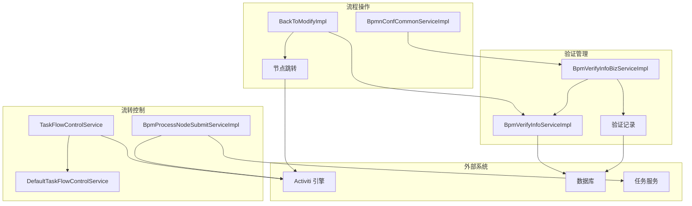
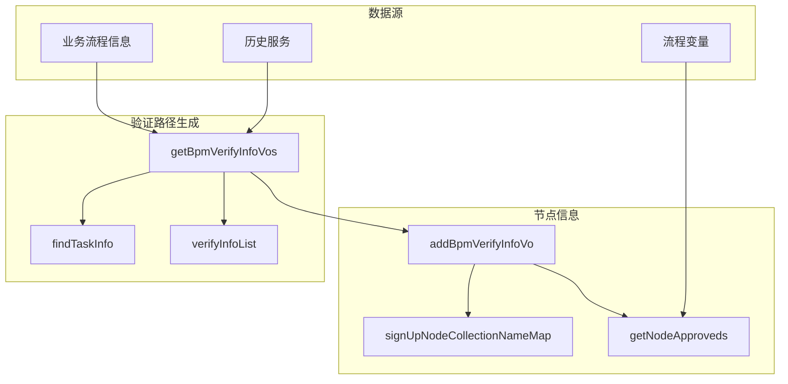
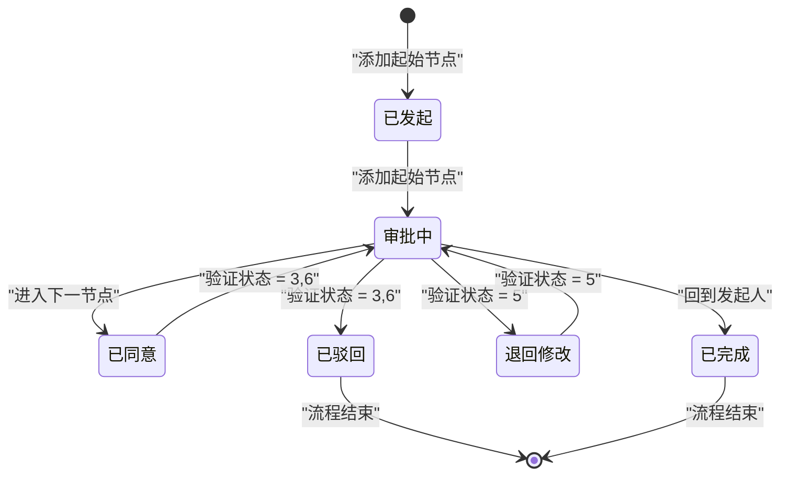
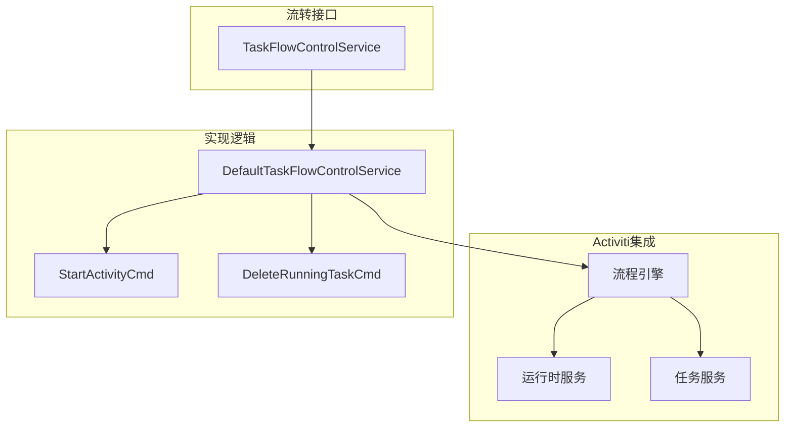

## 核心架构

流程验证与控制系统由多个服务组成，负责管理审批流程的生命周期：

## 验证信息管理

验证系统在流程全生命周期中记录所有审批活动，详细保存谁在何时进行了何种操作。

### BpmVerifyInfoBizServiceImpl 核心功能

`BpmVerifyInfoBizServiceImpl` 是验证信息的核心服务类：

## 验证路径构建

系统构建包含已完成与待处理任务的审批路径：

| 组件     | 作用           | 关键方法                  |
| -------- | -------------- | ------------------------- |
| 起始节点 | 记录流程启动   | `getBpmVerifyInfoVos()` |
| 历史记录 | 记录已审批节点 | `verifyInfoList()`      |
| 当前任务 | 获取活动节点   | `findTaskInfo()`        |
| 未来路径 | 预测后续流程   | `addBpmVerifyInfoVo()`  |

## 流程状态管理

验证系统根据状态转换管理流程：

## 流程流转控制

任务流转控制系统处理流程的前进、回退、跳转等操作。

### TaskFlowControlService 架构

## 节点跳转操作

DefaultTaskFlowControlService 支持丰富的节点跳转逻辑：

| 操作           | 方法                                                   | 描述               |
| -------------- | ------------------------------------------------------ | ------------------ |
| 跳转到指定节点 | `moveTo(currentTaskDefKey, targetTaskDefinitionKey)` | 跳转至任意任务节点 |
| 删除当前任务   | `DeleteRunningTaskCmd`                               | 清理当前任务       |
| 启动目标节点   |                                                        |                    |
