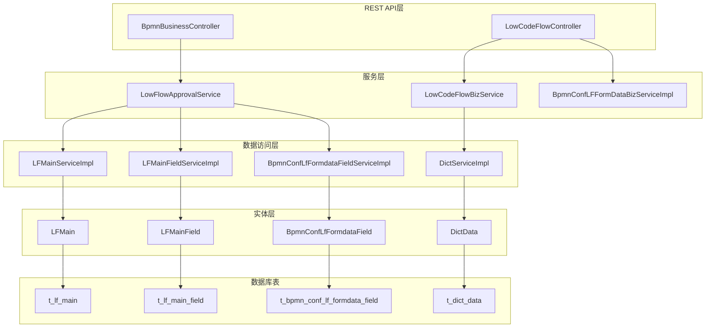
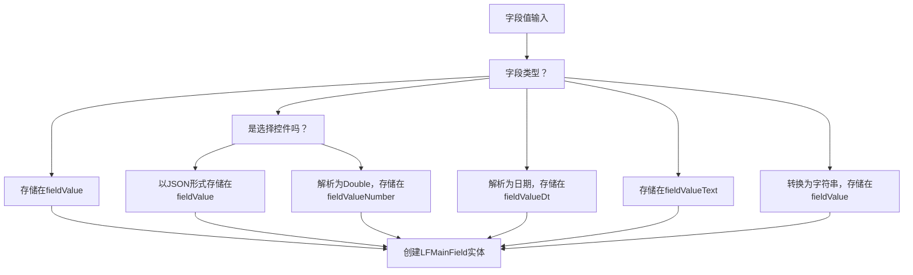
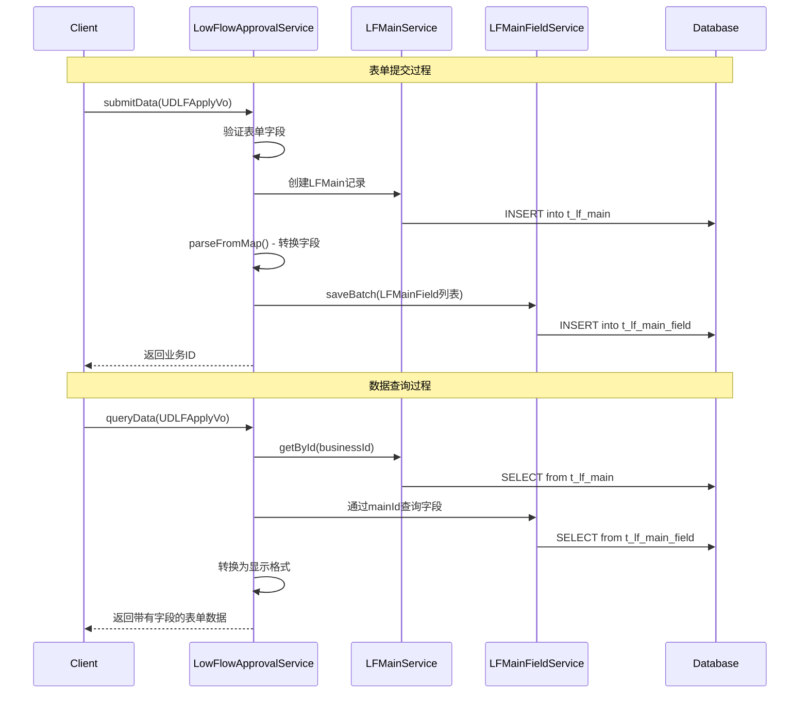
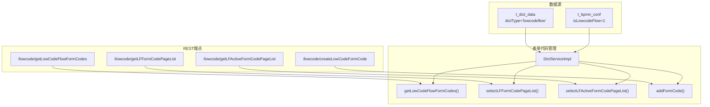
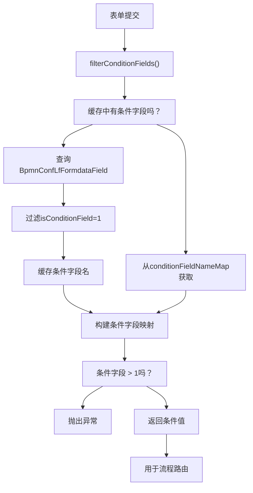
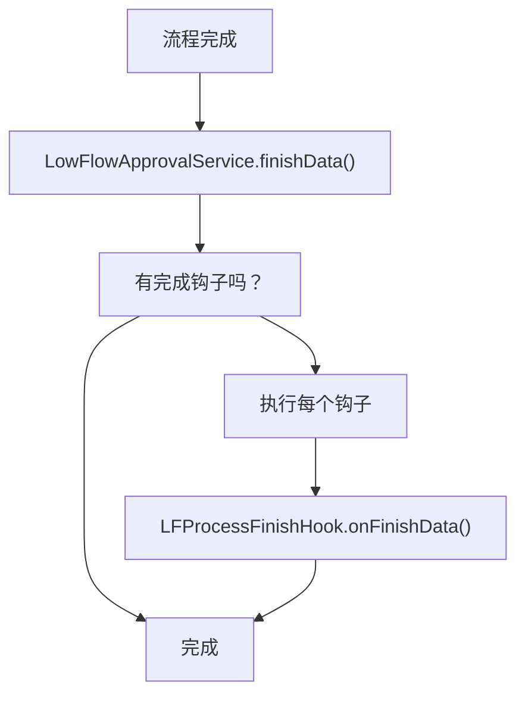

# 低代码流程引擎

## 系统架构

低代码流程引擎由几个相互连接的组件组成，这些组件处理表单配置、数据处理和工作流集成：



## 核心实体和数据模型

低代码流程系统使用几个关键实体来管理表单定义和运行时数据：

### 主要实体

| 实体                        | 目的             | 关键字段                                                                        |
| --------------------------- | ---------------- | ------------------------------------------------------------------------------- |
| `LFMain`                  | 主表单记录容器   | `id`, `confId`, `formCode`, `createUser`                                |
| `LFMainField`             | 单个字段数据存储 | `mainId`, `fieldId`, `fieldValue`, `fieldValueNumber`, `fieldValueDt` |
| `BpmnConfLfFormdataField` | 字段配置元数据   | `bpmnConfId`, `fieldId`, `fieldName`, `fieldType`, `isConditionField` |
| `DictData`                | 表单代码定义     | `dictType`, `value`, `label`, `remark`                                  |


## 字段类型系统

低代码流程引擎通过 `LFFieldTypeEnum`枚举支持多种字段类型：

### 支持的字段类型

| 类型          | 代码 | 描述         | 存储方式                                           |
| ------------- | ---- | ------------ | -------------------------------------------------- |
| `STRING`    | 1    | 基本文本字段 | `fieldValue`                                     |
| `NUMBER`    | 2    | 数值         | `fieldValueNumber` 或 `fieldValue`（用于选择） |
| `DATE`      | 3    | 仅日期       | `fieldValueDt`                                   |
| `DATE_TIME` | 4    | 日期和时间   | `fieldValueDt`                                   |
| `TEXT`      | 5    | 长文本内容   | `fieldValueText`                                 |
| `BOOLEAN`   | 6    | 布尔值       | `fieldValue`（作为字符串）                       |
| `BLOB`      | 7    | 二进制数据   | 未实现                                             |

### 字段处理逻辑

`LFMainField.buildMainField()`方法处理类型特定的值转换：




## 表单处理工作流程

`LowFlowApprovalService`实现了 `FormOperationAdaptor`接口来处理完整的表单生命周期：

### 核心处理方法



### 关键服务方法

| 方法                      | 目的             | 关键操作                        |
| ------------------------- | ---------------- | ------------------------------- |
| `submitData()`          | 处理新表单提交   | 创建 `LFMain`，解析并保存字段 |
| `queryData()`           | 检索现有表单数据 | 加载主记录和相关字段            |
| `consentData()`         | 处理审批更新     | 更新现有字段值                  |
| `previewSetCondition()` | 设置路由条件     | 提取条件字段                    |


## 表单代码管理

系统使用基于字典的方法通过 `DictServiceImpl`来管理表单代码：

### 表单代码操作



### 表单代码查询

系统根据使用上下文提供不同的表单代码查询：

* **所有表单代码**：用于流程设计界面
* **表单代码分页列表**：带分页的模板管理
* **活动表单代码分页列表**：可用于流程发起的表单


## REST API端点

低代码流程引擎暴露了几个用于表单管理的REST端点：

### LowCodeFlowController端点

| 端点                                     | 方法 | 目的                             | 请求/响应                                                     |
| ---------------------------------------- | ---- | -------------------------------- | ------------------------------------------------------------- |
| `/lowcode/getLowCodeFlowFormCodes`     | GET  | 获取所有可用的表单代码           | `List<BaseKeyValueStruVo>`                                  |
| `/lowcode/getLFFormCodePageList`       | POST | 获取分页的表单代码列表           | `DetailRequestDto` → `ResultAndPage<BaseKeyValueStruVo>` |
| `/lowcode/getLFActiveFormCodePageList` | POST | 获取可用于发起的活动表单代码列表 | `DetailRequestDto` → `ResultAndPage<BaseKeyValueStruVo>` |
| `/lowcode/getformDataByFormCode`       | GET  | 通过代码获取表单结构             | `String formCode` → `String formData`                    |
| `/lowcode/createLowCodeFormCode`       | POST | 创建新的表单代码                 | `BaseKeyValueStruVo` → `Integer`                         |

### BpmnBusinessController端点

| 端点                                        | 方法 | 目的                      |
| ------------------------------------------- | ---- | ------------------------- |
| `/bpmnBusiness/getDIYFormCodeList`        | GET  | 获取带有描述的DIY表单代码 |
| `/bpmnBusiness/getStartUserChooseModules` | GET  | 获取用户可选的审批节点    |


## 条件字段处理

系统支持基于表单字段值的条件路由：

### 条件字段逻辑



`filterConditionFields()`方法实现了缓存以提高性能：

* `conditionFieldNameMap`：将 `confId`映射到条件字段名
* `allFieldConfMap`：将 `confId`映射到完整的字段配置


## 与BPMN引擎的集成

低代码流程引擎通过几种机制与AntFlow的BPMN处理集成：

### 服务注册

`LowFlowApprovalService`使用注解注册为Activiti服务：

```python
@ActivitiServiceAnno(svcName = StringConstants.LOWFLOW_FORM_CODE, desc = "")
public class LowFlowApprovalService implements FormOperationAdaptor<UDLFApplyVo>, ActivitiService
```

### 流程集成点

| 集成点   | 方法                      | 目的                   |
| -------- | ------------------------- | ---------------------- |
| 流程启动 | `launchParameters()`    | 为BPMN引擎提供启动条件 |
| 条件评估 | `previewSetCondition()` | 设置路由条件           |
| 任务处理 | `consentData()`         | 处理任务审批/拒绝      |
| 流程完成 | `finishData()`          | 执行完成钩子           |

### 通过钩子扩展

系统支持通过 `LFProcessFinishHook`接口扩展：


