    AntFlow oracle支持

## 一.Oracle 安装

### 1.使用Docker安装oracle xe

#### 1.1 执行以下命令

```bash
docker run -d \
  -p 1521:1521 \
  -e ORACLE_PASSWORD=Yourpass@123 \
  -v oracle-volume:/opt/oracle/oradata \
  gvenzl/oracle-xe:21-slim
```

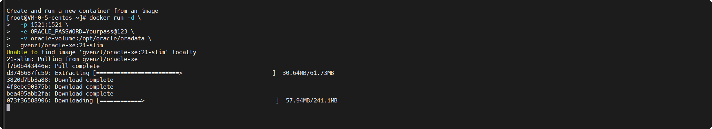

然后执行**docker logs -f oracle-xe 查看是否成功**

然后就可以用：

* **Host** : `容器所在主机IP`
* **Port** : `1521`
* **Service Name** : `XEXDB(或XE)`
* **Username** : `system`
* **Password** : `Yourpass@123`

> 注笔者只有一个4c8g云主机,上面部署的有antflow的服务。只有一个台1c2g的测试机，没法正常启动oracle镜像，直接卡死。读者自行斟酌，有错误的地方还烦请指正。

### 2.windows下安装oracle

#### 2.1进到oracle官网下载学习版（用户可以根据自己的实际情况，也可以下载完整版

[下载地址](https://www.oracle.com/cn/database/technologies/xe-downloads.html)

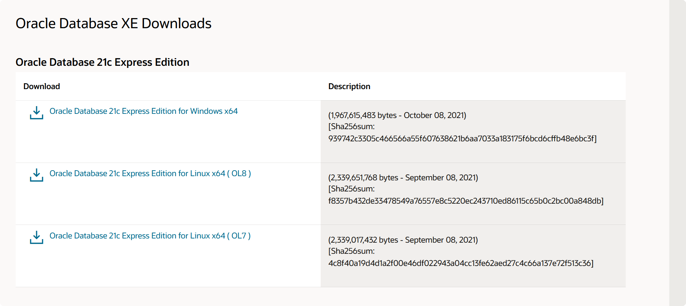

选择windows版安装（有linux机器的用户也可以选择linux版安装）。windwos版安装相对比较简单，图形化界面一直下一步即可。

#### 2.2启动oracle服务

##### ✅ 方法一：使用快捷键 + 运行命令（最快）

1. 按下 **`Win + R`** 键（打开“运行”对话框）
2. 输入 **`services.msc`**
3. 按 **Enter** 或点击“确定”

> 💡 这是最常用、最直接的方式。

##### ✅ 方法二：通过任务管理器

1. 按 **`Ctrl + Shift + Esc`** 打开任务管理器
2. 切换到 **“服务”** 选项卡
3. 点击右下角的 **“打开服务”** 链接

   → 自动跳转到完整的服务管理界面

---

##### ✅ 方法三：通过开始菜单搜索

1. 点击  **开始菜单** （或按 `Win` 键）
2. 输入 **`服务`** 或 **`services`**
3. 在搜索结果中点击  **“服务”** （通常显示为  *“查看本地服务”* ）

---

##### ✅ 方法四：通过控制面板

1. 打开 **控制面板**

   （可在开始菜单搜索“控制面板”）
2. 选择 **“系统和安全”**
3. 点击 **“管理工具”**
4. 双击 **“服务”**

##### 找到OracleServiceXE和OracleOraDB21Home1TNSListener，两个服务都需要启动

> 有时候服务启动了，仍然连接不上，这时候再执行一下重启服务，将以上服务重启一遍。

#### 2.3通过datagrip连接oracle

> datagrip是一款非常优秀的数据库管理软件，对程序员非常友好，现又推出了非商业版个人可免费用于非商业用途。强烈建议尝试一下。（对于重度oracle用户，当然更建议使用Dbeaver或者PL/SQL developer)，后面会出一些对比教程，着重讲解一下dbeaver对于oracle重度用户（尤其需要维护一些老项目的）能带来哪些工作效率的提升。

连接信息如下：

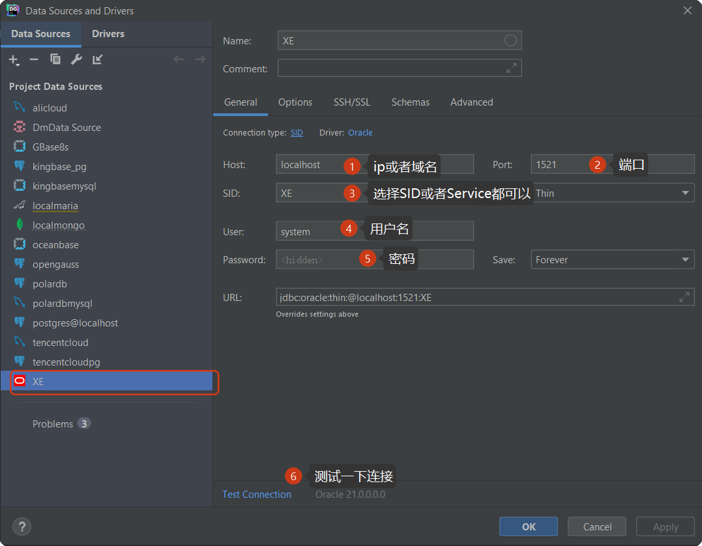

#### 2.4创建用户

> oracle一个用户下面无法创建多个schema，如果不创建用户只能在当前登陆的管理员schema下面创建表，管理员schema下面有很多系统自带的管理表。和自己的表混在一起不是很方便

##### 2.4.1 打开Sql命令行工具，有以下两种方式

+ 通过开始菜单根据根据字母排序进到O里面，展开oracle文件夹即可看到

  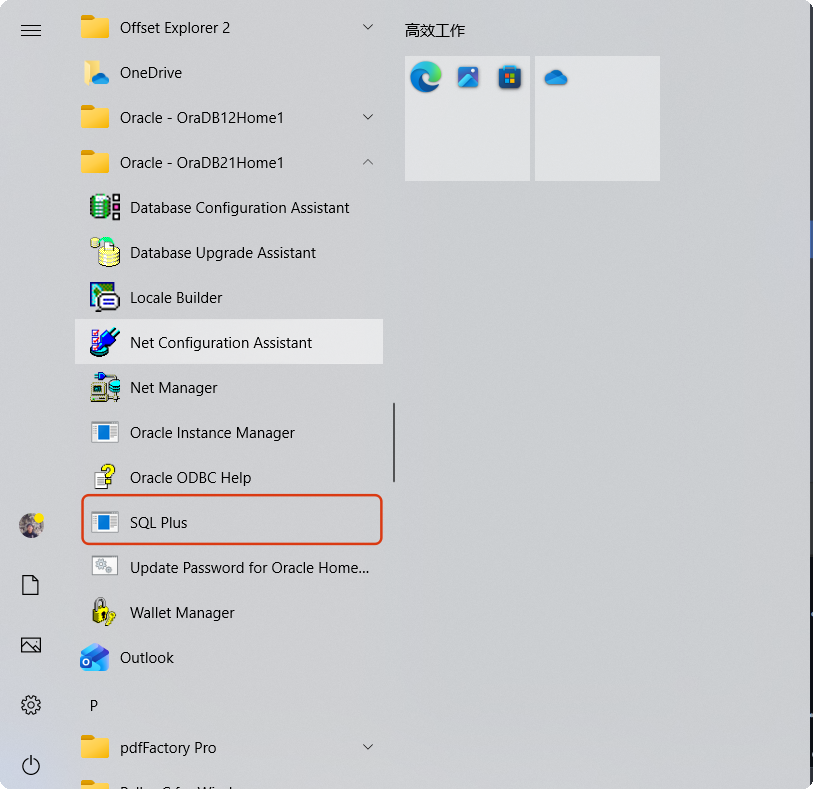
+ 直接通过**windows下方任务栏**搜索**sqlplus**关键字，这样更快

  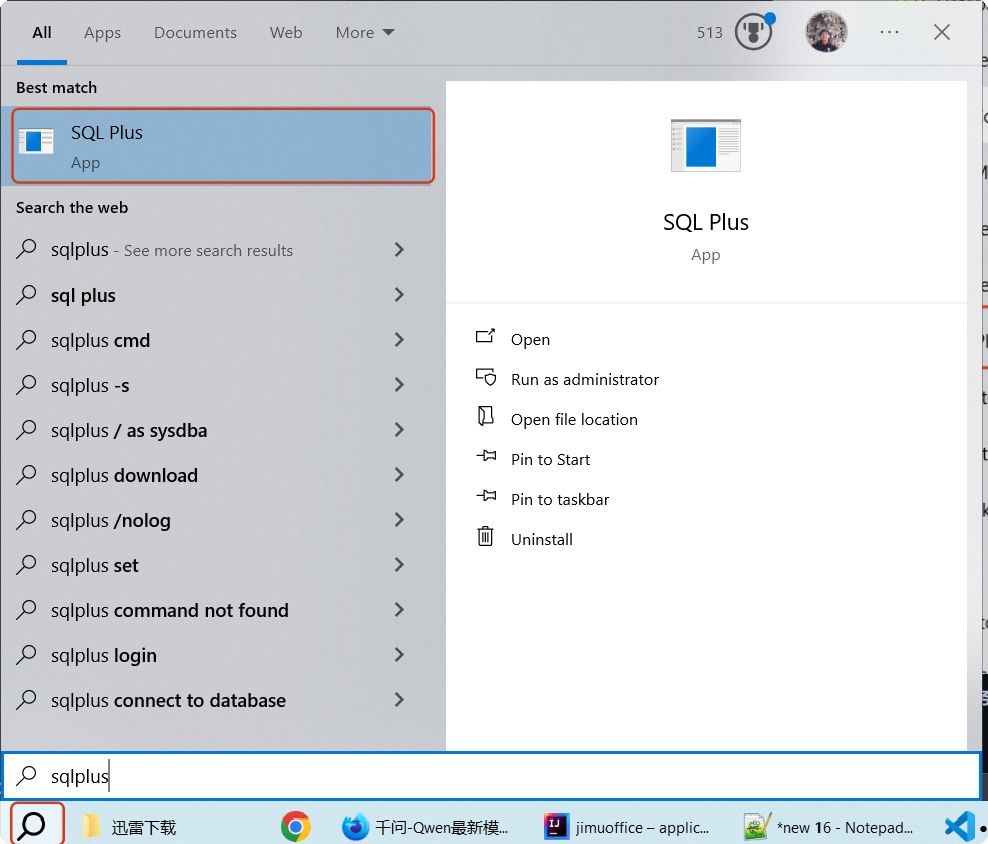

  > 有的用户这里可能不是这样一个放大镜搜索图标，而是一个输入文本框，大同小异。
  >

##### 2.4.2 输入用户名密码登陆sqlplus,和登录linux账户界面大同小异

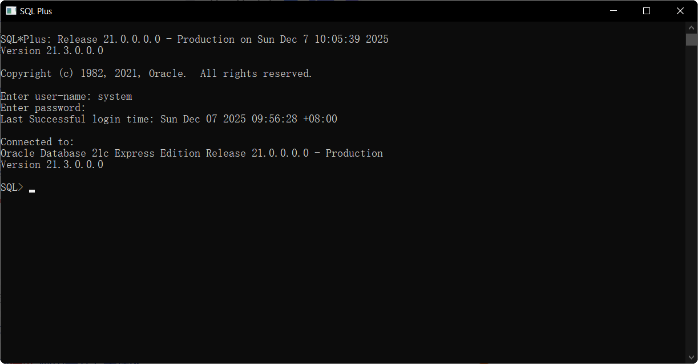

##### 2.4.3 执行创建用户命令创建一个新用户

```bash
CREATE USER C##TEST IDENTIFIED BY tylersmith;
```

执行完以上命令,即成功创建一个名为c##TEST的用户,密码为tylersmith

##### 2.4.4返回datagrip刷新

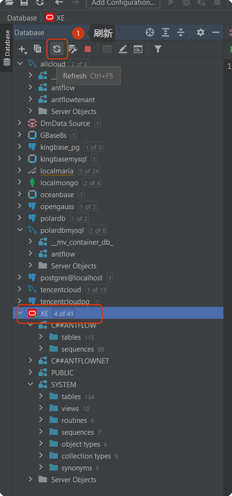

##### 2.4.5 将新建用户的schema显现出来

> 虽然执行了刷新,但是以上用户仍然是不显示的,需要我们手动勾选,然后才能显示出来

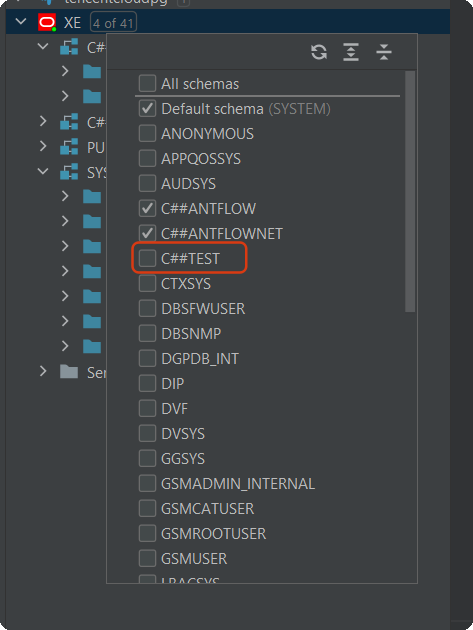

> ⚠注意在datagrip左侧页面板点击有数字的地方(我的是4 of 41)这时候会出现一个小手状图标,点击即可出现如上图示选择面板,勾选以后就能显示出这个schema了

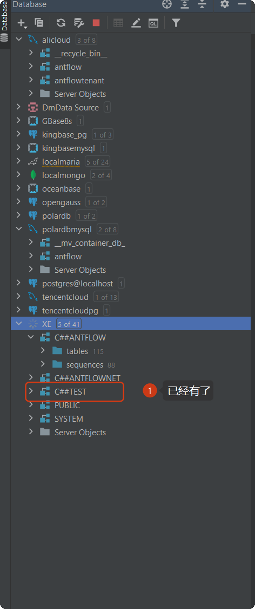

> 如果你是从一开始看的话,可能会有疑问,datagrip创建的连接使用的是system用户,通过以上操作把C##TEST用户也添加进来了,由于system是管理员账户,可以看到其它schema不足为奇,如果想用C##TEST用户登陆是否能登陆呢?答案是否定的,新创建的用户没有任何权限。执行以上命令创建一个用户，oracle只做了两件事 1.在数据字典中创建一个用户账户； 2.自动创建一个与用户名同名的 **Schema（命名空间**

##### 2.4.6 授予用户登录权限

```bash

SQL> CREATE USER C##TEST IDENTIFIED BY tylersmith;

User created.

SQL> GRANT CREATE SESSION TO C##TEST;

Grant succeeded.

SQL>
```

以上授权执行成功以后，就可以用刚创建的C##TEST用户来登陆了

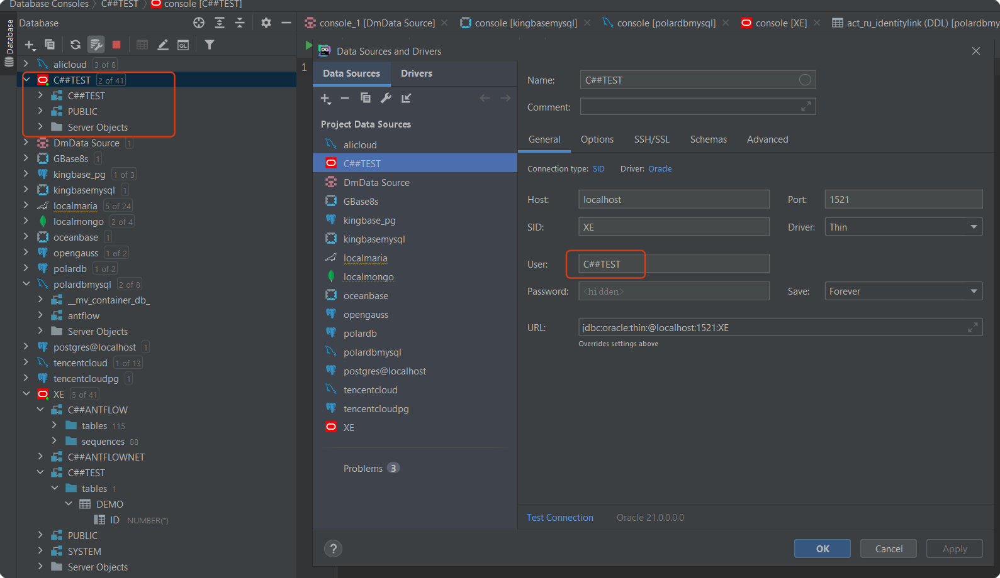

##### 2.4.7 授予用户表空间配额

```bash
ALTER USER C##TEST QUOTA UNLIMITED ON USERS;
```

以上也是是必选的,主要是为了防止配额不足报错,生产环境建议结合服务器资源和dba沟通设置多大配额.

##### 2.4.8 创建表

以上执行完了,终于可以进入到开发阶段,用户可能迫不及待的要创建表来体验一下。可以使用命令或者在datagrip中右击schema，就会出现创建表的选项


如果你使用的是用户C##TEST，到这里又会报错！权限不足，oracle精细的权限管理为安全性提供了保障，同时也会导致上手难度比其它的数据库大很多，尤其是初上手会处处碰壁。（当然实际开发中，以上都是由dba完成的，我们只需要在程序中进行编码）

##### 给用户授以创建表、存储过程、视图和序列的权限

```bash
-- 授予连接权限,这一步是必须要进行的,前面我们已经执行过了
GRANT CREATE SESSION TO C##TEST;
--授予配额，前面也已经执行过了
ALTER USER C##TEST QUOTA UNLIMITED ON USERS;

-- 授予创建核心对象的权限
GRANT CREATE TABLE TO C##TEST;
GRANT CREATE VIEW TO C##TEST;
GRANT CREATE PROCEDURE TO C##TEST;
GRANT CREATE SEQUENCE TO C##TEST;

-- 设置表空间配额（否则无法实际存储数据）
ALTER USER C##TEST QUOTA UNLIMITED ON USERS;
```

> 读者可能有疑问,如果我需要创建触发器,怎么授权呢,实际上oracle不需要单独给创建触发器授权.
>
> 需要授予读/插入/删除记录权限吗.实际上也是不需要的,用户默认是此schema的拥有者,对它拥有的表有读取和变更权限。更为复杂的权限问题还需要用户使用过程中不断的摸索，大家可以相互讨论，也可以咨询dba

> ⚠读者需要注意，以上授予权限是在sqlplus中执行的，也可以在datagrip 管理员连接的session中执行（对于此demo，即前面最早前面用system创建的连接），而不能在当前用户的连接中执行，当前用户没法给自己授权的

##### 2.4.9 快速授权

> 大家可以看到，以上只是简单的授权，其实都挺繁琐的。还不涉及到当前用户去访问其它用户的资源。就更麻烦了。在测试环境中我们有没有快捷的办法给新建的用户授予权限呢？我们可以执行以下命令，完成快速授权

```bash
SQL> GRANT DBA TO C##TEST;

Grant succeeded.

SQL>

```

这样创建完用户以后给它授予dba权限,连接、建表、创建视图存储过程权限都有了。

> ⚠ 以上只是为了方便我们快速流畅的开发，并且我们能拿到管理员账号的前提下。实际上以上操作都是由DBA来完成的，他们创建完用户以后分配给我们我们使用就行了。我们也可以模拟DBA，即所有操作都在SYSTEM连接下操作。C##TEST用户只执行curd操作。和我们生产上的使用习惯是一样的。

##### 2.4.10 创建一个不以C##开头的用户

在前面创建用户的时候我们使用的语句是**CREATE USER C##TEST IDENTIFIED BY tylersmith**,聪明的你可能不会安全按这个语句执行，用户名和密码换成自己喜欢的。但是你可能执行时报错了，类似ORA-65096: **invalid common user or role name**

> 你是否听到过或者网上看到过有人说新版【Oracle 要求默认创建的用户必须以 `C##` 开头？】

实际上这是一个误解，**Oracle** 12C引入了CDB与PDB的新特性，在ORACLE 12C数据库引入的多租用户环境（[Multitenant Environment](https://www.oracle.com/cn/database/multitenant/)中，允许一个数据库容器（CDB）承载多个可插拔数据库（PDB）。CDB全称为Container
 Database，中文翻译为数据库容器，PDB全称为Pluggable Database，即可插拔数据库。在ORACLE
12C之前，实例与数据库是一对一或多对一关系（RAC）：即一个实例只能与一个数据库相关联，数据库可以被多个实例所加载。而实例与数据库不可能是一对多的关系。当进入ORACLE
 12C后，实例与数据库可以是一对多的关系。下面是CDB与PDB的关系图。


一张图看明白Oracle多租户结构（我们使用的是express版，即XE版，因此以其为例，企业版也类似）

Oracle 实例
│
└── CDB (Container Database) ← 整个“多租户数据库”叫 CDB
    │
    ├── CDB$ROOT          ← 根容器（管理全局元数据）
    ├── PDB$SEED          ← 种子 PDB（模板，只读）
    └── XEPDB1            ← 用户 PDB（可读写，你的应用放这里）

回到问题本身。oracle 12c之后有两种用户类型：

| 用户类型                          | 命名规则                                    | 存在于                                    | 用途                  |
| --------------------------------- | ------------------------------------------- | ----------------------------------------- | --------------------- |
| **公用用户（Common User）** | 必须以 `C##`或 `C##_`开头（可配置前缀） | **所有容器（CDB$ROOT + 所有 PDB）** | DBA 管理、跨 PDB 操作 |
| **本地用户（Local User）**  | **任意名字（不能以 `C##`开头）**    | **仅当前 PDB**                      | 应用开发、业务用户    |

当我们在sqlplus或者在datagrip中以servicename为XE连接时，默认是**CDB$ROOT下**，它是“全局管理容器”，在这里创建的用户默认是 **公用用户（Common User），Oracle  **强制要求公用用户的名称必须符合命名规范** （默认以 `C##` 开头），如何知道当前处所的容器环境呢，在sqlplus中使用SHOW CON_NAME来查看。**

> 实际上我们在公用容器空间创建用户是不规范的，（名字看起来也有点扎眼），了解了以上知识以后，我们创建一个在普通用户PDB下的不以C##开头的用户并使用datagrip来连接它

+ 用户system用户登陆sqlplus（登陆方法前面介绍了，这里就不再赘述了），我们执行一下上面介绍的show con_name来验证一下默认登陆的是不是在CDB$ROOT根容器下

```bash
Connected to:
Oracle Database 21c Express Edition Release 21.0.0.0.0 - Production
Version 21.3.0.0.0

SQL> show con_name;

CON_NAME
------------------------------
CDB$ROOT
SQL>

```

+ 执行以下命令把连接切到XEPDB 下

```bash
ALTER SESSION SET CONTAINER = XEPDB1;
```

如果执行成功,会返回session altered,如下:

```bash
SQL> ALTER SESSION SET CONTAINER = XEPDB1;

Session altered.

SQL>

```

+ 执行命令创建用户

```bash
SQL> create user test identified by tylersmith;

User created.

SQL>
```

和前面创建用户命令一下,可以看到,这次用户名前面没有C##开头了,并且创建成功了.

+ 给用户授权,这里我们就快速的给他授予dba权限.当然用户也可以按前面介绍的根据实际需求给他授权.但是至少要有session权限,不然datagrip没法连接

```bash
SQL> grant dba to test;

Grant succeeded.

SQL>
```

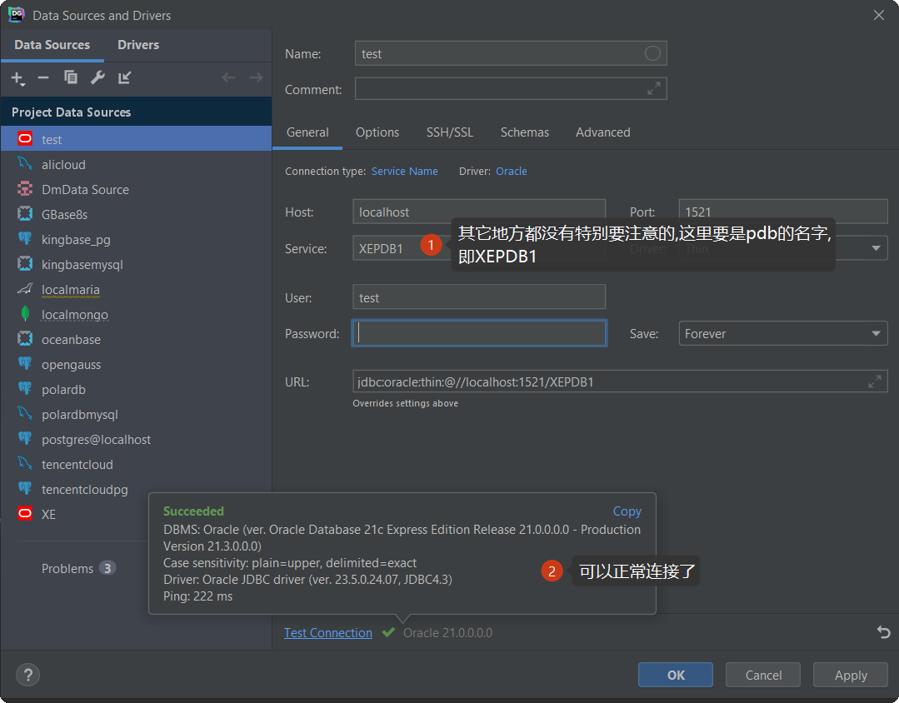

##### 2.4.11 创建一个自定义的pdb

我们如果不想使用XE自带的XEPDB1,也可以自己创建一个,前面介绍了PDB$SEED为模板pdb可以以它为基础创建.有兴趣的朋友可以查看oracle[官方文档](https://docs.oracle.com/en/cloud/paas/base-database/about-pdb/index.html),这里面介绍了如何新建/克隆/删除/启动等操作,并介绍了一些高级管理方法.本文以让用户快速上手为目的,顺带解答用户疑问或者一些常见的误解。高级用户不再本篇介绍范围.

## 二.Antflow中使用Oracle

### 1.初始化数据库

打开下载好的antflow，进到**scripts目录**下的**oracle目录**下，会看到以下脚本：

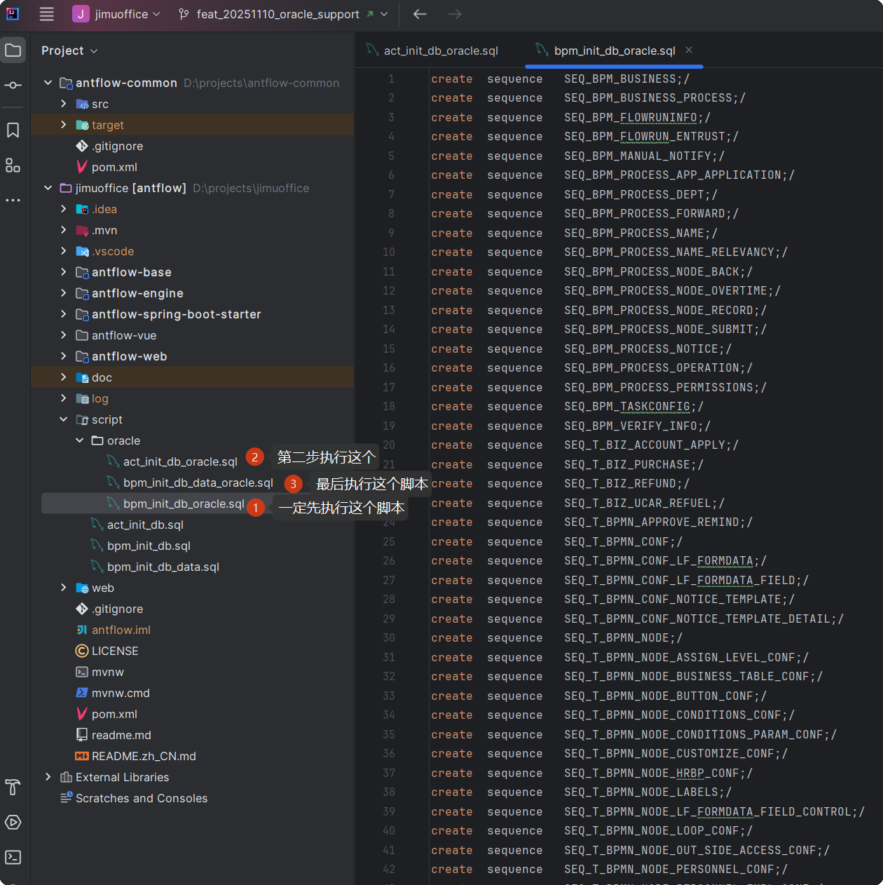

### 2.引入oracle驱动

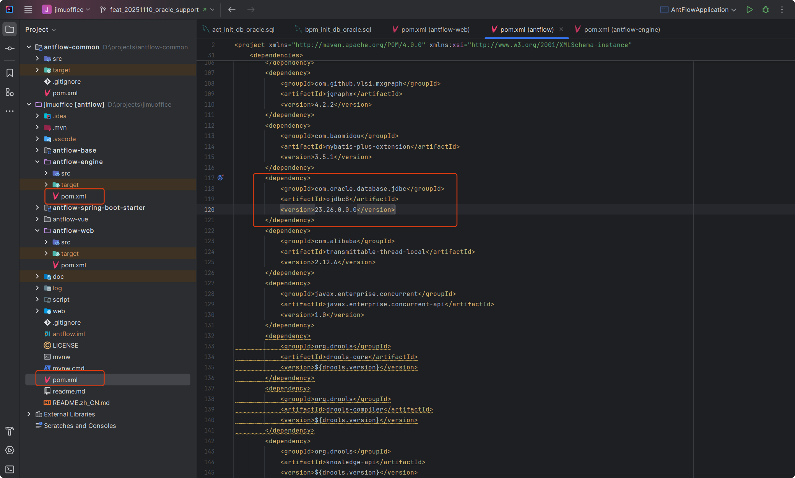

### 3.在application.properties里增加连接配置

```bash
bash
spring.datasource.url=jdbc:oracle:thin:@localhost:1521:XE
spring.datasource.username=C##ANTFLOW
spring.datasource.password=123456
spring.datasource.driver-class-name=oracle.jdbc.OracleDriver
```

## 三.Oracle版费用

Oracle版本不开源，费用暂定为999元，推广阶段仅需要399元，有需要的加QQ 475991994联系或者19921601539微信联系。

antflow目录仅靠社区用捐赠以及ruoyi-mate源码集成有些微薄收入，连基本的官网服务器开支都不够。Antflow会一直坚持流程引擎全部功能免费（日后也不会增加社区版和专业版，就一个版本），同时积极探索其它增加收入模式，还望大佬们支持和理解。
