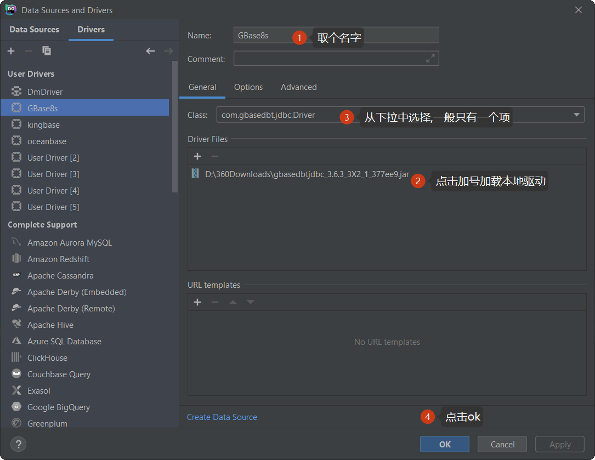
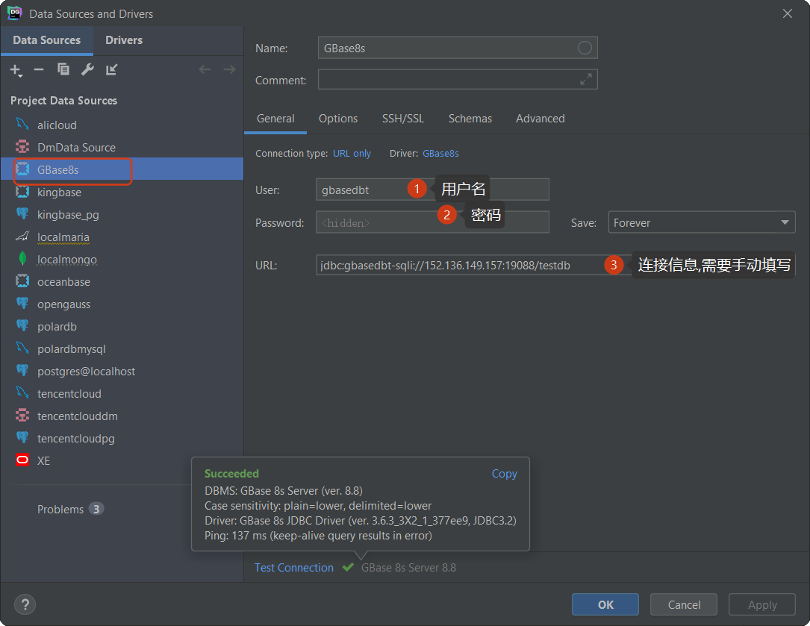
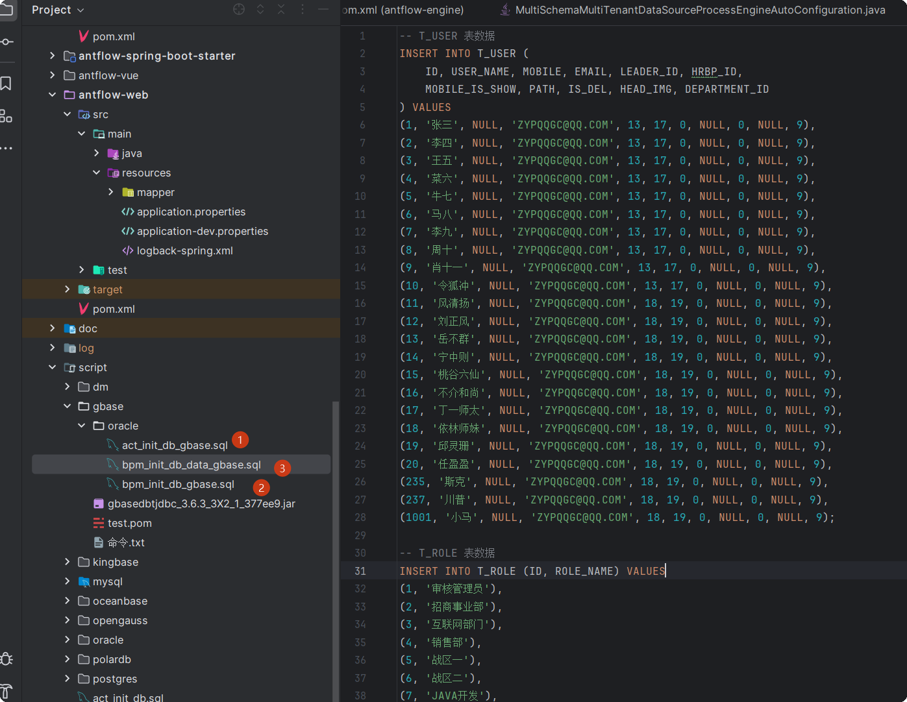

# antflow 南大通用Gbase支持

Gbase是基于一个叫作informix的数据库开发的，它不像达梦或者Kinbase一样，有多种兼容模式。它本身没有，就语法而言和oracle更像一些，支持难度也是比较大的。

## 一、docker安装gbase

### 1.1获取镜像

```
docker pull liaosnet/gbase8s:v8.8_3503x1_x64
```

### 1.2通过docker images查看镜像

```
[root@VM-0-5-centos ~]# docker images
REPOSITORY                              TAG                                 IMAGE ID       CREATED         SIZE
postgres                                latest                              80c0891f5de9   2 weeks ago     456MB
postgres                                14                                  e2764225ca92   4 weeks ago     441MB
polardb/polardb_pg_local_instance       15                                  689b731c1e1c   3 months ago    2.93GB
qiuchenjun/hgdb-see                     4.5.8                               cbacd4dcc337   6 months ago    590MB
qiuchenjun/hgdb-see                     latest                              cbacd4dcc337   6 months ago    590MB
opengauss/opengauss-server              latest                              9763e8b26794   8 months ago    1.68GB
kingbase_v008r006c009b0014_single_x86   v1                                  686e0dfb177e   14 months ago   733MB
kingbase_v8                             v1                                  686e0dfb177e   14 months ago   733MB
gvenzl/oracle-xe                        21-slim                             523f7afc7a05   14 months ago   1.79GB
liaosnet/gbase8s                        v8.8_3503x1_x64                     5a72dffe91e6   20 months ago   624MB
sizx/dm8                                1-2-128-22.08.04-166351-20005-CTM   ccb727ce9dce   3 years ago     432MB

```

### 1.3执行docker run命令启动容器

```
docker run -itd \
  -p 19088:9088 \
  -e GBASE_PASSWORD=GBase123$% \
  --name gbase8s \
  liaosnet/gbase8s:v8.8_3503x1_x64
```

## 1.4通过datagrip连接gbase

### 1.4.1 创建驱动

datagrip默认是不支持gbase的，我们可以通过自定义驱动的方式来使用datagrip连接gbase。

#### 1.4.1 新建驱动

打开datagrip，执行File->NEW->DRIVER,如下图示，创建通用驱动




### 1.4.2创建连接，我们点击左上角加号，选择datasource，会出现一下数据库选择下拉，选择我们刚创建的gbase8s



```
jdbc:gbasedbt-sqli://152.136.149.157:19088/testdb
```

## 二、antflow连接gbase

### 2.1引入gbase驱动

```
<dependency>
    <groupId>com.gbasedbt</groupId>
    <artifactId>jdbc</artifactId>
    <version>3.6.3.33</version>
</dependency>
```

### 2.2修改连接信息

```
spring.datasource.url=jdbc:gbasedbt-sqli://152.136.149.157:19088/testdb
spring.datasource.username=gbasedbt
spring.datasource.password=GBase123$%
spring.datasource.driver-class-name=com.gbasedbt.jdbc.Driver
```

### 2.3执行gbase建表语句

进到antflow项目下的scripts->gbase->oracle目录下,按图中标注顺序执行即可



## 三.Gbase版费用

Gbase版本不开源，费用暂定为3999元，推广阶段仅需要1999元，有需要的加QQ 475991994联系或者19921601539微信联系。

antflow目录仅靠社区用捐赠以及ruoyi-mate源码集成有些微薄收入，连基本的官网服务器开支都不够。Antflow会一直坚持流程引擎全部功能免费（日后也不会增加社区版和专业版，就一个版本），同时积极探索其它增加收入模式，还望大佬们支持和理解。

## 四、资源下载

datagrip连接gbase驱动[百度网盘下载](通过网盘分享的文件：gbasedbtjdbc_3.6.3_3X2_1_377ee9.jar 链接: https://pan.baidu.com/s/1oN5KoYJ5SX-uI4usOm8qxw?pwd=sdq7 提取码: sdq7  --来自百度网盘超级会员v8的分享)
