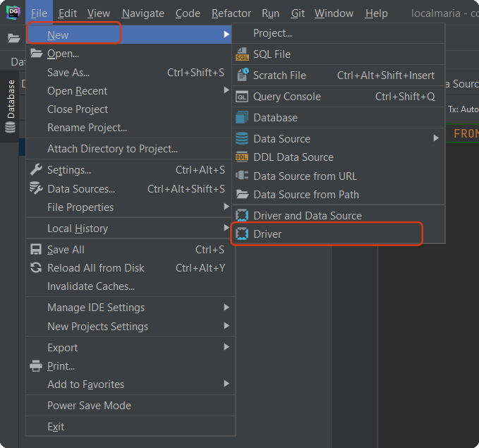
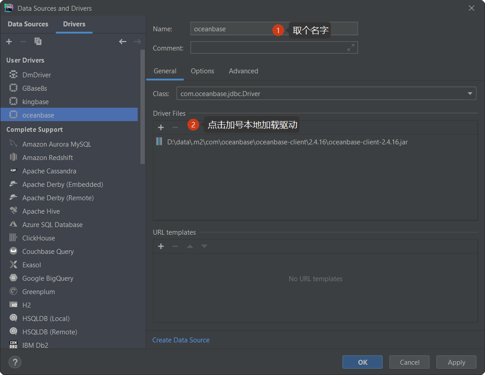
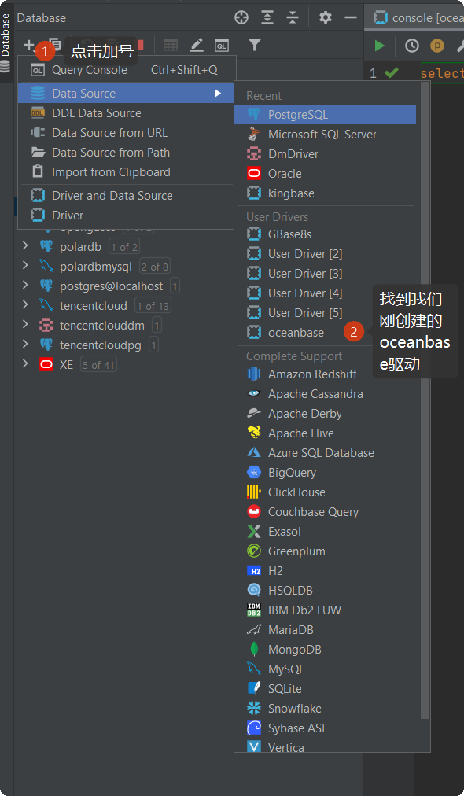
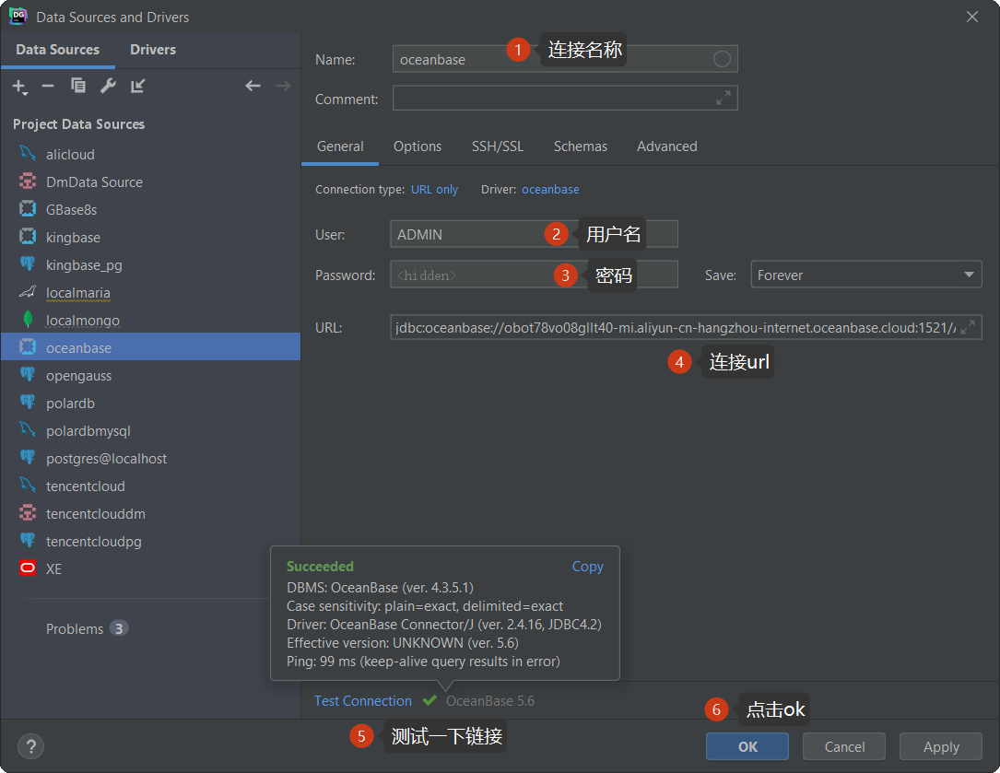
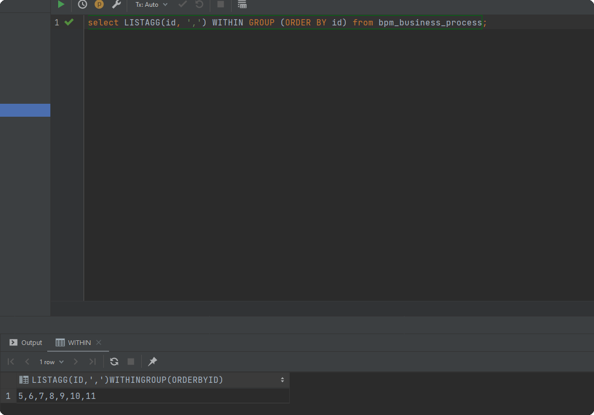
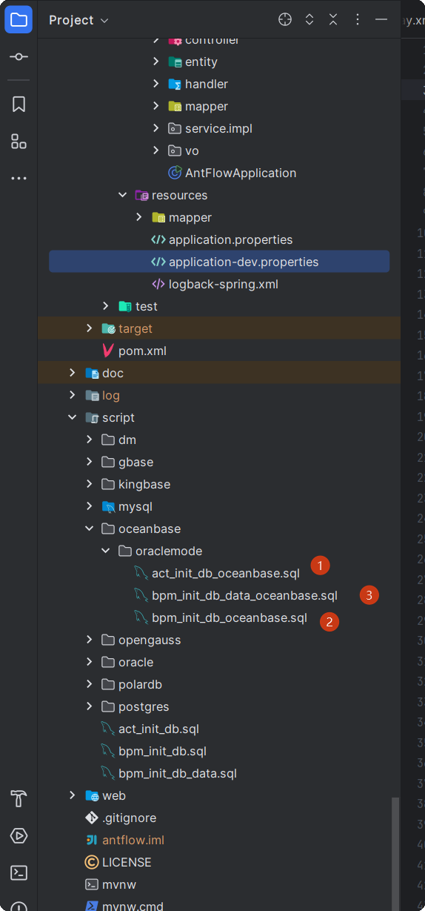

# AntFlow OceanBase oracle模式支持

OceanBase分为企业版和开源版,其中企业版支持Oracle模式,开源版仅支持mysql模式,不支持oracle模式。企业版可以进到OceanBase官网试用半年，这里不再介绍安装了。

## 一、datagrip连接OceanBase

Datagrip本身不直接支持oceanbase，我们可以使用自定义驱动的方式在datagrip里使用oceanbase

### 1.1新建驱动

打开datagrip，执行File->NEW->DRIVER,如下图示，创建通用驱动

> 驱动下载会在文章末尾提供





### 1.2 连接至OceanBase

点击datagrip左上角+加号，会弹出创建数据库连接菜单，从里面选择我们刚刚新建的oceanbase





> 连接urljdbc:oceanbase://obot78vo08gllt40-mi.aliyun-cn-hangzhou-internet.oceanbase.cloud:1521/ADMIN?useUnicode=true&characterEncoding=utf-8&serverTimezone=Asia/Shanghai
>
> 大家基于这个改为自己的域名（或者ip），端口即可

然后就可以使用了



## 二、 antflow连接oceanbase

## 2.1引入oceanbase驱动

```
  <dependency>
            <groupId>com.oceanbase</groupId>
            <artifactId>oceanbase-client</artifactId>
            <version>2.4.16</version>
        </dependency>
```


## 2.2application.properties中添加连接配置

```
spring.datasource.url=jdbc:oceanbase://obot78vo08gllt40-mi.aliyun-cn-hangzhou-internet.oceanbase.cloud:1521/ADMIN?useUnicode=true&characterEncoding=utf-8&useOraclePrepareExecute=true&serverTimezone=Asia/Shanghai
spring.datasource.username=ADMIN
spring.datasource.password=YourPassWord
spring.datasource.driver-class-name=com.oceanbase.jdbc.Driver
```


### 2.3 初始化数据库

进到项目中scripts->oceanbase->oraclemode目录中,按图中顺序执行建表语句sql




## 三.OCeanBase Oracle版费用

OCeanBase Oracle版本不开源，费用暂定为1299元，推广阶段仅需要399元，有需要的加QQ 475991994联系或者19921601539微信联系。

antflow目录仅靠社区用捐赠以及ruoyi-mate源码集成有些微薄收入，连基本的官网服务器开支都不够。Antflow会一直坚持流程引擎全部功能免费（日后也不会增加社区版和专业版，就一个版本），同时积极探索其它增加收入模式，还望大佬们支持和理解。


## 四、oceanbase驱动百度网盘下载

[百度网盘下载链接](通过网盘分享的文件：oceanbase-client-2.4.16.jar 链接: https://pan.baidu.com/s/1SWSkKiDw4g3Zzi-TeEgXfw?pwd=7agb 提取码: 7agb  --来自百度网盘超级会员v8的分享)
