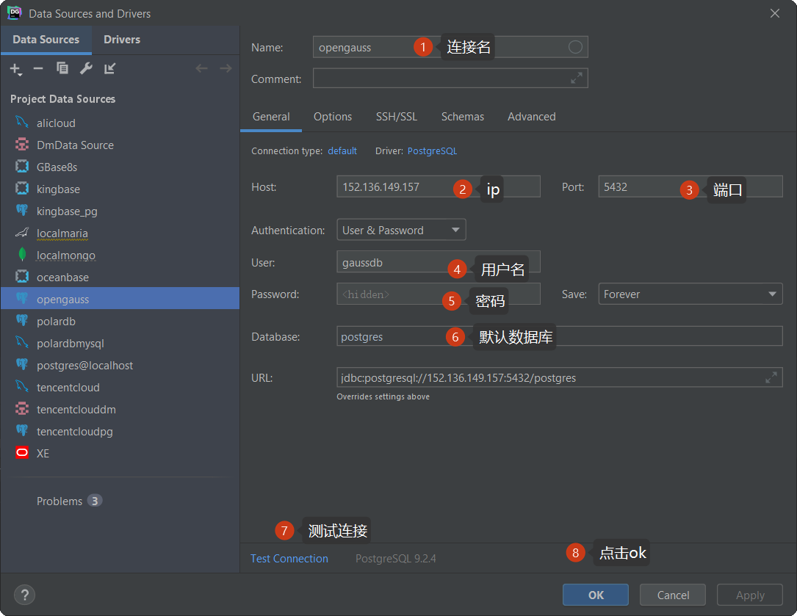
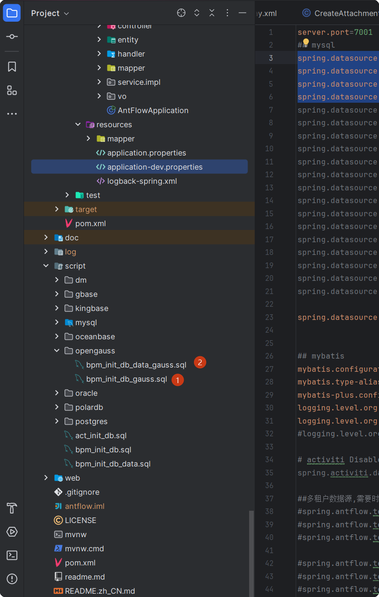

# antflow opengauss支持

## 一、docker安装opengauss

### 1.1镜像拉取

执行以下命令，拉取opengauss最新镜像

```
docker pull opengauss/opengauss-server:latest 
```

### 1.2 使用docker运行opengauss

执行以下命令运行

```
docker run --name opengauss --privileged=true -d \
  -e GS_PASSWORD=YourPass@123 \
  -p 5432:5432 \
  opengauss/opengauss-server
```

参数说明：

```
--name opengauss：为容器命名
    --privileged=true：授予容器特权模式
    -d：后台运行容器
    -p 8888:5432：端口映射（宿主机端口:容器端口）
    -e GS_PASSWORD：设置数据库超级用户omm的密码
```

密码要求

+ 长度至少8个字符
+ 必须包含大写字母、小写字母、数字和特殊字符
+ 支持的特殊字符：#?!@$%^&*-（其中!$&需要转义）

### 1.3 进入容器内操作数据库

```
docker exec -it <CONTAINER_ID> bash


su omm

gsql -d postgres -p 5432

```

### 1.4 从外部以命令行形式连接opengauss

```bash
gsql -d postgres -U gaussdb -W Gaussdb@123 -h 127.0.0.1 -p 8888
```

### 1.5 参数配置

容器内的配置文件路径为：

```
/var/lib/opengauss/data/postgresql.conf

```

### 1.6 常见问题

+ 连接被拒绝：检查端口映射是否正确，防火墙是否开放相应端口
+ 密码不符合要求：确保密码包含大小写字母、数字和特殊字符
+ 容器启动失败：检查日志 docker logs <CONTAINER_ID>

### 1.7 datagrip连接opengauss

datagrip连接opengauss非常方便,可以直接使用pg驱动来连接,即新建连接时选择postgres



## 二、antflow连接opengauss

### 2.1项目引入opengauss驱动

```
 <dependency>
            <groupId>org.opengauss</groupId>
            <artifactId>opengauss-jdbc</artifactId>
            <version>6.0.2</version>
        </dependency>
```

### 2.2 application.properties里增加数据库连接配置

```
spring.datasource.url=jdbc:postgresql://152.136.149.157:5432/postgres?currentSchema=gaussdb&useSSL=false
spring.datasource.username=gaussdb
spring.datasource.password=YourPass@123
spring.datasource.driver-class-name=org.postgresql.Driver
```

### 2.3 初始化数据库

进到项目里面的scripts->opengauss,按下图示顺序执行脚本




## 三.OpenGauss版费用

OpenGauss版本不开源，费用暂定为799元，推广阶段仅需要199元，有需要的加QQ 475991994联系或者19921601539微信联系。

antflow目录仅靠社区用捐赠以及ruoyi-mate源码集成有些微薄收入，连基本的官网服务器开支都不够。Antflow会一直坚持流程引擎全部功能免费（日后也不会增加社区版和专业版，就一个版本），同时积极探索其它增加收入模式，还望大佬们支持和理解。
