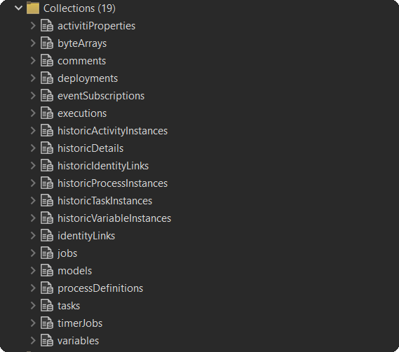
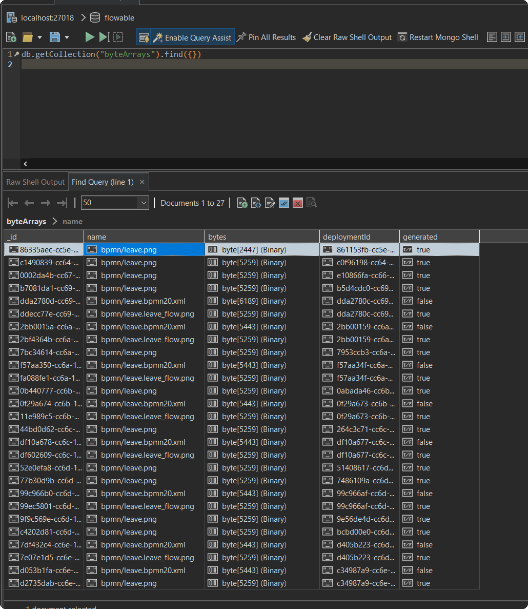
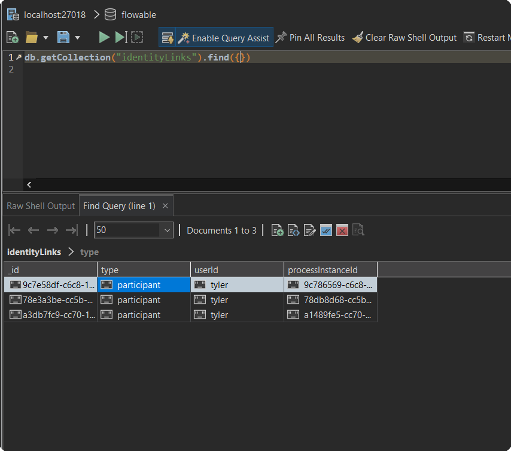
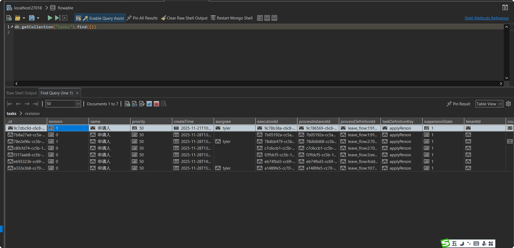

# antflow mongodb支持（实验性）

突破传统关系型数据库极限，antflow mongodb，理论上可无限水平扩展！

当前现状：引擎层已经跑通了，可以使用bpmn文件部署流程，然后发起流程审批。

> antflow基于activiti引擎做了大量定制，上层业务不少地方使用到了表关联，如果改动现有结构会对现有设计结构造成破坏。目前正在思考antflow扩展的部分怎么最小化改动适配mongodb
>
> 当然这些没什么技术上的难度了，难点都在activiti引擎改造适配上，上层改造都是体力活。


一、 windows下安装mongodb

安装方法这里不再介绍了，用户可以到mongodb官网下载即可。我使用的是多年前安装的mongodb 4.4，是支持事务的，antflow引擎也做了相应事务适配，支持@Transactional事务注解，现在开发模式不需要改变


## 1.1 以副本模式启动

```
mongod.exe --port 27018 --bind_ip_all --dbpath "D:\data\mongodata" --replSet rs0
```


> 注意以上命令必须进入到mongodb安装目录的下的bin目录里执行才可以.或者将它的bin目录写入全局变量的path里
>
> mongodb也可以单机模拟cluster模式,mongodb已经流行多年,好多企业在其流行的时候都使用上了.网上有不少的教程资源.


命令行一直是阻塞的不可操作就成功了.


我是使用robo 3t studio连接的,创建的表如下



查询流程bytearray表,有bpmn文件,有png缩略图信息



identity表有数据



task表(对应act_ru_task)表有数据



> 如果仔细看的朋友可能注意到,有些记录的assignee字段是空的,实际上是之前有bug导致的,后面已经解决了。
