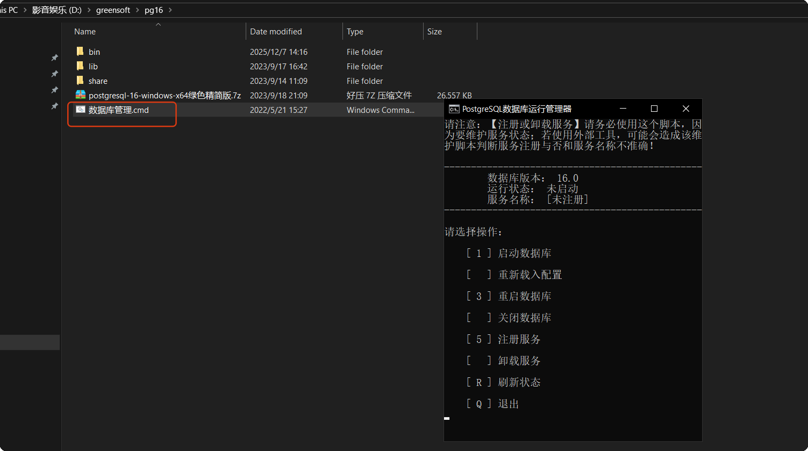
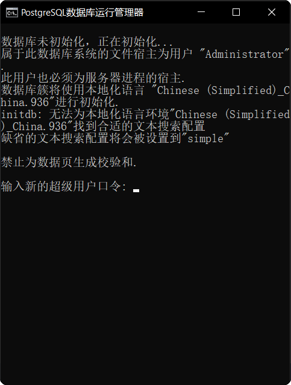
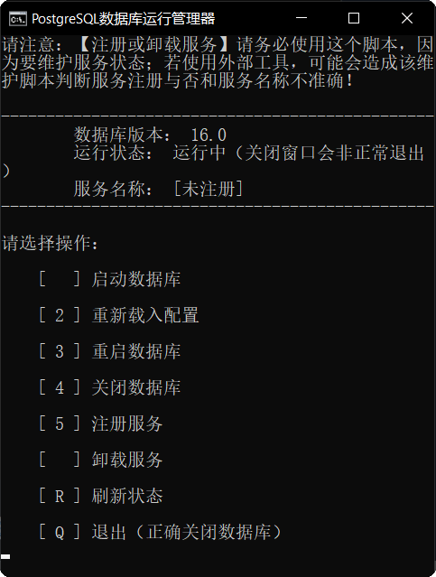
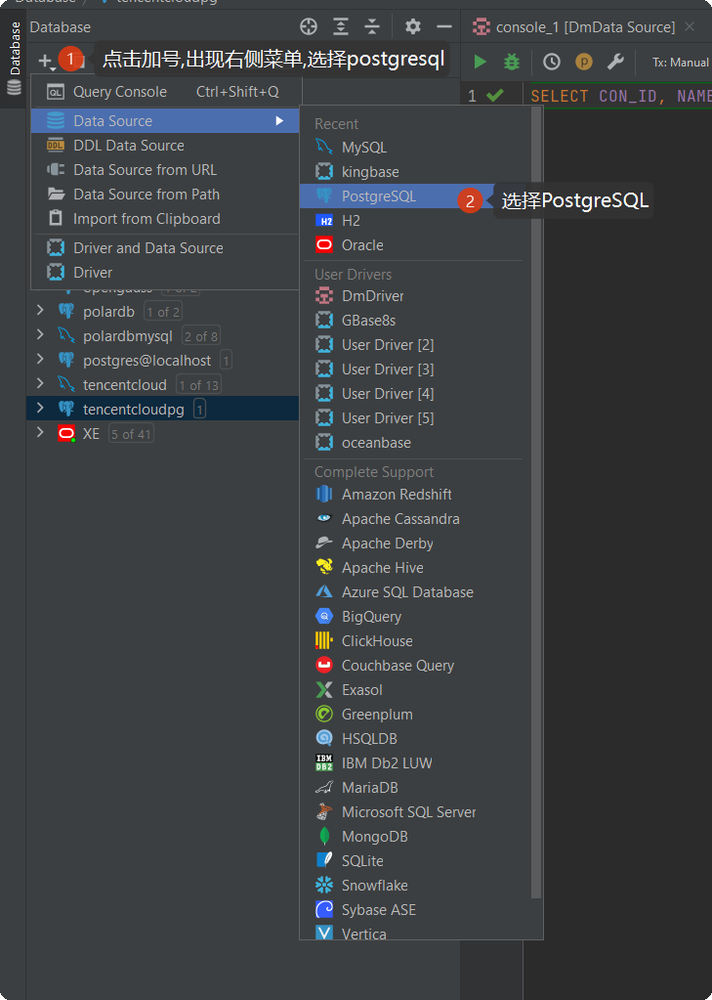
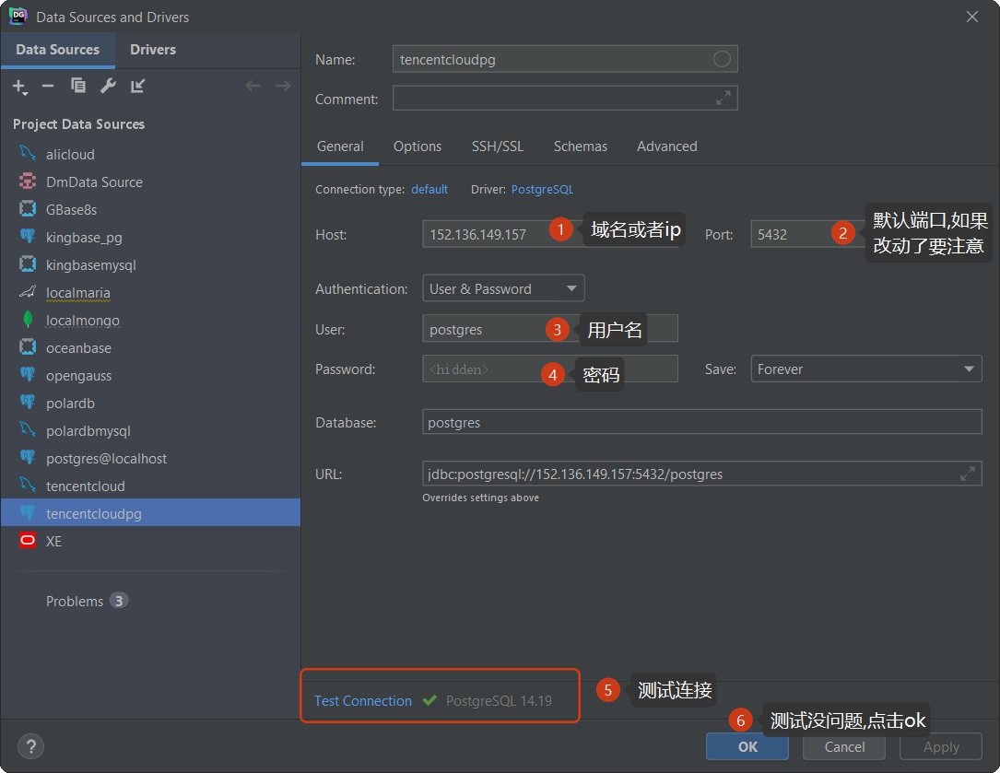
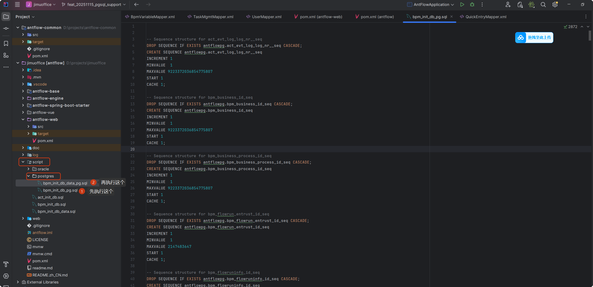
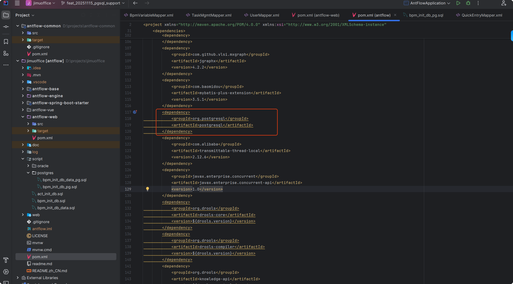

# antflow postgresql支持

## 一、postgresql安装

## 1.1docker安装postgresql

```bash
docker run --name antflow-postgres \
  -e POSTGRES_PASSWORD=Yourpass@123 \
  -p 5432:5432 \
  -v pgdata:/var/lib/postgresql/data \
  -d postgres:14
```

## 1.2 windows安装pg绿色版

有些用户可能没有虚拟机或者云主机,可以在windows上安装pg,pg本身支持windows的.可以通过以下[下载链接](https://www.enterprisedb.com/downloads/postgres-postgresql-downloads)下载windows版,

从链接中的页面还可以下载linux版本和mac版,用户根据自己的实际情况酌情决定下载的版本。

> 有些时候我们只是想在本地测试，如果不想下载官方的完整版，可以使用绿色版，我放在百度网盘里了

[pg16绿色版百度网盘下载链接](通过网盘分享的文件：postgresql-16-windows-x64绿色精简版.7z 链接: https://pan.baidu.com/s/1Mzfg2YCPazWBRnAjgK__Eg?pwd=f1r4 提取码: f1r4  --来自百度网盘超级会员v8的分享)

### 1.2.1 新建一个目录，将下载的压缩包放到新目录下面，名称随便取，我取的是pg16

然后再执行解压，不然会导致文件很乱。解压完以后双击**数据库管理.cmd**,会出现以下cmd窗口



### 1.2.2选择【1】执行数据库初始化。

如果初始化成功，会出现下面界面，让我们输入超级用户指令。我们填写自己想要设置的密码



我们输入指令以后，会让我们再输入一遍，重复上一次操作。如果成功，最终会出现以下界面


根据它的提示，按键盘上的任意键又回到了主界面。这时候不要关掉（最终不用了再关掉）



### 1.2.3以上初始化只让我们输入了超级用户的密码，没有输入用户名，实际上用户名为:postgres


## 1.3使用datagrip连接postgresql(后面简单称pg)






## 二、antflow中使用pg

### 2.1初始化数据库脚本

打开antflow项目，进到scripts目录下的postgres目录下，先执行bpm_init_db_pg.sql，然后再执行bpm_init_db_data_pg.sql即可完成建表语句初始化。




### 2.2项目中引入pg驱动依赖

```bash
  <dependency>
            <groupId>org.postgresql</groupId>
            <artifactId>postgresql</artifactId>
        </dependency>
```




### 2.3 application.properties中加入pg连接配置

```bash
spring.datasource.url=jdbc:postgresql://152.136.149.157:5432/postgres?currentSchema=antflowpg
spring.datasource.username=postgres
spring.datasource.password=123456
spring.datasource.driver-class-name=org.postgresql.Driver
```

完成以上操作,即可启动项目测试。


## 三.PG版费用

PG版本不开源，费用暂定为799元，推广阶段仅需要199元，有需要的加QQ 475991994联系或者19921601539微信联系。

antflow目录仅靠社区用捐赠以及ruoyi-mate源码集成有些微薄收入，连基本的官网服务器开支都不够。Antflow会一直坚持流程引擎全部功能免费（日后也不会增加社区版和专业版，就一个版本），同时积极探索其它增加收入模式，还望大佬们支持和理解。
