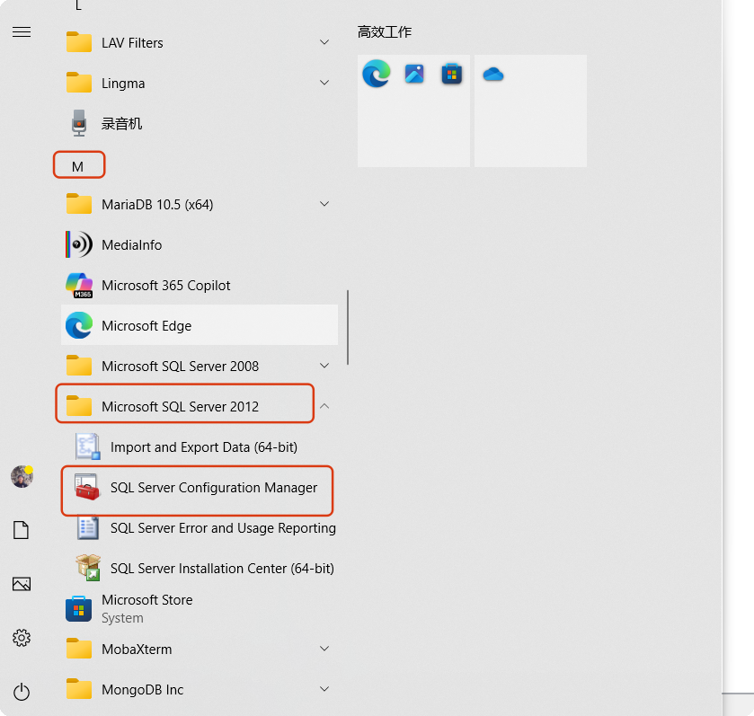
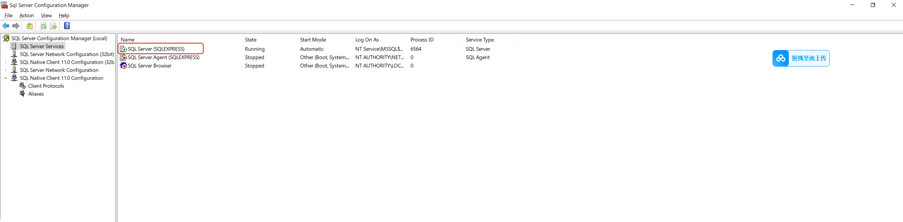
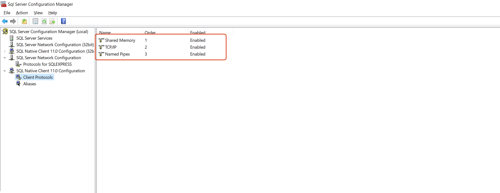
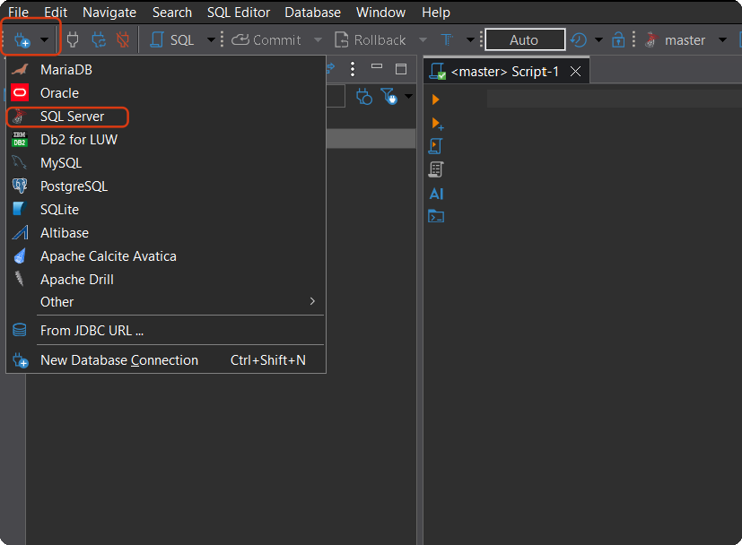
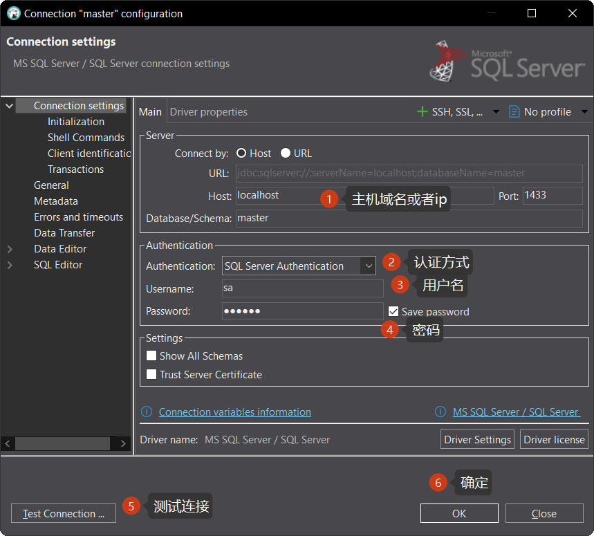
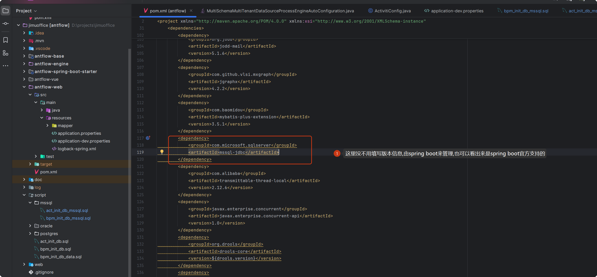

# antflow microsoft sql server支持

## 一、windows 安装sql server express版developer版，网上教程非常多，安装起来除了有点慢，没有别的缺点。

下面介绍一下express版安装以后使用可能会遇到的几个问题（其它版本没有试）

### 1.1无法连接到local


**解决方法：**

在SQLSever配置管理器中。找到“SQL Sever服务”。然后启用“SQL Sever(MSSQLSERVER)





### 1.2 SQL SERVER 安装后无法连接1433端口问题处理

仍然是在sql server configuration manager里面操作，这次切到下面，启动图中的三个服务



*注意：不要启动VIA，否则会导致SQL SERVER 服务无法启动*


### 1.3 使用sql server management studio或者dbeaver连接sql server

> 看了我前面文章的朋友可能会有疑问，你一直使用datagrip，datagrip也是支持sql server的，你这次为什么不用了。实际上是因为我使用的datagrip无法下载sql server驱动
>
> 直连或者使用梯子都不行。由于我的电脑磁盘空间都飘结了，这里也不再下载sqlserver management studio来展示了，使用dbeaver来连接


### 1.4使用dbeaver连接sql server

#### 1.4.1点击左上角+加号，从弹出的菜单中选择sql server



#### 1.4.2  配置连接信息




## 二、antflow中使用sqlserver

### 2.1 打开项目，进到scripts文件夹下面的mssql文件夹下执行文件夹下面的act_init_db_mssql.sql和bpm_init_db_mssql.sql两个脚本，没有执行顺序。


### 2.2 项目引入sql server驱动



### 2.3 在application.properties中添加连接信息

```
spring.datasource.url=jdbc:sqlserver://127.0.0.1:1433;databaseName=antflow;encrypt=false;trustServerCertificate=true;
spring.datasource.username=sa
spring.datasource.password=123456
spring.datasource.driver-class-name=com.microsoft.sqlserver.jdbc.SQLServerDriver
```


## 三.SqlServer版费用

SqlServer版本不开源，费用暂定为5999元，推广阶段仅需要1999元，有需要的加QQ 475991994联系或者19921601539微信联系。

antflow目录仅靠社区用捐赠以及ruoyi-mate源码集成有些微薄收入，连基本的官网服务器开支都不够。Antflow会一直坚持流程引擎全部功能免费（日后也不会增加社区版和专业版，就一个版本），同时积极探索其它增加收入模式，还望大佬们支持和理解。
