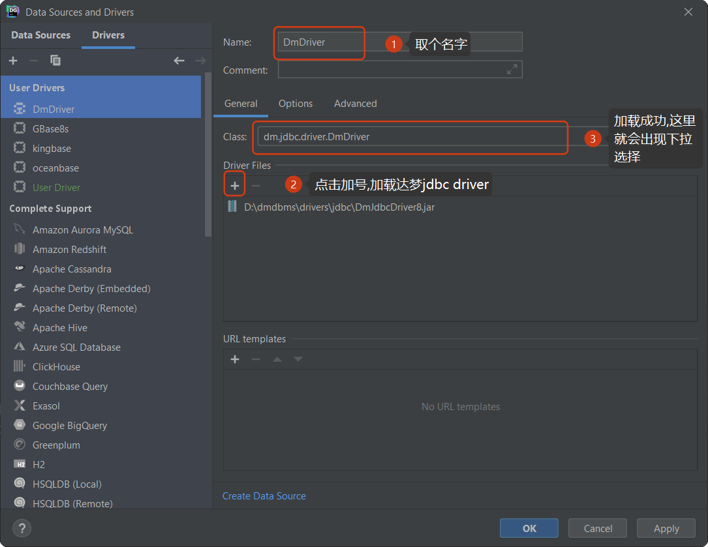
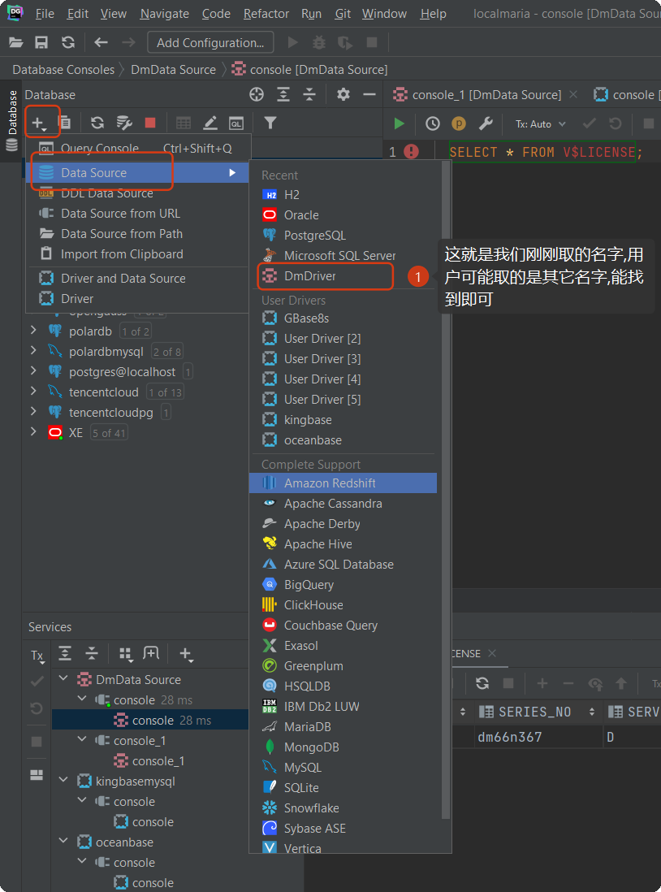
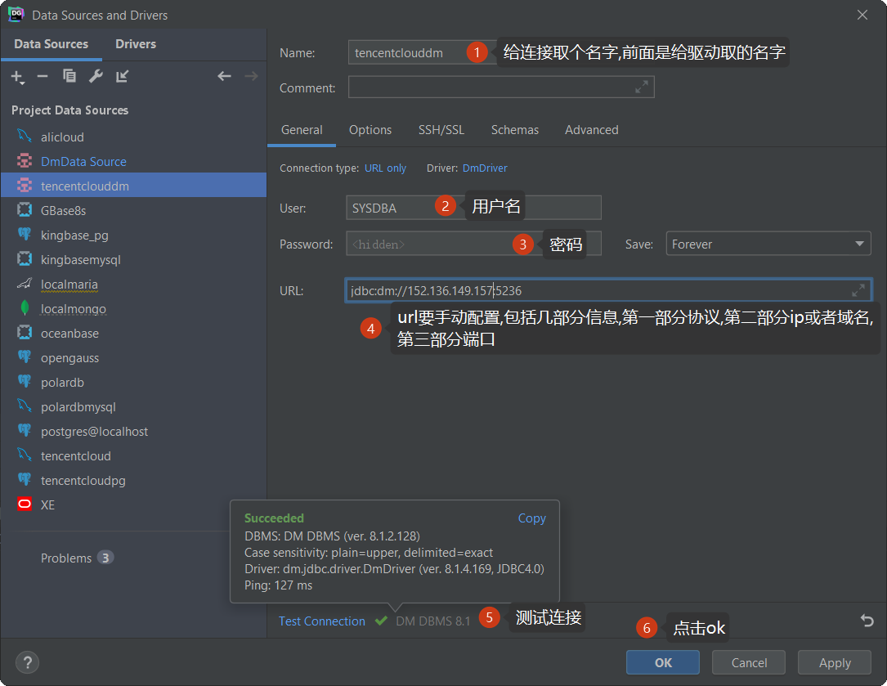
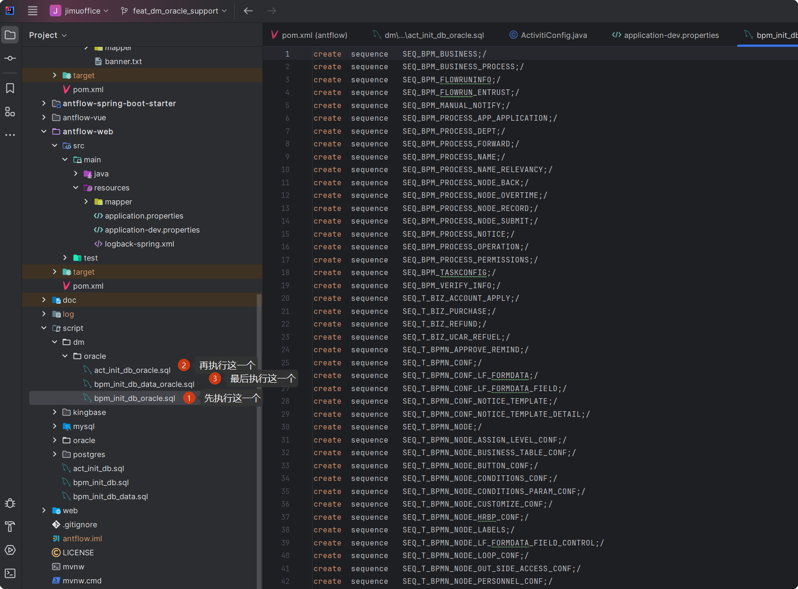

# antflow 达梦DM8支持

## 一、达梦DM数据库安装（后面简称DM）

### 1.1 docker安装达梦

执行以下命令

```bash
docker run -d -p 5236:5236 --name dm8 \
--restart=always --privileged=true \
-e PAGE_SIZE=16 \
-e UNICODE_FLAG=1 \
-e LENGTH_IN_CHAR=1 \
-e CASE_SENSITIVE=0 \
-e SYSDBA_PWD='yourpassword' \
-e LD_LIBRARY_PATH=/opt/dmdbms/bin \
-e INSTANCE_NAME=dm8_instance \
-v /opt/dm8:/opt/dmdbms/data \
sizx/dm8:1-2-128-22.08.04-166351-20005-CTM && docker logs -f dm8
```

> 注意达构官方并未提供docker镜像，以上内容基于互联网。

安装成功会有以下信息：

```bash
[root@VM-0-5-centos ~]# docker run -d -p 5236:5236 --name dm8 \
> --restart=always --privileged=true \
> -e PAGE_SIZE=16 \
> -e UNICODE_FLAG=1 \
> -e LENGTH_IN_CHAR=1 \
> -e CASE_SENSITIVE=0 \
> -e SYSDBA_PWD='123abc!@#' \
> -e LD_LIBRARY_PATH=/opt/dmdbms/bin \
> -e INSTANCE_NAME=dm8_instance \
> -v /opt/dm8:/opt/dmdbms/data \
> sizx/dm8:1-2-128-22.08.04-166351-20005-CTM && docker logs -f dm8
Unable to find image 'sizx/dm8:1-2-128-22.08.04-166351-20005-CTM' locally
1-2-128-22.08.04-166351-20005-CTM: Pulling from sizx/dm8
b234f539f7a1: Pull complete
55172d420b43: Pull complete
5ba5bbeb6b91: Pull complete
43ae2841ad7a: Pull complete
f6c9c6de4190: Pull complete
92fa8068a400: Pull complete
3ac8f2a13f7b: Pull complete
2cffbe6ad608: Pull complete
52a2bee23fed: Pull complete
66c8b5a0ff2f: Pull complete
Digest: sha256:c4088323442747a45d58bd33ef59e657c9b85f9e7dd956ba60b36d04a35b141d
Status: Downloaded newer image for sizx/dm8:1-2-128-22.08.04-166351-20005-CTM
a931267c3a13b48909bd43e797ae22a0adc0e6192bda075d886eb46d8d6ec451
 SELECT * FROM V$LICENSE;
Normal of FAST
Normal of DEFAULT
Normal of RECYCLE
Normal of KEEP
Normal of ROLL

 log file path: /opt/dmdbms/data/DAMENG/DAMENG01.log


 log file path: /opt/dmdbms/data/DAMENG/DAMENG02.log

write to dir [/opt/dmdbms/data/DAMENG].
create dm database success. 2025-12-07 16:40:37
initdb V8
db version: 0x7000c
Init DM success!
Start DmAPService...
Starting DmAPService:                                      [ OK ]
/opt/dmdbms/conf/dm.ini does not exist, use default dm.ini
Start DMSERVER success!
Dmserver is running.
DM Database is not OK, please wait...
DM Database is OK
Finished soft link DM current dm_DMSERVER_202512.log to dm_DMSERVER.log
 * Starting periodic command scheduler cron
   ...done.
2025-12-07 16:40:58.445 [INFO] database P0000000047 T0000000000000000093  total 0 active crash trx, pseg_crash_trx_rollbacksys_only(0) begin ...
2025-12-07 16:40:58.445 [INFO] database P0000000047 T0000000000000000093  pseg_crash_trx_rollback end, total 0 active crash trx, include 0 empty_trxs, 0 empty_pages which only need to delete mgr recs.
2025-12-07 16:40:58.445 [INFO] database P0000000047 T0000000000000000093  pseg_crash_trx_rollback end
2025-12-07 16:40:58.445 [INFO] database P0000000047 T0000000000000000093  hpc_clear_active_trx adjust n_crash_active_trx from 0 to 0.
2025-12-07 16:40:58.445 [INFO] database P0000000047 T0000000000000000047  backup control file /opt/dmdbms/data/DAMENG/dm.ctl to file /opt/dmdbms/data/DAMENG/dm_20251207164058_445388.ctl
2025-12-07 16:40:58.447 [INFO] database P0000000047 T0000000000000000047  backup control file /opt/dmdbms/data/DAMENG/dm.ctl to file /opt/dmdbms/data/DAMENG/ctl_bak/dm_20251207164058_446198.ctl succeed
2025-12-07 16:40:58.447 [INFO] database P0000000047 T0000000000000000047  local instance name is DMSERVER, mode is NORMAL, status is OPEN.
2025-12-07 16:40:58.447 [INFO] database P0000000047 T0000000000000000047  SYSTEM IS READY.
2025-12-07 16:40:58.447 [INFO] database P0000000047 T0000000000000000047  set g_dw_stat from UNDEFINED to NONE success, g_dw_recover_stop is 0
2025-12-07 16:40:59.445 [INFO] database P0000000047 T0000000000000000097  trx4_min_tid_collect set min_active_id_opt, min_active_id: 3643, first_tid: 3006
2025-12-07 16:43:52.466 [INFO] database P0000000047 T0000000000000000130  checkpoint requested, rlog free space[527583744], used space[9278976]
2025-12-07 16:43:52.466 [INFO] database P0000000047 T0000000000000000130  checkpoint generate by ckpt_interval
2025-12-07 16:43:52.466 [INFO] database P0000000047 T0000000000000000086  checkpoint begin, used_space[9278976], free_space[527583744]...
2025-12-07 16:43:52.469 [INFO] database P0000000047 T0000000000000000086  ckpt2_log_adjust: full_status: 160, ptx_reserved: 0
2025-12-07 16:43:52.469 [INFO] database P0000000047 T0000000000000000086  ckpt2_log_adjust: ckpt_lsn(37722), ckpt_fil(0), ckpt_off(9253376), cur_lsn(37836), l_next_seq(4647), g_next_seq(4647), cur_free(9283584), total_space(536862720), used_space(30208), free_space(536832512), n_ep(1)
2025-12-07 16:43:52.469 [INFO] database P0000000047 T0000000000000000086  checkpoint end, 0 pages flushed, used_space[30208], free_space[536832512].
2025-12-07 16:46:52.488 [INFO] database P0000000047 T0000000000000000130  checkpoint requested by CKPT_INTERVAL, rlog free space[536801792], used space[60928]
2025-12-07 16:46:52.488 [INFO] database P0000000047 T0000000000000000130  checkpoint generate by ckpt_interval
2025-12-07 16:46:52.488 [INFO] database P0000000047 T0000000000000000086  checkpoint begin, used_space[60928], free_space[536801792]...
2025-12-07 16:46:52.491 [INFO] database P0000000047 T0000000000000000086  ckpt2_log_adjust: full_status: 160, ptx_reserved: 0
2025-12-07 16:46:52.491 [INFO] database P0000000047 T0000000000000000086  ckpt2_log_adjust: ckpt_lsn(37896), ckpt_fil(0), ckpt_off(9314304), cur_lsn(37896), l_next_seq(4707), g_next_seq(4707), cur_free(9314304), total_space(536862720), used_space(0), free_space(536862720), n_ep(1)
2025-12-07 16:46:52.491 [INFO] database P0000000047 T0000000000000000086  checkpoint end, 0 pages flushed, used_space[0], free_space[536862720].
2025-12-07 16:49:52.510 [INFO] database P0000000047 T0000000000000000130  checkpoint requested by CKPT_INTERVAL, rlog free space[536832512], used space[30208]
2025-12-07 16:49:52.510 [INFO] database P0000000047 T0000000000000000130  checkpoint generate by ckpt_interval
2025-12-07 16:49:52.510 [INFO] database P0000000047 T0000000000000000086  checkpoint begin, used_space[30720], free_space[536832000]...
2025-12-07 16:49:52.512 [INFO] database P0000000047 T0000000000000000086  ckpt2_log_adjust: full_status: 160, ptx_reserved: 0
2025-12-07 16:49:52.512 [INFO] database P0000000047 T0000000000000000086  ckpt2_log_adjust: ckpt_lsn(37956), ckpt_fil(0), ckpt_off(9345024), cur_lsn(37956), l_next_seq(4767), g_next_seq(4767), cur_free(9345024), total_space(536862720), used_space(0), free_space(536862720), n_ep(1)
2025-12-07 16:49:52.512 [INFO] database P0000000047 T0000000000000000086  checkpoint end, 0 pages flushed, used_space[0], free_space[536862720].
2025-12-07 16:52:52.532 [INFO] database P0000000047 T0000000000000000130  checkpoint requested by CKPT_INTERVAL, rlog free space[536832512], used space[30208]
2025-12-07 16:52:52.532 [INFO] database P0000000047 T0000000000000000130  checkpoint generate by ckpt_interval
2025-12-07 16:52:52.532 [INFO] database P0000000047 T0000000000000000086  checkpoint begin, used_space[30720], free_space[536832000]...
2025-12-07 16:52:52.536 [INFO] database P0000000047 T0000000000000000086  ckpt2_log_adjust: full_status: 160, ptx_reserved: 0
2025-12-07 16:52:52.536 [INFO] database P0000000047 T0000000000000000086  ckpt2_log_adjust: ckpt_lsn(38016), ckpt_fil(0), ckpt_off(9375744), cur_lsn(38016), l_next_seq(4827), g_next_seq(4827), cur_free(9375744), total_space(536862720), used_space(0), free_space(536862720), n_ep(1)
2025-12-07 16:52:52.536 [INFO] database P0000000047 T0000000000000000086  checkpoint end, 0 pages flushed, used_space[0], free_space[536862720].
2025-12-07 16:55:52.554 [INFO] database P0000000047 T0000000000000000130  checkpoint requested by CKPT_INTERVAL, rlog free space[536832000], used space[30720]
2025-12-07 16:55:52.554 [INFO] database P0000000047 T0000000000000000130  checkpoint generate by ckpt_interval
2025-12-07 16:55:52.554 [INFO] database P0000000047 T0000000000000000086  checkpoint begin, used_space[30720], free_space[536832000]...
2025-12-07 16:55:52.556 [INFO] database P0000000047 T0000000000000000086  ckpt2_log_adjust: full_status: 160, ptx_reserved: 0
2025-12-07 16:55:52.556 [INFO] database P0000000047 T0000000000000000086  ckpt2_log_adjust: ckpt_lsn(38076), ckpt_fil(0), ckpt_off(9406464), cur_lsn(38076), l_next_seq(4887), g_next_seq(4887), cur_free(9406464), total_space(536862720), used_space(0), free_space(536862720), n_ep(1)
2025-12-07 16:55:52.556 [INFO] database P0000000047 T0000000000000000086  checkpoint end, 0 pages flushed, used_space[0], free_space[536862720].
2025-12-07 16:58:52.576 [INFO] database P0000000047 T0000000000000000130  checkpoint requested by CKPT_INTERVAL, rlog free space[536832000], used space[30720]
2025-12-07 16:58:52.576 [INFO] database P0000000047 T0000000000000000130  checkpoint generate by ckpt_interval
2025-12-07 16:58:52.576 [INFO] database P0000000047 T0000000000000000086  checkpoint begin, used_space[30720], free_space[536832000]...
2025-12-07 16:58:52.581 [INFO] database P0000000047 T0000000000000000086  ckpt2_log_adjust: full_status: 160, ptx_reserved: 0
2025-12-07 16:58:52.581 [INFO] database P0000000047 T0000000000000000086  ckpt2_log_adjust: ckpt_lsn(38136), ckpt_fil(0), ckpt_off(9437184), cur_lsn(38136), l_next_seq(4947), g_next_seq(4947), cur_free(9437184), total_space(536862720), used_space(0), free_space(536862720), n_ep(1)
2025-12-07 16:58:52.581 [INFO] database P0000000047 T0000000000000000086  checkpoint end, 0 pages flushed, used_space[0], free_space[536862720].

```

关键信息:DM Database is OK

### 1.3 datagrip连接达梦

⚠默认情况下，datagrip是不支持达梦的（包括其它国产数据库），但是可以通过自定义扩展驱动来使用datagrip连接达梦

#### 1.3.1 新建驱动

打开datagrip，执行File->NEW->DRIVER,如下图示，创建通用驱动


> 这个命令有多个入口，也可以从File->Data Source...中进入



> 有读者可能会问DmJdbcDriver8.jar在哪里？能否提供给我一份？不要着急，文章末尾会附上下载链接。

执行完以上,我们点击下方的[ok]按钮保存.

### 1.3.2 新建达梦数据库连接



### 1.3.3配置连接信息



```bash
jdbc:dm://127.0.0.1:5236
```

修改以上连接字符串中的ip和端口(一般端口不要轻易改动)即可.

### 1.3.4 授权时间是多久

大家都知道,达梦并不是开源免费软件,是一款商业软件.以上docker的授权时间为14天,

> 如果你观察,可以看到它的输出内容里包含了授权的时间。如果使用windows版，则授权时间为半年（下面章节会讲到windows安装并附近上笔者用的window镜像）

也可以通过以下sql来查询授权时间

```bash
 SELECT * FROM V$LICENSE;
```

sql结果中有一列EXPIRED_DATE即为授权过期时间。

## 1.4 达梦兼容模式介绍

如果你已经在使用或者准备使用达梦了，你可能对它多少有一些了解，知道达梦能兼容多种主流数据库，如oracle，mysql，pg等。下面对达梦的兼容性做一些简要的说明

### 1.4.1达梦数据库兼容模式对照表

| 模式值      | 兼容数据库           | 模式名称                       | 主要兼容特性说明                                                                                                                                                                                                                                                      |
| ----------- | -------------------- | ------------------------------ | --------------------------------------------------------------------------------------------------------------------------------------------------------------------------------------------------------------------------------------------------------------------- |
| **0** | —                   | **无兼容 / DM 原生模式** | - 默认模式 ``- 严格遵循达梦自身语法和行为``- 标识符区分大小写 ``- 使用 `VARCHAR`、`INT`等 DM 类型``- 系统视图如 `USER_TABLES`                                                                                                                                       |
| **1** | SQL-92               | **SQL92 标准模式**       | - 遵循 ANSI SQL-92 标准 ``- 适用于需要标准 SQL 兼容性的通用场景``- 较少使用，主要用于规范性要求高的系统                                                                                                                                                               |
| **2** | **Oracle**     | **Oracle 兼容模式**      | - ✅**最常用的企业迁移模式** ``- 标识符**不区分大小写**``- 支持 `VARCHAR2`、`NUMBER`、`DATE`等 Oracle 类型 ``- 提供 `DUAL`表``- 兼容 `ROWNUM`、`NVL()`、`TO_CHAR()`等函数``- 系统视图如 `ALL_TABLES`,`USER_TAB_COLUMNS`- 适合从 Oracle 迁移应用 |
| **3** | Microsoft SQL Server | **MSSQL 兼容模式**       | - 支持 `TOP N`语法（如 `SELECT TOP 10 * FROM T`）``- 兼容部分 T-SQL 函数``- 标识符处理接近 SQL Server``- 适用于从 SQL Server 迁移的场景                                                                                                                           |
| **4** | MySQL                | **MySQL 兼容模式**       | - 支持反引号```包裹标识符（如 `SELECT `name `FROM`user ``）``- 兼容部分 MySQL 函数（如 `IF()`,`CONCAT()`）``- 自动递增列行为类似 MySQL``- 适用于轻量级 Web 应用从 MySQL 迁移                                                                                  |
| **5** | DM6                  | **达梦 6 兼容模式**      | - 用于兼容旧版达梦 6 的行为 ``- 主要用于老系统升级到 DM8 后保持兼容``- 普通用户一般不需要使用                                                                                                                                                                         |
| **6** | Teradata             | **Teradata 兼容模式**    | - 支持 Teradata 特有语法（如 `QUALIFY`,`RANK()`窗口函数用法）``- 适用于数据仓库场景从 Teradata 迁移``- 使用较少                                                                                                                                                   |
| **7** | PostgreSQL           | **PostgreSQL 兼容模式**  | - 支持 `$$`字符串、`SERIAL`类型等 PG 特性 ``- 兼容部分 PG 函数和元数据查询方式``- 适用于从 PostgreSQL 迁移的开源项目                                                                                                                                              |

### ⚠️ 重要注意事项

1. **设置时机** ：

   `COMPATIBLE_MODE`  **只能在初始化数据库时通过 `dminit` 指定** ，例如：

```bash
dminit PATH=/dm8/data MODE=2  # Oracle 模式
```

初始化后，该值会写入 `dm.ini` 文件：

```bash
COMPATIBLE_MODE = 2
```

## 1.5验证并修改兼容模式

看到上面内容以后,用户可能会有疑问,那么我安装的是什么模式呢?直接说答案,前面表格里也有介绍,安装以后默认值为0,即无兼容模式。即达梦自己的模式.

我们可以通过以下sql根据返回的值来确定当前的兼容模式

```bash
SELECT NAME, VALUE FROM V$PARAMETER WHERE NAME = 'COMPATIBLE_MODE';
```


用户在连接到数据库以后，可以执行一下以上sql，可以发现值为0，即为无兼容模式。我们需要修改配置将兼容模式改为oracle

> 以上docker镜像启动时无法指定兼容模式，笔者试了使用-e COMPATIBLE_MODE=1或者-e MODE=1均无法修改兼容模式。下面我们就介绍如何进到容器里面手动修改兼容模式。

### 1.5.1 进入容器中交互式执行命令界面。

我们执行docker ps命令，查找我们刚启动的容器信息

结果如下:

```bash
[root@VM-0-5-centos ~]# docker ps
CONTAINER ID   IMAGE                                        COMMAND                  CREATED          STATUS          PORTS                                       NAMES
6af460abd185   sizx/dm8:1-2-128-22.08.04-166351-20005-CTM   "/bin/bash /opt/star…"   40 minutes ago   Up 24 minutes   0.0.0.0:5236->5236/tcp, :::5236->5236/tcp   dm8-oracle

```

我们执行以下命令即进入容器内部终端:

```bash
[root@VM-0-5-centos ~]# docker exec -it dm8-oracle bash
root@6af460abd185:/#

```

> -it 后面的dm8-oracle即为容器的名字(我们最终启动的名字叫dm8,后来为了验证通过指定参数来启动oracle兼容模式,没有成功,我新启的容器的名子叫作dm8-oracle,和最早的是不一样的。用户跟着做需要注意
>
> 此外，用户还可以将名字更换为容器的Id（即最新面那一列），容器id不必输出全部，只需要输入开头几位，只要不重复能惟一识别即可。和git有点像。

前面我们介绍过，兼容模式配置的值最终写在了dm.ini里面。镜像并不是我们自己打的，我们如何知道它在哪里呢？其实我也不知道，但是我知道这个文件的名字，可以使用linux find命令来搜索一下

```bash
find / -name dm.ini 2>/dev/null
```

得到的搜索结果如下:

```bash
root@6af460abd185:/# find / -name dm.ini 2>/dev/null
/opt/dmdbms/data/DAMENG/dm.ini
root@6af460abd185:/#


```

这我们就知道了它的位置了。我们使用vi来编辑它，将COMPATIBLE_MODE值改为2，即oracle兼容模式。

修改以后我们查看一下，看看值是否已经改掉了。


```bash
root@6af460abd185:/opt/dmdbms/data/DAMENG# cat dm.ini|grep "COMPATIBLE_MODE"
                COMPATIBLE_MODE                 = 2               #Server compatible mode, 0:none, 1:SQL92, 2:Oracle, 3:MS SQL Server, 4:MySQL, 5:DM6, 6:Teradata
                CASE_COMPATIBLE_MODE            = 1               #Case compatible mode, 0:none, 1:Oracle, 2:Oracle(new rule)
                XA_COMPATIBLE_MODE              = 0               #XA compatible mode, 0:none, 1:Oracle

```

> 注意,路径一定不能打错了,如果打错了vi就会新建一个一文件,里面什么都没有,这样就没法修改了。

### 1.5.2 执行exit退出容器交互执行命令。并执行docker restart dm8-oracle 重启容器。

### 1.5.3 重新执行SELECT NAME, VALUE FROM V$PARAMETER WHERE NAME = 'COMPATIBLE_MODE';查看兼容模式是否已经改了


得到结果如下：


| NAME             | VALUE |
| :--------------- | :---- |
| COMPATIBLE\_MODE | 2     |

可以看到，现在已经是oracle兼模式了。


### 1.6 windows安装达梦。

根据官方论坛介绍，windows安装至少需要有2g可用内存

#### 1.6.1 [官方下载地址](https://eco.dameng.com/download/)


可以看到下载分为X86平台和信创平台。X86平台支持windows，rhel，ubuntu，centos等。信创平台支持鲲鹏、龙心、鲲鹏、海光等。用户可以根据自己实际情况下载安装。

#### 1.6.2 windows平台下安装

windows平台下安装相对较为容易，只要图形化界面点击就可以了。也可以参照以下[文章](https://eco.dameng.com/community/post/20251021174709JF82PA19EIU2ESBNCI)来进行安装。

需要注意的是我们是用来支持antflow的，因此不需要安装它的测试数据库。可以用antflow库来进行测试。

#### 1.6.3 windows下修改兼容模式。

进到安装目录的data\DAMENG目录下，即可**dm.ini**我们可以使用文本编辑工具来编辑它。编辑完以后保存。这时候是不生效的，用户可以通过sql来查询。需要我们重启windows服务来使其生效。

#### 1.6.4 重启DmServiceDMSERVER服务。

我们打开windows服务，找到DmServiceDMSERVER服务，然后右键“restart”，重启以后我们再执行前面讲过的sql语句，即可看到模式相应更改为我们编辑后的模式。


## 二、antfow连接达梦数据库

### 2.1 引入达梦驱动

```bash
 <dependency>
            <groupId>com.dameng</groupId>
            <artifactId>DmJdbcDriver18</artifactId>
            <version>8.1.3.140</version>
        </dependency>
```

> 这个驱动支持java8及以后的版本,如果使用的是java8也可以使用DmJdbcDriver8这个驱动.

> 需要说明的是网上有有些教程介绍说要从官网下载driver,当然是可以上,上面的下载达梦数据库地址往下拉就有java驱动下载.但是达梦官方已经把驱动传到maven中央仓库了,可以直接通过坐标引入


### 2.2更改数据库连接字配置

找到application.properties文件，进行更改，更改后内容如下：

```bash
spring.datasource.url=jdbc:dm://127.0.0.1:5236?compatibleMode=oracle&schema=ANTFLOW
spring.datasource.username=SYSDBA
spring.datasource.password=Dsb0004699
spring.datasource.driver-class-name=dm.jdbc.driver.DmDriver
```

### 2.3 初始化建表.

进到antflow项目下的scripts目录下的dm目录下的oracle目录,按下图中顺序执行



执行完以上以后,启动项目


## 三.达梦Oracle兼容版费用

达梦Oracle版本不开源，费用暂定为2999元，推广阶段仅需要999元，有需要的加QQ 475991994联系或者19921601539微信联系。

> 需要注意的是,前面介绍过,达梦与主流数据库的兼容模式并不是完全兼容。如果用户购买的是oracle版不提供达梦oracle兼容模式支持。（当然可以群里沟通，群里问题我看到也会第一时间回复）

antflow目录仅靠社区用捐赠以及ruoyi-mate源码集成有些微薄收入，连基本的官网服务器开支都不够。Antflow会一直坚持流程引擎全部功能免费（日后也不会增加社区版和专业版，就一个版本），同时积极探索其它增加收入模式，还望大佬们支持和理解。
