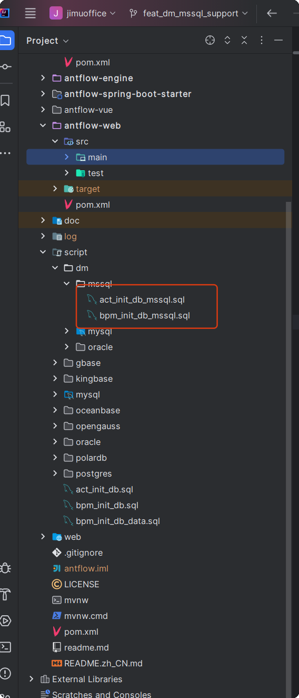

# antflow SqlServer模式支持

# antfow 达梦SqlServer模式支持

# antflow 达梦SqlServer模式兼容支持

不少用户会以为达梦对应主流数据库支持模式和对应的数据库是一样的，实际上并不是，差异还是不少的。第4部分oracle模式支持里有简单介绍。具体差异的细节还要以达梦官方信息为准。

关于达梦的安装以及如何修改为指定主流数据库的支持模式，可 以查看前面一章oracle模式支持里面的介绍。非常详细。按照兼容模式对照表修改即可。

应用程序上，只需要修改兼容模式以及建表语句，驱动本身并不需要改变。

## 一、antflow 达梦SqlServer模式建表

进到scripts->dm->mssql目录下，执行里面的两个sql脚本即可，没有顺序

## SqlServer模式费用

达梦SqlServer模式版本不开源，费用暂定为7999元，推广阶段仅需要5999元，有需要的加QQ 475991994联系或者19921601539微信联系。

antflow目录仅靠社区用捐赠以及ruoyi-mate源码集成有些微薄收入，连基本的官网服务器开支都不够。Antflow会一直坚持流程引擎全部功能免费（日后也不会增加社区版和专业版，就一个版本），同时积极探索其它增加收入模式，还望大佬们支持和理解。
