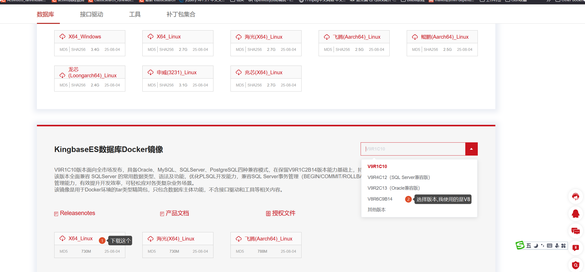
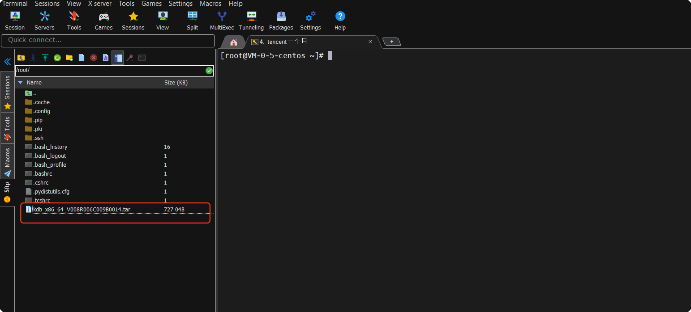
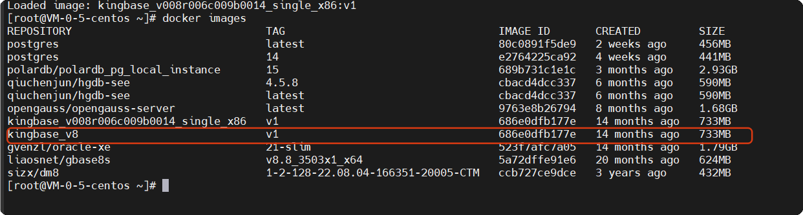
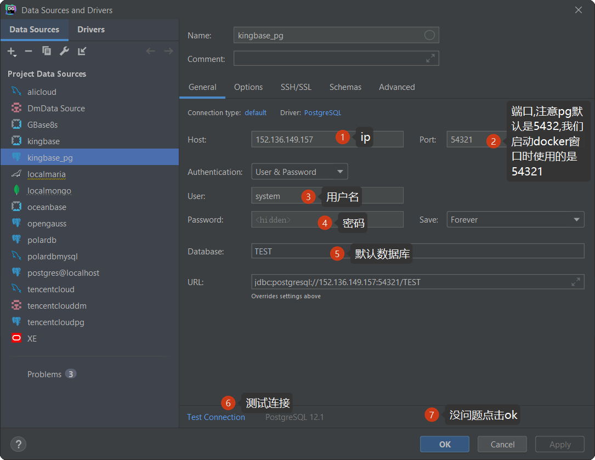
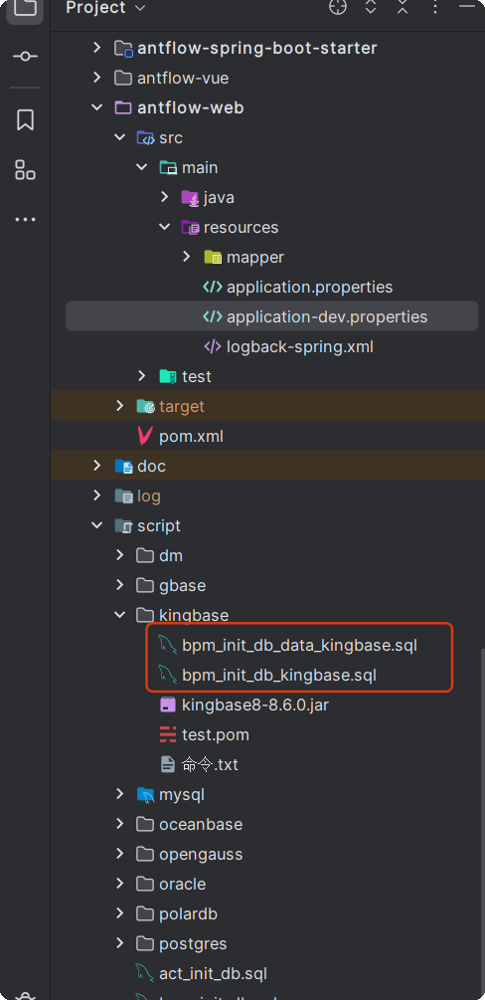

# antflow kingbase oracle模式

KingBase虽然是基于PG开发的，但是支持Oracle模式，方便Oracle用户迁移到KingBase


这是 KingbaseES 的**核心竞争力**之一，以下为兼容支持情况：

| Oracle 特性                     | KingbaseES 支持情况                        |
| ------------------------------- | ------------------------------------------ |
| **PL/SQL 语法**           | ✅ 支持（`CREATE OR REPLACE PROCEDURE`） |
| **Package（包）**         | ✅ 支持                                    |
| **同义词（Synonym）**     | ✅ 支持                                    |
| **DUAL 表**               | ✅ 自动创建 `SYS.DUAL`                   |
| **ROWNUM / ROWNUMBER()**  | ✅ 支持                                    |
| **NVL, TO_CHAR, DECODE**  | ✅ 提供兼容函数                            |
| **序列 + 触发器模拟自增** | ✅ 支持                                    |
| **大小写不敏感**          | ✅ 默认标识符转大写（类似 Oracle）         |


## 一、 KingBase 通过Docker镜像安装

KingBase官方提供docker镜像，只是中一个离线包，需要我们上传到自己服务器上然后使用。

### 1.1KingBase安装包下载

[下载地址](https://www.kingbase.com.cn/download.html#database)



> 我已经将下载过的文件传到百度网盘里了，文章最后附有下载链接

### 1.2 将下载的镜像上传到自己的linux服务器上



> 这里我使用的是moba，可以通过点击上传或者下载按钮下载，感觉挺方便，还是免费的。当然用户可能用其它的连接工具，工具没有最好，适合自己，用得习惯顺手就好。

### 1.3加载镜像

我们通过以下命令加载镜像

```
docker load -i kdb_x86_64_V008R006C009B0014.tar
```

> 很多用户都是使用docker pull,或者直接docker run来获取镜像,可能没有这样加载过离线docker镜像,不过无所谓,跟着做就行了.


### 1.4 给镜像打个标签,方便查看管理

docker tag kingbase_v008r006c008b0014_single_x86:v1 kingbase_v8:v1




### 1.5 以oracle兼容模式启动kingbase docker

执行以下命令

```
docker run -idt \
--name KingBase \
--privileged \
--restart=always \
-p 54321:54321 \
-e DB_MODE=oracle \
-v /data/kingbase/data:/home/kingbase/userdata/data \
kingbase_v8:v1

```

执行完以后,我们再执行docker ps看看镜像启来没有

```
CONTAINER ID   IMAGE            COMMAND                  CREATED         STATUS         PORTS                                           NAMES
5c5e99d4f458   kingbase_v8:v1   "/bin/bash /home/kin…"   9 seconds ago   Up 8 seconds   0.0.0.0:54321->54321/tcp, :::54321->54321/tcp   KingBase

```

执行docker logs KingBase 查看日志.内容如下

```
[root@VM-0-5-centos ~]# docker logs KingBase
export KINGBASE_USER=system
The database cluster will be initialized with locale "en_US.UTF-8".
The files belonging to this database system will be owned by user "kingbase".
This user must also own the server process.

The default text search configuration will be set to "english".

The comparision of strings is case-insensitive.
Data page checksums are disabled.

fixing permissions on existing directory /home/kingbase/userdata/data ... ok
creating subdirectories ... ok
selecting dynamic shared memory implementation ... posix
selecting default max_connections ... 100
selecting default shared_buffers ... 128MB
selecting default time zone ... UTC
creating configuration files ... ok
Begin setup encrypt device
initializing the encrypt device ... ok
running bootstrap script ... ok
performing post-bootstrap initialization ... ok
create security database ... ok
load security database ... ok
syncing data to disk ... ok

initdb: warning: enabling "trust" authentication for local connections
You can change this by editing sys_hba.conf or using the option -A, or
--auth-local and --auth-host, the next time you run initdb.

Success. You can now start the database server using:

    /home/kingbase/install/kingbase/bin/sys_ctl -D /home/kingbase/userdata/data -l logfile start

waiting for server to start.... done
server started
* * * * * kingbase /home/kingbase/docker-entrypoint.sh check_and_run /home/kingbase/userdata/data >> /home/kingbase/cronlog

```

关键信息:

Success. You can now start the database server using:

> 如果你是在linux 命令容器看,Success字为绿色,代表启动成功

### 1.6 进入交互式命令窗口,启动数据库

执行以下命令进入交互式执行窗口

```
docker exec -it KingBase /bin/bash
```

执行日志中的命令.Success. You can now start the database server using:后面跟了一句命令,我们复制并执行它.

```
[kingbase@d05481e829e3 ~]$ /home/kingbase/install/kingbase/bin/sys_ctl -D /home/kingbase/userdata/data -l logfile start
sys_ctl: another server might be running; trying to start server anyway
waiting for server to start.... stopped waiting
sys_ctl: could not start server
Examine the log output.

```

使用ksql进入数据库命令执行

```
[kingbase@d05481e829e3 ~]$ ksql -Usystem -d TEST -p54321
Type "help" for help.

TEST=#


```

### 1.7 修改system用户密码

```

TEST=# ALTER USER system PASSWORD 'Yourpass@123';
ALTER ROLE

```

## 二、datagrip连接KIngBase

前面说过，KingBase是基于Postgresql开发的，datagrip里面，它可以直接使用PG驱动来连接（即便是oracle模式）




执行sql查看是否支持oracle

```
select  trunc(sysdate()) from dual;
```

通过执行以上oracle专有的函数,并成功执行,说明当前是兼容oracle的.


## 三、 antflow连接kingbase


### 3.1 通过maven坐标引入kingbase驱动

```
<dependency>
    <groupId>cn.com.kingbase</groupId>
    <artifactId>kingbase8</artifactId>
    <version>8.6.1</version>
</dependency>
```

> 前面虽然我们使用PG驱动在datagrip里连接Kingbase oracle模式。但是实际项目中我们还是要使用KingBase官方驱动。

### 3.2 application.properties中引入配置

```
spring.datasource.url=jdbc:kingbase8://152.136.149.157:54321/TEST?useUnicode=true&characterEncoding=UTF-8&currentSchema=antflow
spring.datasource.username=system
spring.datasource.password=Yourpass@123
```

### 3.3初始化数据库

进入项目中scripts->kingbase目录下,执行里面的两个sql文件



## 四.KingBasa oracle模式费用

KingBasa oracle模式版本不开源，费用暂定为1999元，推广阶段仅需要399元，有需要的加QQ 475991994联系或者19921601539微信联系。

antflow目录仅靠社区用捐赠以及ruoyi-mate源码集成有些微薄收入，连基本的官网服务器开支都不够。Antflow会一直坚持流程引擎全部功能免费（日后也不会增加社区版和专业版，就一个版本），同时积极探索其它增加收入模式，还望大佬们支持和理解。


## 五、资源下载

### 5.1 kingbase驱动下载

[百度盘下载链接](通过网盘分享的文件：kdb_x86_64_V008R006C009B0014.tar 链接: https://pan.baidu.com/s/1FDBPwaD42CQt5WUXGR2uvA?pwd=xbdm 提取码: xbdm  --来自百度网盘超级会员v8的分享)


### 5.2 kingbase docker离线文件下载

[百度盘下载地址](通过网盘分享的文件：kingbase8-8.6.0.jar 链接: https://pan.baidu.com/s/1bvXYqsdn0nDZ4Zup8T638w?pwd=r23a 提取码: r23a  --来自百度网盘超级会员v8的分享)
