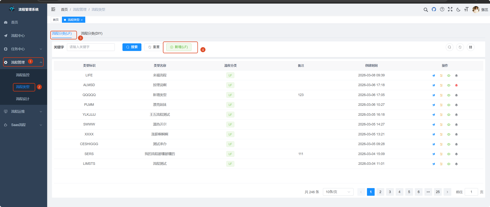
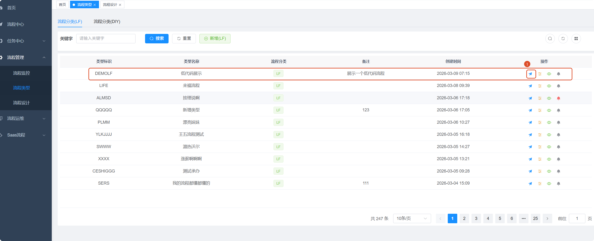
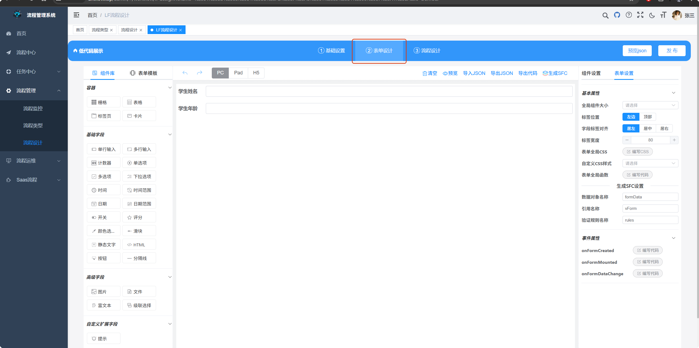
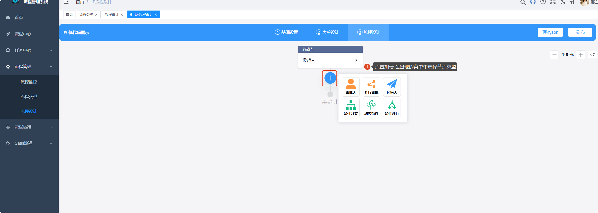
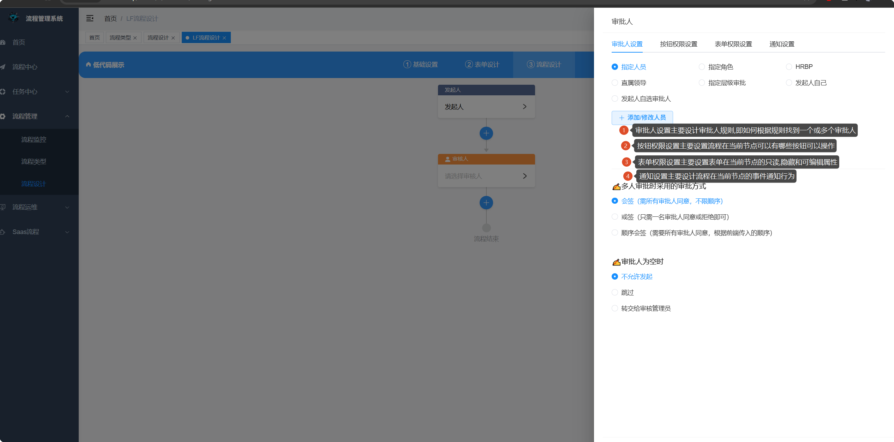
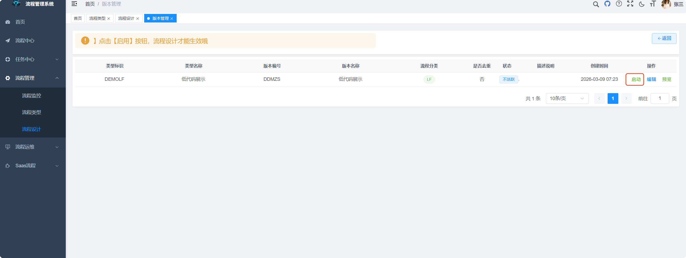
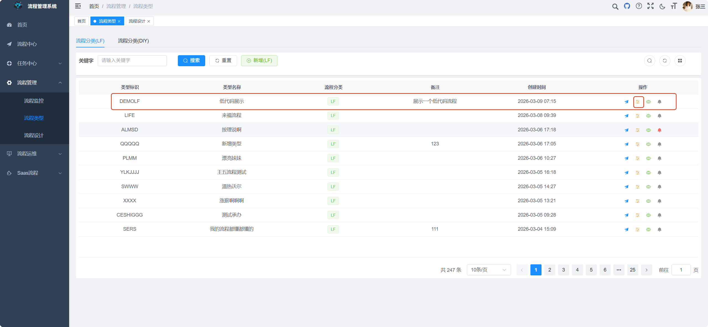
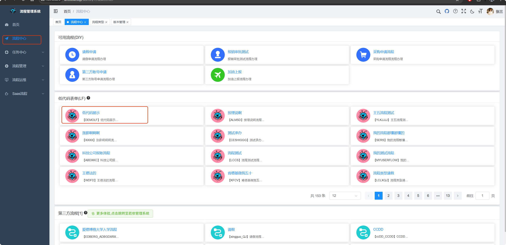
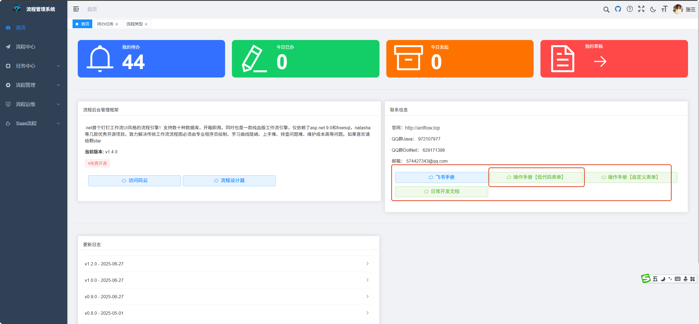

# AntFlow 资源索引

AntFlow目前文档有几十篇,并助越来越多。有些新上手的用户可能会感到眼花缭乱，不知道该如何从哪里上手。本篇给出一个资源索引，以帮助大家循序渐进由浅入深学习理解AntFlow

## 1.新手快速上手。

打开AntFlow[官网](http://antflow.top/admin/#/index)，几乎不用文档，即可快速上手体验从创建到设计一个低代码流程。

> AntFlow流程分为完全自定义（DIY）流程（从表单到后台代码）和低代码（LF）流程,低代码流程和DIY流程最显著的区别在于它仅通过页面配置即可完成一个流程的设计。

### 1.1创建一个低代码流程

#### 1.1.1创建流程

 打开【流程管理】找到【流程类型】，打开的页面默认激活的就是LF流程，点击上方【添加】按钮，即可快速创建一个低代码工作流。

#### 1.1.2设计流程

添加完以后，列表里就会多出一条流程，点击它右侧的小飞机图标，即可开始设计流程。

一般一个低代码流程设计分为两步：表单设计和流程设计。

* 表单设计
* 
* 流程设计
  
  一个流程至少有一个审批人节点。我们选择第一个【审批人】

  

  设计完成以后，点击【发布】发布流程。发布完以后，页面会跳到【版本管理】页面，点击右侧的发布，使设计的流程生效。
* 

如果用户一不小心关掉了列表而。可以从【流程类型】里找到这个流程，点击右侧的三横线图标再次进入到版本管理界面

### 1.1.3发起流程

通过以上设计以后，进入到【流程中心】就可以发起一个流程了

## 2.完整示例。

以上只是最快最简单的方式从创建到设计再到发起一个低代码流程。如果用户想要较完整上手低代码流程，请查看[完整文档]()

完整文档也可以从官网首页里找到

