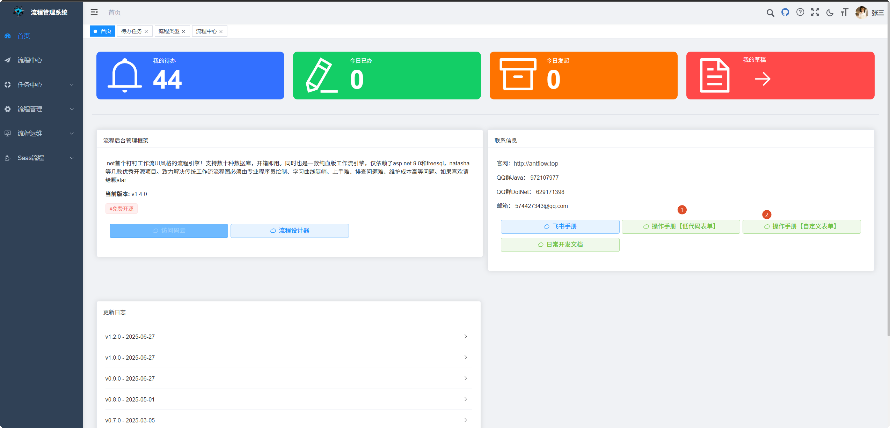

# AntFlow 资源索引

AntFlow目前文档有几十篇,并助越来越多。有些新上手的用户可能会感到眼花缭乱，不知道该如何从哪里上手。本篇给出一个资源索引，以帮助大家循序渐进由浅入深学习理解AntFlow

## 1.新手必看

一般地，低代码手册和自定义流程手册是必看的

> 在新手第一篇介绍了何为低代码何为自定义

## 2.DIY流程常见回调方法

如果你看了操作手册自定义表单，你会看到DIY流程后台需要实现FormOperationAdaptor接口，用户的业务逻辑都是在这个接口的实现类里面处理的。接口里定义了非常多的回调方法，用户不是所有的必须都要实现。但是submitData方法必须实现，用于接收前端的表单数据并持久化。此外finishData方法也非常常用，用于流程完成以后做一些事情。

每个方法都有注释，但是项目中都是英文的，如果想要看中文注释，可以查看【antflow事件系统与接入模式介绍.md】第一节，DIY流程事件钩子介绍。

## 3.DIY流程定制条件

如果你从没有了解过antflow,可以直接看【antflow快速集成六之自定义一个审批条件-v2.md】，v2并不是v1的升级版，而是完全不一样的做法。v2版的和低代码版采用一样的思路实现。

> V2版能满足95%的功能，如果你需要复杂的完全定制，可以查看v1版，即【antflow快速集成五之自定义一个审批条件-v1.md】

## 4.扩展AntFlow的审批人规则

【Antflow新增审批人规则完整实现指南.md】

## 5.定制一个连续的审批人规则。

参数现有的的审批人规则【层层审批】，文档查看【定制一个连续审批节点审批规则.md】

## 6.审批页、查看页定制额外的按钮

【antflow按钮系统介绍及自定义按钮.md】

## 7.消息系统接入，定制钉钉，飞书，企业微信等通知

查看docs目录下的系统集成与扩展篇里面的【消息消息系统介绍之xxx】
