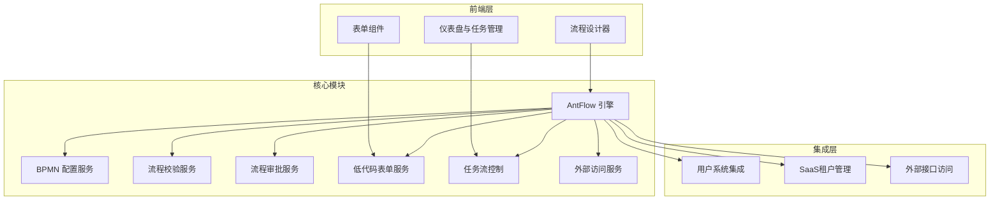
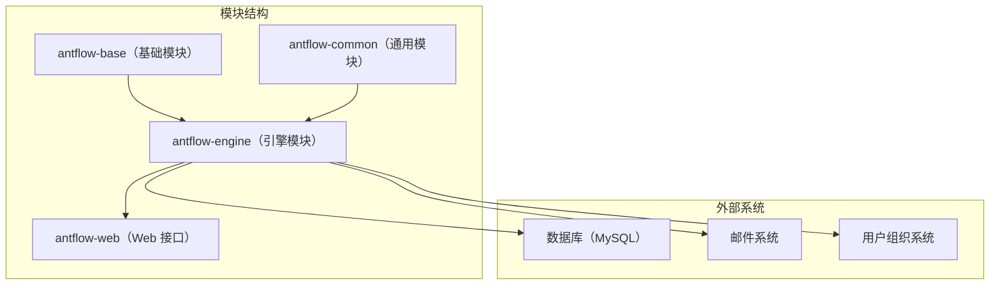
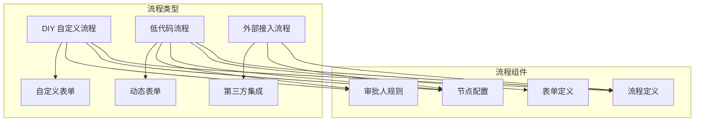
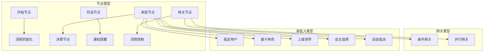

# AntFlow 简介

AntFlow 是一个企业级低代码工作流引擎平台，构建于改进版的 Activiti 引擎之上。相比传统 BPMN 工具，它提供了更简洁的工作流设计与管理方式，使技术人员和非技术用户都能通过图形化界面创建、管理和监控业务流程。


## 系统总览

AntFlow 通过提供直观的设计体验，并保留强大的流程能力，解决传统流程系统复杂难用的问题。支持独立部署和嵌入到已经有企业内部系统或者其它开源框架(若依等)。

### 系统架构图



## 核心特性

AntFlow 提供以下关键功能，使其既强大又易于使用：

1. **虚拟节点（VNode）模型**：将流程逻辑与引擎实现分离，使系统不依赖特定引擎，灵活性更高。(目前已独立实现支持Java和.net语言)
2. **简洁的开发模型**：LowCode模式下用户几乎不需要编码,只需要拖拽即可创建一个工作流!DIY模式开发者也仅需实现一个接口即可快速创建自定义流程。
3. **低代码方式**：非技术用户可通过拖拽方式创建流程，无需编写代码。
4. **用户系统无绑定**：完全脱离 Activiti 自带用户系统，可轻松接入企业现有用户/角色系统。
5. **运行时动态节点**：支持在运行时定义节点，适应流程需求的动态变化。
6. **丰富的节点类型**：支持串行、并行、会签、或签、依次签、去重、加签、委托、转办、退回任意节点、动态跳过节点、动态处理人变更等多种操作。
7. **基于 JSON 的可视化方案**：流程预览和审批路径采用 JSON 数据表示而非图像流，便于自定义渲染样式。

## 系统模块架构图



## 流程类型与概念图



## 节点配置图



## 集成能力

### 用户系统集成

```properties
集成外部用户系统非常简单,只需要查看源码中org.openoa.base.service.UserServiceImpl,跟着里面每个方法找到对应sql修改指定sql,select字段包含id和name两个字段,select x as id,xx as name from [你的表名]
或者实现AfUserService接口,并将自己的实现标注为@Primary,以覆盖默认的
```

### 外部接口能力

支持流程启动、任务完成、状态查询、表单数据获取等功能。

### 邮件通知配置示例(暂未和前端打通)

```properties
message.email.host=smtp.163.com
message.email.account=antflow@163.com
message.email.password=HHVZDETFJMCATUGS
```

## 技术栈

| 组件       | 技术                |
| ---------- | ------------------- |
| 后端框架   | Spring Boot 2.7.x   |
| 工作流引擎 | 改进版 Activiti 5.x |
| 数据库     | MySQL 5.7+          |
| ORM 框架   | MyBatis Plus 3.5.1  |
| 前端框架   | Vue.js              |
| 构建工具   | Maven               |

## 后续阅读建议

- 系统架构说明
- 核心概念与术语
- 后端系统设计
- 前端系统结构
- 开发者快速入门指南
