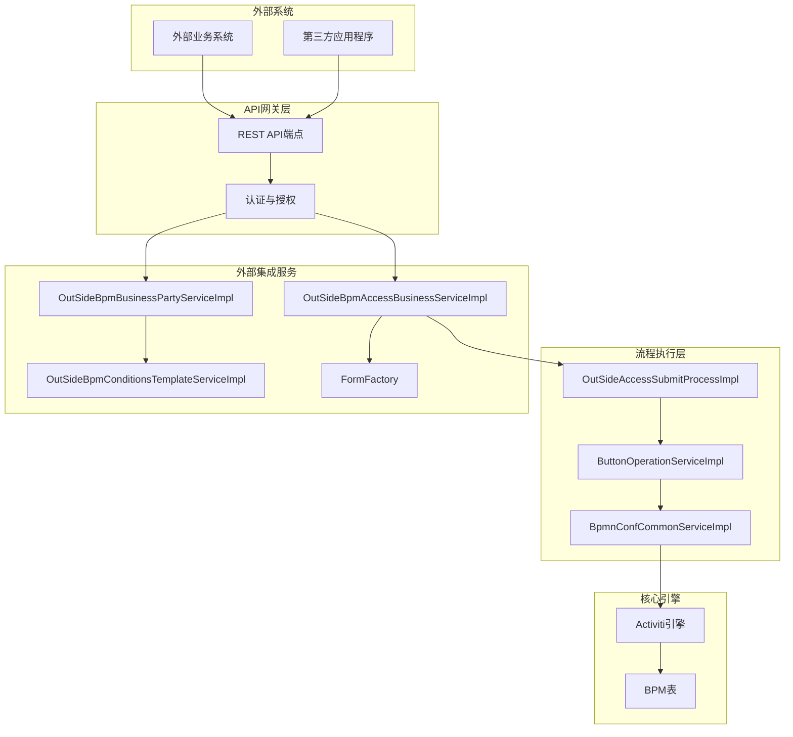
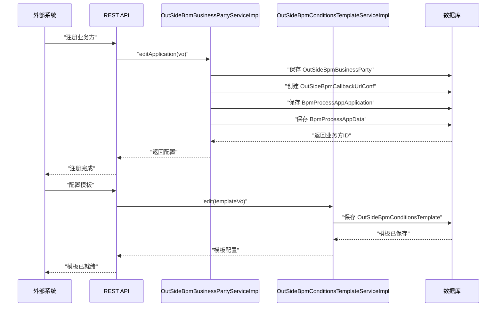
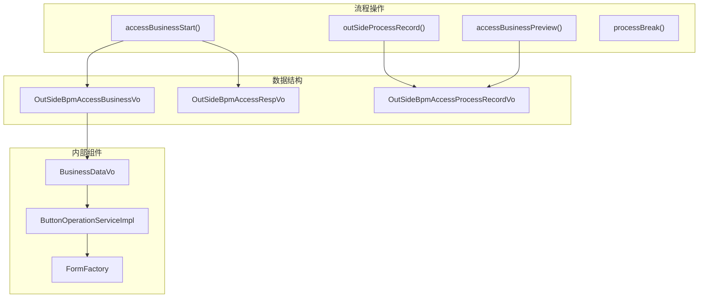
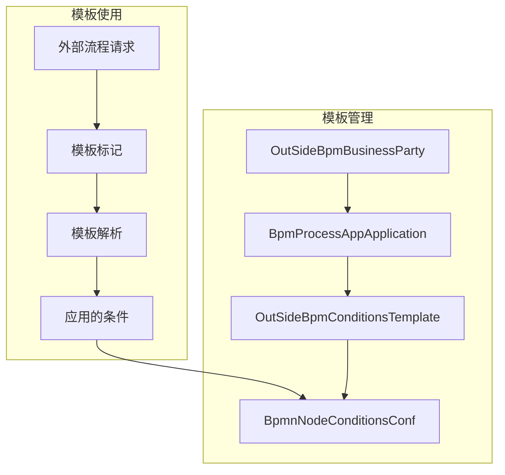
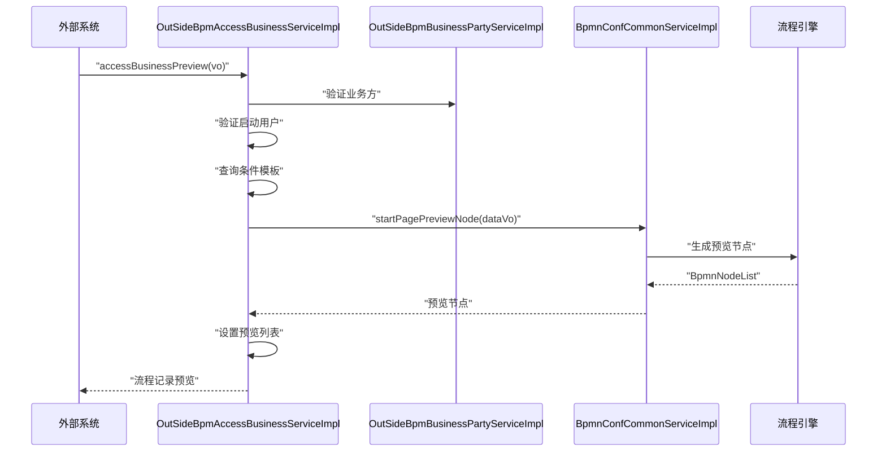

# 外部API集成

## 系统架构概述

外部API集成系统遵循分层架构，通过专门的服务层和数据转换组件将外部访问与内部工作流操作隔离。

### 外部集成架构

## 业务方管理

业务方代表被授权与AntFlow工作流交互的外部组织或系统。每个业务方都有配置设置、人员分配和访问权限。

### 业务方实体结构

| 字段                  | 类型    | 描述                              |
| --------------------- | ------- | --------------------------------- |
| `businessPartyMark` | String  | 业务方的唯一标识符                |
| `name`              | String  | 业务方的显示名称                  |
| `type`              | Integer | 业务方类型（1=嵌入式，2=API访问） |
| `businessPartyId`   | Long    | 内部ID引用                        |

### 业务方配置流程

## 外部流程生命周期

外部系统可以通过标准化API启动和管理工作流流程，该API抽象了内部工作流引擎的复杂性。

### 流程启动与管理

`OutSideBpmAccessBusinessServiceImpl`类作为外部流程操作的主要接口：

### 外部流程启动流程

流程启动遵循以下顺序：

1. **验证**：验证业务方凭证和表单代码
2. **数据准备**：将外部数据转换为内部 `BusinessDataVo`格式
3. **流程创建**：创建 `OutSideBpmAccessBusiness`记录
4. **工作流启动**：通过 `ButtonOperationServiceImpl`调用内部流程引擎
5. **响应**：返回流程编号和初始状态

## API集成点

### 表单数据转换

`FormFactory`类处理外部API数据格式与内部流程数据结构之间的转换：

```mermaid
flowchart TD
EXT_JSON["外部JSON数据"]
FACTORY["FormFactory.dataFormConversion()"]
VO_PARSE["JSON转BusinessDataVo"]
FORM_CHECK["表单代码验证"]
OUTSIDE_CHECK["外部访问检查"]
LF_CHECK["低代码流检查"]
BEAN_GET["获取处理Bean"]
TYPE_CONVERT["类型转换"]
RESULT["类型化的BusinessDataVo"]
subgraph subGraph0 ["数据转换过程"]
 EXT_JSON
 FACTORY
 VO_PARSE
 FORM_CHECK
 OUTSIDE_CHECK
 LF_CHECK
 BEAN_GET
 TYPE_CONVERT
 RESULT
 EXT_JSON --> FACTORY
 FACTORY --> VO_PARSE
 VO_PARSE --> FORM_CHECK
 FORM_CHECK --> OUTSIDE_CHECK
 OUTSIDE_CHECK --> LF_CHECK
 LF_CHECK --> BEAN_GET
 BEAN_GET --> TYPE_CONVERT
 TYPE_CONVERT --> RESULT
end
```

关键转换逻辑包括：

* **外部访问检测**：`vo.getIsOutSideAccessProc()`确定外部还是内部处理
* **低代码流处理**：特殊处理 `isLowCodeFlow=1`场景
* **表单数据注入**：从 `OutSideBpmAccessBusiness`记录中检索和注入存储的表单数据

### 业务数据集成

`BusinessDataVo`类作为外部集成的中央数据传输对象：

| 关键字段                | 目的                        |
| ----------------------- | --------------------------- |
| `isOutSideAccessProc` | 布尔标志，指示外部API访问   |
| `outSideType`         | 整数（0=嵌入式，1=API访问） |
| `templateMarks`       | 条件模板标识符列表          |
| `embedNodes`          | 嵌入式审批节点的配置        |
| `businessPartyId`     | 外部业务方的引用            |
| `formCode`            | 工作流表单标识符            |
| `processNumber`       | 流程实例的唯一标识符        |

## 模板和条件管理

外部流程可以使用预定义的条件模板来自定义工作流路由和审批逻辑，而无需深入了解内部BPMN结构。

### 模板配置结构

### 模板生命周期操作

`OutSideBpmConditionsTemplateServiceImpl`提供模板管理能力：

* **创建/编辑**：`edit(OutSideBpmConditionsTemplateVo vo)` - 创建或更新条件模板
* **验证**：检查业务方范围内模板标记和名称的重复
* **使用跟踪**：`templateIsUsed()` - 防止删除正在使用的模板
* **查询操作**：`selectListByPartMark()` - 按业务方检索模板

## 流程预览与监控

外部系统可以预览工作流路由并监控流程执行，而无需实际启动流程。

### 预览功能

## 安全与访问控制

### 业务方认证

每个外部集成都需要适当的业务方注册和认证：

1. **业务方注册**：创建具有唯一 `businessPartyMark`的 `OutSideBpmBusinessParty`
2. **人员分配**：通过 `OutSideBpmAdminPersonnel`配置管理人员
3. **回调配置**：设置 `OutSideBpmCallbackUrlConf`以进行流程通知
4. **权限映射**：与内部用户角色和权限关联

## 集成数据模型

### 关键实体关系

| 实体                             | 关键字段                                                 | 关系                                     |
| -------------------------------- | -------------------------------------------------------- | ---------------------------------------- |
| `OutSideBpmBusinessParty`      | `businessPartyMark`, `name`, `type`                | 与 `OutSideBpmAccessBusiness`为1:N关系 |
| `OutSideBpmAccessBusiness`     | `formCode`, `processNumber`, `businessPartyId`     | 与 `OutSideBpmBusinessParty`为N:1关系  |
| `OutSideBpmConditionsTemplate` | `templateMark`, `businessPartyId`, `applicationId` | 与 `OutSideBpmBusinessParty`为N:1关系  |
| `BpmProcessAppApplication`     | `businessCode`, `processKey`, `title`              | 与外部流程为1:N关系                      |

系统通过外键关系维护引用完整性，并通过MyBatis-Plus驱动的映射器提供全面的查询能力。
