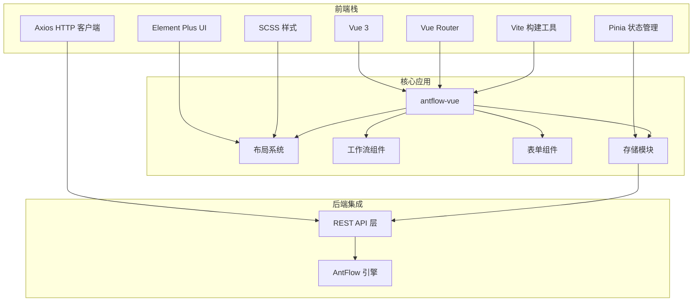
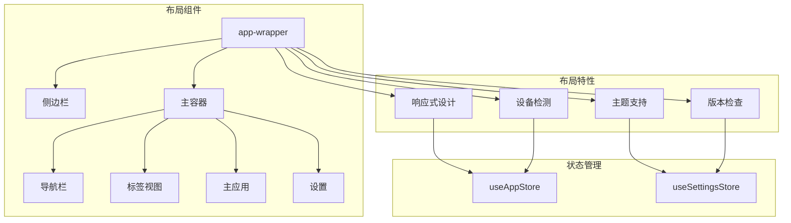
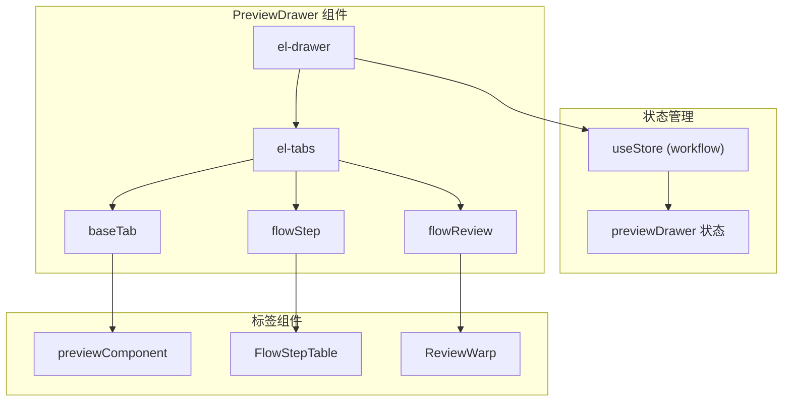
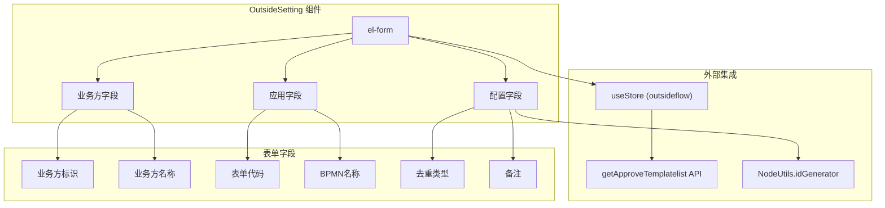
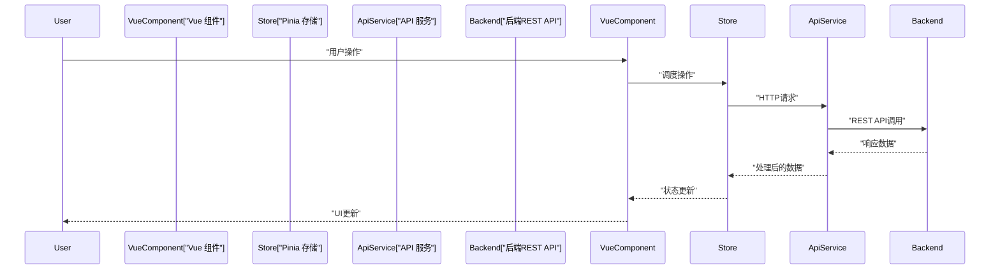
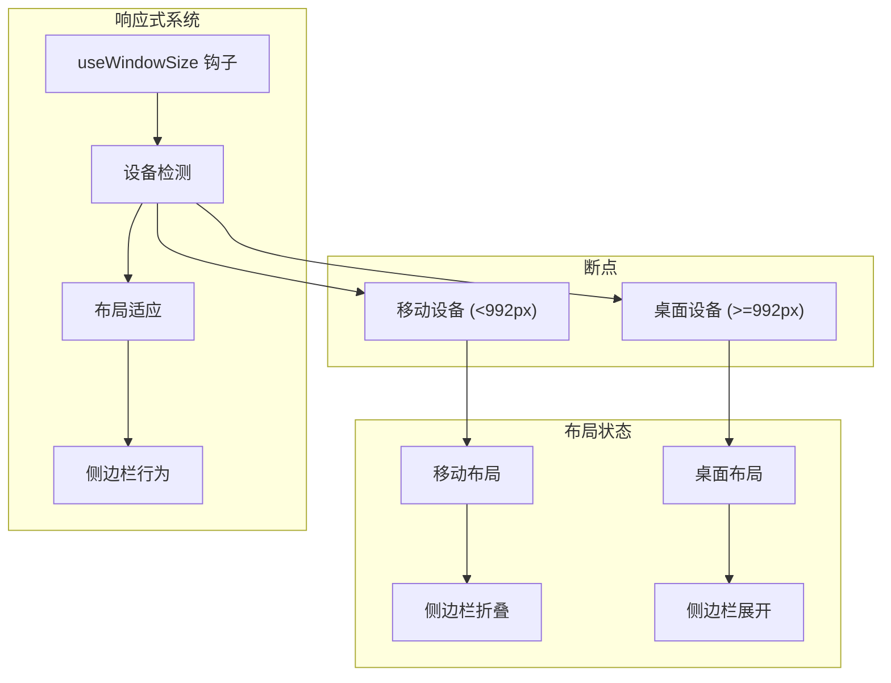

# 前端系统

## 架构概述

AntFlow前端是使用Element Plus UI组件、Pinia进行状态管理和Vite作为构建工具构建的Vue 3单页应用程序。该应用程序遵循模块化架构，在布局、工作流组件和业务逻辑之间有清晰的分离。

### 前端技术栈




### 应用结构和布局系统

主应用布局由 `layout/index.vue`组件管理，该组件提供带有侧边栏导航、页眉和主内容区的响应式布局。




布局系统包括：

* **响应式设计**：使用 `useWindowSize`钩子自动适应移动和桌面视图
* **主题支持**：使用CSS自定义属性进行动态主题设置
* **版本管理**：通过 `getCurrentVersion` API自动进行版本检查和重新加载通知
* **状态管理**：与Pinia存储集成，用于应用状态和设置

## 样式系统和UI框架

前端使用基于SCSS的综合样式系统，包含工具类和组件特定样式。

### 核心样式架构

| 样式文件                  | 目的     | 关键特性                               |
| ------------------------- | -------- | -------------------------------------- |
| `index.scss`            | 主入口点 | 导入所有样式模块，全局应用样式         |
| `ruoyi.scss`            | 工具类   | 间距、颜色、布局工具、Element Plus覆盖 |
| `variables.module.scss` | CSS变量  | 主题颜色、断点、测量单位               |
| `element-ui.scss`       | 组件覆盖 | Element Plus组件自定义                 |
| `sidebar.scss`          | 导航样式 | 侧边栏和导航样式                       |

### 工具类系统

样式系统提供广泛的工具类，用于快速UI开发：

```
// 间距工具类
.pt5, .pr5, .pl5, .pb5 // 内边距5px
.pt10, .pr10, .pl10, .pb10 // 内边距10px
.mt5, .mr5, .ml5, .mb5 // 外边距5px
.mt10, .mr10, .ml10, .mb10 // 外边距10px
// 布局工具类
.l, .r // 左浮动/右浮动
.clearfix // 清除浮动
.clickable // 指针光标
.text-center // 文本居中
```


### Element Plus自定义

系统广泛自定义Element Plus组件，以满足AntFlow的设计要求：

```css
// 表格自定义
.el-table {
 height: calc(65vh);
 .el-table__header-wrapper th {
 background-color: #f8f8f9 !important;
 color: #515a6e;
 height: 50px !important;
 }
}
// 对话框自定义
.el-dialog:not(.is-fullscreen) {
 margin-top: 6vh !important;
}
// 表单自定义
.el-form .el-form-item__label {
 font-weight: 700;
}
```


## 工作流组件和用户界面

前端提供专门的工作流管理、任务处理和外部集成组件。

### 工作流预览系统

`previewDrawer.vue`组件提供全面的工作流预览界面，带有标签导航：




预览系统的关键特性：

* **标签界面**：提供表单信息、审批记录和流程预览
* **延迟加载**：通过条件渲染仅在访问时加载标签
* **状态管理**：使用工作流存储进行状态同步
* **响应式设计**：抽屉大小适应内容

### 外部应用程序管理

`outsideSetting/index.vue`组件处理外部应用程序和第三方集成的配置：




外部应用程序管理系统提供：

* **业务方配置**：管理外部业务方标识符和名称
* **应用集成**：处理第三方系统的应用代码和名称
* **审批配置**：管理去重类型和审批模板
* **表单验证**：全面的验证，带有错误处理和用户反馈

## 前端-后端集成

前端通过使用Axios进行HTTP请求的API层与后端通信。

### API集成模式




### 状态管理架构

应用程序使用Pinia进行集中式状态管理，带有模块化存储：

| 存储模块        | 目的       | 关键状态                    |
| --------------- | ---------- | --------------------------- |
| `workflow`    | 工作流操作 | `previewDrawer`，流程数据 |
| `outsideflow` | 外部集成   | 表单配置，模板              |
| `app`         | 应用状态   | 侧边栏，设备检测            |
| `settings`    | 用户偏好   | 主题，版本，布局设置        |

### 组件通信模式

前端使用几种通信模式：

* **Props/Events**：父子组件通信
* **Store Composition**：通过Pinia存储共享状态
* **Provide/Inject**：深层组件树通信
* **Event Bus**：跨组件消息传递，用于复杂工作流


## 响应式设计和用户体验

前端实现全面的响应式设计，以支持桌面和移动工作流。

### 设备检测和适应




### UI组件响应性

系统通过以下方式提供响应性行为：

* **灵活的网格系统**：CSS Grid和Flexbox布局
* **自适应组件**：自动调整大小的Element Plus组件
* **媒体查询**：用于响应式断点的SCSS混合
* **触摸支持**：移动友好的交互和手势

响应式设计确保跨设备的最佳用户体验，同时保持复杂工作流操作的全部功能。
