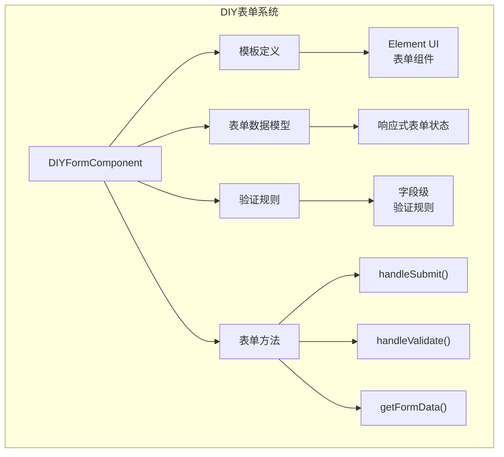
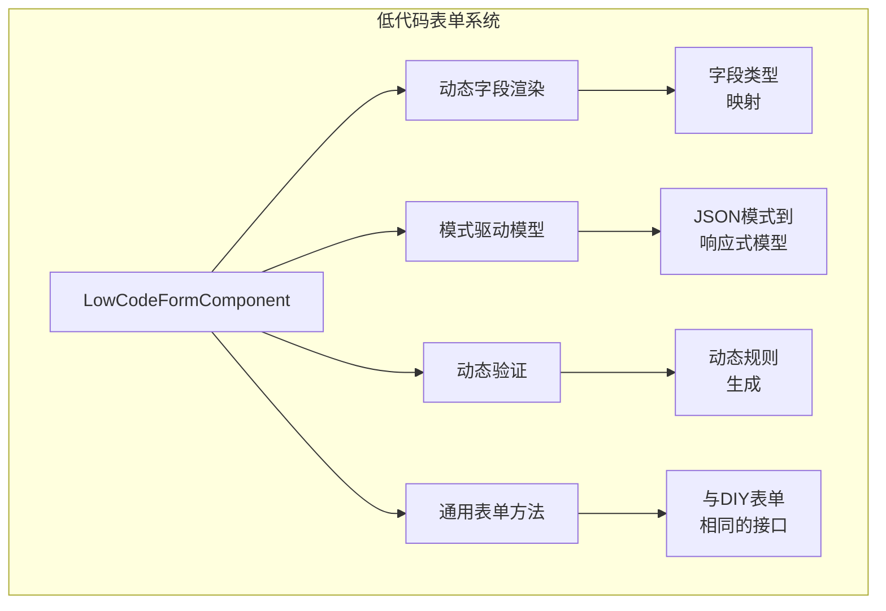
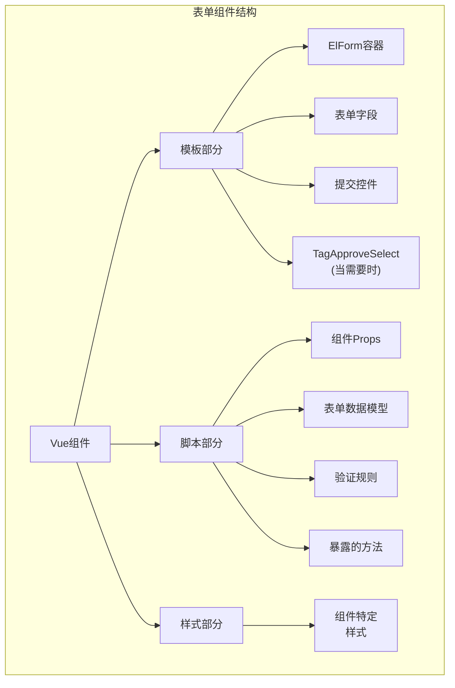
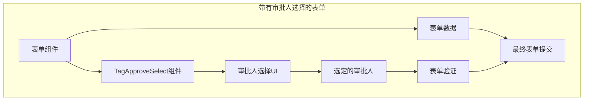
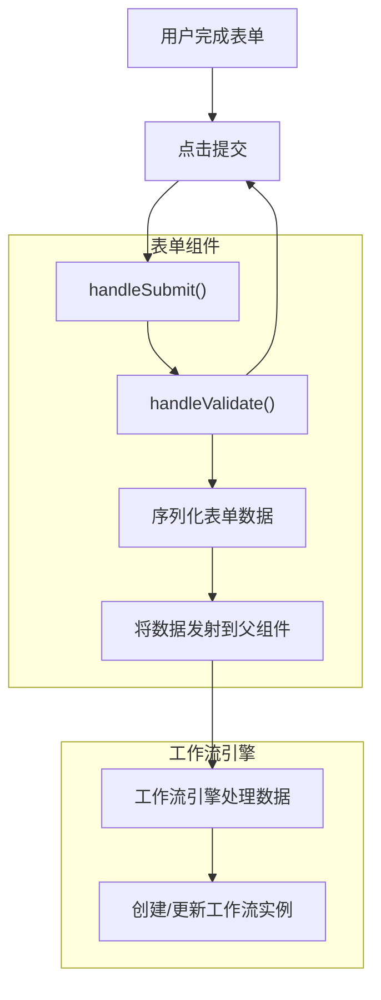

# 表单组件与动态表单

## 表单组件

> **相关源文件**
> * [antflow-vue/src/components/Dashboard/Workplace.vue](https://github.com/mrtylerzhou/AntFlow-activiti/blob/160c7ba8/antflow-vue/src/components/Dashboard/Workplace.vue)
> * [antflow-vue/src/components/Workflow/DynamicForm/formRender.vue](https://github.com/mrtylerzhou/AntFlow-activiti/blob/160c7ba8/antflow-vue/src/components/Workflow/DynamicForm/formRender.vue)
> * [antflow-vue/src/views/workflow/components/forms/form1.vue](https://github.com/mrtylerzhou/AntFlow-activiti/blob/160c7ba8/antflow-vue/src/views/workflow/components/forms/form1.vue)
> * [antflow-vue/src/views/workflow/components/forms/form2.vue](https://github.com/mrtylerzhou/AntFlow-activiti/blob/160c7ba8/antflow-vue/src/views/workflow/components/forms/form2.vue)
> * [antflow-vue/src/views/workflow/components/forms/form3.vue](https://github.com/mrtylerzhou/AntFlow-activiti/blob/160c7ba8/antflow-vue/src/views/workflow/components/forms/form3.vue)
> * [antflow-vue/src/views/workflow/components/forms/form4.vue](https://github.com/mrtylerzhou/AntFlow-activiti/blob/160c7ba8/antflow-vue/src/views/workflow/components/forms/form4.vue)
> * [antflow-vue/src/views/workflow/components/forms/form5.vue](https://github.com/mrtylerzhou/AntFlow-activiti/blob/160c7ba8/antflow-vue/src/views/workflow/components/forms/form5.vue)

本页文档记录了AntFlow工作流系统中使用的表单组件。这些表单作为工作流应用程序中收集和显示数据的用户界面。AntFlow系统支持预构建的DIY表单和动态生成的低代码表单。

有关使用这些表单的工作流设计器的信息，请参阅[工作流设计器](/mrtylerzhou/AntFlow-activiti/3.1-workflow-designer-and-node-configuration)。有关工作流中节点如何与表单交互的详细信息，请参阅[节点配置](/mrtylerzhou/AntFlow-activiti/3.2-form-components-and-dynamic-forms)。

## 表单类型和类别

AntFlow的表单系统支持两种主要的表单类别：

1. **DIY表单**：由开发者创建的预定义表单模板，具有特定的硬编码字段和验证规则。
2. **低代码表单**：基于配置动态生成的表单，允许非开发者无需编程即可设计表单。

### DIY表单

DIY表单是遵循一致结构的Vue.js组件。当工作流需要特定、自定义设计的表单时，可能会使用这些表单，这些表单可能具有复杂的业务逻辑。



来源：[antflow-vue/src/views/workflow/components/forms/form1.vue L1-L146](https://github.com/mrtylerzhou/AntFlow-activiti/blob/160c7ba8/antflow-vue/src/views/workflow/components/forms/form1.vue#L1-L146)
 [antflow-vue/src/views/workflow/components/forms/form2.vue L1-L188](https://github.com/mrtylerzhou/AntFlow-activiti/blob/160c7ba8/antflow-vue/src/views/workflow/components/forms/form2.vue#L1-L188)

### 低代码表单

低代码表单基于配置数据动态生成。这允许业务用户无需编程知识即可创建和修改表单。



来源：[antflow-vue/src/views/startOutside/index.vue L9-L21](https://github.com/mrtylerzhou/AntFlow-activiti/blob/160c7ba8/antflow-vue/src/views/startOutside/index.vue#L9-L21)
 [antflow-vue/src/views/startOutside/index.vue L55-L63](https://github.com/mrtylerzhou/AntFlow-activiti/blob/160c7ba8/antflow-vue/src/views/startOutside/index.vue#L55-L63)

## 表单组件结构

AntFlow中的所有表单组件都遵循一个通用结构，该结构使它们能够与工作流引擎无缝协作。



来源：[antflow-vue/src/views/workflow/components/forms/form1.vue L1-L146](https://github.com/mrtylerzhou/AntFlow-activiti/blob/160c7ba8/antflow-vue/src/views/workflow/components/forms/form1.vue#L1-L146)
 [antflow-vue/src/views/workflow/components/forms/form2.vue L1-L188](https://github.com/mrtylerzhou/AntFlow-activiti/blob/160c7ba8/antflow-vue/src/views/workflow/components/forms/form2.vue#L1-L188)
 [antflow-vue/src/views/workflow/components/forms/form3.vue L1-L140](https://github.com/mrtylerzhou/AntFlow-activiti/blob/160c7ba8/antflow-vue/src/views/workflow/components/forms/form3.vue#L1-L140)

### 模板结构

每个表单组件的模板包括：

1. 引用表单数据模型和验证规则的表单容器
2. 适合所收集数据的输入字段
3. 基于视图模式的提交按钮的条件渲染
4. 当需要时与审批选择的集成

```xml
<el-form ref="ruleFormRef" :model="form" :rules="rules">
 <!-- 表单字段 -->
 <el-form-item label="字段标签" prop="fieldName">
 <el-input v-model="form.fieldName" />
 </el-form-item>
 
 <!-- 提交按钮（条件） -->
 <el-form-item v-if="!isPreview && showSubmit">
 <el-button type="primary" @click="handleSubmit">提交</el-button>
 </el-form-item>
</el-form>
<!-- 审批选择（条件） -->
<TagApproveSelect v-if="hasChooseApprove == 'true'" ... />
```

来源：[antflow-vue/src/views/workflow/components/forms/form1.vue L2-L28](https://github.com/mrtylerzhou/AntFlow-activiti/blob/160c7ba8/antflow-vue/src/views/workflow/components/forms/form1.vue#L2-L28)
 [antflow-vue/src/views/workflow/components/forms/form2.vue L2-L46](https://github.com/mrtylerzhou/AntFlow-activiti/blob/160c7ba8/antflow-vue/src/views/workflow/components/forms/form2.vue#L2-L46)

### 脚本组织

表单组件的脚本部分包括：

1. **Props定义** - 控制表单行为
   * `previewData`：预览模式下显示的数据
   * `showSubmit`：是否显示提交按钮
   * `isPreview`：表单是否处于预览模式
2. **表单数据模型** - 具有表单字段的响应式对象
3. **验证规则** - 定义必填字段和其他验证
4. **标准方法**：
   * `handleValidate()`：验证表单数据
   * `getFromData()`：返回序列化的表单数据
   * `handleSubmit()`：处理表单提交
   * `chooseApprovers()`：处理审批人选择

来源：[antflow-vue/src/views/workflow/components/forms/form1.vue L31-L129](https://github.com/mrtylerzhou/AntFlow-activiti/blob/160c7ba8/antflow-vue/src/views/workflow/components/forms/form1.vue#L31-L129)
 [antflow-vue/src/views/workflow/components/forms/form2.vue L49-L172](https://github.com/mrtylerzhou/AntFlow-activiti/blob/160c7ba8/antflow-vue/src/views/workflow/components/forms/form2.vue#L49-L172)

## 常用表单组件

AntFlow包含几个预构建的表单组件，用于常见的业务流程。以下是包含的表单模板概述：

| 表单 | 用途 | 关键字段 |
| --- | --- | --- |
| 表单1 | 账户申请 | 账户类型、备注 |
| 表单2 | 请假申请 | 请假类型、日期范围、小时数、原因 |
| 表单3 | 加油记录 | 车牌号、加油日期、备注 |
| 表单4 | 采购请求 | 采购人姓名、日期、金额、备注 |
| 表单5 | 费用报销 | 用户名、日期、金额、备注 |

来源：[antflow-vue/src/views/workflow/components/forms/form1.vue](https://github.com/mrtylerzhou/AntFlow-activiti/blob/160c7ba8/antflow-vue/src/views/workflow/components/forms/form1.vue)
 [antflow-vue/src/views/workflow/components/forms/form2.vue](https://github.com/mrtylerzhou/AntFlow-activiti/blob/160c7ba8/antflow-vue/src/views/workflow/components/forms/form2.vue)
 [antflow-vue/src/views/workflow/components/forms/form3.vue](https://github.com/mrtylerzhou/AntFlow-activiti/blob/160c7ba8/antflow-vue/src/views/workflow/components/forms/form3.vue)
 [antflow-vue/src/views/workflow/components/forms/form4.vue](https://github.com/mrtylerzhou/AntFlow-activiti/blob/160c7ba8/antflow-vue/src/views/workflow/components/forms/form4.vue)
 [antflow-vue/src/views/workflow/components/forms/form5.vue](https://github.com/mrtylerzhou/AntFlow-activiti/blob/160c7ba8/antflow-vue/src/views/workflow/components/forms/form5.vue)

## 表单与工作流的集成

表单通过标准化接口与工作流系统集成，允许它们动态加载并与工作流引擎交互。

```mermaid
sequenceDiagram
 participant 工作流引擎
 participant 表单加载器
 participant 表单组件
 participant 审批组件
 工作流引擎->>表单加载器：请求工作流的表单
 表单加载器->>表单加载器：确定表单类型（DIY/低代码）
 loop [DIY表单]
 表单加载器->>表单组件：加载DIY组件
 表单加载器->>工作流引擎：获取表单模式
 工作流引擎-->>表单加载器：返回模式
 表单加载器->>表单组件：生成动态表单
 表单组件->>表单组件：初始化表单数据
 表单组件->>表单组件：设置验证规则
 工作流引擎->>表单组件：提交表单
 表单组件->>表单组件：验证表单数据
 表单组件->>审批组件：请求审批人选择
 审批组件-->>表单组件：返回选定的审批人
 表单组件->>表单组件：验证审批人
 end
 表单组件-->>工作流引擎：返回验证后的表单数据
```

来源：[antflow-vue/src/views/startOutside/index.vue L27-L134](https://github.com/mrtylerzhou/AntFlow-activiti/blob/160c7ba8/antflow-vue/src/views/startOutside/index.vue#L27-L134)

### 动态表单加载

系统根据工作流类型动态加载表单组件：

```javascript
// 基于实际实现的伪代码
if (isLowCodeFlow) {
 // 从服务器获取表单模式
 const formData = await getLowCodeFromCodeData(flowCode);
 // 加载动态生成的表单组件
 component = await loadLFComponent();
} else {
 // 加载预定义的DIY组件
 component = await loadDIYComponent(flowCode);
}
```

来源：[antflow-vue/src/views/startOutside/index.vue L46-L63](https://github.com/mrtylerzhou/AntFlow-activiti/blob/160c7ba8/antflow-vue/src/views/startOutside/index.vue#L46-L63)

### 表单数据处理

表单组件暴露验证和数据检索的方法：

1. `handleValidate()`：验证表单并返回一个promise
2. `getFromData()`：返回表单数据的JSON字符串表示

工作流引擎使用这些方法来验证和收集表单数据：

```javascript
// 验证表单
await formRef.value.handleValidate().then(async (isValid) => {
 if (isValid) {
 // 获取表单数据
 const formData = await formRef.value.getFromData();
 // 为工作流处理表单数据
 // ...
 }
});
```

来源：[antflow-vue/src/views/startOutside/index.vue L83-L108](https://github.com/mrtylerzhou/AntFlow-activiti/blob/160c7ba8/antflow-vue/src/views/startOutside/index.vue#L83-L108)

## 审批人选择集成

表单组件可以根据配置与审批人选择组件（`TagApproveSelect`）集成。这允许用户为工作流步骤选择审批人。



来源：[antflow-vue/src/views/workflow/components/forms/form1.vue L27](https://github.com/mrtylerzhou/AntFlow-activiti/blob/160c7ba8/antflow-vue/src/views/workflow/components/forms/form1.vue#L27-L27)
 [antflow-vue/src/views/workflow/components/forms/form1.vue L87-L91](https://github.com/mrtylerzhou/AntFlow-activiti/blob/160c7ba8/antflow-vue/src/views/workflow/components/forms/form1.vue#L87-L91)
 [antflow-vue/src/views/workflow/components/forms/form1.vue L115-L121](https://github.com/mrtylerzhou/AntFlow-activiti/blob/160c7ba8/antflow-vue/src/views/workflow/components/forms/form1.vue#L115-L121)

审批人选择组件根据`hasChooseApprove`参数有条件地渲染：

```
<TagApproveSelect v-if="hasChooseApprove == 'true'" v-model:formCode="formCode" @chooseApprove="chooseApprovers" />
```

选定的审批人存储在表单数据中，并在提交前进行验证：

```javascript
// 存储选定的审批人
const chooseApprovers = (data) => {
 form.approversList = data.approvers; 
 form.approversValid = data.nodeVaild;
}
// 在提交前验证审批人
if (hasChooseApprove == 'true') { 
 if (!form.approversValid || form.approversValid == false) { 
 proxy.$modal.msgError('请选择自选审批人'); 
 return Promise.reject(false);
 } 
}
```

来源：[antflow-vue/src/views/workflow/components/forms/form1.vue L87-L91](https://github.com/mrtylerzhou/AntFlow-activiti/blob/160c7ba8/antflow-vue/src/views/workflow/components/forms/form1.vue#L87-L91)
 [antflow-vue/src/views/workflow/components/forms/form1.vue L115-L121](https://github.com/mrtylerzhou/AntFlow-activiti/blob/160c7ba8/antflow-vue/src/views/workflow/components/forms/form1.vue#L115-L121)

## 预览与编辑模式

表单组件通过`isPreview`属性支持预览和编辑模式。

在预览模式下：

* 表单字段为只读（使用CSS类禁用指针事件）
* 隐藏提交按钮
* 表单预先填充现有数据

```xml
<el-row :class="{ disableClss: props.isPreview }">
 <!-- 表单字段 -->
</el-row>
```

```
.disableClss {
 pointer-events: none;
}
```

来源：[antflow-vue/src/views/workflow/components/forms/form1.vue L4](https://github.com/mrtylerzhou/AntFlow-activiti/blob/160c7ba8/antflow-vue/src/views/workflow/components/forms/form1.vue#L4-L4)
 [antflow-vue/src/views/workflow/components/forms/form1.vue L20](https://github.com/mrtylerzhou/AntFlow-activiti/blob/160c7ba8/antflow-vue/src/views/workflow/components/forms/form1.vue#L20-L20)
 [antflow-vue/src/views/workflow/components/forms/form1.vue L132-L134](https://github.com/mrtylerzhou/AntFlow-activiti/blob/160c7ba8/antflow-vue/src/views/workflow/components/forms/form1.vue#L132-L134)

## 表单验证

表单验证使用Element UI的验证系统与自定义规则实现：

```javascript
let rules = {
 accountType: [{
 required: true,
 message: '请选择账户类型',
 trigger: 'change'
 }],
 remark: [{
 required: true,
 message: '请输入备注说明',
 trigger: 'blur'
 }]
};
```

`handleValidate()`方法执行验证并返回一个promise：

```javascript
const handleValidate = () => { 
 return proxy.$refs['ruleFormRef'].validate((valid) => {
 if (!valid) {
 return Promise.reject(false);
 } 
 // 如果需要，对审批人进行额外验证
 else if(hasChooseApprove == 'true') { 
 if (!form.approversValid) { 
 proxy.$modal.msgError('请选择自选审批人'); 
 return Promise.reject(false);
 } 
 }
 else {
 return Promise.resolve(true);
 }
 });
}
```

来源：[antflow-vue/src/views/workflow/components/forms/form1.vue L71-L82](https://github.com/mrtylerzhou/AntFlow-activiti/blob/160c7ba8/antflow-vue/src/views/workflow/components/forms/form1.vue#L71-L82)
 [antflow-vue/src/views/workflow/components/forms/form1.vue L110-L125](https://github.com/mrtylerzhou/AntFlow-activiti/blob/160c7ba8/antflow-vue/src/views/workflow/components/forms/form1.vue#L110-L125)

## 表单提交流程

表单提交过程遵循以下步骤：

1. 用户完成表单
2. 用户点击提交按钮
3. 触发表单验证
4. 如果有效且需要审批人，则进行审批人验证
5. 将表单数据序列化为JSON
6. 将数据发射到父组件进行处理
7. 工作流引擎接收数据并创建/更新工作流实例



来源：[antflow-vue/src/views/workflow/components/forms/form1.vue L103-L109](https://github.com/mrtylerzhou/AntFlow-activiti/blob/160c7ba8/antflow-vue/src/views/workflow/components/forms/form1.vue#L103-L109)
 [antflow-vue/src/views/startOutside/index.vue L114-L144](https://github.com/mrtylerzhou/AntFlow-activiti/blob/160c7ba8/antflow-vue/src/views/startOutside/index.vue#L114-L144)

## 创建自定义表单组件

开发者可以通过以下步骤创建自定义表单组件：

1. 创建一个遵循表单结构模式的新Vue组件
2. 定义特定于业务需求的表单数据模型
3. 为必填字段实现验证规则
4. 实现标准表单方法：
   * `handleValidate()`
   * `getFromData()`
   * `handleSubmit()`
5. 导出组件以供在工作流中使用

组件必须通过`defineExpose()`暴露这些方法：

```
defineExpose({
 handleValidate,
 getFromData
})
```

来源：[antflow-vue/src/views/workflow/components/forms/form1.vue L126-L129](https://github.com/mrtylerzhou/AntFlow-activiti/blob/160c7ba8/antflow-vue/src/views/workflow/components/forms/form1.vue#L126-L129)
 [antflow-vue/src/views/workflow/components/forms/form2.vue L169-L172](https://github.com/mrtylerzhou/AntFlow-activiti/blob/160c7ba8/antflow-vue/src/views/workflow/components/forms/form2.vue#L169-L172)

## 总结

AntFlow中的表单组件为工作流应用程序中的数据收集和显示提供了一个灵活的系统。该系统支持预构建的DIY表单和动态生成的低代码表单，允许广泛的工作流应用程序。

每个表单组件都遵循一个一致的结构，并具有用于验证和数据检索的标准化方法，确保与工作流引擎的无缝集成。审批人选择集成允许用户直接从表单中选择工作流审批人。

通过了解表单组件系统，开发者可以创建自定义表单或利用现有模板快速构建工作流应用程序。