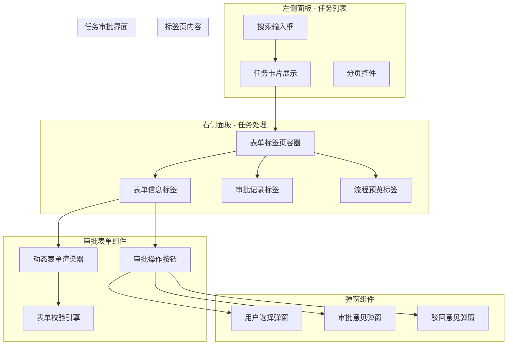
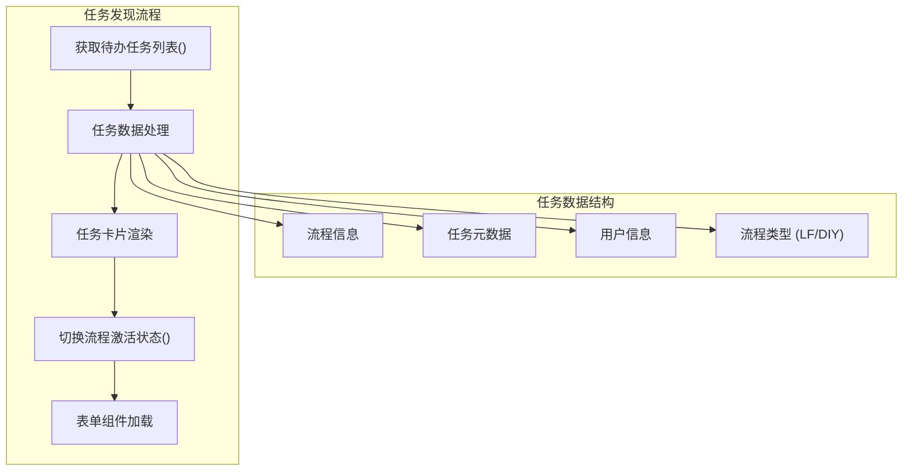
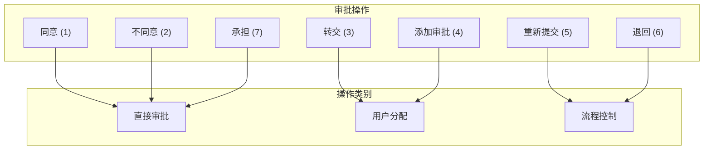
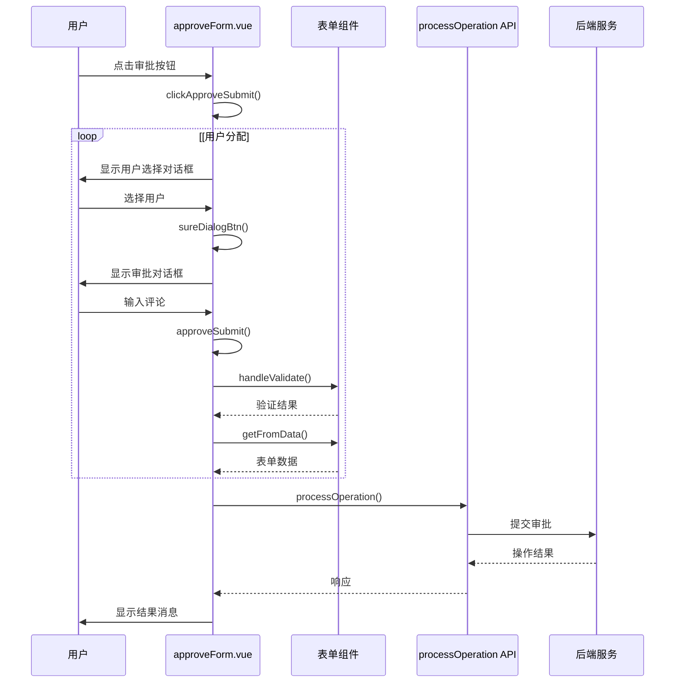
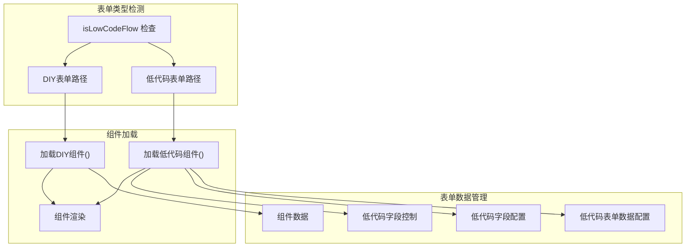
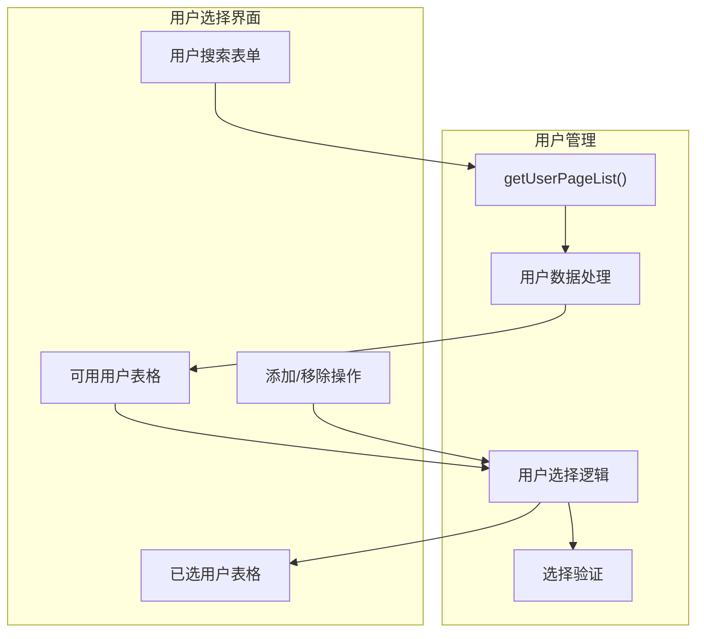
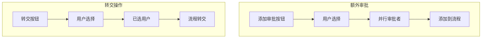
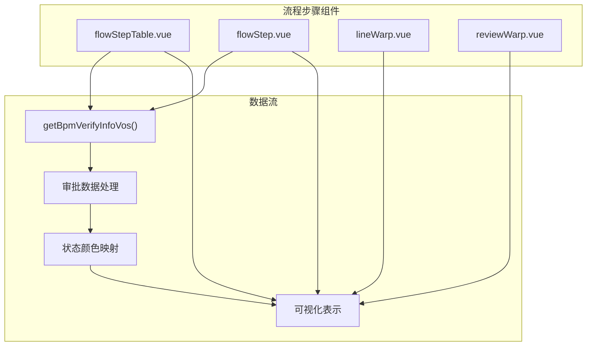
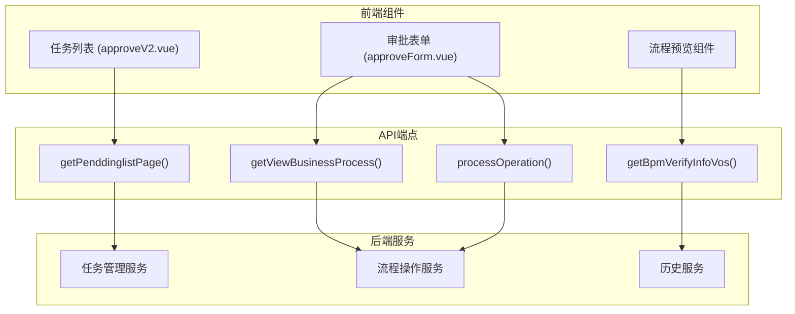
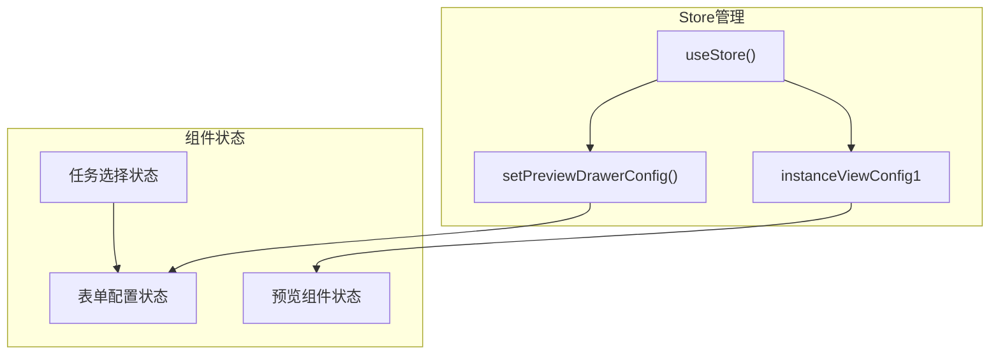

# 任务审批与流程操作

## 任务审批界面架构

任务审批系统基于一个双面板界面构建，该界面将任务浏览与任务处理分开，从而实现了高效的工作流管理。

## 待办任务管理

### 任务列表界面

待办任务界面提供了一个可搜索的任务列表，这些任务需要用户关注。主要组件 `approveV2.vue`管理任务发现和选择。

任务列表显示关键信息，包括流程类型、描述、审批状态和创建时间。每个任务卡片都显示它是一个低代码流程(LF)还是DIY表单类型。

### 任务数据结构

| 字段                 | 类型   | 描述                    |
| -------------------- | ------ | ----------------------- |
| `processNumber`    | 字符串 | 唯一流程标识符          |
| `processTypeName`  | 字符串 | 可读的流程类型          |
| `taskId`           | 字符串 | 活动任务标识符          |
| `isLowCodeFlow`    | 布尔值 | 表示表单类型(LF vs DIY) |
| `isOutSideProcess` | 布尔值 | 外部流程标志            |
| `taskState`        | 字符串 | 当前任务状态            |
| `userName`         | 字符串 | 任务执行者姓名          |
| `createTime`       | 日期   | 流程创建时间戳          |

## 审批操作系统

### 审批按钮配置

审批系统支持在 `approvalButtonConf`常量中定义的多种操作类型：

### 审批流程

审批处理遵循一个结构化的工作流程，该流程处理不同的操作类型：

## 表单渲染与验证

### 动态表单加载

审批表单系统通过动态组件加载支持低代码表单(LF)和DIY表单：

### 表单验证流程

表单验证系统确保在提交前数据完整性：

| 验证步骤             | 组件     | 目的         |
| -------------------- | -------- | ------------ |
| `handleValidate()` | 表单组件 | 客户端验证   |
| `getFromData()`    | 表单组件 | 数据提取     |
| JSON处理             | 审批表单 | 数据格式化   |
| API提交              | 流程操作 | 服务器端处理 |

## 用户选择与分配

### 用户选择对话框

`selectUserDialog.vue`组件为转交和额外审批操作提供用户选择功能：

### 用户分配操作

系统处理两种类型的用户分配：

1. **转交操作** (`transfer`)：将任务重新分配给不同的用户
2. **额外审批** (`addApproval`)：为流程添加并行审批者

## 流程步骤跟踪与预览

### 审批记录显示

`flowStepTable.vue`组件提供流程历史的表格视图：

### 流程可视化

流程预览系统提供多种可视化选项：

| 组件                  | 目的             | 数据源                  |
| --------------------- | ---------------- | ----------------------- |
| `flowStepTable.vue` | 表格审批历史     | `getBpmVerifyInfoVos` |
| `flowStep.vue`      | 时间线可视化     | `getBpmVerifyInfoVos` |
| `lineWarp.vue`      | 基于节点的流程图 | BPMN配置                |
| `reviewWarp.vue`    | 交互式流程预览   | 流程定义                |

## 流程操作集成

### API集成点

任务审批系统通过特定的API端点与后端服务集成：

### 状态管理集成

审批系统使用Pinia store进行状态管理：

