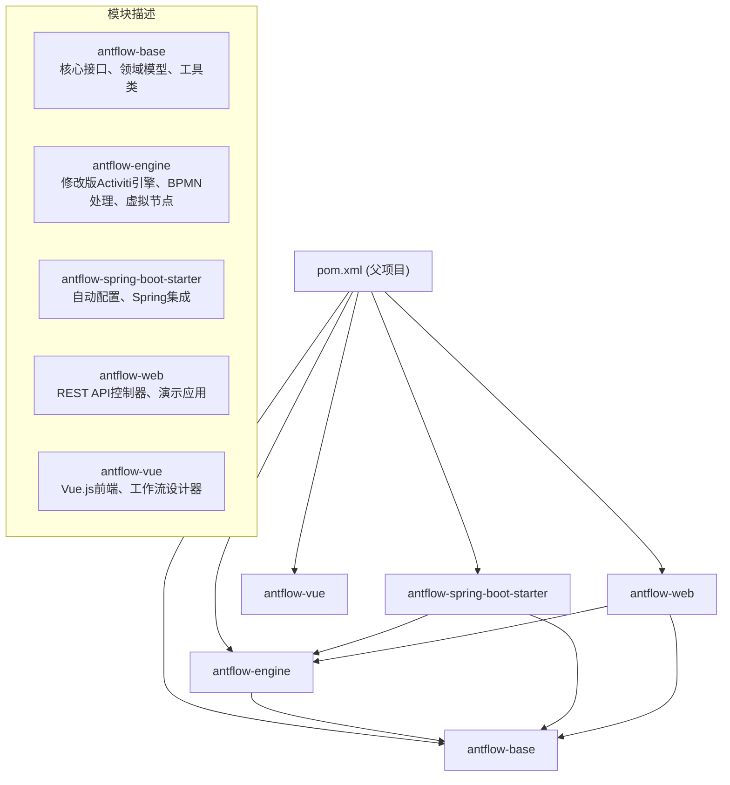
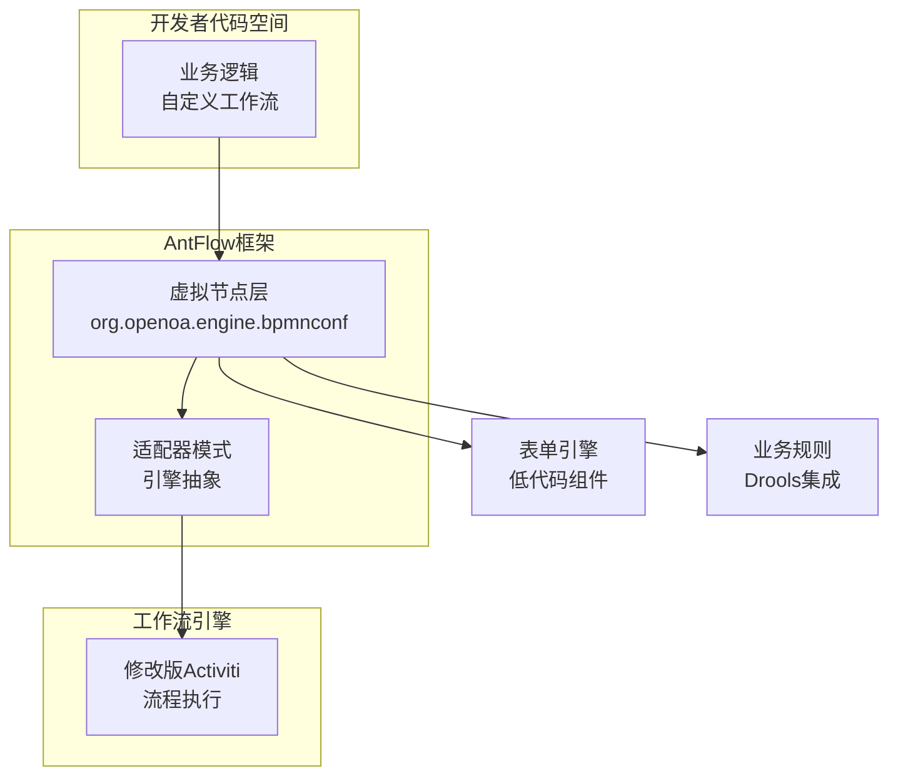
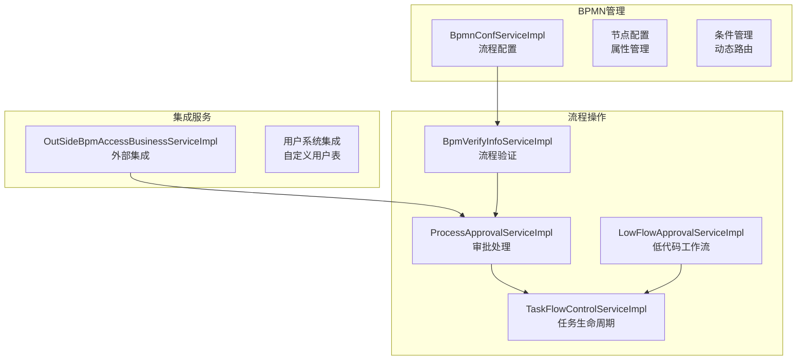
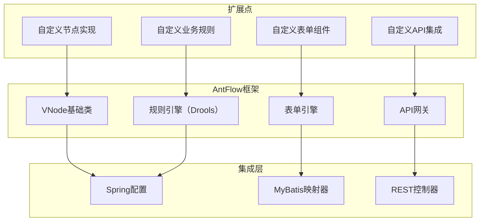
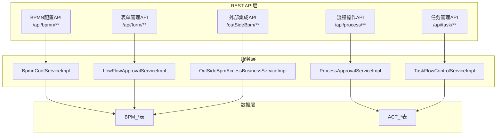

# 开发者指南

本综合指南为开发者提供了使用AntFlow所需的一切信息，AntFlow是一个基于修改版Activiti的企业级低代码工作流引擎平台。它涵盖了开发环境设置、系统架构、数据库模式、扩展模式和API参考。

AntFlow具有独特的虚拟节点（VNode）系统，该系统将工作流业务逻辑与引擎执行API分离，使开发者无需深入Activiti知识即可创建工作流。该平台支持需要自定义实现的DIY工作流和通过可视化设计创建的低代码工作流。

## 系统架构

AntFlow基于模块化的Maven架构构建，核心为修改版Activiti 5.23引擎。该系统实现了一个虚拟节点抽象层，将业务逻辑与工作流引擎API解耦。

### 技术栈

| 组件       | 技术           | 版本   |
| ---------- | -------------- | ------ |
| 后端框架   | Spring Boot    | 2.7.17 |
| 工作流引擎 | 修改版Activiti | 5.23   |
| ORM        | MyBatis-Plus   | 3.5.1  |
| 数据库     | MySQL          | 5.7+   |
| 规则引擎   | Drools         | 6.5.0  |
| 前端       | Vue.js         | 3.x    |
| 构建工具   | Maven          | 3.x    |
| Java       | JDK            | 8-21   |

### 模块架构

Maven模块依赖结构：



### 虚拟节点系统架构

核心创新——虚拟节点（VNode）系统，将业务逻辑与引擎API分离：



### 服务层架构

核心服务实现及其职责：



## 开发环境设置

### 前提条件

| 组件    | 要求     | 备注                                    |
| ------- | -------- | --------------------------------------- |
| JDK     | 8-21     | 使用 `java17_support`分支支持Java 17+ |
| Maven   | 3.x      | 用于后端构建                            |
| MySQL   | 5.7+     | 数据库服务器                            |
| Node.js | 16.20.0+ | 用于前端开发                            |
| npm     | 最新版   | 包管理器                                |

### 仓库结构

```markdown
AntFlow-activiti/
├── pom.xml # 父项目POM
├── antflow-base/ # 核心接口和模型
├── antflow-engine/ # 修改版Activiti引擎
├── antflow-spring-boot-starter/ # 自动配置
├── antflow-web/ # REST API和演示
├── antflow-vue/ # Vue.js前端
└── doc/ # 文档
```

### 后端开发设置

**步骤1：克隆和构建**

```markdown
# 克隆仓库
git clone https://github.com/mrtylerzhou/AntFlow-activiti.git
cd AntFlow-activiti
# 构建所有模块
mvn clean install -DskipTests
```

**步骤2：数据库设置**

1. 创建MySQL数据库：

```sql
CREATE DATABASE antflow CHARACTER SET utf8mb4 COLLATE utf8mb4_general_ci;
```

```
spring.datasource.url=jdbc:mysql://localhost:3306/antflow?nullCatalogMeansCurrent=true&serverTimezone=Asia/Shanghai
spring.datasource.username=your_username
spring.datasource.password=your_password
spring.datasource.driver-class-name=com.mysql.cj.jdbc.Driver
```

1. 按顺序执行初始化脚本：

   * [antflow-web/src/main/resources/scripts/act_init_db.sql](https://github.com/mrtylerzhou/AntFlow-activiti/blob/160c7ba8/antflow-web/src/main/resources/scripts/act_init_db.sql) - Activiti表
   * [antflow-web/src/main/resources/scripts/bpm_init_db.sql](https://github.com/mrtylerzhou/AntFlow-activiti/blob/160c7ba8/antflow-web/src/main/resources/scripts/bpm_init_db.sql) - AntFlow自定义表
   * antflow-web/src/main/resources/scripts/bpm_init_db_data.sql -AntFlow demo数据初始化表

**步骤3：应用配置(设 计改动,暂时忽略)**

[antflow-web/src/main/resources/application.properties](https://github.com/mrtylerzhou/AntFlow-activiti/blob/160c7ba8/antflow-web/src/main/resources/application.properties)中的关键配置属性：

| 属性                                   | 用途       | 默认值         |
| -------------------------------------- | ---------- | -------------- |
| `antflow.common.empTable.empTblName` | 用户表名   | `t_user`     |
| `antflow.common.empTable.idField`    | 用户ID列   | `id`         |
| `antflow.common.empTable.nameField`  | 用户名列   | `user_name`  |
| `antflow.common.scan-packages`       | 组件扫描包 | `org.openoa` |

**步骤4：运行后端**

```
cd antflow-web
mvn spring-boot:run -Dspring.profiles.active=dev
```

后端API将在：`http://localhost:8080`可用

### 前端开发设置

**步骤1：安装依赖**

```
cd antflow-vue
npm install --registry=https://registry.npmmirror.com
```

**步骤2：开发服务器**

```markdown
# 启动开发服务器
npm run dev
# 生产构建
npm run build:prod
# 预发布构建
npm run build:stage
```

前端将在：`http://localhost:80`可用

### 开发工具配置

**IDE设置（IntelliJ IDEA/Eclipse）**

1. 导入为Maven项目
2. 设置JDK版本为8或更高
3. 为MyBatis-Plus启用注解处理
4. 可选配置代码风格

**Maven配置文件**

可用的Maven配置文件：

* `dev` - 开发环境
* `test` - 测试环境
* `prod` - 生产环境

**数据库版本管理**

⚠️ **重要**：使用提供的SQL脚本创建表。不要使用Activiti的自动模式创建：

```sql
# 禁用Activiti自动模式创建
spring.activiti.database-schema-update=none
```

## 数据库模式和初始化

AntFlow使用结合标准Activiti表和自定义BPM表的双表架构，以增强功能。

### 数据库架构

```css
#mermaid-j8vexlatw6{font-family:ui-sans-serif,-apple-system,system-ui,Segoe UI,Helvetica;font-size:16px;fill:#333;}@keyframes edge-animation-frame{from{stroke-dashoffset:0;}}@keyframes dash{to{stroke-dashoffset:0;}}#mermaid-j8vexlatw6 .edge-animation-slow{stroke-dasharray:9,5!important;stroke-dashoffset:900;animation:dash 50s linear infinite;stroke-linecap:round;}#mermaid-j8vexlatw6 .edge-animation-fast{stroke-dasharray:9,5!important;stroke-dashoffset:900;animation:dash 20s linear infinite;stroke-linecap:round;}#mermaid-j8vexlatw6 .error-icon{fill:#dddddd;}#mermaid-j8vexlatw6 .error-text{fill:#222222;stroke:#222222;}#mermaid-j8vexlatw6 .edge-thickness-normal{stroke-width:1px;}#mermaid-j8vexlatw6 .edge-thickness-thick{stroke-width:3.5px;}#mermaid-j8vexlatw6 .edge-pattern-solid{stroke-dasharray:0;}#mermaid-j8vexlatw6 .edge-thickness-invisible{stroke-width:0;fill:none;}#mermaid-j8vexlatw6 .edge-pattern-dashed{stroke-dasharray:3;}#mermaid-j8vexlatw6 .edge-pattern-dotted{stroke-dasharray:2;}#mermaid-j8vexlatw6 .marker{fill:#999;stroke:#999;}#mermaid-j8vexlatw6 .marker.cross{stroke:#999;}#mermaid-j8vexlatw6 svg{font-family:ui-sans-serif,-apple-system,system-ui,Segoe UI,Helvetica;font-size:16px;}#mermaid-j8vexlatw6 p{margin:0;}#mermaid-j8vexlatw6 .entityBox{fill:#ffffff;stroke:#dddddd;}#mermaid-j8vexlatw6 .relationshipLabelBox{fill:#dddddd;opacity:0.7;background-color:#dddddd;}#mermaid-j8vexlatw6 .relationshipLabelBox rect{opacity:0.5;}#mermaid-j8vexlatw6 .labelBkg{background-color:rgba(221, 221, 221, 0.5);}#mermaid-j8vexlatw6 .edgeLabel .label{fill:#dddddd;font-size:14px;}#mermaid-j8vexlatw6 .label{font-family:ui-sans-serif,-apple-system,system-ui,Segoe UI,Helvetica;color:#333;}#mermaid-j8vexlatw6 .edge-pattern-dashed{stroke-dasharray:8,8;}#mermaid-j8vexlatw6 .node rect,#mermaid-j8vexlatw6 .node circle,#mermaid-j8vexlatw6 .node ellipse,#mermaid-j8vexlatw6 .node polygon{fill:#ffffff;stroke:#dddddd;stroke-width:1px;}#mermaid-j8vexlatw6 .relationshipLine{stroke:#999;stroke-width:1;fill:none;}#mermaid-j8vexlatw6 .marker{fill:none!important;stroke:#999!important;stroke-width:1;}#mermaid-j8vexlatw6 :root{--mermaid-font-family:"trebuchet ms",verdana,arial,sans-serif;}containscorresponds_tocreatesspawnsusestracksACT_RE_PROCDEFActiviti Process DefinitionsstringID_stringKEY_stringNAME_intVERSION_stringDEPLOYMENT_ID_ACT_RU_EXECUTIONRuntime ExecutionsstringID_stringPROC_DEF_ID_stringBUSINESS_KEY_stringPARENT_ID_ACT_RU_TASKRuntime TasksstringID_stringEXECUTION_ID_stringASSIGNEE_stringNAME_datetimeCREATE_TIME_BPM_PROCESS_DEFAntFlow Process Configurationbigintidstringprocess_keystringprocess_namestringprocess_typetextbpmn_xmlBPM_NODE_PROPERTYNode Propertiesbigintidbigintconf_idstringnode_idstringproperty_typetextproperty_valueBPM_VERIFY_INFOProcess Verificationbigintidstringprocess_instance_idstringverify_statustextverify_descLOW_FLOW_FORMLow-Code Formsbigintidstringform_codestringform_nametextform_data
```

### 表类别

**Activiti引擎表**（ACT_前缀）

* `ACT_RE_*` - 存储库表（流程定义、模型）
* `ACT_RU_*` - 运行时表（活动流程实例、任务）
* `ACT_HI_*` - 历史表（已完成流程、任务）
* `ACT_GE_*` - 通用表（属性、字节数组）
* `ACT_ID_*` - 身份表（用户、组） - **AntFlow不使用**

**AntFlow自定义表**（BPM_前缀）

* 流程配置和元数据
* 节点属性和条件
* 表单定义和验证
* 验证和审批跟踪
* 外部系统集成数据

### 初始化脚本

**脚本执行顺序**：

1. **[antflow-web/src/main/resources/scripts/act_init_db.sql](https://github.com/mrtylerzhou/AntFlow-activiti/blob/160c7ba8/antflow-web/src/main/resources/scripts/act_init_db.sql)**

   * 创建Activiti引擎表
   * 设置流程引擎基础设施
   * 必须首先执行
2. **[antflow-web/src/main/resources/scripts/bpm_init_db.sql](https://github.com/mrtylerzhou/AntFlow-activiti/blob/160c7ba8/antflow-web/src/main/resources/scripts/bpm_init_db.sql)**

   * 创建AntFlow自定义表
   * 插入默认配置数据
   * 创建索引和约束

**关键自定义表**：

| 表                     | 用途         | 关键列                                     |
| ---------------------- | ------------ | ------------------------------------------ |
| `BPM_PROCESS_DEF`    | 流程定义     | `process_key`, `bpmn_xml`              |
| `BPM_NODE_PROPERTY`  | 节点配置     | `node_id`, `property_type`             |
| `BPM_VERIFY_INFO`    | 流程验证     | `process_instance_id`, `verify_status` |
| `LOW_FLOW_FORM`      | 表单定义     | `form_code`, `form_data`               |
| `BPM_BUSINESS_PARTY` | 外部系统集成 | `app_id`, `access_key`                 |

### 数据库配置

开发环境的关键数据库设置：

```sql
# 主数据源
spring.datasource.url=jdbc:mysql://localhost:3306/antflow?nullCatalogMeansCurrent=true&serverTimezone=Asia/Shanghai
spring.datasource.driver-class-name=com.mysql.cj.jdbc.Driver
# 连接池设置
spring.datasource.hikari.maximum-pool-size=20
spring.datasource.hikari.minimum-idle=5
spring.datasource.hikari.connection-timeout=30000
# MyBatis-Plus配置
mybatis-plus.mapper-locations=classpath*:/mapper/**/*.xml (如果报找不到绑定错误,这里注意一下,看看是否改动了目录的名称或者层次结构)
mybatis-plus.type-aliases-package=org.openoa.**.entity
# 禁用Activiti自动模式（使用手动脚本）
spring.activiti.database-schema-update=none
```

## 系统扩展

AntFlow的模块化架构和虚拟节点系统支持在不修改核心引擎代码的情况下进行广泛定制。

### 虚拟节点扩展模式

VNode系统允许通过扩展基础节点类型来实现自定义工作流逻辑：



## API参考

AntFlow为工作流操作提供了全面的REST API和Java服务接口。

### REST API端点

外部集成的核心API结构：



## 最佳实践

### 性能优化

* 对大数据集使用批量操作
* 对频繁访问的数据实现缓存
* 仔细考虑事务边界

### 安全考虑

* 对工作流操作实现适当的授权
* 验证和清理所有输入数据
* 为电子邮件通知使用安全配置

### 测试

* 对服务逻辑使用单元测试
* 对工作流执行实现集成测试
* 使用现实的数据量进行测试

## 故障排除

### 常见问题

| 问题           | 解决方案                     |
| -------------- | ---------------------------- |
| 数据库连接错误 | 检查数据库凭据和连接性       |
| 流程部署失败   | 验证BPMN配置和语法           |
| 任务分配不工作 | 检查分配者解析和用户系统集成 |
| 工作流卡住     | 使用流程验证工具识别问题     |

### 日志记录

启用调试日志以获取详细信息：

```
logging.level.org.openoa=DEBUG
logging.level.org.activiti=DEBUG
```
