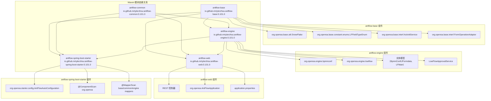
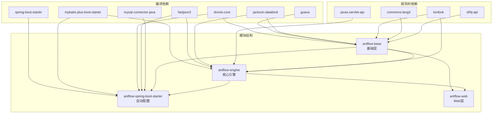
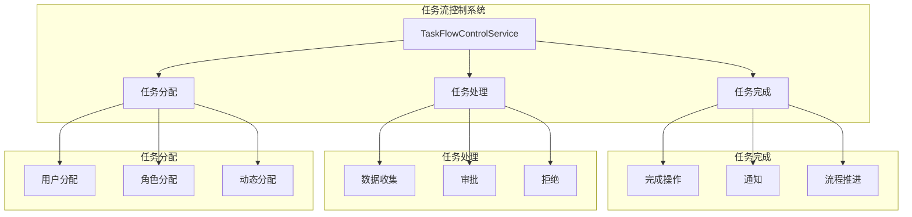
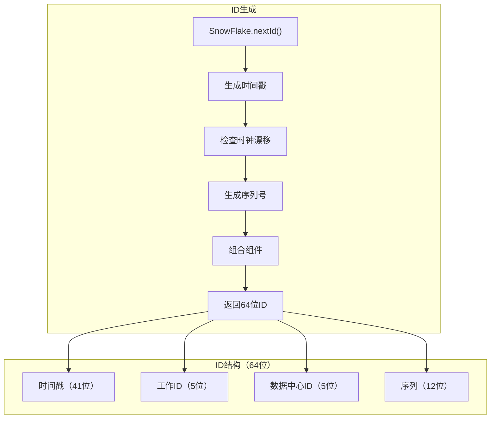
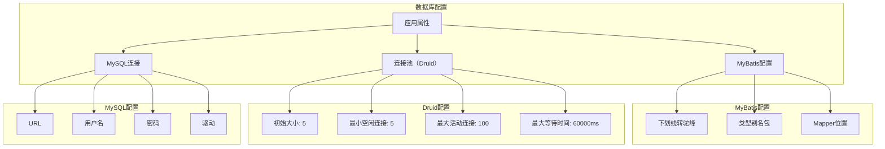
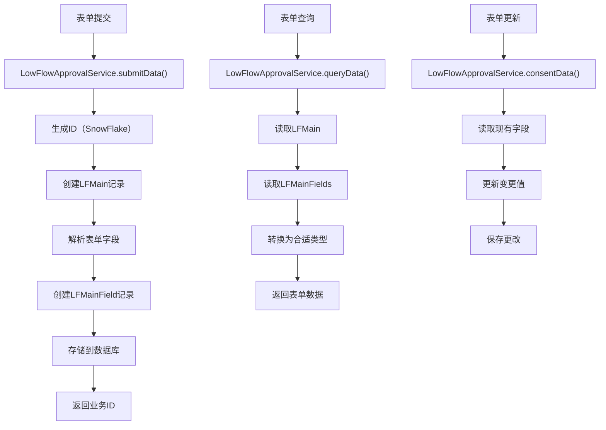

# 后端系统

## 模块架构

AntFlow的后端由四个主要的Maven模块组成，具有清晰的依赖关系：



### antflow-base

基础模块提供了系统中使用的基本组件：

* 通用接口，如 `ActivitiService` 和 `FormOperationAdaptor`
* 用于ID生成（`SnowFlake`）和日期处理的工具类
* 数据类型定义，包括字段类型枚举（`LFFieldTypeEnum`）
* 异常处理机制

此模块具有最小的依赖关系，是所有其他模块的基础。

### antflow-engine

引擎模块包含工作流管理的核心功能：

* BPMN（业务流程模型和符号）配置服务
* 流程验证和执行逻辑
* 低代码表单引擎实现
* 任务流控制服务
* 数据持久化的实体模型

该模块建立在base模块之上，实现了工作流系统的主要业务逻辑。

### antflow-spring-boot-starter

Spring Boot启动器模块提供自动配置，便于与Spring Boot应用程序集成，并聚合所有AntFlow依赖项：

#### 自动配置

`AntFlowAutoConfiguration` 类启用自动组件发现：

* **组件扫描**：`@ComponentScan({"org.openoa"})` 自动注册所有AntFlow组件
* **MyBatis Mapper扫描**：三个 `@MapperScan` 注解：* `org.openoa.base.mapper` * `org.openoa.common.mapper` * `org.openoa.engine.bpmnconf.mapper`

#### 依赖管理

此模块整合了所有所需的依赖项，并进行版本管理：

| 依赖类别           | 库                            | 版本              |
| ------------------ | ----------------------------- | ----------------- |
| **核心框架** | Spring Boot                   | 2.7.17            |
| **数据库**   | MyBatis Plus, MySQL Connector | 3.5.1, 8.0.27     |
| **JSON处理** | FastJSON2                     | 2.0.53            |
| **规则引擎** | Drools                        | 6.5.0.Final       |
| **工具类**   | Guava, Joda Time              | 31.0.1-jre, 2.9.9 |
| **通信**     | JGroups                       | 4.2.30.Final      |

#### Spring Boot集成

该启动器通过 `META-INF/spring.factories` 自动发现：

```
org.springframework.boot.autoconfigure.EnableAutoConfiguration=org.openoa.starter.config.AntFlowAutoConfiguration
```

### antflow-web

Web模块提供REST控制器和Web特定配置：

* HTTP端点用于工作流管理
* 应用程序属性配置
* Web服务器设置和初始化

该模块作为客户端应用程序的访问点。

## 技术栈与依赖

### 核心技术栈

AntFlow构建在一个综合的技术栈上，通过Maven依赖管理进行管理：

| 组件                | 技术         | 版本         | 目的                     |
| ------------------- | ------------ | ------------ | ------------------------ |
| **框架**      | Spring Boot  | 2.7.17       | 应用框架和自动配置       |
| **数据库**    | MySQL        | 8.0.27       | 主要数据持久化           |
| **ORM**       | MyBatis Plus | 3.5.1        | 对象关系映射和数据库操作 |
| **连接池**    | Druid        | 1.1.17       | 数据库连接池             |
| **规则引擎**  | Drools       | 6.5.0.Final  | 业务规则处理和条件评估   |
| **JSON**      | FastJSON2    | 2.0.53       | JSON序列化和反序列化     |
| **工具类**    | Guava        | 31.0.1-jre   | 常用工具函数             |
| **日期/时间** | Joda Time    | 2.9.9        | 日期和时间处理           |
| **集群**      | JGroups      | 4.2.30.Final | 分布式通信               |

### 依赖关系



### Maven Profiles

该项目支持多种部署配置：

| 配置      | 目的         | 属性                          |
| --------- | ------------ | ----------------------------- |
| `dev`   | 开发（默认） | `activatedProperties=dev`   |
| `local` | 本地开发     | `activatedProperties=local` |
| `uat`   | 用户验收测试 | `activatedProperties=uat`   |
| `pro`   | 生产环境     | `activatedProperties=pro`   |

---

## 任务流控制

任务流控制系统负责工作流任务的分配、处理和完成。



任务流控制包括：

* 将任务分配给适当的用户或角色
* 处理任务数据、审批与拒绝
* 完成操作（包括通知和流程推进）

## ID生成

AntFlow 使用 Snowflake 算法在系统中生成唯一 ID。



`SnowFlake` 工具类生成分布式唯一 ID，特性如下：

* 由时间戳、工作ID、数据中心ID和序列组成的64位整型ID
* 兼容Kubernetes，可通过Pod名称生成Worker ID
* 在非Kubernetes环境下使用网络接口作为备选机制
* 确保分布式系统中ID的唯一性

来源：

* [SnowFlake.java](https://github.com/mrtylerzhou/AntFlow-activiti/blob/160c7ba8/antflow-base/src/main/java/org/openoa/base/util/SnowFlake.java#L11-L126)

## 数据库配置

AntFlow 使用 MySQL 作为主数据库，并通过 Spring 属性进行配置。



数据库配置说明：

* MySQL连接属性定义在 `application-dev.properties`
* 使用 Druid 提供连接池，具备优化参数
* 配置 MyBatis 实现 ORM 功能
* 支持多租户数据源（可选）

## 表单数据处理流程

以下流程图说明了低代码引擎中表单数据的流转：


