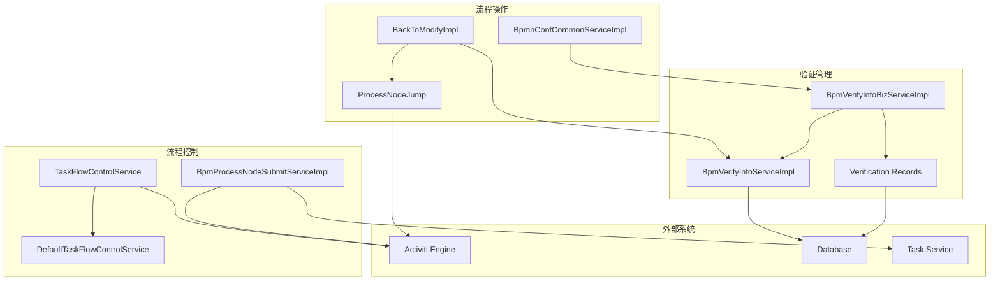
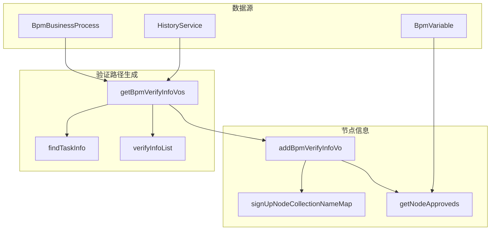
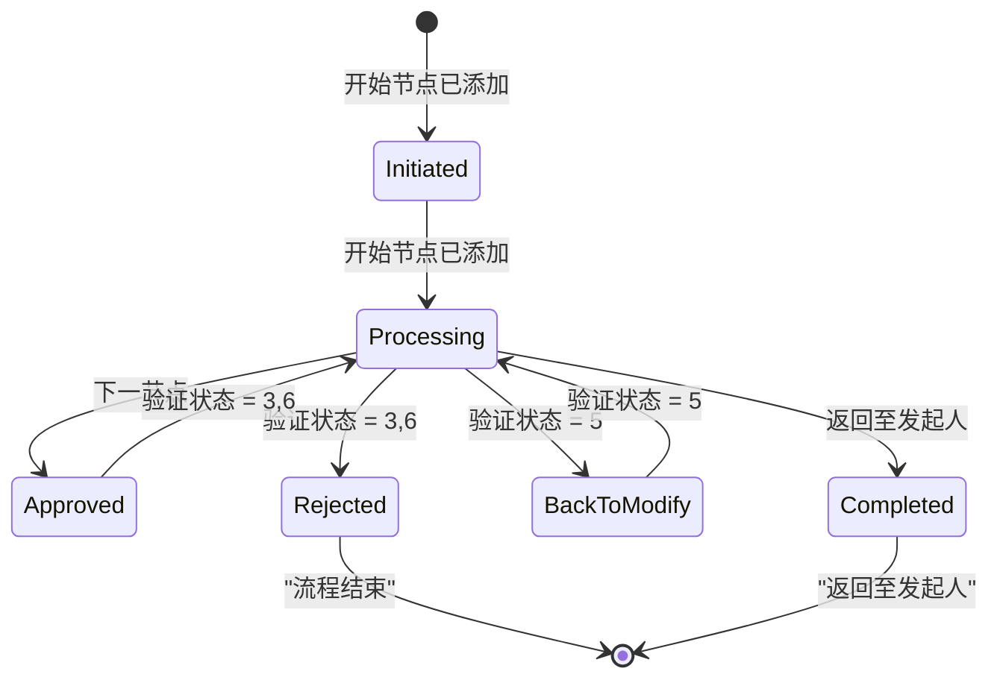
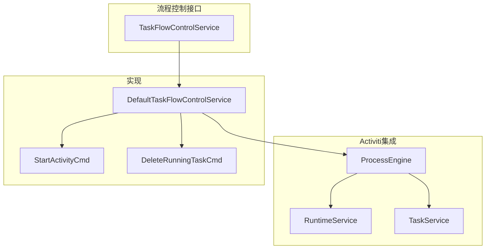
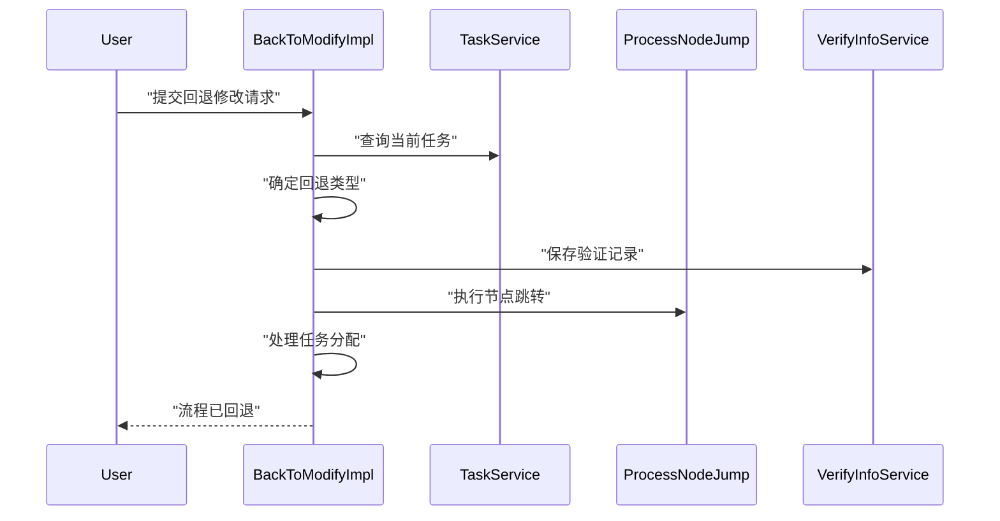
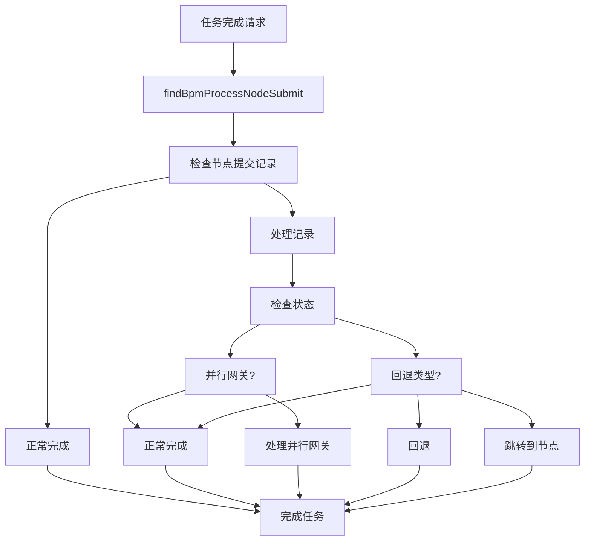
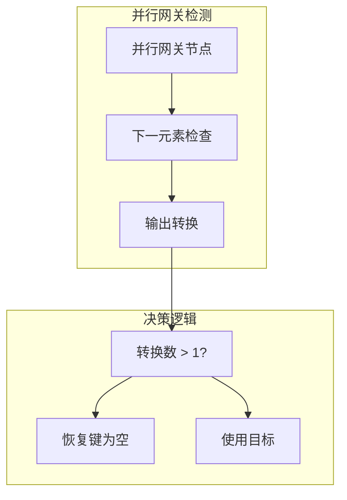
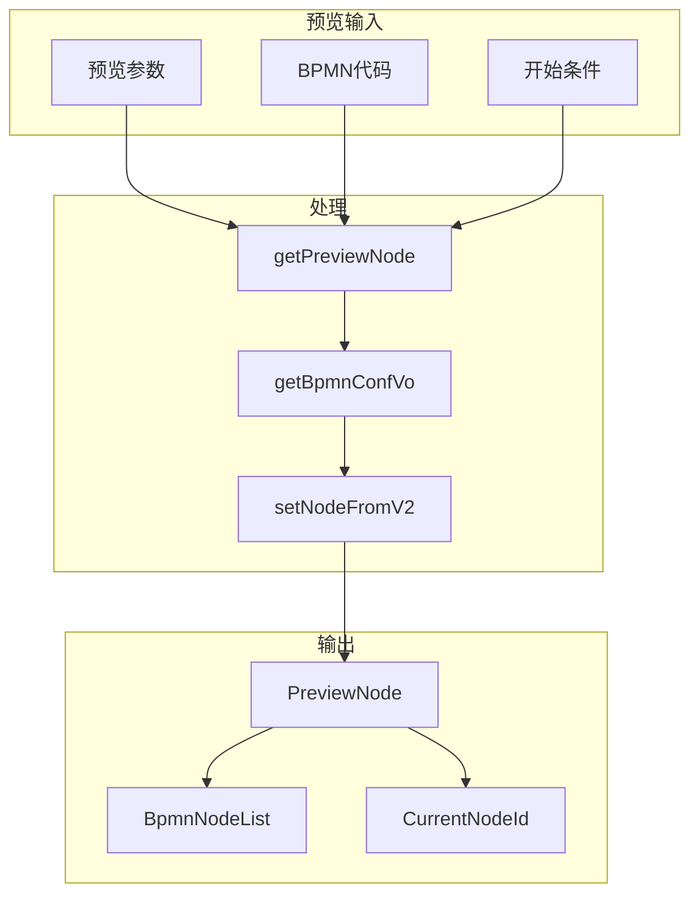

# 流程状态验证与控制

流程验证与控制系统由几个相互连接的服务组成，这些服务管理流程审批的生命周期和流程控制：

## 验证信息管理

验证系统跟踪流程生命周期中的所有审批活动，维护谁在何时批准了什么的详细记录。

### BpmVerifyInfoBizServiceImpl核心功能

`BpmVerifyInfoBizServiceImpl`类是管理验证信息的主要服务：

### 验证路径构建

系统构建全面的验证路径，显示已完成和待审批的节点：

| 组件     | 目的           | 关键方法                          |
| -------- | -------------- | --------------------------------- |
| 开始节点 | 流程启动记录   | `getBpmVerifyInfoVos():109-110` |
| 历史记录 | 已完成的审批   | `verifyInfoList():114-118`      |
| 当前任务 | 活跃的审批任务 | `findTaskInfo():184-195`        |
| 未来路径 | 预测的审批路线 | `addBpmVerifyInfoVo():262-334`  |

### 流程状态管理

验证系统处理不同的流程状态和审批场景：

**来源**： [antflow-engine/src/main/java/org/openoa/engine/bpmnconf/service/biz/BpmVerifyInfoBizServiceImpl.java L131-L177](https://github.com/mrtylerzhou/AntFlow-activiti/blob/160c7ba8/antflow-engine/src/main/java/org/openoa/engine/bpmnconf/service/biz/BpmVerifyInfoBizServiceImpl.java#L131-L177)

## 流程流控制

任务流控制系统管理流程导航，包括向前移动和回滚操作。

### TaskFlowControlService架构

**来源**： [antflow-engine/src/main/java/org/openoa/engine/bpmnconf/service/flowcontrol/TaskFlowControlService.java L1-L18](https://github.com/mrtylerzhou/AntFlow-activiti/blob/160c7ba8/antflow-engine/src/main/java/org/openoa/engine/bpmnconf/service/flowcontrol/TaskFlowControlService.java#L1-L18)
[antflow-engine/src/main/java/org/openoa/engine/bpmnconf/service/flowcontrol/DefaultTaskFlowControlService.java L1-L161](https://github.com/mrtylerzhou/AntFlow-activiti/blob/160c7ba8/antflow-engine/src/main/java/org/openoa/engine/bpmnconf/service/flowcontrol/DefaultTaskFlowControlService.java#L1-L161)

### 任务移动操作

`DefaultTaskFlowControlService`提供了复杂的任务移动能力：

| 操作       | 方法                                                   | 目的                 |
| ---------- | ------------------------------------------------------ | -------------------- |
| 移动到节点 | `moveTo(currentTaskDefKey, targetTaskDefinitionKey)` | 导航到特定节点       |
| 删除任务   | `DeleteRunningTaskCmd`                               | 移除当前任务         |
| 开始活动   | `StartActivityCmd`                                   | 在目标节点创建新任务 |
| 处理并行   | `moveTov2()`                                         | 管理并行网关场景     |

**来源**： [antflow-engine/src/main/java/org/openoa/engine/bpmnconf/service/flowcontrol/DefaultTaskFlowControlService.java L75-L161](https://github.com/mrtylerzhou/AntFlow-activiti/blob/160c7ba8/antflow-engine/src/main/java/org/openoa/engine/bpmnconf/service/flowcontrol/DefaultTaskFlowControlService.java#L75-L161)

## 回退修改操作

回退修改功能允许流程返回到之前的状态以进行更正或添加更多信息。

### BackToModifyImpl流程

**来源**： [antflow-engine/src/main/java/org/openoa/engine/bpmnconf/service/biz/BackToModifyImpl.java L90-L242](https://github.com/mrtylerzhou/AntFlow-activiti/blob/160c7ba8/antflow-engine/src/main/java/org/openoa/engine/bpmnconf/service/biz/BackToModifyImpl.java#L90-L242)

### 回退修改类型

系统根据 `ProcessDisagreeTypeEnum`支持多种回退修改场景：

| 类型                 | 代码 | 行为                   | 实现                       |
| -------------------- | ---- | ---------------------- | -------------------------- |
| 回退到前一个节点     | 1    | 返回到立即的前一个节点 | `ONE_DISAGREE:124-130`   |
| 回退到开始节点       | 2    | 返回到流程发起人       | `TWO_DISAGREE:131-134`   |
| 回退到发起人         | 3    | 默认回退行为           | `THREE_DISAGREE:135-138` |
| 回退到特定节点       | 4    | 返回到用户选择的节点   | `FOUR_DISAGREE:139-154`  |
| 回退到带节点ID的节点 | 5    | 使用节点标识符回退     | `FIVE_DISAGREE:155-158`  |

**来源**： [antflow-engine/src/main/java/org/openoa/engine/bpmnconf/service/biz/BackToModifyImpl.java L122-L161](https://github.com/mrtylerzhou/AntFlow-activiti/blob/160c7ba8/antflow-engine/src/main/java/org/openoa/engine/bpmnconf/service/biz/BackToModifyImpl.java#L122-L161)

## 流程节点提交控制

`BpmProcessNodeSubmitServiceImpl`管理流程节点的完成和控制。

### 节点提交逻辑

**来源**： [antflow-engine/src/main/java/org/openoa/engine/bpmnconf/service/impl/BpmProcessNodeSubmitServiceImpl.java L86-L156](https://github.com/mrtylerzhou/AntFlow-activiti/blob/160c7ba8/antflow-engine/src/main/java/org/openoa/engine/bpmnconf/service/impl/BpmProcessNodeSubmitServiceImpl.java#L86-L156)

### 并行网关处理

系统为并行网关场景提供特殊处理：

**来源**： [antflow-engine/src/main/java/org/openoa/engine/bpmnconf/service/impl/BpmProcessNodeSubmitServiceImpl.java L100-L116](https://github.com/mrtylerzhou/AntFlow-activiti/blob/160c7ba8/antflow-engine/src/main/java/org/openoa/engine/bpmnconf/service/impl/BpmProcessNodeSubmitServiceImpl.java#L100-L116)

## 预览和分析功能

系统通过 `BpmnConfCommonServiceImpl`为流程验证路径提供预览能力。

### 预览节点生成

**来源**： [antflow-engine/src/main/java/org/openoa/engine/bpmnconf/service/biz/BpmnConfCommonServiceImpl.java L336-L421](https://github.com/mrtylerzhou/AntFlow-activiti/blob/160c7ba8/antflow-engine/src/main/java/org/openoa/engine/bpmnconf/service/biz/BpmnConfCommonServiceImpl.java#L336-L421)

### 当前节点识别

系统识别当前流程节点以进行验证和控制：

| 功能                         | 目的                 | 数据源          |
| ---------------------------- | -------------------- | --------------- |
| `findCurrentNodeIds()`     | 获取当前审批节点ID   | ACT_RU_TASK表   |
| `findTaskInfor()`          | 获取活跃任务信息     | 流程实例查询    |
| `getNodeIdsByeElementId()` | 将元素ID映射到节点ID | BpmVariable映射 |

**来源**： [antflow-engine/src/main/java/org/openoa/engine/bpmnconf/service/impl/BpmVerifyInfoServiceImpl.java L235-L276](https://github.com/mrtylerzhou/AntFlow-activiti/blob/160c7ba8/antflow-engine/src/main/java/org/openoa/engine/bpmnconf/service/impl/BpmVerifyInfoServiceImpl.java#L235-L276)
