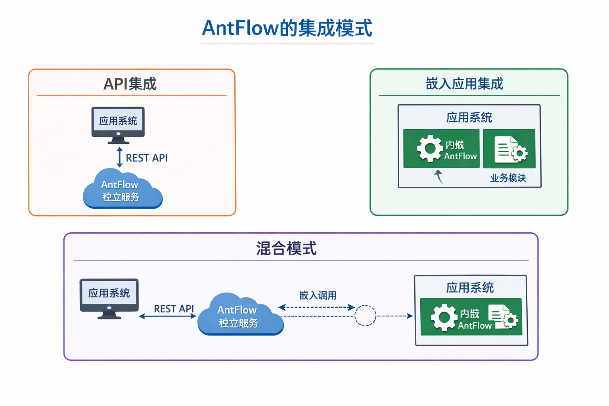
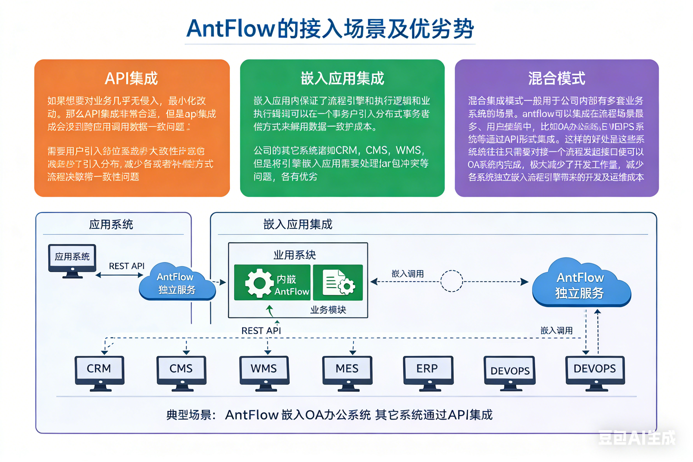

# antflow业务集成模式介绍

### 1.常见集成方式

antflow提供了灵活的部署模式,即可以独立部署,又可以做为一个模块嵌入到应用中(即将antflow源码拷贝到自己的项目里,或者直接引用maven坐标)。由于部署方式的不同导致了接入形式的不同。粗略分为API集成（独立部署时由于流程引擎和应用不在一个进程内，因此应用没法直接调用antflow的方法。这时通常使用REST  API形式集成，后面都统一叫作API集成）和嵌入应用集成。嵌入应用即将antflow源码或者maven坐标引入到自己的应用项目中。实际中，除了这两种独立模式以外还有混合模式，即同时使用API集成和嵌入应用集成。

### 2.常见集成方式的使用场景介绍

关于使用何种模式集成，用户可以结合业务灵活选择。如果想要对业务几乎无侵入，最小化改动。那么API集成非常合适，但是api集成会涉及到跨应用调用数据一致性问题，需要用户引入分布式事务或者补偿方式来解决数据一致性问题。嵌入应用内保证了流程引擎和执行逻辑和业务执行逻辑可以在一个事务中，极大减少应用开发复杂度和维护成本。但是将引擎嵌入应用需要处理jar包冲突等问题，各有优劣。实际项目中，有些公司还会使用混合集成模式。混合集成模式一般用于公司内部有多套业务系统的场景。antflow可以集成在流程场景最多、用户使用最广的系统中，比如OA办公系统。公司的其它系统诸如CRM，CMS，WMS，MES，ERP，DEVOPS系统等通过API形式 集成。这样的好处是这些系统往往只需要对接一个流程发起接口发起流程，然后流程办理便可以在OA系统内完成，极大减少了开发工作量，减少各系统独立嵌入流程引擎带来的开发及运维成本。

