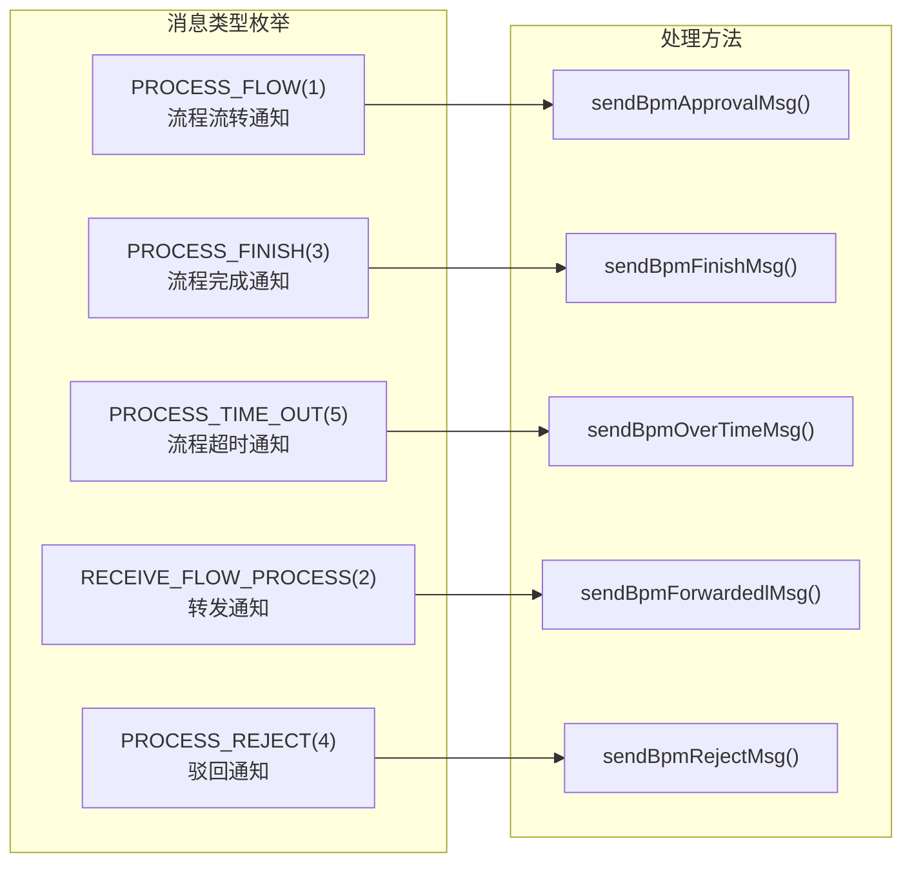
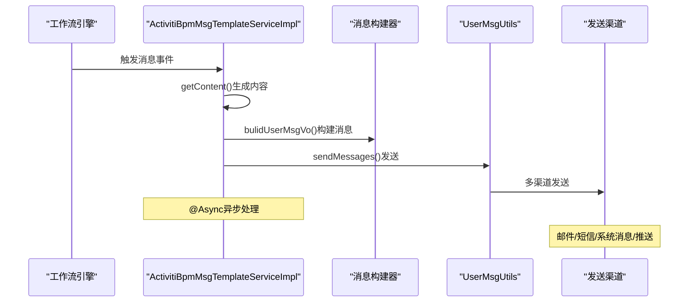
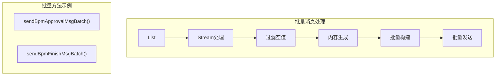
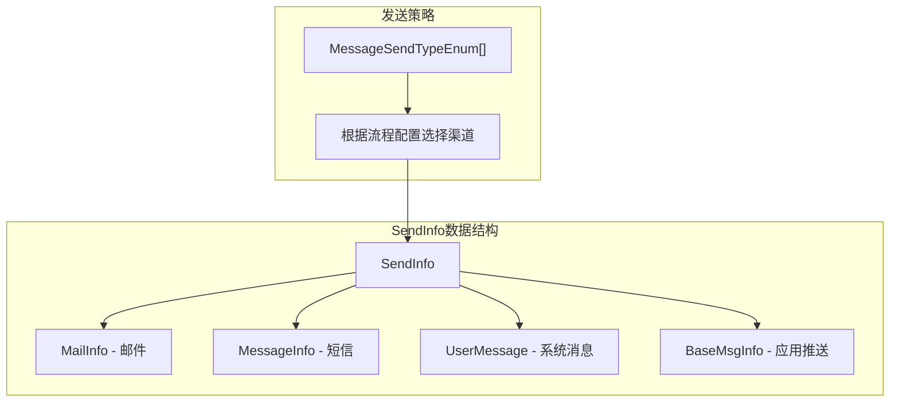

# AntFlow 消息通知系统整体介绍与架构设计

## 1. 整体架构

```mermaid

```

AntFlow的消息通知系统设计完善，支持工作流全生命周期的消息推送。系统采用异步处理机制，支持多种发送渠道，并且能与企业现有用户系统无缝集成。

> 目前AntFlow引擎本身只实现了邮件通知,但是有强大的扩展机制。用户可以对接企业微信、飞书、短信sdk等实现将消息通知以不同形式发送。本章后面会介绍如何自定义扩展

AntFlow的消息通知系统是一个完整的工作流消息推送机制，支持多种通知类型和发送方式。`<cite/>`

## 1.1 消息通知类型

AntFlow定义了10种不同的消息通知类型，涵盖工作流的各个环节： [1](#0-0)

主要包括：

- 工作流流转通知：当有新任务需要处理时
- 转发工作流通知：收到转发的流程时
- 完成通知：流程完成时通知发起人
- 审批不通过通知：流程被驳回时
- 超时通知：任务超过处理期限时
- 终止通知：流程被终止时
- 代审批通知：任务被委托处理时
- 变更处理人通知：审批人发生变更时

## 1.2 核心服务实现

消息通知的核心逻辑在 `ActivitiBpmMsgTemplateServiceImpl`类中实现，该类提供了异步的消息发送服务： [2](#0-1)

### 1.3 主要发送方法

系统为每种通知类型都提供了对应的发送方法，例如：

- `sendBpmApprovalMsg()`: 发送流程审批通知
- `sendBpmFinishMsg()`: 发送流程完成通知
- `sendBpmRejectMsg()`: 发送审批拒绝通知

所有发送方法都使用 `@Async`注解实现异步处理，确保消息发送不会阻塞主业务流程。

## 1.4 消息发送渠道

系统支持多种消息发送方式，通过 `SendInfo`类统一管理：

包括：

- 邮件通知
- 短信通知
- 系统内消息
- App推送
- ...

以上都在MessageSendTypeEnum

> 需要注意的是如果用户要扩展通知类型，除了在MessageSendTypeEnum添加以外，还要在ProcessNoticeEnum添加相同枚举。前者主要用于消息实际发送，后者用于在web页面上消息通知配置。实际上二者一般是一对一对等的，属于设计上冗余。
>
> 另外需要注意的是即便用户在页面上配置了飞书、企业微信消息，AntFlow也不会真正执行发送到相关平台，而是提供一种消息通知的能力，流程指定事件完成以后将消息通知发出来，用户可以扩展实现将消息发送至指定渠道。用户不需要了解消息发送的实现细节，只需要按文档指引修改代码就可以了

## 用户数据集成

消息通知系统与企业用户系统完全解耦，通过SQL映射获取用户信息：需要改写org.openoa.base.service.AfUserService#getEmployeeDetailByIds 对应的sql

需要说明的是，这个方法返回的是Employee对象，里面包含了较多参数，根据实际情况处理即可，比如你想要给用户邮件提醒，就要返回用户的邮箱地址，要发送短信需要返回用户手机号

系统支持批量获取用户详细信息用于消息发送：

## 1.5 消息系统架构图

当然可以！我可以将AntFlow消息通知系统架构图分解为多个更清晰的图表。`<cite/>`

### 1.5.1 系统整体架构图

```mermaid
graph TB
    subgraph "业务触发层"
        A["工作流引擎事件"]
    end
  
    subgraph "消息服务层"
        B["ActivitiBpmMsgTemplateServiceImpl"]
    end
  
    subgraph "消息处理层"
        C["消息模板处理"]
        D["消息构建"]
    end
  
    subgraph "消息发送层"
        E["UserMsgUtils"]
    end
  
    subgraph "通知渠道层"
        F["多渠道通知"]
    end
  
    A --> B
    B --> C
    C --> D
    D --> E
    E --> F
```

### 1.5.2 消息类型与处理方法映射图



### 1.5.3消息发送流程图



### 1.5.4 批量处理架构图



### 1.5.5.消息发送渠道架构图



这种分层架构设计使得消息通知系统具有良好的可扩展性和维护性。每个图表专注于系统的不同方面，便于理解和维护。所有消息处理都采用异步模式，确保不影响主业务流程性能。
