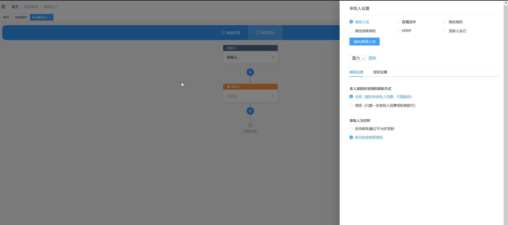

### English | [简体中文](./README.zh_CN.md) |
<p align="center" style="margin-bottom: 0 !important">
	
</p>

### Basic Introduction:

AntFlow is an open-source OA (Office Automation) approval workflow system inspired by Dingtalk's workflow design. Its interface is very simple,you only need some clicks to configure a workflow. It aims to solve the high usage threshold and complexity of traditional BPMN.js process designers, making it easy for non-technical users to get started and quickly configure daily approval processes.

> Use Case 1: In a large enterprise with thousands of employees, heavily relying on workflows (even getting a notebook or a pen requires a workflow), a single process operator can solve most problems without needing backend development intervention.


### Core Technology Stack:

* **Java 8-21:** the main branch is java 8 version,if you use a newer java version,please check out the `java17_support` branch
* **Activiti 5.23:**
* **Spring Boot 2.7.17:**
* **MybatisPlus 3.5.1:** MybatisPlus is a famous orm tool on top of another famous orm framework:mybatis.
* **MySQL 5.7+:**

### core features

1. **easy to config** it has a very simple an intuitive workflow configuration interface.It simplifies the approach to design a flow diagram.You only need some clicks and drags to configure an approval flow.You do not need to write expressions,scripts snippets and variables.
2. **super easy to develop new workflow process** AntFlow decoupled the process engine and business logic.If you choose to use it,you only need to implement a single predefined interface.
3. **Process Observability:** AntFlow offers an admin preview interface for debugging, allowing administrators to quickly identify issues by previewing the approval path based on user-initiated conditions.

### a glimpse of its features


add approver or conditions node


conditions attr panel


approver node attr panel



validation


admin pages


##  Donation support

### 💕 Donation List（按时间排序）
 
😀 You can treat the author to a cup of coffee as an encouragement

- 有捐赠的小伙伴（金额不限）可以联系作者领取一份 **独家提升开发技能的文档**
- 加QQ574427343或者邮件到 574427343@qq.com邮箱 *注明 领取开发技能提升文档*
- 文档宗旨在于提升初级、中级、高级等一线开发人员的编码意识，讲述**什么是好代码**，好代码的标准，**如何编写高质量代码**等
### 💕 捐赠列表（按时间排序,不区分java版还是.net版,两个仓库一并致谢）

```
琉璃 100元、*敏 6.6元、w*g 20元、付*旗88元、幻20元、*成50元、*豪10元、X*u 5元、s*i20元、 *虫20元、 *风6.66元、
小郑 30元、高宇 20元、*门 88元、平安喜乐 1元、GxpCode 100元、*十 50元、
不爱吃的白萝卜 10元、汪总 100元+3元、十三 100元(.net版首捐⭐️)、SZ1806 188元,
ゞ低调℡华丽 100元,Dorian 8.88元,小桥流水 6.6元,杨章隐 88元 首捐⭐️，大虫子88元
```

<table>
    <tr>
        <td></td>
        <td></td>
    </tr>  
</table>